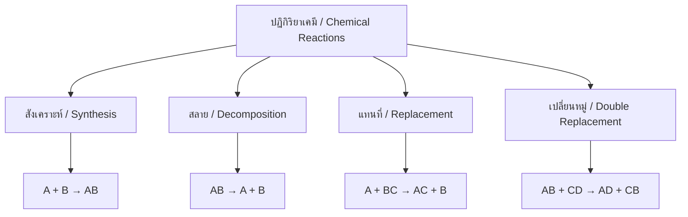
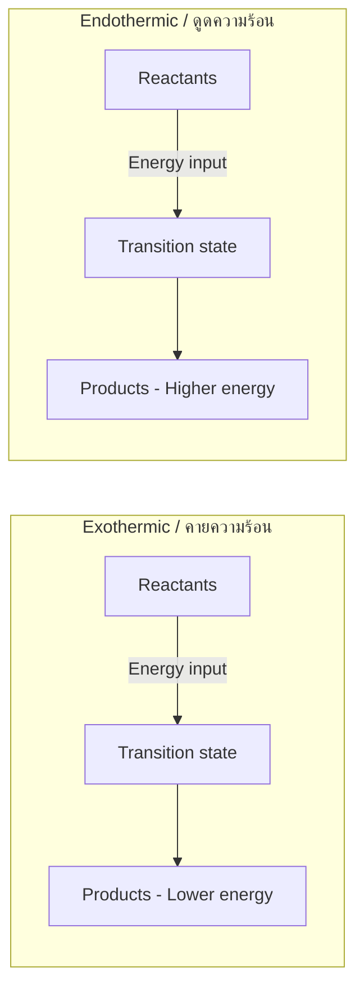

---
tags:
  - science
  - fundamental
  - chemistry
  - chemical-reactions
  - ipst
source: "IPST (สสวท.) Fundamental Science Curriculum, B.E. 2551 (2008, revised 2560/2017)"
created: 2026-07-26
course_codes: ["ว211", "ว212", "ว213"]
---

# Chemical Reactions — ปฏิกิริยาเคมี

> *"The whole of chemistry is about the rearrangement of atoms."*

This note covers types of chemical reactions, balancing equations, reaction rates, and energy changes. Students learn to identify, predict, and balance chemical reactions from ม.1 through ม.3.

---

## 1 | Grade Band Breakdown

### ป.1–3 (Grades 1–3)

| Grade | Scope | Key Skills |
|---|---|---|
| **ป.1–3** | Basic awareness | Observing changes: rusting, burning, dissolving; recognizing that some changes are permanent |

### ป.4–6 (Grades 4–6)

| Grade | Scope | Key Skills |
|---|---|---|
| **ป.5–6** | Simple reactions | Observing burning, rusting, acid-base reactions; evidence of chemical change |

### ม.1–3 (Grades 7–9)

| Grade | Scope | Key Skills |
|---|---|---|
| **ม.1** | Reaction types | Synthesis, decomposition, single/double replacement; balancing equations |
| **ม.2** | Reaction rates | Factors affecting speed: temperature, concentration, catalyst, surface area |
| **ม.3** | Energy & equilibrium | Exothermic/endothermic; reaction energy diagrams; conservation of mass |

---

## 2 | Key Terminology

| Thai | English | Notes |
|---|---|---|
| ปฏิกิริยาเคมี | Chemical reaction | Process forming new substances |
| สารตั้งต้น | Reactant | Starting substances |
| สารผลิตภัณฑ์ | Product | Substances formed |
| สมการเคมี | Chemical equation | Symbolic representation |
| การดุลสมการ | Balancing equation | Equal atoms on both sides |
| ปฏิกิริยาสังเคราะห์ | Synthesis reaction | A + B → AB |
| ปฏิกิริยาสลาย | Decomposition reaction | AB → A + B |
| ปฏิกิริยาแทนที่ | Replacement reaction | More active replaces less active |
| ปฏิกิริยาเปลี่ยนหมู่ | Double replacement | Exchange of ions |
| ปฏิกิริยาคายความร้อน | Exothermic | Releases heat |
| ปฏิกิริยาดูดความร้อน | Endothermic | Absorbs heat |
| ตัวเร่งปฏิกิริยา | Catalyst | Speeds up reaction, not consumed |
| อัตราเร็วปฏิกิริยา | Reaction rate | Speed of reaction |
| การเกิดออกซิเดชัน | Oxidation | Reaction with oxygen |
| การเผาไหม้ | Combustion | Rapid oxidation with flame |
| การกัดกร่อน | Corrosion | Slow oxidation (rusting) |

---

## 3 | Types of Chemical Reactions

### 3.1 Four Main Types

### 3.2 Examples

| Type | Equation | Thai Example |
|---|---|---|
| Synthesis | 2H₂ + O₂ → 2H₂O | ไฮโดรเจน + ออกซิเจน → น้ำ |
| Decomposition | 2H₂O → 2H₂ + O₂ | การสลายตัวของน้ำด้วยไฟฟ้า |
| Single replacement | Zn + CuSO₄ → ZnSO₄ + Cu | สังกะสีแทนที่ทองแดง |
| Double replacement | AgNO₃ + NaCl → AgCl↓ + NaNO₃ | เงินไนเตรต + เกลือแกง |

---

## 4 | Balancing Chemical Equations

### 4.1 Rules

1. **Conservation of mass** — atoms cannot be created or destroyed
2. **Same number of each atom** on both sides
3. **Only change coefficients** (numbers in front), never subscripts

### 4.2 Example

**Unbalanced:** H₂ + O₂ → H₂O

**Balanced:** 2H₂ + O₂ → 2H₂O

| Atom | Left | Right |
|---|---|---|
| H | 2×2 = 4 | 2×2 = 4 ✓ |
| O | 2 | 2 ✓ |

### 4.3 Steps

1. Write unbalanced equation
2. Count atoms on each side
3. Add coefficients to balance
4. Check that all atoms balance
5. Reduce coefficients to simplest ratio

---

## 5 | Factors Affecting Reaction Rate

| Factor | Thai | Effect | Example |
|---|---|---|---|
| Temperature | อุณหภูมิ | Higher = faster | Cooking food faster at high heat |
| Concentration | ความเข้มข้น | Higher = faster | Concentrated acid reacts faster |
| Surface area | พื้นที่ผิว | Larger = faster | Powdered vs solid sugar dissolves faster |
| Catalyst | ตัวเร่ง | Speeds up without being used | Enzymes in digestion |

---

## 6 | Energy in Reactions

### 6.1 Exothermic vs Endothermic

| Feature | Exothermic (คายความร้อน) | Endothermic (ดูดความร้อน) |
|---|---|---|
| Energy | Releases heat | Absorbs heat |
| Temperature | Increases | Decreases |
| Energy diagram | Products lower than reactants | Products higher than reactants |
| Examples | Burning, rusting, neutralization | Photosynthesis, cooking |

### 6.2 Energy Diagram

---

## 7 | Common Reactions in Daily Life

| Reaction | Thai | Type |
|---|---|---|
| Burning fuel | การเผาไหม้เชื้อเพลิง | Combustion |
| Rusting iron | การเกิดสนิมเหล็ก | Oxidation |
| Cooking food | การปรุงอาหาร | Various |
| Baking soda + vinegar | โซเดียมไบคาร์บอเนต + กรดอะซิติก | Acid-base |
| Digestion | การย่อยอาหาร | Enzyme-catalyzed |
| Photosynthesis | การสังเคราะห์ด้วยแสง | Endothermic |

---

## 8 | Cross-Links

- [[09_Matter_and_Properties]] — Physical vs chemical changes
- [[10_Atoms_Elements_and_Compounds]] — Atomic structure and bonding
- [[12_Acids_Bases_and_Salts]] — Acid-base reactions
- [[14_Energy]] — Energy changes in reactions
- [[15_Heat_and_Temperature]] — Heat in reactions
