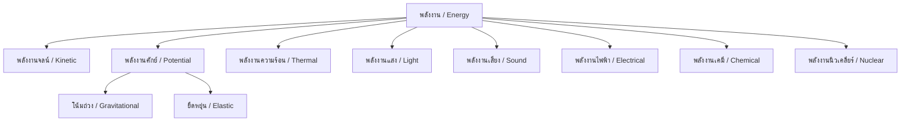

---
tags:
  - science
  - fundamental
  - physics
  - energy
  - ipst
source: "IPST (สสวท.) Fundamental Science Curriculum, B.E. 2551 (2008, revised 2560/2017)"
created: 2026-07-26
course_codes: ["ว111", "ว112", "ว113", "ว211", "ว212", "ว213"]
---

# Energy — พลังงาน

> *"Energy cannot be created or destroyed, only transformed."* — Law of Conservation of Energy

This note covers forms of energy, energy transformations, conservation of energy, work, power, and renewable/non-renewable energy sources. Students progress from recognizing energy in daily life to calculating work and power.

---

## 1 | Grade Band Breakdown

### ป.1–3 (Grades 1–3)

| Grade | Scope | Key Skills |
|---|---|---|
| **ป.1** | Energy around us | Observing sources of energy: sun, food, fire (แสงแดด อาหาร ไฟ); hot and cold |
| **ป.2** | Types of energy | Light, sound, heat, motion energy (พลังงานแสง เสียง ความร้อน การเคลื่อนที่) |
| **ป.3** | Energy use | Energy in daily life; saving energy (ประหยัดพลังงาน); electrical devices |

### ป.4–6 (Grades 4–6)

| Grade | Scope | Key Skills |
|---|---|---|
| **ป.4** | Energy forms | Kinetic, potential, heat, light, sound, electrical (พลังงานจลน์ ศักย์ ความร้อน แสง เสียง ไฟฟ้า) |
| **ป.5** | Energy transformation | Converting between forms; energy in machines; efficiency concept |
| **ป.6** | Energy sources | Renewable vs non-renewable (พลังงานหมุนเวียนและไม่หมุนเวียน); solar, wind, fossil fuels |

### ม.1–3 (Grades 7–9)

| Grade | Scope | Key Skills |
|---|---|---|
| **ม.1** | Work and energy | Work = Force × distance; kinetic and potential energy formulas |
| **ม.2** | Power | Power = Work ÷ time; efficiency calculations; energy conservation |
| **ม.3** | Energy resources | Thailand's energy mix; environmental impact; sustainable energy |

---

## 2 | Key Terminology

| Thai | English | Notes |
|---|---|---|
| พลังงาน | Energy | Ability to do work (J) |
| งาน | Work | Force × distance (J) |
| กำลัง | Power | Work ÷ time (W) |
| พลังงานจลน์ | Kinetic energy | Energy of motion |
| พลังงานศักย์ | Potential energy | Stored energy |
| พลังงานศักย์โน้มถ่วง | Gravitational PE | Energy due to height |
| พลังงานศักย์ยืดหยุ่น | Elastic PE | Energy in stretched/compressed objects |
| พลังงานความร้อน | Thermal energy | Heat energy |
| พลังงานแสง | Light energy | Electromagnetic radiation |
| พลังงานเสียง | Sound energy | Vibrations in medium |
| พลังงานไฟฟ้า | Electrical energy | Energy from electric current |
| พลังงานเคมี | Chemical energy | Energy in chemical bonds |
| พลังงานนิวเคลียร์ | Nuclear energy | Energy in atomic nuclei |
| การเปลี่ยนรูปพลังงาน | Energy transformation | Changing from one form to another |
| การอนุรักษ์พลังงาน | Conservation of energy | Energy cannot be created or destroyed |
| พลังงานหมุนเวียน | Renewable energy | Naturally replenished |
| พลังงานไม่หมุนเวียน | Non-renewable energy | Finite supply |
| ประสิทธิภาพ | Efficiency | Useful energy output ÷ total input |

---

## 3 | Forms of Energy

---

## 4 | Key Formulas

### 4.1 Work (งาน)

$$W = Fd\cos\theta$$

Where:
- $W$ = work (Joules, J)
- $F$ = force (Newtons, N)
- $d$ = distance (meters, m)
- $\theta$ = angle between force and displacement

**Simple case (force in direction of motion):**
$$W = Fd$$

### 4.2 Kinetic Energy (พลังงานจลน์)

$$KE = \frac{1}{2}mv^2$$

Where:
- $KE$ = kinetic energy (J)
- $m$ = mass (kg)
- $v$ = velocity (m/s)

### 4.3 Gravitational Potential Energy (พลังงานศักย์โน้มถ่วง)

$$PE = mgh$$

Where:
- $PE$ = potential energy (J)
- $m$ = mass (kg)
- $g$ = gravitational acceleration (9.8 m/s²)
- $h$ = height (m)

### 4.4 Power (กำลัง)

$$P = \frac{W}{t}$$

Where:
- $P$ = power (Watts, W)
- $W$ = work (J)
- $t$ = time (s)

### 4.5 Efficiency (ประสิทธิภาพ)

$$\text{Efficiency} = \frac{\text{Useful energy output}}{\text{Total energy input}} \times 100\%$$

### 4.6 Conservation of Energy

$$\text{Total energy before} = \text{Total energy after}$$

$$KE_1 + PE_1 = KE_2 + PE_2$$

---

## 5 | Energy Transformations

### 5.1 Common Transformations

| Device | Input Energy | Output Energy |
|---|---|---|
| Light bulb | Electrical | Light + Heat |
| Car engine | Chemical | Kinetic + Heat |
| Solar panel | Light | Electrical |
| Battery | Chemical | Electrical |
| Generator | Kinetic | Electrical |
| Motor | Electrical | Kinetic |
| Hair dryer | Electrical | Heat + Kinetic |
| Plant (photosynthesis) | Light | Chemical |

### 5.2 Energy Flow Diagram

---

## 6 | Energy Sources

### 6.1 Renewable vs Non-Renewable

| Renewable (หมุนเวียน) | Non-Renewable (ไม่หมุนเวียน) |
|---|---|
| Solar (พลังงานแสงอาทิตย์) | Coal (ถ่านหิน) |
| Wind (พลังงานลม) | Oil (น้ำมัน) |
| Hydroelectric (พลังงานน้ำ) | Natural gas (แก๊สธรรมชาติ) |
| Biomass (ชีวมวล) | Nuclear (นิวเคลียร์) |
| Geothermal (ความร้อนใต้พิภพ) | |

### 6.2 Thailand's Energy Mix

- Natural gas: ~50%
- Oil: ~30%
- Coal: ~12%
- Renewable: ~8%

---

## 7 | Real-World Examples

1. **Roller coaster** — PE at top → KE at bottom
2. **Rubber band** — Elastic PE → KE when released
3. **Food** — Chemical energy → body's kinetic and thermal energy
4. **Solar cells** — Light energy → electrical energy
5. **Wind turbines** — Kinetic energy → electrical energy

---

## 8 | Cross-Links

- [[13_Forces_and_Motion]] — Work and force
- [[15_Heat_and_Temperature]] — Thermal energy
- [[16_Light]] — Light energy
- [[17_Sound]] — Sound energy
- [[18_Electricity_and_Magnetism]] — Electrical energy
- [[07_Ecosystems]] — Energy flow in ecosystems
- [[11_Chemical_Reactions]] — Chemical energy
