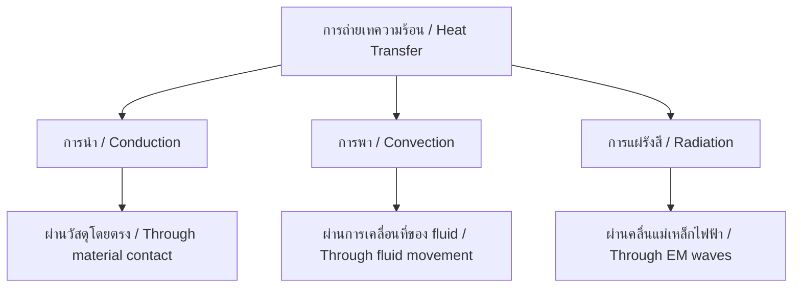

---
tags:
  - science
  - fundamental
  - physics
  - heat
  - temperature
  - ipst
source: "IPST (สสวท.) Fundamental Science Curriculum, B.E. 2551 (2008, revised 2560/2017)"
created: 2026-07-26
course_codes: ["ว111", "ว112", "ว113", "ว211", "ว212", "ว213"]
---

# Heat and Temperature — ความร้อนและอุณหภูมิ

> *"Heat is not a substance but a form of energy."*

This note covers temperature measurement, heat transfer, thermal expansion, and changes of state. Students progress from feeling hot and cold to calculating heat transfer and understanding thermal equilibrium.

---

## 1 | Grade Band Breakdown

### ป.1–3 (Grades 1–3)

| Grade | Scope | Key Skills |
|---|---|---|
| **ป.1** | Hot and cold | Feeling temperature differences; hot/cold objects in daily life |
| **ป.2** | Measuring temperature | Using thermometers (ปรอทวัดอุณหภูมิ); reading Celsius scale; safety around heat |
| **ป.3** | Heat sources | Sun, fire, friction as heat sources; heat in cooking |

### ป.4–6 (Grades 4–6)

| Grade | Scope | Key Skills |
|---|---|---|
| **ป.4** | Heat transfer I | Conduction (การนำความร้อน); metals conduct well; insulators |
| **ป.5** | Heat transfer II | Convection (การพาความร้อน); radiation (การแผ่รังสี); expansion/contraction |
| **ป.6** | Heat and matter | Melting, boiling points; heat and cooking; energy conservation |

### ม.1–3 (Grades 7–9)

| Grade | Scope | Key Skills |
|---|---|---|
| **ม.1** | Temperature scales | Celsius, Fahrenheit, Kelvin conversions; absolute zero |
| **ม.2** | Heat calculation | $Q = mc\Delta T$; specific heat capacity; latent heat |
| **ม.3** | Thermal physics | Heat engines; efficiency; global warming and heat |

---

## 2 | Key Terminology

| Thai | English | Notes |
|---|---|---|
| ความร้อน | Heat | Transfer of thermal energy (J) |
| อุณหภูมิ | Temperature | Measure of average kinetic energy (°C, °F, K) |
| การนำความร้อน | Conduction | Heat through direct contact |
| การพาความร้อน | Convection | Heat through fluid movement |
| การแผ่รังสี | Radiation | Heat through electromagnetic waves |
| ความจุความร้อนจำเพาะ | Specific heat capacity | Energy to raise 1 kg by 1°C |
| จุดหลอมเหลว | Melting point | Solid → Liquid temperature |
| จุดเดือด | Boiling point | Liquid → Gas temperature |
| การขยายตัว | Thermal expansion | Expansion when heated |
| การหดตัว | Thermal contraction | Shrinking when cooled |
| สภาพสมดุลทางความร้อน | Thermal equilibrium | Same temperature reached |
| ศูนย์สัมบูรณ์ | Absolute zero | 0 K = -273.15°C |
| ปรอท | Mercury | Used in thermometers |
| เทอร์โมมิเตอร์ | Thermometer | Temperature measuring device |

---

## 3 | Temperature Scales

### 3.1 Conversion Formulas

$$°F = \frac{9}{5}°C + 32$$

$$°C = \frac{5}{9}(°F - 32)$$

$$K = °C + 273.15$$

### 3.2 Key Points

| Point | Celsius | Fahrenheit | Kelvin |
|---|---|---|---|
| Absolute zero | -273.15°C | -459.67°F | 0 K |
| Water freezes | 0°C | 32°F | 273.15 K |
| Water boils | 100°C | 212°F | 373.15 K |
| Body temperature | 37°C | 98.6°F | 310.15 K |

---

## 4 | Heat Transfer Methods

### 4.1 Three Methods

| Method | Thai | Medium | Example |
|---|---|---|---|
| Conduction | การนำความร้อน | Solid (mainly) | Touching hot pan |
| Convection | การพาความร้อน | Liquid and gas | Boiling water, sea breeze |
| Radiation | การแผ่รังสี | No medium needed | Sun's heat, campfire |

### 4.2 Conductors vs Insulators

| Conductors (ตัวนำ) | Insulators (ฉนวน) |
|---|---|
| Metals (ทองแดง, อลูมิเนียม) | Wood, plastic, rubber, air |
| Transfer heat quickly | Transfer heat slowly |

---

## 5 | Key Formulas

### 5.1 Heat Energy

$$Q = mc\Delta T$$

Where:
- $Q$ = heat energy (Joules, J)
- $m$ = mass (kg)
- $c$ = specific heat capacity (J/kg·°C)
- $\Delta T$ = temperature change (°C)

### 5.2 Specific Heat Capacities

| Substance | c (J/kg·°C) | Thai |
|---|---|---|
| Water | 4,186 | น้ำ |
| Aluminum | 900 | อะลูมิเนียม |
| Iron | 450 | เหล็ก |
| Copper | 385 | ทองแดง |
| Ice | 2,090 | น้ำแข็ง |

### 5.3 Latent Heat (ความร้อนแฝง)

$$Q = mL$$

Where:
- $L$ = latent heat (J/kg)
- $L_f$ = latent heat of fusion (หลอมเหลว)
- $L_v$ = latent heat of vaporization (เดือด)

For water:
- $L_f = 334,000$ J/kg
- $L_v = 2,260,000$ J/kg

---

## 6 | Thermal Expansion (การขยายตัวจากความร้อน)

### 6.1 Linear Expansion

$$\Delta L = L_0 \alpha \Delta T$$

Where:
- $\Delta L$ = change in length
- $L_0$ = original length
- $\alpha$ = coefficient of linear expansion
- $\Delta T$ = temperature change

### 6.2 Applications

| Application | Thai | Explanation |
|---|---|---|
| Railway gaps | รางรถไฟมีช่องว่าง | Allow for expansion in heat |
| Bridge expansion joints | ข้อต่อสะพาน | Prevent buckling |
| Mercury thermometer | ปรอทวัดอุณหภูมิ | Mercury expands when heated |

---

## 7 | Changes of State and Energy

| Change | Thai | Energy | Temperature |
|---|---|---|---|
| Melting | หลอมเหลว | Absorbs heat | Stays at melting point |
| Freezing | แข็งตัว | Releases heat | Stays at freezing point |
| Boiling | เดือด | Absorbs heat | Stays at boiling point |
| Condensation | ควบแน่น | Releases heat | Stays at boiling point |

---

## 8 | Real-World Examples

1. **Cooking** — Heat transfer methods in Thai cooking (stir-frying = conduction, boiling = convection)
2. **Air conditioning** — Convection cycles in rooms
3. **Thermos flask** — Minimizing all three heat transfer methods
4. **Earth's atmosphere** — Greenhouse effect via radiation
5. **Sweating** — Evaporation cools the body

---

## 9 | Cross-Links

- [[09_Matter_and_Properties]] — States of matter and changes
- [[14_Energy]] — Thermal energy
- [[20_Weather_and_Climate]] — Heat and weather patterns
- [[04_Human_Body_Systems]] — Body temperature regulation
