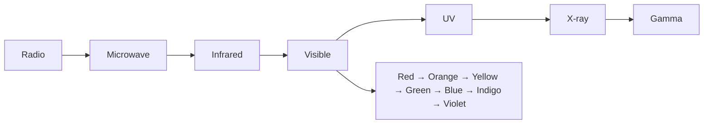

---
tags:
  - science
  - fundamental
  - physics
  - light
  - ipst
source: "IPST (สสวท.) Fundamental Science Curriculum, B.E. 2551 (2008, revised 2560/2017)"
created: 2026-07-26
course_codes: ["ว111", "ว112", "ว113", "ว211", "ว212", "ว213"]
---

# Light — แสง

> *"The speed of light is the ultimate speed limit."*

This note covers properties of light, reflection, refraction, lenses, and the electromagnetic spectrum. Students progress from observing light and shadows to understanding optics and color.

---

## 1 | Grade Band Breakdown

### ป.1–3 (Grades 1–3)

| Grade | Scope | Key Skills |
|---|---|---|
| **ป.1** | Light sources | Identifying light sources (แหล่งกำเนิดแสง): sun, lamp, candle; bright and dim |
| **ป.2** | Shadows | Making shadows; transparent, translucent, opaque (โปร่งใส โปร่งแสง ทึบแสง); light travels in straight lines |
| **ป.3** | Colors | Colors of the rainbow (สีรุ้ง); mixing colors; mirrors and reflections |

### ป.4–6 (Grades 4–6)

| Grade | Scope | Key Skills |
|---|---|---|
| **ป.4** | Reflection | Mirror reflection; angle of incidence = angle of reflection; periscope |
| **ป.5** | Refraction | Light bending in water; lenses (convex/concave); magnifying glass |
| **ป.6** | Optics | Eyes and vision; cameras; simple telescopes and microscopes |

### ม.1–3 (Grades 7–9)

| Grade | Scope | Key Skills |
|---|---|---|
| **ม.1** | Light properties | Speed of light; reflection and refraction laws; mirrors |
| **ม.2** | Lenses and images | Convex/concave lens; image formation; eye defects and correction |
| **ม.3** | Electromagnetic spectrum | Visible light; radio waves; X-rays; applications |

---

## 2 | Key Terminology

| Thai | English | Notes |
|---|---|---|
| แสง | Light | Electromagnetic radiation visible to eye |
| แหล่งกำเนิดแสง | Light source | Object that produces light |
| การสะท้อน | Reflection | Light bouncing off surface |
| การหักเห | Refraction | Light bending at medium boundary |
| มุมตกกระทบ | Angle of incidence | Angle of incoming light |
| มุมสะท้อน | Angle of reflection | Angle of reflected light |
| เลนส์นูน | Convex lens | Thicker in middle, converges light |
| เลนส์เว้า | Concave lens | Thinner in middle, diverges light |
| กระจกเงาราบ | Plane mirror | Flat mirror |
| กระจกนูน | Convex mirror | Curved outward, wider view |
| กระจกเว้า | Concave mirror | Curved inward, magnified image |
| ภาพจริง | Real image | Can be projected on screen |
| ภาพเสมือน | Virtual image | Cannot be projected |
| สเปกตรัม | Spectrum | Range of electromagnetic waves |
| ความถี่ | Frequency | Waves per second (Hz) |
| ความยาวคลื่น | Wavelength | Distance between wave peaks (m) |
| การแทรกสอด | Interference | Overlapping waves |
| การเลี้ยวเบน | Diffraction | Waves bending around obstacles |

---

## 3 | Properties of Light

### 3.1 Key Properties

1. **Travels in straight lines** (เดินทางเป็นเส้นตรง)
2. **Fastest speed in vacuum** — $c = 3 \times 10^8$ m/s
3. **Can be reflected** — bounces off surfaces
4. **Can be refracted** — bends when entering different medium
5. **Can be absorbed** — energy transferred to material

### 3.2 Transparent, Translucent, Opaque

| Type | Thai | Light passes? | Example |
|---|---|---|---|
| Transparent | โปร่งใส | Yes, clearly | Clear glass, water |
| Translucent | โปร่งแสง | Yes, partially | Frosted glass, thin paper |
| Opaque | ทึบแสง | No | Wood, metal, brick |

---

## 4 | Reflection (การสะท้อน)

### 4.1 Law of Reflection

$$\theta_i = \theta_r$$

Where:
- $\theta_i$ = angle of incidence (มุมตกกระทบ)
- $\theta_r$ = angle of reflection (มุมสะท้อน)

**Both angles measured from the normal (เส้นตั้งฉาก)**

### 4.2 Mirror Types

| Mirror | Thai | Image Properties | Use |
|---|---|---|---|
| Plane | กระจกเงาราบ | Same size, upright, virtual | Bathroom mirror |
| Convex | กระจกนูน | Smaller, upright, virtual | Car side mirror |
| Concave | กระจกเว้า | Can be larger, inverted, real | Makeup mirror, telescope |

---

## 5 | Refraction (การหักเห)

### 5.1 Snell's Law

$$n_1 \sin\theta_1 = n_2 \sin\theta_2$$

Where:
- $n$ = refractive index of medium
- $\theta$ = angle from normal

### 5.2 Refractive Indices

| Medium | n |
|---|---|
| Vacuum | 1.00 |
| Air | 1.00 |
| Water | 1.33 |
| Glass | 1.52 |
| Diamond | 2.42 |

### 5.3 Effects

- **Light bends toward normal** when entering denser medium (air → water)
- **Light bends away from normal** when entering less dense medium (water → air)

---

## 6 | Lenses (เลนส์)

### 6.1 Types

| Lens | Thai | Shape | Effect |
|---|---|---|---|
| Convex | เลนส์นูน | Thicker in middle | Converges light |
| Concave | เลนส์เว้า | Thinner in middle | Diverges light |

### 6.2 Lens Formula

$$\frac{1}{f} = \frac{1}{v} + \frac{1}{u}$$

Where:
- $f$ = focal length
- $v$ = image distance
- $u$ = object distance

### 6.3 Magnification

$$M = \frac{v}{u} = \frac{\text{Image height}}{\text{Object height}}$$

---

## 7 | Electromagnetic Spectrum (สเปกตรัมแม่เหล็กไฟฟ้า)

| Type | Thai | Wavelength | Use |
|---|---|---|---|
| Radio waves | คลื่นวิทยุ | Longest | Radio, TV |
| Microwave | ไมโครเวฟ | cm range | Cooking, phones |
| Infrared | อินฟราเรด | μm range | Remote controls, heat |
| Visible light | แสงที่มองเห็น | 400-700 nm | Vision |
| Ultraviolet | อัลตราไวโอเลต | 10-400 nm | Sterilization, tanning |
| X-ray | รังสีเอกซ์ | 0.01-10 nm | Medical imaging |
| Gamma ray | รังสีแกมมา | Shortest | Cancer treatment |

---

## 8 | Color and Light

### 8.1 Visible Spectrum

| Color | Thai | Wavelength (nm) |
|---|---|---|
| Red | แดง | 620-750 |
| Orange | ส้ม | 590-620 |
| Yellow | เหลือง | 570-590 |
| Green | เขียว | 495-570 |
| Blue | น้ำเงิน | 450-495 |
| Indigo | คราม | 420-450 |
| Violet | ม่วง | 380-420 |

### 8.2 Color Mixing

- **Additive (เพิ่ม):** Red + Green + Blue = White (light mixing)
- **Subtractive (ลด):** Cyan + Magenta + Yellow = Black (paint mixing)

---

## 9 | Real-World Examples

1. **Rainbow** — Refraction and dispersion of sunlight in water droplets
2. **Swimming pool** — Refraction makes pool look shallower
3. **Car mirrors** — Convex mirrors for wider view
4. **Eye** — Convex lens focuses light on retina
5. **Fiber optics** — Total internal reflection for data transmission

---

## 10 | Cross-Links

- [[14_Energy]] — Light energy
- [[17_Sound]] — Comparing light and sound waves
- [[18_Electricity_and_Magnetism]] — Electromagnetic waves
- [[05_Plants]] — Light in photosynthesis
- [[21_Solar_System_and_Astronomy]] — Light from stars
