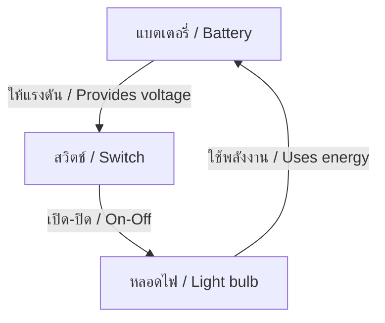

---
tags:
  - science
  - fundamental
  - physics
  - electricity
  - magnetism
  - ipst
source: "IPST (สสวท.) Fundamental Science Curriculum, B.E. 2551 (2008, revised 2560/2017)"
created: 2026-07-26
course_codes: ["ว111", "ว112", "ว113", "ว211", "ว212", "ว213"]
---

# Electricity and Magnetism — ไฟฟ้าและแม่เหล็ก

> *"Electricity is the power that causes all natural phenomena not observed to be chemical."* — Thomas Edison

This note covers electric circuits, magnetism, electromagnetism, and their applications. Students progress from simple circuits to understanding Ohm's law and electromagnetic induction.

---

## 1 | Grade Band Breakdown

### ป.1–3 (Grades 1–3)

| Grade | Scope | Key Skills |
|---|---|---|
| **ป.1** | Electrical safety | Danger of electricity (อันตรายจากไฟฟ้า); batteries and plugs; electrical devices at home |
| **ป.2** | Simple circuits | Making a bulb light up; battery, wire, bulb (แบตเตอรี่ สายไฟ หลอดไฟ); on/off switch |
| **ป.3** | Magnets | Magnets attract some metals (แม่เหล็กดูดโลหะ); north and south poles; compass |

### ป.4–6 (Grades 4–6)

| Grade | Scope | Key Skills |
|---|---|---|
| **ป.4** | Circuits I | Series and parallel circuits; conductors and insulators; switches |
| **ป.5** | Circuits II | Voltage, current, resistance concept; batteries in series |
| **ป.6** | Magnetism | Magnetic fields; electromagnets; compass and navigation |

### ม.1–3 (Grades 7–9)

| Grade | Scope | Key Skills |
|---|---|---|
| **ม.1** | Ohm's law | $V = IR$; calculating voltage, current, resistance; series and parallel calculations |
| **ม.2** | Electrical power | $P = IV$; energy consumption; safety devices; household circuits |
| **ม.3** | Electromagnetism | Electromagnetic induction; generators; motors; transformers |

---

## 2 | Key Terminology

| Thai | English | Notes |
|---|---|---|
| ไฟฟ้า | Electricity | Flow of electric charge |
| กระแสไฟฟ้า | Electric current | Flow of electrons (A) |
| ความต่างศักย์ | Voltage/Potential difference | Electrical pressure (V) |
| ความต้านทาน | Resistance | Opposition to current (Ω) |
| วงจรไฟฟ้า | Electric circuit | Closed path for current |
| วงจรอนุกรม | Series circuit | Components in a single loop |
| วงจรขนาน | Parallel circuit | Components in separate branches |
| แบตเตอรี่ | Battery | Source of electrical energy |
| ตัวนำ | Conductor | Material that allows current flow |
| ฉนวน | Insulator | Material that blocks current flow |
| แม่เหล็ก | Magnet | Object with magnetic field |
| ขั้วเหนือ | North pole | Magnetic pole |
| ขั้วใต้ | South pole | Magnetic pole |
| สนามแม่เหล็ก | Magnetic field | Region of magnetic force |
| แม่เหล็กไฟฟ้า | Electromagnet | Magnet made by electric current |
| การเหนี่ยวนำแม่เหล็กไฟฟ้า | Electromagnetic induction | Current from changing magnetic field |
| วัตต์ | Watt (W) | Unit of power |
| โอห์ม | Ohm (Ω) | Unit of resistance |
| แอมแปร์ | Ampere (A) | Unit of current |
| โวลต์ | Volt (V) | Unit of voltage |

---

## 3 | Electric Circuits

### 3.1 Circuit Components



### 3.2 Series vs Parallel Circuits

| Feature | Series (อนุกรม) | Parallel (ขนาน) |
|---|---|---|
| Path | Single loop | Multiple branches |
| Current | Same everywhere | Splits at junctions |
| Voltage | Splits across components | Same across each branch |
| One bulb breaks | All go out | Others stay on |
| Total resistance | $R_T = R_1 + R_2 + ...$ | $\frac{1}{R_T} = \frac{1}{R_1} + \frac{1}{R_2} + ...$ |

---

## 4 | Ohm's Law (กฎของโอห์ม)

### 4.1 Formula

$$V = IR$$

Where:
- $V$ = Voltage (Volts, V)
- $I$ = Current (Amperes, A)
- $R$ = Resistance (Ohms, Ω)

### 4.2 Derived Formulas

$$I = \frac{V}{R}$$

$$R = \frac{V}{I}$$

### 4.3 Example

> A 12V battery is connected to a 4Ω resistor. What is the current?

$$I = \frac{V}{R} = \frac{12}{4} = 3 \text{ A}$$

---

## 5 | Electrical Power and Energy

### 5.1 Power Formula

$$P = IV$$

Where:
- $P$ = Power (Watts, W)
- $I$ = Current (A)
- $V$ = Voltage (V)

### 5.2 Combined Formulas

$$P = I^2R$$

$$P = \frac{V^2}{R}$$

### 5.3 Energy Consumption

$$E = Pt$$

Where:
- $E$ = Energy (Joules, J or kWh)
- $P$ = Power (Watts)
- $t$ = Time (seconds or hours)

**Unit:** 1 kWh = 3,600,000 J = 3.6 MJ

---

## 6 | Magnetism (แม่เหล็ก)

### 6.1 Magnetic Properties

1. **Every magnet has two poles** — North (N) and South (S)
2. **Like poles repel, unlike poles attract**
3. **Magnetic field lines** go from North to South outside the magnet
4. **Earth is a giant magnet** — magnetic north and south poles

### 6.2 Magnetic Field Patterns

```
    N ─────→ ─────→ ─────→ S
    ↑                      ↓
    ↑      Field lines     ↓
    ↑                      ↓
    N ←───── ←───── ←───── S
```

### 6.3 Electromagnet (แม่เหล็กไฟฟ้า)

**Made by:** Wrapping wire around an iron core and passing current

**Strength depends on:**
- Number of coil turns
- Amount of current
- Type of core material

**Applications:** Electric bell, crane magnet, MRI machine

---

## 7 | Electromagnetic Induction

### 7.1 Faraday's Law

A changing magnetic field induces a voltage in a conductor.

**Methods:**
1. Move a magnet through a coil
2. Move a coil through a magnetic field
3. Change the magnetic field strength

### 7.2 Applications

| Device | Thai | Principle |
|---|---|---|
| Generator | เครื่องกำเนิดไฟฟ้า | Mechanical → Electrical |
| Motor | มอเตอร์ | Electrical → Mechanical |
| Transformer | ทรานส์ฟอร์เมอร์ | Change voltage levels |
| Microphone | ไมโครโฟน | Sound → Electrical |

---

## 8 | Electrical Safety

| Safety Measure | Thai | Purpose |
|---|---|---|
| Fuse | ฟิวส์ | Breaks circuit if current too high |
| Circuit breaker | เซอร์กิตเบรกเกอร์ | Resettable safety switch |
| Earth wire | สายดิน | Directs fault current to ground |
| Insulation | ฉนวน | Prevents contact with live wire |
| RCD | อุปกรณ์ตัดไฟรั่ว | Detects current leakage |

---

## 9 | Series and Parallel Calculations

### 9.1 Series Circuit

$$R_T = R_1 + R_2 + R_3$$
$$I_T = I_1 = I_2 = I_3$$
$$V_T = V_1 + V_2 + V_3$$

### 9.2 Parallel Circuit

$$\frac{1}{R_T} = \frac{1}{R_1} + \frac{1}{R_2} + \frac{1}{R_3}$$
$$I_T = I_1 + I_2 + I_3$$
$$V_T = V_1 = V_2 = V_3$$

---

## 10 | Real-World Examples

1. **Household wiring** — Parallel circuits for independent operation
2. **Christmas lights** — Series (old) vs parallel (modern)
3. **Electric trains** — Motors convert electrical to kinetic energy
4. **Compass navigation** — Earth's magnetic field
5. **Power plants** — Generators using electromagnetic induction

---

## 11 | Cross-Links

- [[14_Energy]] — Electrical energy
- [[16_Light]] — Electromagnetic waves
- [[13_Forces_and_Motion]] — Motor and generator principles
- [[22_Technology_and_Engineering]] — Electrical technology
