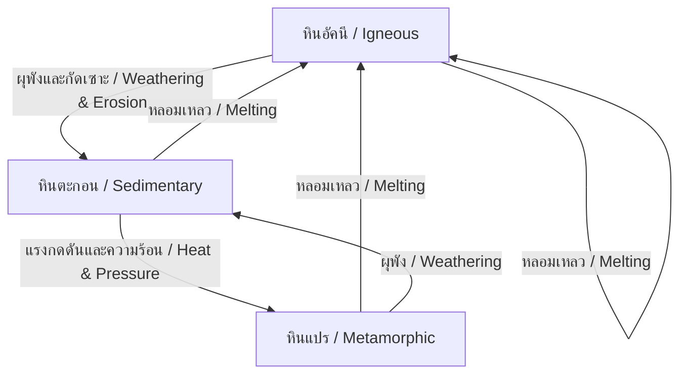
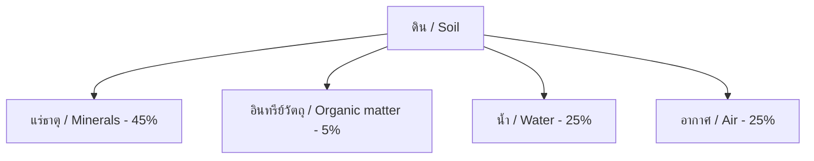

---
tags:
  - science
  - fundamental
  - earth-science
  - rocks
  - minerals
  - soil
  - ipst
source: "IPST (สสวท.) Fundamental Science Curriculum, B.E. 2551 (2008, revised 2560/2017)"
created: 2026-07-26
course_codes: ["ว111", "ว112", "ว113", "ว211", "ว212", "ว213"]
---

# Rocks, Minerals, and Soil — หิน แร่ และดิน

> *"The earth has music for those who listen."* — William Shakespeare

This note covers the rock cycle, mineral properties, soil composition, and Earth's geological processes. Students progress from observing rocks and soil to understanding geological transformations.

---

## 1 | Grade Band Breakdown

### ป.1–3 (Grades 1–3)

| Grade | Scope | Key Skills |
|---|---|---|
| **ป.1** | Rocks around me | Observing rocks by size, shape, color (สังเกตก้อนหิน); collecting and sorting rocks |
| **ป.2** | Properties of rocks | Hard/soft, smooth/rough, heavy/light (แข็ง/อ่อน หยาบ/เรียบ); uses of rocks |
| **ป.3** | Soil | Observing soil types; components of soil (ส่วนประกอบของดิน); sand, clay, humus |

### ป.4–6 (Grades 4–6)

| Grade | Scope | Key Skills |
|---|---|---|
| **ป.4** | Rock types | Igneous, sedimentary, metamorphic introduction; fossils in rocks |
| **ป.5** | Minerals | Mineral properties: hardness, color, luster, streak; Mohs hardness scale |
| **ป.6** | Soil science | Soil layers (horizons); soil erosion; importance of soil for plants |

### ม.1–3 (Grades 7–9)

| Grade | Scope | Key Skills |
|---|---|---|
| **ม.1** | Rock cycle | Formation processes; plate tectonics introduction; weathering and erosion |
| **ม.2** | Mineral identification | Detailed mineral testing; economic minerals of Thailand |
| **ม.3** | Earth processes | Earthquakes, volcanoes; geological time; soil conservation |

---

## 2 | Key Terminology

| Thai | English | Notes |
|---|---|---|
| หิน | Rock | Natural solid made of minerals |
| แร่ | Mineral | Natural inorganic solid with crystal structure |
| ดิน | Soil | Mixture of minerals, organic matter, water, air |
| หินอัคนี | Igneous rock | Formed from cooled magma/lava |
| หินตะกอน | Sedimentary rock | Formed from compressed sediments |
| หินแปร | Metamorphic rock | Changed by heat and pressure |
| แมกมา | Magma | Molten rock below surface |
| ลาวา | Lava | Molten rock on surface |
| ซากดึกดำบรรพ์ | Fossil | Preserved remains in rock |
| ความแข็ง | Hardness | Resistance to scratching |
| รอยขีด | Streak | Color of mineral powder |
| เนื้อ | Luster | How light reflects off surface |
| การผุพัง | Weathering | Breaking down of rock |
| การกัดเซาะ | Erosion | Movement of weathered material |
| แผ่นเปลือกโลก | Tectonic plates | Moving sections of Earth's crust |
| วัฏจักรหิน | Rock cycle | Continuous transformation of rocks |
| ชั้นดิน | Soil horizon | Layers in soil profile |
| ฮิวมัส | Humus | Decomposed organic matter in soil |

---

## 3 | Rock Types

### 3.1 Three Main Types



### 3.2 Comparison

| Feature | Igneous (อัคนี) | Sedimentary (ตะกอน) | Metamorphic (แปร) |
|---|---|---|---|
| Formation | Cooled magma/lava | Compressed sediments | Heat + pressure |
| Texture | Crystalline | Layered, may have fossils | Banded, foliated |
| Examples | Granite, basalt, obsidian | Limestone, sandstone, shale | Marble, slate, quartzite |
| Thai examples | หินแกรนิต | หินปูน | หินอ่อน |

### 3.3 Igneous Rock Types

| Type | Thai | Where formed | Cooling | Examples |
|---|---|---|---|---|
| Intrusive (plutonic) | หินอัคนีแทรกซอน | Below surface | Slow | Granite |
| Extrusive (volcanic) | หินอัคนีพุ | On surface | Fast | Basalt, obsidian |

---

## 4 | Mineral Properties

### 4.1 Mohs Hardness Scale (ระดับความแข็งของโมส์)

| Hardness | Mineral | Thai | Test |
|---|---|---|---|
| 1 | Talc | ทัลก์ | Softest, feels greasy |
| 2 | Gypsum | ยิปซัม | Can scratch with fingernail |
| 3 | Calcite | แคลไซต์ | Scratches copper coin |
| 4 | Fluorite | ฟลูออไรต์ | Easily scratched by knife |
| 5 | Apatite | อะพาไทต์ | Scratched by knife with difficulty |
| 6 | Orthoclase | ออร์โทเคลส | Scratches glass |
| 7 | Quartz | ควอตซ์ | Scratches steel file |
| 8 | Topaz | โทแพซ | Scratches quartz |
| 9 | Corundum | คอรันดัม | Scratches topaz |
| 10 | Diamond | เพชร | Hardest natural substance |

### 4.2 Other Mineral Properties

| Property | Thai | How to test |
|---|---|---|
| Color | สี | Visual observation |
| Streak | รอยขีด | Rub on unglazed porcelain |
| Luster | เนื้อ/ประกาย | How light reflects (metallic, glassy, dull) |
| Cleavage | แนวแตกเรียบ | How it breaks |
| Crystal form | ผลึก | Shape of crystals |

---

## 5 | Soil (ดิน)

### 5.1 Soil Composition



### 5.2 Soil Types

| Type | Thai | Particle size | Properties |
|---|---|---|---|
| Sandy soil | ดินทราย | Large | Drains quickly, low nutrients |
| Clay soil | ดินเหนียว | Small | Retains water, sticky |
| Loam soil | ดินร่วน | Medium | Best for plants, balanced |
| Silt soil | ดินตะกอน | Fine | Smooth, retains moisture |

### 5.3 Soil Profile

```
O Horizon (ชั้นอินทรีย์) — Organic matter, humus
A Horizon (ชั้นบน) — Topsoil, rich in nutrients
B Horizon (ชั้นล่าง) — Subsoil, minerals accumulate
C Horizon (ชั้นหินผุ) — Weathered parent rock
Bedrock (ชั้นหินแข็ง) — Solid rock
```

---

## 6 | Weathering and Erosion

### 6.1 Types of Weathering

| Type | Thai | Process | Example |
|---|---|---|---|
| Physical | การผุพังทางกายภาพ | Physical breakdown | Freeze-thaw, root growth |
| Chemical | การผุพังทางเคมี | Chemical reactions | Acid rain on limestone |
| Biological | การผุพังทางชีวภาพ | Living organisms | Plant roots, burrowing animals |

### 6.2 Agents of Erosion

| Agent | Thai | Effect |
|---|---|---|
| Water | น้ำ | Rivers, waves, rain |
| Wind | ลม | Sandstorms, dust |
| Ice | น้ำแข็ง | Glaciers |
| Gravity | แรงโน้มถ่วง | Landslides |

---

## 7 | The Rock Cycle in Detail

### 7.1 Processes

| Process | Thai | Result |
|---|---|---|
| Cooling & crystallization | การเย็นตัวและตกผลึก | Magma → Igneous rock |
| Weathering & erosion | การผุพังและกัดเซาะ | Any rock → Sediments |
| Compaction & cementation | การอัดตัวและการเชื่อมตัว | Sediments → Sedimentary rock |
| Heat & pressure | ความร้อนและแรงดัน | Any rock → Metamorphic rock |
| Melting | การหลอมเหลว | Any rock → Magma |

---

## 8 | Thai Geological Resources

| Resource | Thai | Location |
|---|---|---|
| Tin | แร่ดีบุก | Southern Thailand |
| Gypsum | ยิปซัม | Nakhon Ratchasima |
| Limestone | หินปูน | Throughout Thailand |
| Gemstones | อัญมณี | Chanthaburi, Kanchanaburi |
| Gold | ทองคำ | Loei, Phichit |

---

## 9 | Cross-Links

- [[09_Matter_and_Properties]] — Properties of materials
- [[12_Acids_Bases_and_Salts]] — Chemical weathering
- [[20_Weather_and_Climate]] — Weathering agents
- [[21_Solar_System_and_Astronomy]] — Earth's structure
- [[07_Ecosystems]] — Soil in ecosystems
