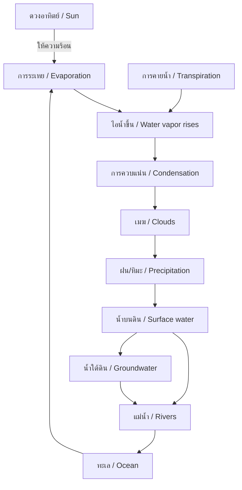
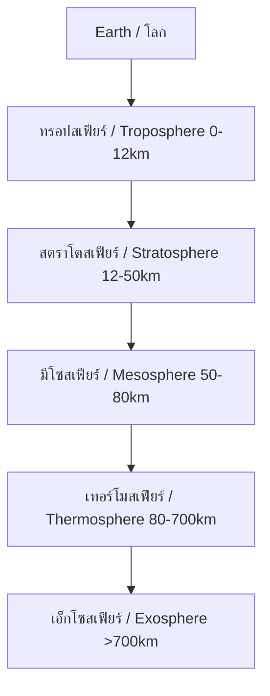

---
tags:
  - science
  - fundamental
  - earth-science
  - weather
  - climate
  - ipst
source: "IPST (สสวท.) Fundamental Science Curriculum, B.E. 2551 (2008, revised 2560/2017)"
created: 2026-07-26
course_codes: ["ว111", "ว112", "ว113", "ว211", "ว212", "ว213"]
---

# Weather and Climate — ลมฟ้าอากาศและภูมิอากาศ

> *"Climate is what we expect, weather is what we get."* — Mark Twain

This note covers weather observation, climate patterns, the water cycle, and atmospheric phenomena. Students progress from observing daily weather to understanding global climate systems.

---

## 1 | Grade Band Breakdown

### ป.1–3 (Grades 1–3)

| Grade | Scope | Key Skills |
|---|---|---|
| **ป.1** | Daily weather | Observing sunny, cloudy, rainy (แดดออก เมฆมาก ฝนตก); hot and cold |
| **ป.2** | Weather observation | Measuring temperature; wind direction; cloud types; rainy season vs dry season |
| **ป.3** | Seasons | Thai seasons: summer, rainy, winter (ฤดูร้อน ฤดูฝน ฤดูหนาว); weather and clothing |

### ป.4–6 (Grades 4–6)

| Grade | Scope | Key Skills |
|---|---|---|
| **ป.4** | Weather instruments | Thermometer, rain gauge, wind vane, barometer; weather recording |
| **ป.5** | Water cycle | Evaporation, condensation, precipitation (ระเหย ควบแน่น ฝนตก); clouds |
| **ป.6** | Weather vs climate | Difference between weather and climate; factors affecting climate |

### ม.1–3 (Grades 7–9)

| Grade | Scope | Key Skills |
|---|---|---|
| **ม.1** | Atmosphere | Atmospheric layers; air pressure; winds and global circulation |
| **ม.2** | Climate systems | Climate zones; ocean currents; monsoons in Thailand |
| **ม.3** | Climate change | Greenhouse effect; global warming; human impact; weather disasters |

---

## 2 | Key Terminology

| Thai | English | Notes |
|---|---|---|
| สภาพอากาศ | Weather | Day-to-day atmospheric conditions |
| ภูมิอากาศ | Climate | Long-term weather patterns |
| อุณหภูมิ | Temperature | Measure of heat |
| ความชื้น | Humidity | Amount of water vapor in air |
| ความดันอากาศ | Air pressure | Weight of air above |
| ปริมาณฝน | Rainfall | Amount of precipitation |
| ลม | Wind | Moving air |
| เมฆ | Cloud | Water droplets/ice in atmosphere |
| ฝน | Rain | Liquid precipitation |
| หมอก | Fog | Low cloud |
| พายุ | Storm | Severe weather disturbance |
| ไต้ฝุ่น | Typhoon | Tropical storm in Pacific |
| มรสุม | Monsoon | Seasonal wind pattern |
| ฤดูร้อน | Summer | Hot season (March-May) |
| ฤดูฝน | Rainy | Wet season (June-October) |
| ฤดูหนาว | Winter | Cool season (November-February) |
| ปรากฏการณ์เรือนกระจก | Greenhouse effect | Trapping of heat by atmosphere |
| ภาวะโลกร้อน | Global warming | Rising Earth temperatures |
| ชั้นบรรยากาศ | Atmosphere | Layers of gases around Earth |

---

## 3 | The Water Cycle (วัฏจักรน้ำ)

---

## 4 | Thai Seasons

| Season | Thai | Months | Characteristics |
|---|---|---|---|
| Summer | ฤดูร้อน | March – May | Hot, 30-40°C |
| Rainy | ฤดูฝน | June – October | Monsoon rains, flooding |
| Winter | ฤดูหนาว | November – February | Cool, 15-25°C |

---

## 5 | Cloud Types

| Cloud | Thai | Altitude | Weather |
|---|---|---|---|
| Cirrus | ซีรัส | High (>6 km) | Fair weather |
| Cumulus | คิวมูลัส | Medium | Fair, may grow |
| Stratus | สเตรตัส | Low | Overcast, drizzle |
| Cumulonimbus | คิวมูโลนิมบัส | Low to high | Thunderstorms |

---

## 6 | Atmospheric Layers

| Layer | Thai | Key Features |
|---|---|---|
| Troposphere | ทรอปสเฟียร์ | Weather occurs here; temp decreases with altitude |
| Stratosphere | สตราโตสเฟียร์ | Ozone layer; temp increases |
| Mesosphere | มีโซสเฟียร️ | Meteors burn up here |
| Thermosphere | เทอร์โมสเฟียร์ | Auroras; very hot but thin |
| Exosphere | เอ็กโซสเฟียร์ | Transition to space |

---

## 7 | Factors Affecting Climate

| Factor | Thai | Effect |
|---|---|---|
| Latitude | ละติจูด | Closer to equator = warmer |
| Altitude | ระดับความสูง | Higher = cooler |
| Ocean currents | กระแสลมทะเล | Warm/cold currents affect coastal climate |
| Distance from sea | ระยะทางจากทะเล | Maritime vs continental climate |
| Mountains | ภูเขา | Rain shadow effect |

---

## 8 | Greenhouse Effect and Climate Change

### 8.1 Greenhouse Gases

| Gas | Thai | Source |
|---|---|---|
| CO₂ | คาร์บอนไดออกไซด์ | Burning fossil fuels |
| CH₄ | มีเทน | Agriculture, landfills |
| N₂O | ไนตรัสออกไซด์ | Fertilizers |
| H₂O | ไอน้ำ | Evaporation |

### 8.2 Effects of Global Warming

| Effect | Thai |
|---|---|
| Rising sea levels | ระดับน้ำทะเลสูงขึ้น |
| More extreme weather | สภาพอากาศแปรปรวน |
| Coral bleaching | ปะการังฟอกขาว |
| Species extinction | การสูญพันธุ์ |
| Agricultural impacts | ผลกระทบต่อเกษตรกรรม |

---

## 9 | Weather Instruments

| Instrument | Thai | Measures |
|---|---|---|
| Thermometer | เทอร์โมมิเตอร์ | Temperature |
| Rain gauge | เกวัดปริมาณฝน | Rainfall |
| Wind vane | ลมบอกทิศ | Wind direction |
| Anemometer | แอนนิโมมิเตอร์ | Wind speed |
| Barometer | บารอมิเตอร์ | Air pressure |
| Hygrometer | ไฮโกรมิเตอร์ | Humidity |

---

## 10 | Real-World Examples

1. **Thai monsoon** — Southwest monsoon brings rain (June-October)
2. **Bangkok flooding** — Climate and urbanization effects
3. **PM2.5** — Air pollution in Thai cities
4. **Coral reef bleaching** — Rising sea temperatures
5. **Drought** — El Niño effects on Thai agriculture

---

## 11 | Cross-Links

- [[15_Heat_and_Temperature]] — Heat and atmospheric processes
- [[07_Ecosystems]] — Climate and ecosystems
- [[14_Energy]] — Solar energy driving weather
- [[19_Rocks_Minerals_Soil]] — Weathering and erosion
- [[21_Solar_System_and_Astronomy]] — Earth's atmosphere
