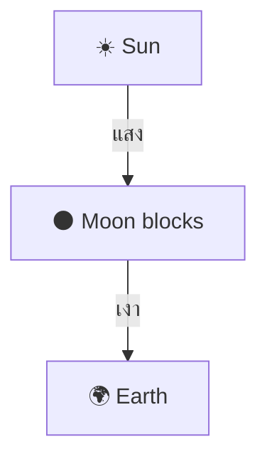
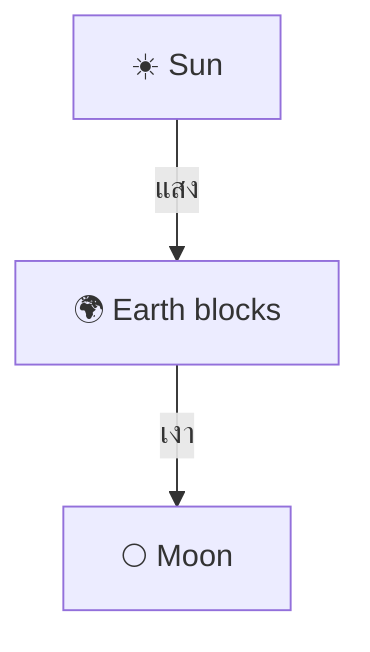
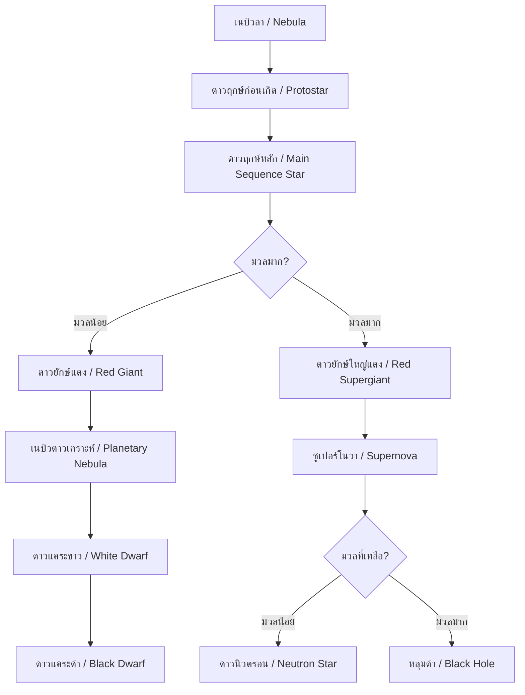

---
tags:
  - science
  - fundamental
  - earth-science
  - astronomy
  - solar-system
  - ipst
source: "IPST (สสวท.) Fundamental Science Curriculum, B.E. 2551 (2008, revised 2560/2017)"
created: 2026-07-26
course_codes: ["ว111", "ว112", "ว113", "ว211", "ว212", "ว213"]
---

# Solar System and Astronomy — ระบบสุริยะและดาราศาสตร์

> *"The cosmos is within us. We are made of star-stuff."* — Carl Sagan

This note covers the solar system, planets, stars, and astronomical phenomena. Students progress from observing the sun and moon to understanding the scale of the universe.

---

## 1 | Grade Band Breakdown

### ป.1–3 (Grades 1–3)

| Grade | Scope | Key Skills |
|---|---|---|
| **ป.1** | Sun, moon, stars | Observing day/night (กลางวัน/กลางคืน); sun gives light and heat; moon phases |
| **ป.2** | Earth and sky | Earth is a sphere; movement of sun across sky; shadows change direction |
| **ป.3** | Moon and tides | Moon phases (ข้างขึ้นข้างแรม); day length; constellations (กลุ่มดาว) |

### ป.4–6 (Grades 4–6)

| Grade | Scope | Key Skills |
|---|---|---|
| **ป.4** | Solar system | 8 planets; sun as star; order of planets |
| **ป.5** | Earth's movements | Rotation (หมุนรอบตัวเอง) = day; Revolution (โคจรรอบดวงอาทิตย์) = year; seasons |
| **ป.6** | Stars and space | Stars twinkle; light-year concept; space exploration |

### ม.1–3 (Grades 7–9)

| Grade | Scope | Key Skills |
|---|---|---|
| **ม.1** | Solar system details | Planet characteristics; asteroid belt; comets; dwarf planets |
| **ม.2** | Stars and galaxies | Star life cycle; H-R diagram; galaxies; Big Bang theory |
| **ม.3** | Space technology | Telescopes; space missions; satellites; Thailand's space program |

---

## 2 | Key Terminology

| Thai | English | Notes |
|---|---|---|
| ระบบสุริยะ | Solar system | Sun and orbiting bodies |
| ดวงอาทิตย์ | Sun | Star at center of solar system |
| ดาวเคราะห์ | Planet | Orbits a star, cleared orbit |
| ดาวบริวาร | Satellite/Moon | Orbits a planet |
| ดาวเคราะห์แคระ | Dwarf planet | Orbits star but hasn't cleared orbit |
| ดาวเคราะห์น้อย | Asteroid | Small rocky body |
| ดาวหาง | Comet | Icy body with tail |
| ดาวฤกษ์ | Star | Luminous sphere of hot gas |
| กาแล็กซี | Galaxy | Collection of stars |
| ทางช้างเผือก | Milky Way | Our galaxy |
| จักรวาล | Universe | Everything that exists |
| การหมุนรอบตัวเอง | Rotation | Spinning on axis |
| การโคจร | Revolution | Orbiting another body |
| แรงโน้มถ่วง | Gravity | Attractive force |
| ปีแสง | Light-year | Distance light travels in one year |
| กลุ่มดาว | Constellation | Named pattern of stars |
| ข้างขึ้น | Waxing moon | Moon getting fuller |
| ข้างแรม | Waning moon | Moon getting thinner |
| สุริยุปราคา | Solar eclipse | Moon blocks sun |
| จันทรุปราคา | Lunar eclipse | Earth blocks moon |

---

## 3 | The Solar System

### 3.1 Planets in Order

### 3.2 Planet Comparison

| Planet | Thai | Type | Key Feature |
|---|---|---|---|
| Mercury | ดาวพุธ | Terrestrial | Closest to sun, no atmosphere |
| Venus | ดาวศุกร์ | Terrestrial | Hottest, thick CO₂ atmosphere |
| Earth | ดาวโลก | Terrestrial | Only known life, liquid water |
| Mars | ดาวอังคาร | Terrestrial | Red planet, thin atmosphere |
| Jupiter | ดาวพฤหัสบดี | Gas giant | Largest planet, Great Red Spot |
| Saturn | ดาวเสาร์ | Gas giant | Rings |
| Uranus | ดาวยูเรนัส | Ice giant | Tilted axis |
| Neptune | ดาวเนปจูน | Ice giant | Farthest, strong winds |

### 3.3 Inner vs Outer Planets

| Inner (ชั้นใน) | Outer (ชั้นนอก) |
|---|---|
| Mercury, Venus, Earth, Mars | Jupiter, Saturn, Uranus, Neptune |
| Rocky, smaller | Gas/ice giants, larger |
| Asteroid belt separates them | |

---

## 4 | Earth's Movements

### 4.1 Rotation (การหมุนรอบตัวเอง)

- **Time:** 24 hours
- **Effect:** Day and night (กลางวันและกลางคืน)
- **Direction:** West to East

### 4.2 Revolution (การโคจรรอบดวงอาทิตย์)

- **Time:** 365.25 days (1 year)
- **Effect:** Seasons (ฤดูกาล)
- **Orbit shape:** Elliptical

### 4.3 Moon Phases

**Cycle:** ~29.5 days

---

## 5 | Eclipses

### 5.1 Solar Eclipse (สุริยุปราคา)

Moon passes between Sun and Earth; Moon's shadow falls on Earth.

### 5.2 Lunar Eclipse (จันทรุปราคา)

Earth passes between Sun and Moon; Earth's shadow falls on Moon.

---

## 6 | Stars and Stellar Evolution

### 6.1 Star Life Cycle

### 6.2 Star Classification

| Class | Color | Temperature | Thai |
|---|---|---|---|
| O | Blue | >30,000 K | ร้อนมาก |
| B | Blue-white | 10,000-30,000 K | ร้อน |
| A | White | 7,500-10,000 K | ค่อนข้างร้อน |
| F | Yellow-white | 6,000-7,500 K | อุ่น |
| G | Yellow | 5,200-6,000 K | ปานกลาง (Sun) |
| K | Orange | 3,700-5,200 K | เย็น |
| M | Red | <3,700 K | เย็นมาก |

---

## 7 | Distance in Space

### 7.1 Units

| Unit | Thai | Value |
|---|---|---|
| Astronomical Unit (AU) | หน่วยดาราศาสตร์ | Distance from Earth to Sun (~150 million km) |
| Light-year (ly) | ปีแสง | Distance light travels in 1 year (~9.46 trillion km) |
| Parsec (pc) | พาร์เซก | ~3.26 light-years |

### 7.2 Distances

| Object | Distance |
|---|---|
| Earth to Moon | 384,400 km |
| Earth to Sun | 1 AU (~150 million km) |
| Sun to Neptune | 30 AU |
| Sun to nearest star (Proxima Centauri) | 4.24 ly |
| Milky Way diameter | ~100,000 ly |

---

## 8 | Galaxies

| Type | Thai | Shape | Example |
|---|---|---|---|
| Spiral | ก้นหอย | Spiral arms | Milky Way, Andromeda |
| Elliptical | ทรงรี | Oval shaped | M87 |
| Irregular | ไม่ปกติ | No definite shape | Large Magellanic Cloud |

---

## 9 | Thai Space Program

| Project | Thai | Description |
|---|---|---|
| THEOS-2 | ดาวเทียมธีออส 2 | Earth observation satellite |
| TSC (GISTDA) | สำนักงานพัฒนาเทคโนโลยีอวกาศและภูมิสารสนเทศ | Thai space agency |
| Student satellites | ดาวเทียมนักเรียน | Educational satellite projects |

---

## 10 | Cross-Links

- [[16_Light]] — Light from stars, speed of light
- [[13_Forces_and_Motion]] — Gravity and orbits
- [[14_Energy]] — Nuclear energy in stars
- [[20_Weather_and_Climate]] — Sun's effect on Earth
- [[19_Rocks_Minerals_Soil]] — Earth's structure
