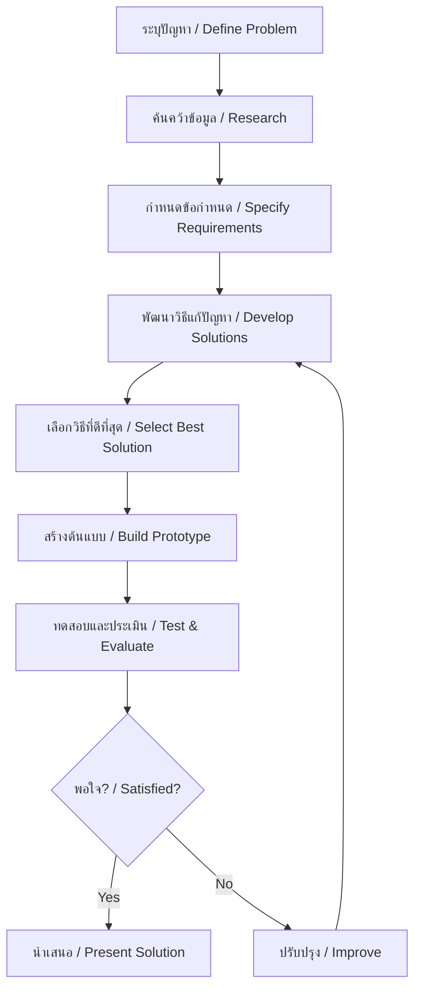
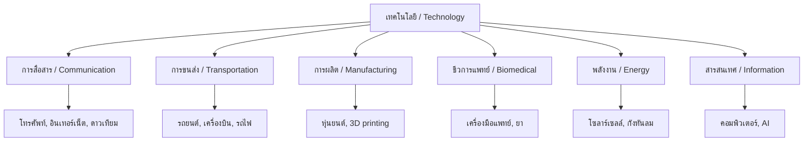

---
tags:
  - science
  - fundamental
  - technology
  - engineering
  - design
  - ipst
source: "IPST (สสวท.) Fundamental Science Curriculum, B.E. 2551 (2008, revised 2560/2017)"
created: 2026-07-26
course_codes: ["ว111", "ว112", "ว113", "ว211", "ว212", "ว213"]
---

# Technology and Engineering — เทคโนโลยีและการออกแบบ

> *"Technology is a useful servant but a dangerous master."* — Christian Lous Lange

This note covers the engineering design process, simple machines, technology applications, and the relationship between science and technology. Students progress from building simple structures to understanding the design process and its societal impacts.

---

## 1 | Grade Band Breakdown

### ป.1–3 (Grades 1–3)

| Grade | Scope | Key Skills |
|---|---|---|
| **ป.1** | Building and making | Using everyday materials to build; simple structures; toys and tools |
| **ป.2** | Simple machines | Observing levers, wheels, ramps in daily life; how tools help us |
| **ป.3** | Design I | Identifying a problem; brainstorming solutions; building a simple model |

### ป.4–6 (Grades 4–6)

| Grade | Scope | Key Skills |
|---|---|---|
| **ป.4** | Simple machines | Lever, pulley, inclined plane, wheel and axle; mechanical advantage |
| **ป.5** | Design process | Ask → Imagine → Plan → Create → Improve; testing designs |
| **ป.6** | Technology in society | Communication technology; transportation; positive and negative impacts |

### ม.1–3 (Grades 7–9)

| Grade | Scope | Key Skills |
|---|---|---|
| **ม.1** | Engineering design | Define problem → Research → Specify requirements → Develop solutions → Build → Test → Evaluate |
| **ม.2** | Systems thinking | Input-process-output; feedback; optimization |
| **ม.3** | Technology & society | Ethical considerations; sustainability; Thai innovation; future technologies |

---

## 2 | Key Terminology

| Thai | English | Notes |
|---|---|---|
| เทคโนโลยี | Technology | Application of scientific knowledge |
| วิศวกรรม | Engineering | Design and building of systems |
| การออกแบบ | Design | Planning a solution |
| กระบวนการออกแบบ | Design process | Steps to create solutions |
| ปัญหา | Problem | Need or challenge |
| วิธีแก้ปัญหา | Solution | Answer to the problem |
| ต้นแบบ | Prototype | Early model of design |
| การทดสอบ | Testing | Checking if design works |
| การปรับปรุง | Improvement | Making design better |
| เครื่องจักรกลง่าย | Simple machine | Basic mechanical device |
| คาน | Lever | Bar that pivots on fulcrum |
| รอก | Pulley | Wheel with rope |
| ระนาบเอียง | Inclined plane | Sloped surface |
| ล้อและเพลา | Wheel and axle | Rotating mechanism |
| กลไก | Mechanism | System of parts |
| โครงสร้าง | Structure | Supporting framework |
| วัสดุ | Material | Substance used in building |
| นวัตกรรม | Innovation | New ideas and inventions |
| การพัฒนาอย่างยั่งยืน | Sustainable development | Meeting needs without harming future |

---

## 3 | Engineering Design Process

---

## 4 | Simple Machines (เครื่องจักรกลง่าย)

### 4.1 Six Simple Machines

| Machine | Thai | Function | Example |
|---|---|---|---|
| Lever | คาน | Multiplies force | See-saw, crowbar |
| Pulley | รอก | Changes force direction | Flagpole, crane |
| Inclined plane | ระนาบเอียง | Reduces effort over distance | Ramp, stairs |
| Wheel and axle | ล้อและเพลา | Reduces friction, multiplies force | Bicycle, door handle |
| Screw | สกรู | Rotational to linear motion | Bolt, jar lid |
| Wedge | ลิ่ม | Splits or cuts | Axe, knife |

### 4.2 Mechanical Advantage (ความได้เปรียบเชิงกล)

$$MA = \frac{\text{Load (แรงต้าน)}}{\text{Effort (แรงพยายาม)}}$$

$$MA = \frac{\text{Distance effort moves}}{\text{Distance load moves}}$$

### 4.3 Compound Machines

Multiple simple machines combined:
- **Bicycle** — wheel and axle, lever, pulley, screw
- **Scissors** — two levers (wedge at the end)
- **Wheelbarrow** — lever + wheel and axle

---

## 5 | Technology Categories

---

## 6 | Materials in Engineering

| Material | Thai | Properties | Use |
|---|---|---|---|
| Wood | ไม้ | Lightweight, renewable | Construction, furniture |
| Metal | โลหะ | Strong, conductive | Structure, tools |
| Plastic | พลาสติก | Flexible, cheap | Containers, parts |
| Glass | แก้ว | Transparent, brittle | Windows, lenses |
| Concrete | คอนกรีต | Strong in compression | Buildings, roads |
| Fiber | เส้นใย | Flexible, strong | Clothing, composites |

---

## 7 | Structures and Design

### 7.1 Types of Structures

| Type | Thai | Example |
|---|---|---|
| Frame | โครงสร้างโครงร่าง | Bicycle frame, house frame |
| Shell | โครงสร้างเปลือก | Egg shell, dome |
| Solid | โครงสร้างทึบ | Dam, wall |

### 7.2 Forces on Structures

| Force | Thai | Description |
|---|---|---|
| Compression | แรงอัด | Squeezing force |
| Tension | แรงดึง | Pulling force |
| Torsion | แรงบิด | Twisting force |
| Shear | แรงเฉือน | Sliding force |

---

## 8 | Innovation in Thailand

| Innovation | Thai | Description |
|---|---|---|
| Sufficiency Economy | เศรษฐกิจพอเพียง | Royal philosophy for sustainable development |
| Thai Traditional Medicine | แพทย์แผนไทย | Traditional healing practices |
| Agricultural Innovation | นวัตกรรมเกษตร | Rice varieties, rubber processing |
| THEOS Satellite | ดาวเทียมธีออส | Earth observation |
| Robotics | หุ่นยนต์ | Industrial and service robots |

---

## 9 | Technology and Society

### 9.1 Positive Impacts

| Impact | Thai | Example |
|---|---|---|
| Communication | การสื่อสาร | Internet, smartphones |
| Medicine | การแพทย์ | Vaccines, surgery |
| Transportation | การขนส่ง | Cars, planes |
| Education | การศึกษา | Online learning |

### 9.2 Negative Impacts

| Impact | Thai | Example |
|---|---|---|
| Pollution | มลพิษ | Industrial waste |
| Unemployment | ว่างงาน | Automation |
| Privacy | ความเป็นส่วนตัว | Data collection |
| Health | สุขภาพ | Screen addiction |

### 9.3 Ethical Considerations

| Issue | Thai | Questions |
|---|---|---|
| AI | ปัญญาประดิษฐ์ | Who is responsible for AI decisions? |
| Genetic engineering | วิศวพันธุกรรม | Should we modify organisms? |
| Nuclear technology | เทคโนโลยีนิวเคลียร์ | Energy vs weapons? |
| Environmental | สิ่งแวดล้อม | Sustainable development? |

---

## 10 | The Design Challenge

### Example: Design a Water Filter

| Step | Action | Thai |
|---|---|---|
| 1. Define | Clean dirty water | ระบุปัญหา |
| 2. Research | Filtration methods | ค้นคว้า |
| 3. Requirements | Remove visible particles, improve taste | ข้อกำหนด |
| 4. Solutions | Sand filter, charcoal filter, cloth filter | วิธีแก้ปัญหา |
| 5. Select | Multi-layer filter | เลือกวิธี |
| 6. Build | Assemble materials | สร้าง |
| 7. Test | Pour dirty water through | ทดสอบ |
| 8. Evaluate | Check clarity, taste | ประเมิน |
| 9. Improve | Add more layers, different materials | ปรับปรุง |

---

## 11 | Cross-Links

- [[01_Scientific_Method]] — Design process parallels scientific method
- [[13_Forces_and_Motion]] — Simple machines and forces
- [[14_Energy]] — Energy in technology
- [[18_Electricity_and_Magnetism]] — Electrical technology
- [[07_Ecosystems]] — Environmental impact of technology
