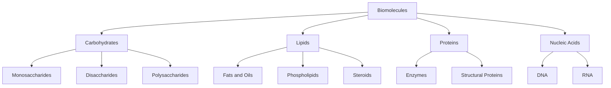

---
tags:
  - biology
  - advance
  - biomolecules
  - ipst
source: "IPST (สสวท.) Biology Curriculum B.E. 2551 (2008, revised 2560/2017)"
created: 2026-07-30
course_codes: ["ว321"]
---

# Biomolecules — ชีวโมเลกุล

> *"The chemistry of life is the chemistry of carbon."* — Anonymous

Biomolecules (ชีวโมเลกุล) are organic molecules essential for the structure and function of living organisms. The four major classes — carbohydrates (คาร์โบไฮเดรต), lipids (ลิพิด), proteins (โปรตีน), and nucleic acids (กรดนิวคลีอิก) — are built from simpler subunits joined by dehydration synthesis (การสังเคราะห์แบบเสียน้ำ) and broken down by hydrolysis (ไฮโดรไลซิส). Carbon's ability to form four covalent bonds makes these complex molecules possible.

Understanding biomolecule structure and function is critical for biochemistry, nutrition, medicine, and biotechnology. Each class plays distinct but interconnected roles: carbohydrates provide energy and structural support, lipids store energy and form membranes, proteins catalyze reactions and provide structure, and nucleic acids store and transmit genetic information.

---

## 1 | Course Coverage

### ม.4 (ว321)

| Semester | Scope | Key Skills |
|---|---|---|
| **Semester 1** | Carbohydrates, lipids, proteins, nucleic acids — structure and function | Biochemical tests, molecular modeling |
| **Semester 2** | Enzyme structure, mechanism, factors affecting enzyme activity | Enzyme experiments, data analysis, graphing |

---

## 2 | Key Terminology

| Thai | English | Symbol/Notes |
|---|---|---|
| ชีวโมเลกุล | Biomolecule | Organic molecules of life |
| คาร์โบไฮเดรต | Carbohydrate | General formula $C_n(H_2O)_n$ |
| ลิพิด | Lipid | Fats, oils, phospholipids, steroids |
| โปรตีน | Protein | Amino acid polymers |
| กรดนิวคลีอิก | Nucleic acid | DNA and RNA |
| โมโนแซ็กคาไรด์ | Monosaccharide | Simple sugar (e.g., glucose) |
| ไดแซ็กคาไรด์ | Disaccharide | Two sugars (e.g., sucrose) |
| พอลิแซ็กคาไรด์ | Polysaccharide | Many sugars (e.g., starch, cellulose) |
| กรดอะมิโน | Amino acid | Monomer of proteins |
| พันธะเพปไทด์ | Peptide bond | Links amino acids |
| เอนไซม์ | Enzyme | Biological catalyst |
| ซับสเตรต | Substrate | Molecule acted on by enzyme |
| การสังเคราะห์แบบเสียน้ำ | Dehydration synthesis | Removal of $H_2O$ to form bond |
| ไฮโดรไลซิส | Hydrolysis | Addition of $H_2O$ to break bond |
| นิวคลีโอไทด์ | Nucleotide | Monomer of nucleic acids |

---

## 3 | Key Concepts

### 3.1 Carbohydrates (คาร์โบไฮเดรต)

Organic compounds with the general formula $C_n(H_2O)_n$. Classified by size:

**Monosaccharides (โมโนแซ็กคาไรด์):** Simple sugars with 3-7 carbons. Key examples:
- Glucose (กลูโคส): $C_6H_{12}O_6$ — primary energy source; blood sugar
- Fructose (ฟรักโทส): fruit sugar; same formula, different structure (structural isomers)
- Galactose (กาแล็กโทส): component of milk sugar

**Disaccharides (ไดแซ็กคาไรด์):** Two monosaccharides joined by a glycosidic bond (พันธะไกลโคซิดิก) via dehydration synthesis:
- Sucrose (ซูโครส) = glucose + fructose (table sugar)
- Lactose (แล็กโทส) = glucose + galactose (milk sugar)
- Maltose (มอลโทส) = glucose + glucose

**Polysaccharides (พอลิแซ็กคาไรด์):** Long chains of monosaccharides:
- Starch (แป้ง): Energy storage in plants; amylose (helical) + amylopectin (branched)
- Glycogen (ไกลโคเจน): Energy storage in animals; highly branched; stored in liver and muscles
- Cellulose (เซลลูโลส): Structural support in plant cell walls; beta-1,4 glycosidic bonds; humans cannot digest
- Chitin (ไคติน): Structural polysaccharide in arthropod exoskeletons and fungal cell walls

### 3.2 Lipids (ลิพิด)

Hydrophobic molecules that are insoluble in water. Not true polymers.

**Fats and Oils (ไขมันและน้ำมัน):** Composed of glycerol (กลีเซอรอล) + 3 fatty acids (กรดไขมัน) -> triglyceride (ไตรกลีเซอไรด์) via ester bonds.
- Saturated fatty acids (กรดไขมันอิ่มตัว): No double bonds; solid at room temperature (animal fats)
- Unsaturated fatty acids (กรดไขมันไม่อิ่มตัว): One or more double bonds; liquid at room temperature (plant oils)

**Phospholipids (ฟอสโฟลิปิด):** Glycerol + 2 fatty acids + phosphate group. Amphipathic — hydrophilic head, hydrophobic tails. Form the cell membrane bilayer.

**Steroids (สเตียรอยด์):** Four fused carbon rings. Examples: cholesterol (คอเลสเตอรอล), testosterone, estrogen, cortisol.

**Functions:** Long-term energy storage (9 kcal/g vs 4 kcal/g for carbs), insulation, cushioning organs, membrane structure, hormones.

### 3.3 Proteins (โปรตีน)

Polymers of amino acids (กรดอะมิโน) linked by peptide bonds (พันธะเพปไทด์). There are 20 standard amino acids; each has an amino group ($-NH_2$), a carboxyl group ($-COOH$), a hydrogen atom, and a variable R group (side chain).

**Four Structural Levels:**
1. **Primary structure (โครงสร้างปฐมภูมิ):** Linear sequence of amino acids; determined by gene; held by peptide bonds.
2. **Secondary structure (โครงสร้างทุติยภูมิ):** Local folding into alpha-helix (เกลียวอัลฟา) or beta-pleated sheet (แผ่นเบตา); held by hydrogen bonds between backbone atoms.
3. **Tertiary structure (โครงสร้างตติยภูมิ):** Overall 3D shape of a single polypeptide; held by hydrophobic interactions, hydrogen bonds, ionic bonds, disulfide bridges (พันธะไดซัลไฟด์).
4. **Quaternary structure (โครงสร้างจตุตถภูมิ):** Arrangement of multiple polypeptide subunits (e.g., hemoglobin has 4 subunits).

**Functions:** Enzymes (เอนไซม์), structural proteins (keratin, collagen), transport (hemoglobin), defense (antibodies), movement (actin, myosin), hormones (insulin), storage (ferritin).

### 3.4 Enzymes (เอนไซม์)

Biological catalysts — proteins that speed up reactions without being consumed. They lower the activation energy (พลังงานกระตุ้น) of reactions.

**Lock-and-Key Model:** The substrate fits precisely into the enzyme's active site (ตำแหน่งทำงาน) like a key into a lock.

**Induced-Fit Model:** The active site changes shape slightly to fit the substrate more snugly upon binding, forming an enzyme-substrate complex (สารเชิงซ้อนเอนไซม์-ซับสเตรต).

**Factors Affecting Enzyme Activity:**
- **Temperature (อุณหภูมิ):** Rate increases up to optimum (37 degrees C for human enzymes); above optimum, denaturation (การสูญเสียสภาพ) occurs.
- **pH:** Each enzyme has an optimum pH (e.g., pepsin at pH 2, trypsin at pH 8).
- **Substrate concentration (ความเข้มข้นของซับสเตรต):** Rate increases until all enzyme active sites are saturated.
- **Inhibitors (สารยับยั้ง):** Competitive inhibitors compete for the active site; non-competitive inhibitors bind elsewhere, changing enzyme shape.

### 3.5 Nucleic Acids (กรดนิวคลีอิก)

**DNA (กรดออกซีไรโบนิวคลีอิก):** Double-stranded helix; stores genetic information. Nucleotide = deoxyribose sugar + phosphate + nitrogenous base (A, T, G, C).

**RNA (กรดไรโบนิวคลีอิก):** Single-stranded; involved in gene expression. Nucleotide = ribose sugar + phosphate + nitrogenous base (A, U, G, C).

Base pairing rules: A-T (DNA) or A-U (RNA); G-C (both).

---

## 4 | Common Problem Types

### Type 1: Identifying Biomolecules by Tests
> A food sample turns blue-black with iodine solution. What biomolecule is present?

**Solution:** The iodine test (สารละลายไอโอดีน) detects **starch (แป้ง)**. Iodine ($I_2$) binds to the helical structure of amylose, producing a blue-black color. A negative result (remains yellow-brown) means no starch is present.

### Type 2: Enzyme Activity Graph Interpretation
> An enzyme has maximum activity at 37 degrees C and pH 7. What happens at 60 degrees C?

**Solution:** At 60 degrees C, the enzyme is **denatured** (สูญเสียสภาพ). High temperature breaks the hydrogen bonds, ionic bonds, and hydrophobic interactions that maintain the tertiary structure. The active site changes shape, and the enzyme can no longer bind substrate. Activity drops to near zero. This is irreversible.

---

## 5 | Cross-Links

- [[01_Cell_Biology]] — organelles that synthesize biomolecules
- [[02_Cell_Membrane_and_Transport]] — phospholipid and protein roles in membranes
- [[04_Cell_Energy]] — carbohydrates as energy source; enzymes in metabolic pathways
- [[../../Advance/Chemistry/06_Organic_Chemistry|Chemistry: Organic Chemistry]] — carbon bonding and functional groups
