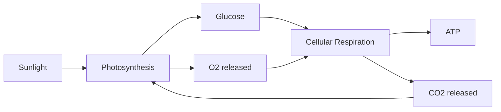

---
tags:
  - biology
  - advance
  - cell-energy
  - photosynthesis
  - respiration
  - ipst
source: "IPST (สสวท.) Biology Curriculum B.E. 2551 (2008, revised 2560/2017)"
created: 2026-07-30
course_codes: ["ว321"]
---

# Cell Energy — พลังงานในเซลล์

> *"All life depends on a continuous flow of energy from the sun through living systems."* — Eugene Odum

Cellular energy metabolism (เมแทบอลิซึมของพลังงานเซลล์) encompasses the chemical reactions that capture, store, and utilize energy in living organisms. The two central processes are photosynthesis (การสังเคราะห์ด้วยแสง), which converts light energy into chemical energy in glucose, and cellular respiration (การหายใจระดับเซลล์), which releases energy from glucose to produce ATP (อะดีโนซีนไตรฟอสเฟต) — the universal energy currency of cells.

Adenosine triphosphate (ATP) powers virtually all cellular work: mechanical (muscle contraction), transport (active transport pumps), and chemical (biosynthesis). When cells cannot perform aerobic respiration, fermentation (การหมัก) provides a limited alternative pathway. These interconnected processes form the energy cycle that sustains all life.

---

## 1 | Course Coverage

### ม.4 (ว321)

| Semester | Scope | Key Skills |
|---|---|---|
| **Semester 1** | ATP structure, photosynthesis (light reactions, Calvin cycle) | Elodea/O2 experiments, chromatography |
| **Semester 2** | Cellular respiration (glycolysis, Krebs, ETC), fermentation | Respirometer experiments, yeast fermentation |

---

## 2 | Key Terminology

| Thai | English | Symbol/Notes |
|---|---|---|
| อะดีโนซีนไตรฟอสเฟต | Adenosine triphosphate (ATP) | Energy currency |
| การสังเคราะห์ด้วยแสง | Photosynthesis | Light to glucose |
| การหายใจระดับเซลล์ | Cellular respiration | Glucose to ATP |
| ไกลโคไลซิส | Glycolysis | Glucose to 2 pyruvate |
| วัฏจักรเครปส์ | Krebs cycle (TCA cycle) | Acetyl-CoA oxidation |
| ห่วงโซ่การขนส่งอิเล็กตรอน | Electron transport chain (ETC) | Inner mitochondrial membrane |
| การหมัก | Fermentation | Anaerobic ATP production |
| คลอโรฟิลล์ | Chlorophyll | Light-absorbing pigment |
| โฟตอน | Photon | Quantum of light energy |
| NADH / FADH2 | Electron carriers | Reduced forms; carry electrons to ETC |
| อะซีทิล-CoA | Acetyl-CoA | Links glycolysis to Krebs cycle |
| ไพโรุเวต | Pyruvate | End product of glycolysis |
| เคมิออสโมซิส | Chemiosmosis | ATP production via H+ gradient |
| ATP ซินเทส | ATP synthase | Enzyme that makes ATP |
| แคลวิน ไซเคิล | Calvin cycle | Dark reactions / light-independent reactions |

---

## 3 | Key Concepts

### 3.1 ATP Structure and Function

ATP consists of adenine (อะดีนีน), ribose sugar, and three phosphate groups. Energy is stored in the phosphoanhydride bonds between phosphate groups. When ATP is hydrolyzed:

$$\text{ATP} + H_2O \rightarrow \text{ADP} + P_i + \text{Energy (7.3 kcal/mol)}$$

ATP is constantly recycled — a human produces and consumes approximately 40 kg of ATP per day. ATP drives active transport, muscle contraction, biosynthesis, and signal transduction.

### 3.2 Photosynthesis (การสังเคราะห์ด้วยแสง)

Overall equation:
$$6CO_2 + 6H_2O \xrightarrow{\text{light}} C_6H_{12}O_6 + 6O_2$$

Occurs in chloroplasts (คลอโรพลาสต์) in two stages:

**Light Reactions (ปฏิกิริยาแสง):** Occur in thylakoid membranes (เยื่อไทลาคอยด์).
1. **Photosystem II (PSII):** Chlorophyll P680 absorbs light, electrons are excited and passed to an electron transport chain. Water is split (photolysis): $2H_2O \rightarrow 4H^+ + 4e^- + O_2$ — this is the source of $O_2$.
2. **Electron Transport Chain:** Electrons pass through plastoquinone, cytochrome complex, and plastocyanin. Energy released pumps $H^+$ into the thylakoid lumen, creating a proton gradient.
3. **Photosystem I (PSI):** Chlorophyll P700 absorbs light, re-energizes electrons. These pass through ferredoxin to $NADP^+$ reductase, producing NADPH.
4. **Chemiosmosis (เคมิออสโมซิส):** $H^+$ flows through ATP synthase (ATP ซินเทส) from the thylakoid lumen to the stroma, driving ATP synthesis. Called photophosphorylation.

**Calvin Cycle (แคลวิน ไซเคิล):** Occurs in the stroma (สโตรมา). Uses ATP and NADPH from light reactions.
1. **Carbon fixation (การตรึงคาร์บอน):** $CO_2$ combines with ribulose bisphosphate (RuBP) via the enzyme RuBisCO to form two 3-phosphoglycerate (3-PGA) molecules.
2. **Reduction:** ATP and NADPH convert 3-PGA to glyceraldehyde-3-phosphate (G3P).
3. **Regeneration:** Most G3P is used to regenerate RuBP; for every 3 $CO_2$ fixed, one net G3P is produced. Two G3P molecules are needed to make one glucose.

### 3.3 Cellular Respiration (การหายใจระดับเซลล์)

Overall equation:
$$C_6H_{12}O_6 + 6O_2 \rightarrow 6CO_2 + 6H_2O + \text{36-38 ATP}$$

**Glycolysis (ไกลโคไลซิส):** Occurs in the cytoplasm. Glucose (6C) is split into 2 pyruvate (3C).
- Net yield: 2 ATP (substrate-level phosphorylation) + 2 NADH
- Does not require oxygen

**Pyruvate Oxidation:** In the mitochondrial matrix, each pyruvate loses $CO_2$ and is converted to acetyl-CoA (อะซีทิล-CoA), producing 1 NADH per pyruvate.

**Krebs Cycle (วัฏจักรเครปส์):** Occurs in the mitochondrial matrix. Acetyl-CoA (2C) combines with oxaloacetate (4C) to form citrate (6C). Through 8 steps, citrate is oxidized back to oxaloacetate.
- Per turn: 3 NADH, 1 FADH2, 1 ATP (GTP), 2 $CO_2$
- Per glucose (2 turns): 6 NADH, 2 FADH2, 2 ATP, 4 $CO_2$

**Electron Transport Chain and Oxidative Phosphorylation (ห่วงโซ่การขนส่งอิเล็กตรอนและการเติมหมู่ฟอสเฟตแบบใช้ออกซิเจน):** Occurs on the inner mitochondrial membrane.
1. NADH and FADH2 donate electrons to protein complexes (I, II, III, IV).
2. Energy from electron transfer pumps $H^+$ from matrix to intermembrane space.
3. $H^+$ flows back through ATP synthase -> chemiosmosis -> ATP production.
4. Final electron acceptor: $O_2$ + $H^+$ -> $H_2O$.
- NADH yields approximately 2.5 ATP each; FADH2 yields approximately 1.5 ATP each.

**Total ATP per glucose (aerobic):** approximately 30-38 ATP (depending on shuttle system used).

### 3.4 Fermentation (การหมัก)

When $O_2$ is unavailable, cells use fermentation to regenerate $NAD^+$ from NADH so glycolysis can continue.

**Lactic Acid Fermentation (การหมักกรดแลกติก):**
$$\text{Pyruvate} + \text{NADH} \rightarrow \text{Lactate} + NAD^+$$
Occurs in animal muscle cells during intense exercise; also in some bacteria (yogurt production).

**Alcoholic Fermentation (การหมักแอลกอฮอล์):**
$$\text{Pyruvate} \rightarrow \text{Acetaldehyde} + CO_2 \rightarrow \text{Ethanol} + NAD^+$$
Occurs in yeast (ยีสต์) and some plants; used in baking, brewing, and winemaking.

Both yield only 2 ATP per glucose (from glycolysis alone).

---

## 4 | Common Problem Types

### Type 1: ATP Yield Calculation
> How many ATP molecules are produced from one glucose molecule during complete aerobic respiration?

**Solution:**
- Glycolysis: 2 ATP + 2 NADH (yields approximately 5 ATP via ETC)
- Pyruvate oxidation: 2 NADH (yields approximately 5 ATP)
- Krebs cycle: 2 ATP + 6 NADH (yields approximately 15 ATP) + 2 FADH2 (yields approximately 3 ATP)
- **Total: approximately 30-38 ATP** (varies by NADH shuttle: malate-aspartate = 2.5 ATP/NADH; glycerol-3-phosphate = 1.5 ATP/NADH for cytoplasmic NADH)

### Type 2: Photosynthesis Rate Experiment
> An aquatic plant is placed under different light intensities. At low light, O2 production is 2 mL/min; at medium light, 8 mL/min; at high light, 8 mL/min. Explain.

**Solution:** At low light, light is the limiting factor (ปัจจัยจำกัด) — photosynthesis rate increases with intensity. At medium to high light, the rate plateaus — light is no longer limiting; $CO_2$ concentration or enzyme capacity (RuBisCO) becomes the limiting factor. This shows the **light saturation point**.

---

## 5 | Cross-Links

- [[03_Biomolecules]] — ATP structure, enzyme function
- [[01_Cell_Biology]] — mitochondria and chloroplast structure
- [[02_Cell_Membrane_and_Transport]] — ATP-driven active transport
- [[05_Cell_Division]] — energy requirements for cell division
- [[11_Thermochemistry|Chemistry: Thermochemistry]] — energy in chemical bonds
