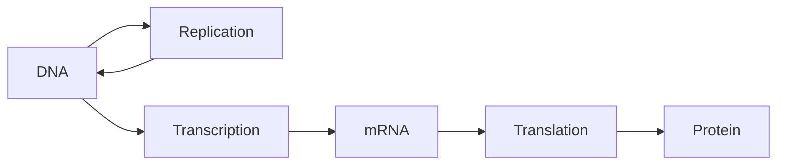

---
tags:
  - biology
  - advance
  - molecular-biology
  - dna
  - gene-expression
  - ipst
source: "IPST (สสวท.) Biology Curriculum B.E. 2551 (2008, revised 2560/2017)"
created: 2026-07-30
course_codes: ["ว321"]
---

# Molecular Biology — ชีววิทยาระดับโมเลกุล

> *"DNA is like a computer program but far, far more advanced than any software ever created."* — Bill Gates

Molecular biology (ชีววิทยาระดับโมเลกุล) studies the molecular basis of gene structure, function, and regulation. The central dogma (หลักการกลาง) of molecular biology states that genetic information flows from DNA -> RNA -> protein. This process involves DNA replication (การจำลองดีเอ็นเอ), transcription (การถอดรหัส), and translation (การแปลรหัส).

The discovery of DNA's double helix structure by Watson and Crick in 1953, based on X-ray crystallography data from Rosalind Franklin, revolutionized biology. Understanding how genes are expressed and regulated is essential for medicine, biotechnology, forensics, and evolutionary biology.

---

## 1 | Course Coverage

### ม.4 (ว321)

| Semester | Scope | Key Skills |
|---|---|---|
| **Semester 1** | DNA structure, base pairing, DNA replication | DNA model building, extraction lab |
| **Semester 2** | RNA types, transcription, translation, genetic code, gene regulation | Codon table reading, protein synthesis simulation |

---

## 2 | Key Terminology

| Thai | English | Symbol/Notes |
|---|---|---|
| ดีเอ็นเอ | DNA | Deoxyribonucleic acid |
| อาร์เอ็นเอ | RNA | Ribonucleic acid |
| การจำลองดีเอ็นเอ | DNA replication | Semi-conservative |
| การถอดรหัส | Transcription | DNA -> mRNA |
| การแปลรหัส | Translation | mRNA -> protein |
| หลักการกลาง | Central dogma | DNA -> RNA -> protein |
| นิวคลีโอไทด์ | Nucleotide | Sugar + phosphate + base |
| เบส | Base | A, T, G, C (DNA); A, U, G, C (RNA) |
| คู่เบส | Base pair | A-T, G-C |
| โคดอน | Codon | 3-nucleotide mRNA sequence |
| แอนติโคดอน | Anticodon | 3-nucleotide tRNA sequence |
| ยีน | Gene | Segment of DNA encoding a protein |
| โอเพนเรดิงเฟรม | Open reading frame | Start to stop codon |
| เอนไซม์ | Enzyme | Biological catalyst |

---

## 3 | Key Concepts

### 3.1 DNA Structure (โครงสร้างดีเอ็นเอ)

Watson and Crick's double helix model (1953):
- Two antiparallel polynucleotide strands wound around each other.
- Sugar-phosphate backbone (กระดูกสันหลังน้ำตาล-ฟอสเฟต) on the outside; bases face inward.
- Each nucleotide consists of: deoxyribose sugar (น้ำตาลดีออกซีไรโบส) + phosphate group + nitrogenous base (เบส).
- **Base pairing rules:** Adenine (A) pairs with Thymine (T) via 2 hydrogen bonds; Guanine (G) pairs with Cytosine (C) via 3 hydrogen bonds. This is **Chargaff's rule** — in any DNA sample, %A = %T and %G = %C.
- The two strands run **antiparallel** (5' to 3' and 3' to 5').
- The helix has a major groove (ร่องใหญ่) and minor groove (ร่องเล็ก) where proteins can interact with bases.
- Diameter: 2 nm; one full turn = 10 base pairs = 3.4 nm.

### 3.2 DNA Replication (การจำลองดีเอ็นเอ)

DNA replication is **semi-conservative** (กึ่งอนุรักษ์) — each new DNA molecule consists of one original strand and one new strand. Demonstrated by the Meselson-Stahl experiment (1958) using $^{15}N$ and $^{14}N$ isotopes.

**Steps:**
1. **Helicase (เฮลิเคส):** Unwinds the double helix at the replication fork (ส้อมจำลอง), breaking hydrogen bonds between base pairs. Creates single-stranded regions.
2. **Single-strand binding proteins (โปรตีนจับสายเดี่ยว):** Stabilize unwound strands, prevent re-annealing.
3. **Topoisomerase (โทโพไอโซเมอเรส):** Relieves torsional strain ahead of the replication fork by cutting and rejoining DNA.
4. **Primase (ไพรเมส):** Synthesizes a short RNA primer (ไพรเมอร์ RNA) complementary to the template strand — DNA polymerase cannot start synthesis de novo.
5. **DNA Polymerase III (DNA พอลิเมอเรส III):** Adds nucleotides in the 5' to 3' direction, complementary to the template strand.
   - **Leading strand (สายชั้นนำ):** Synthesized continuously toward the replication fork.
   - **Lagging strand (สายตาม):** Synthesized away from the fork in short fragments called **Okazaki fragments (โอกาซากิฟรา็กเมนต์)**, each requiring its own RNA primer.
6. **DNA Polymerase I:** Removes RNA primers and replaces them with DNA.
7. **DNA Ligase (DNA ไลเกส):** Seals nicks between Okazaki fragments by forming phosphodiester bonds.

### 3.3 RNA Types and Structure

RNA differs from DNA: ribose sugar (not deoxyribose), single-stranded, uracil (U) instead of thymine (T).

| Type | Full Name | Function |
|---|---|---|
| **mRNA** | Messenger RNA (เอ็มอาร์เอ็นเอ) | Carries genetic code from DNA to ribosomes |
| **tRNA** | Transfer RNA (ทีอาร์เอ็นเอ) | Carries amino acids to ribosomes; has anticodon loop |
| **rRNA** | Ribosomal RNA (อาร์อาร์เอ็นเอ) | Structural and catalytic component of ribosomes |

### 3.4 Transcription (การถอดรหัส)

Synthesis of mRNA from a DNA template. Occurs in the nucleus.

1. **Initiation:** RNA polymerase (RNA พอลิเมอเรส) binds to the promoter region (โปรโมเตอร์) upstream of the gene. In prokaryotes, sigma factor helps RNA polymerase recognize the promoter. In eukaryotes, transcription factors (แฟกเตอร์การถอดรหัส) are required.
2. **Elongation:** RNA polymerase reads the template strand (3' to 5') and synthesizes mRNA in the 5' to 3' direction, adding complementary nucleotides (A to U, T to A, G to C, C to G).
3. **Termination:** RNA polymerase reaches a terminator sequence and releases the mRNA.

**Post-transcriptional modification (in eukaryotes):**
- 5' cap (หมวก 5'): Methylated guanine added to 5' end; protects from degradation, aids ribosome binding.
- 3' poly-A tail (หางโพลิ-A): approximately 200 adenine nucleotides added to 3' end; stabilizes mRNA.
- **Splicing (การตัดต่อ):** Introns (อินทรอน, non-coding sequences) are removed by spliceosomes; exons (เอกซอน, coding sequences) are joined together.

### 3.5 Translation (การแปลรหัส)

Synthesis of a polypeptide from mRNA at the ribosome. Occurs in the cytoplasm.

**The Genetic Code (รหัสพันธุกรรม):**
- Triplet code: Each codon (โคดอน) consists of 3 nucleotides specifying one amino acid.
- 64 codons total: 61 sense codons (code for amino acids) + 3 stop codons (UAA, UAG, UGA).
- **Start codon:** AUG (methionine) — initiates translation.
- The code is degenerate (หลายความหมาย) — multiple codons can code for the same amino acid (e.g., leucine has 6 codons).
- Nearly universal across all organisms.

**Steps:**
1. **Initiation:** Small ribosomal subunit binds to mRNA at the 5' cap and scans for the start codon (AUG). The initiator tRNA (carrying methionine) binds to AUG via its anticodon (UAC). Large ribosomal subunit joins, forming the complete ribosome with P site, A site, and E site.
2. **Elongation:**
   - A tRNA with the correct anticodon enters the A site (ตำแหน่งรับ aminoacyl).
   - A peptide bond (พันธะเพปไทด์) forms between the amino acid in the P site and the amino acid in the A site (catalyzed by peptidyl transferase, a ribozyme activity of rRNA).
   - The ribosome translocates (moves) one codon along the mRNA. The tRNA in the P site moves to the E site and exits; the tRNA in the A site moves to the P site.
3. **Termination:** A stop codon (UAA, UAG, or UGA) enters the A site. No tRNA recognizes stop codons. Release factor (แฟกเตอร์ปล่อย) binds, causing the polypeptide to be released. The ribosome disassembles.

**Polyribosomes (พอลิไรโบโซม):** Multiple ribosomes translating the same mRNA simultaneously — allows rapid production of many copies of the same protein.

### 3.6 Gene Expression Regulation

Gene expression (การแสดงออกของยีน) is regulated at multiple levels:

**Prokaryotic regulation — Operon model:**
- The **lac operon** in *E. coli*: A cluster of genes (Z, Y, A) controlled by a single promoter and operator.
- **Without lactose:** Repressor protein binds operator -> blocks transcription (negative regulation).
- **With lactose:** Allolactose binds repressor -> repressor releases operator -> transcription proceeds.
- **With glucose low + lactose high:** CAP-cAMP complex enhances transcription (positive regulation).

**Eukaryotic regulation:**
- **Chromatin remodeling:** Histone acetylation (อะซีทิลเลชันของฮิสโตน) opens chromatin -> promotes transcription. Methylation (เมทิลเลชัน) generally silences genes.
- **Transcription factors:** Activators (โปรตีนกระตุ้น) and repressors (โปรตีนยับยั้ง) control promoter accessibility.
- **Post-transcriptional:** Alternative splicing allows one gene to produce multiple proteins.
- **Post-translational:** Protein modification (phosphorylation, glycosylation) and degradation.

---

## 4 | Common Problem Types

### Type 1: DNA Base Pairing
> A DNA strand has the sequence 5'-ATCGGA-3'. What is the complementary strand?

**Solution:** Apply Chargaff's rules (A-T, G-C) and antiparallel direction:
- Template: 5'-ATCGGA-3'
- Complementary: **3'-TAGCCT-5'** (or written 5'-TCCGAT-3')

### Type 2: Codon to Amino Acid
> The mRNA sequence is 5'-AUG-UUU-GAC-UAA-3'. How many amino acids are in the polypeptide?

**Solution:**
- AUG = Met (start codon)
- UUU = Phe
- GAC = Asp
- UAA = Stop
- The polypeptide has **3 amino acids**: Met-Phe-Asp. Translation stops at UAA.

### Type 3: Meselson-Stahl Experiment Interpretation
> After one generation in $^{14}N$ medium, DNA from $^{15}N$-labeled bacteria shows one band of intermediate density. What does this prove?

**Solution:** This proves **semi-conservative replication** (การจำลองแบบกึ่งอนุรักษ์). Each daughter DNA molecule contains one heavy ($^{15}N$) strand and one light ($^{14}N$) strand, giving intermediate density. If replication were conservative, there would be two bands (one heavy, one light).

---

## 5 | Cross-Links

- [[03_Biomolecules]] — nucleic acid structure
- [[05_Cell_Division]] — DNA replication before mitosis
- [[07_Genetics]] — gene expression and inheritance
- [[../../Advance/Chemistry/03_Chemical_Bonding|Chemistry: Chemical Bonding]] — hydrogen bonding in base pairs
