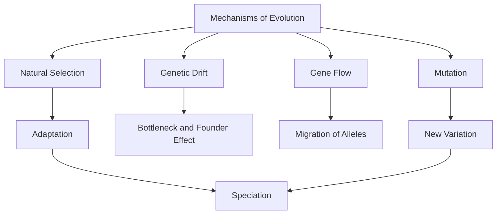
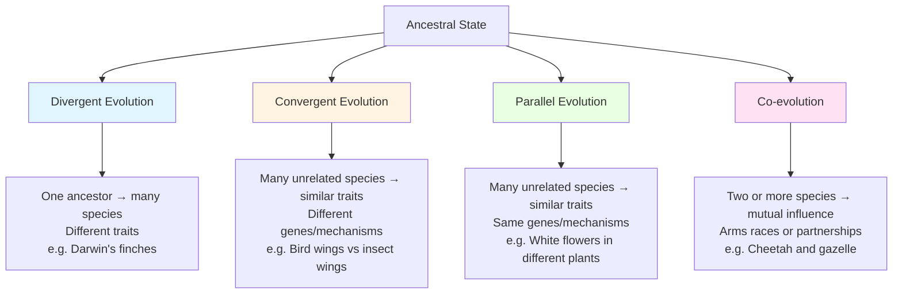

---
tags:
  - biology
  - advance
  - evolution
  - ipst
source: "IPST (สสวท.) Biology Curriculum B.E. 2551 (2008, revised 2560/2017)"
created: 2026-07-30
course_codes: ["ว322"]
---

# Evolution — วิวัฒนาการ

> *"Nothing in biology makes sense except in the light of evolution."* — Theodosius Dobzhansky

Evolution (วิวัฒนาการ) is the change in heritable characteristics of biological populations over successive generations. It explains the diversity of life on Earth through processes such as natural selection (การคัดสรรโดยธรรมชาติ), genetic drift (การแปรผันทางพันธุกรรม), mutation (การกลายพันธุ์), and gene flow (การไหลของยีน). Evidence comes from multiple lines: the fossil record (ซากดึกดำบรรพ์), comparative anatomy, molecular biology, and biogeography (ภูมิศาสตร์ชีวภาพ).

Understanding evolution is foundational to all modern biology — it unifies fields from ecology to medicine. Darwin's theory of evolution by natural selection, supplemented by modern genetics (the Modern Synthesis), provides the framework for explaining adaptation (การปรับตัว), speciation (การเกิดชนิดใหม่), and the tree of life (ต้นไม้แห่งชีวิต).

---

## 1 | Course Coverage

### ม.5 (ว322)

| Semester | Scope | Key Skills |
|---|---|---|
| **Semester 1** | Evidence for evolution; Darwin's theory and natural selection; types of natural selection; mechanisms of evolution | Analyzing fossil data, comparing homologous/analogous structures, solving Hardy-Weinberg problems |
| **Semester 1** | Speciation and reproductive isolation; Hardy-Weinberg equilibrium; patterns and rates of evolution | Applying Hardy-Weinberg equation, distinguishing allopatric vs. sympatric speciation |

---

## 2 | Key Terminology

| Thai | English | Symbol/Notes |
|---|---|---|
| วิวัฒนาการ | Evolution | Change in allele frequency over time |
| การคัดสรรโดยธรรมชาติ | Natural selection | Differential reproductive success |
| ซากดึกดำบรรพ์ | Fossil | Preserved remains/impressions |
| โครงสร้างร่วมสายวิวัฒนาการ | Homologous structures | Same origin, different function |
| โครงสร้างคล้ายกันแต่ไม่ร่วมสาย | Analogous structures | Different origin, same function |
| โครงสร้างที่เหลือค้าง | Vestigial structures | Reduced/unused remnants |
| การเกิดชนิดใหม่ | Speciation | Formation of new species |
| การแยกทางสืบพันธุ์ | Reproductive isolation | Barrier to interbreeding |
| สมดุลฮาร์ดี-ไวน์เบิร์ก | Hardy-Weinberg equilibrium | $p^2 + 2pq + q^2 = 1$ |
| การกลายพันธุ์ | Mutation | Ultimate source of variation |
| การแปรผันทางพันธุกรรม | Genetic drift | Random allele frequency change |
| การอพยพของยีน | Gene flow (migration) | Movement of alleles between populations |

---

## 3 | Key Concepts

### 3.1 Evidence for Evolution

Evidence comes from five main lines. **Fossil evidence** (หลักฐานซากดึกดำบรรพ์) shows progressive changes in organisms over geological time, with transitional forms like *Archaeopteryx* linking reptiles and birds. **Comparative anatomy** reveals homologous structures (e.g., vertebrate forelimbs — same bones, different functions), analogous structures (e.g., wings of insects and birds — convergent evolution, การวิวัฒนาการมารบจบ), and vestigial structures (e.g., human appendix, pelvic bones in whales). **Molecular biology** shows that organisms sharing more DNA/protein sequences are more closely related. **Biogeography** explains species distribution patterns based on continental drift and island isolation. **Embryology** shows similar developmental stages across vertebrates.

### 3.1.1 Patterns of Evolution

Evolution can follow three distinct patterns, depending on whether species share a common ancestor and whether they evolve similar or different traits:

**Divergent evolution** (วิวัฒนาการลู่ออก) occurs when related species evolve different traits from a common ancestor, adapting to different environments — e.g., Darwin's finches evolved 15+ species with different beak shapes for different foods from one ancestral finch.

**Convergent evolution** (วิวัฒนาการลู่เข้า) occurs when unrelated species evolve similar traits through different genetic/developmental mechanisms, arriving at the same solution to a similar problem — e.g., bird wings and insect wings both enable flight, but evolved from completely different anatomical structures.

**Parallel evolution** (วิวัฒนาการขนาน) occurs when unrelated species evolve similar traits through the same genetic/developmental mechanisms, having inherited the same ancestral "toolkit" — e.g., multiple plant species independently evolved white flowers by turning off the same pigment genes.

**Co-evolution** (วิวัฒนาการร่วม) occurs when two or more species evolve in response to each other through close ecological interactions — e.g., predator-prey arms races (cheetahs and gazelles evolving speed), or mutualistic partnerships (orchids and their specific pollinators).

### 3.2 Darwin's Theory and Natural Selection

Darwin proposed that evolution occurs by natural selection with four key observations: (1) organisms produce more offspring than can survive, (2) there is variation (ความแปรปรวน) among individuals, (3) variation is heritable (ถ่ายทอดได้), and (4) individuals with advantageous traits survive and reproduce more (survival of the fittest — การอยู่รอดของผู้เหมาะสมที่สุด). This leads to adaptation over generations.

### 3.3 Types of Natural Selection

**Directional selection** (การคัดสรรทิศทาง) shifts the population mean toward one extreme — e.g., increasing antibiotic resistance. **Stabilizing selection** (การคัดสรรรักษาเสถียร) favors the average phenotype and reduces variation — e.g., human birth weight. **Disruptive selection** (การคัดสรรแตกกระจาย) favors both extremes over the average — e.g., seed size in birds.

### 3.4 Speciation

**Allopatric speciation** (การเกิดชนิดใหม่แบบห่างทางภูมิศาสตร์) occurs when a geographic barrier (e.g., mountain, river) splits a population, and the isolated populations diverge genetically. **Sympatric speciation** (การเกิดชนิดใหม่ในพื้นที่เดียวกัน) occurs without geographic separation, often through polyploidy in plants or habitat differentiation. Reproductive isolation mechanisms include **prezygotic barriers** (temporal, habitat, behavioral, mechanical, gametic isolation) and **postzygotic barriers** (hybrid inviability, hybrid sterility, hybrid breakdown).

### 3.5 Hardy-Weinberg Equilibrium

The Hardy-Weinberg principle states that allele and genotype frequencies remain constant in a population (ประชากร) from generation to generation if five conditions are met: no mutation, random mating (การผสมพันธุ์แบบสุ่ม), no natural selection, large population size, and no gene flow. The equation is:

$$p^2 + 2pq + q^2 = 1$$

where $p$ = frequency of dominant allele, $q$ = frequency of recessive allele, and $p + q = 1$. Deviations from equilibrium indicate that evolution is occurring.

---

## 4 | Common Problem Types

### Type 1: Hardy-Weinberg Calculation
> In a population of 10,000 people, 160 are affected by a recessive condition (genotype $aa$). Find the frequency of carriers ($Aa$).

**Solution:**
1. $q^2 = 160/10000 = 0.016$
2. $q = \sqrt{0.016} = 0.1265$
3. $p = 1 - q = 1 - 0.1265 = 0.8735$
4. Frequency of carriers: $2pq = 2 \times 0.8735 \times 0.1265 = 0.221$
5. Number of carriers: $0.221 \times 10000 = 2210$

### Type 2: Identifying Type of Selection
> A graph shows a population's beak size distribution shifting from small to large over many generations. What type of selection is this?

**Solution:** This is **directional selection** (การคัดสรรทิศทาง) — the mean phenotype shifts toward one extreme (larger beaks), indicating that larger beaks confer a survival advantage in the given environment.

### Type 3: Evidence Analysis
> Two species have very similar cytochrome c amino acid sequences. What does this imply about their evolutionary relationship?

**Solution:** High sequence similarity indicates a **recent common ancestor** (บรรพบุรุษร่วม). The fewer the molecular differences, the more recently the two lineages diverged. This is molecular evidence for evolution.

---

## 5 | Cross-Links

- [[07_Genetics]] — prerequisite: Mendelian genetics and allele frequency
- [[09_Diversity_of_Life]] — evolution produces biodiversity
- [[../../Advance/Chemistry/18_Biochemistry|Chemistry: Biochemistry]] — molecular evidence (DNA, proteins) for evolution
- [[10_Microbiology]] — rapid evolution in bacteria (antibiotic resistance)
