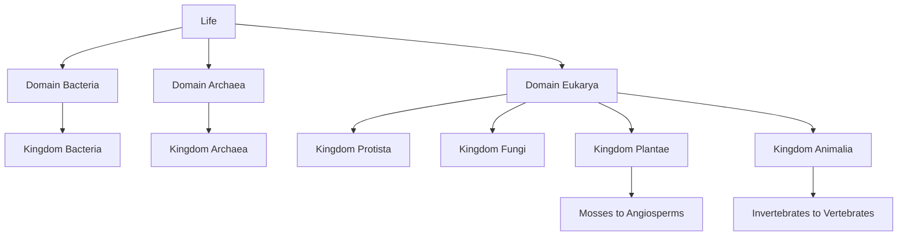

---
tags:
  - biology
  - advance
  - diversity-of-life
  - ipst
source: "IPST (สสวท.) Biology Curriculum B.E. 2551 (2008, revised 2560/2017)"
created: 2026-07-30
course_codes: ["ว322"]
---

# Diversity of Life — ความหลากหลายของสิ่งมีชีวิต

> *"There is grandeur in this view of life, with its several powers, having been originally breathed into a few forms or into one."* — Charles Darwin

The diversity of life (ความหลากหลายของสิ่งมีชีวิต) encompasses all living organisms on Earth, classified into a hierarchical system (ระบบอนุกรมวิธาน) from domain down to species. Modern taxonomy (อนุกรมวิธาน) uses phylogenetics (วิวัฒนาการชาติพันธุ์) and cladistics (การวิเคราะห์สาขา) to organize organisms based on evolutionary relationships rather than superficial similarities alone.

The six-kingdom system divides life into Bacteria (แบคทีเรีย), Archaea (อาร์เคีย), Protista (โพรทิสตา), Fungi (เห็ดรา), Plantae (พืช), and Animalia (สัตว์). Each kingdom represents a major lineage with distinct cellular organization, nutrition strategies, and reproductive methods. Understanding biodiversity is essential for conservation (การอนุรักษ์), medicine, agriculture, and ecology.

---

## 1 | Course Coverage

### ม.5 (ว322)

| Semester | Scope | Key Skills |
|---|---|---|
| **Semester 1** | Taxonomy and classification systems; binomial nomenclature; phylogenetic trees; characteristics of the six kingdoms | Constructing and reading cladograms, classifying unknown organisms, applying binomial nomenclature rules |
| **Semester 1** | Detailed survey of kingdom characteristics; domains of life; evolutionary relationships among kingdoms | Comparing prokaryotic vs. eukaryotic diversity, analyzing molecular phylogenies |

---

## 2 | Key Terminology

| Thai | English | Symbol/Notes |
|---|---|---|
| อนุกรมวิธาน | Taxonomy | Science of classification |
| ระบบอนุกรมวิธาน | Taxonomic hierarchy | Domain → Kingdom → Phylum → Class → Order → Family → Genus → Species |
| การตั้งชื่อทวินาม | Binomial nomenclature | *Genus species* (italicized) |
| ไฟลัม / หมวด | Phylum (Division in botany) | Major taxonomic rank |
| วงศ์ | Family | Taxonomic rank between order and genus |
| ชนิด | Species | Basic unit of classification |
| วิวัฒนาการชาติพันธุ์ | Phylogenetics | Study of evolutionary relationships |
| การวิเคราะห์สาขา | Cladistics | Classification by shared derived characters |
| แผนภูมิสาขา | Cladogram | Branching diagram of evolutionary relationships |
| ลักษณะกำเนิดร่วม | Synapomorphy | Shared derived character |
| ดอเมน / โดเมน | Domain | Highest taxonomic rank (3 domains) |
| โพรคาริโอต | Prokaryote | No membrane-bound nucleus |
| ยูคาริโอต | Eukaryote | Membrane-bound nucleus |

---

## 3 | Key Concepts

### 3.1 Taxonomic Hierarchy

The classification system uses eight major ranks: **Domain** (โดเมน) → **Kingdom** (อาณาจักร) → **Phylum** (ไฟลัม) → **Class** (ชั้น) → **Order** (อันดับ) → **Family** (วงศ์) → **Genus** (สกุล) → **Species** (ชนิด). A mnemonic: "**D**ear **K**ing **P**hilip **C**ame **O**ver **F**or **G**ood **S**oup." Each rank groups organisms by increasingly specific shared characteristics.

### 3.2 Binomial Nomenclature

Established by Carl Linnaeus (ลินเนียส), every species receives a two-part Latin name: the **genus** (capitalized) and **specific epithet** (lowercase), both italicized — e.g., *Homo sapiens*, *Escherichia coli*. This universal system eliminates confusion from common names, which vary by language and region.

### 3.3 Phylogenetics and Cladistics

A **phylogenetic tree** (ต้นไม้วิวัฒนาการชาติพันธุ์) depicts evolutionary relationships. **Cladistics** groups organisms by **shared derived characters** (ลักษณะกำเนิดร่วม, synapomorphies) rather than ancestral characters. A **cladogram** shows branching points (nodes, โหนด) representing common ancestors. Organisms on the same branch share a more recent common ancestor.

### 3.4 The Three Domains

**Domain Bacteria** — prokaryotic, peptidoglycan cell walls, diverse metabolic types. **Domain Archaea** — prokaryotic, lack peptidoglycan, often extremophiles (สิ่งมีชีวิตที่ทนสภาวะสุดขั้ว), cell membranes with ether-linked lipids. **Domain Eukarya** — eukaryotic, includes Protista, Fungi, Plantae, and Animalia.

### 3.5 The Six Kingdoms

**Kingdom Bacteria (Eubacteria)** — true bacteria, most are beneficial (decomposers, nitrogen fixation), some pathogenic. **Kingdom Archaea (Archaebacteria)** — ancient prokaryotes in extreme environments (hot springs, salt lakes, deep-sea vents). **Kingdom Protista** — diverse eukaryotes that don't fit other kingdoms; includes algae (สาหร่าย), protozoa (โปรโตซัว), and slime molds. **Kingdom Fungi** — eukaryotic, chitin cell walls, heterotrophic by absorption; includes mushrooms (เห็ด), yeasts (ยีสต์), and molds (รา). **Kingdom Plantae** — eukaryotic, cellulose cell walls, autotrophic via photosynthesis; includes mosses, ferns, gymnosperms, angiosperms. **Kingdom Animalia** — eukaryotic, no cell wall, heterotrophic by ingestion; includes invertebrates and vertebrates.

---

## 4 | Common Problem Types

### Type 1: Classification from Characteristics
> An organism is multicellular, has chitin cell walls, and obtains nutrition by absorption. Which kingdom does it belong to?

**Solution:**
1. Multicellular → eliminates Bacteria, Archaea, Protista (mostly unicellular)
2. Chitin cell walls → not Plantae (cellulose) or Animalia (no cell wall)
3. Heterotrophic by absorption → characteristic of Fungi
4. **Answer: Kingdom Fungi**

### Type 2: Reading a Cladogram
> A cladogram shows that Species A and B share a node that is more recent than the node shared by Species A and C. What can you conclude?

**Solution:** Species A and B are **more closely related** to each other than either is to Species C, because they share a more recent common ancestor (indicated by the more recent branching point).

### Type 3: Binomial Nomenclature Rules
> Is "Homo Sapiens" correctly written? If not, correct it.

**Solution:** No. The specific epithet must be lowercase: ***Homo sapiens***. Both parts are italicized (or underlined when handwritten).

---

## 5 | Cross-Links

- [[08_Evolution]] — classification reflects evolutionary relationships
- [[10_Microbiology]] — detailed study of Bacteria, Archaea, Fungi, Protista
- [[11_Plant_Biology]] — Kingdom Plantae diversity
- [[12_Animal_Biology]] — Kingdom Animalia diversity
