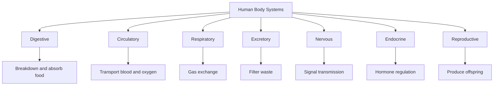

---
tags:
  - biology
  - advance
  - human-body-systems
  - ipst
source: "IPST (สสวท.) Biology Curriculum B.E. 2551 (2008, revised 2560/2017)"
created: 2026-07-30
course_codes: ["ว322"]
---

# Human Body Systems — ระบบต่างๆ ของร่างกายมนุษย์

> *"The human body is the best picture of the human soul."* — Ludwig Wittgenstein

The human body (ร่างกายมนุษย์) is organized into multiple organ systems that work together to maintain life. Each system has specialized organs performing coordinated functions — from breaking down food (ระบบย่อยอาหาร) to circulating blood (ระบบไหลเวียน), exchanging gases (ระบบหายใจ), filtering waste (ระบบขับถ่าย), transmitting signals (ระบบประสาท), and regulating hormones (ระบบต่อมไร้ท่อ). The overarching principle is **homeostasis** (สภาวะสมดุล) — the maintenance of stable internal conditions.

Understanding human body systems is critical for medicine, health sciences, and biology. At the ม.5 level, students study each system's structure and function in depth, connecting organ-level physiology to cellular processes and chemical principles learned in earlier courses.

---

## 1 | Course Coverage

### ม.5 (ว322)

| Semester | Scope | Key Skills |
|---|---|---|
| **Semester 2** | Digestive system (organs, enzymes); circulatory system (heart, blood vessels, blood components); respiratory system (gas exchange) | Labeling diagrams, tracing blood flow, analyzing enzyme action and pH effects |
| **Semester 2** | Excretory system (kidney, nephron); nervous system (neurons, brain, reflex arc); endocrine system (glands, hormones); reproductive system; homeostasis | Explaining kidney filtration, drawing reflex arcs, matching hormones to functions, analyzing feedback loops |

---

## 2 | Key Terminology

| Thai | English | Symbol/Notes |
|---|---|---|
| สภาวะสมดุล | Homeostasis | Stable internal environment |
| ระบบย่อยอาหาร | Digestive system | Breakdown and absorption of food |
| เอนไซม์ | Enzyme | Biological catalyst |
| ระบบไหลเวียน | Circulatory system | Blood transport |
| หัวใจ | Heart | Four-chambered pump |
| เลือด | Blood | Connective tissue (plasma + cells) |
| ระบบหายใจ | Respiratory system | Gas exchange (O₂ and CO₂) |
| ถุงลมปอด | Alveolus (pl. alveoli) | Gas exchange surfaces in lungs |
| ระบบขับถ่าย | Excretory system | Waste removal, water balance |
| หน่วยไต | Nephron | Functional unit of kidney |
| ระบบประสาท | Nervous system | Signal transmission |
| เซลล์ประสาท | Neuron | Nerve cell |
| สมอง | Brain | Central processing organ |
| รีเฟล็กซ์ | Reflex arc | Automatic neural response |
| ระบบต่อมไร้ท่อ | Endocrine system | Hormone regulation |
| ฮอร์โมน | Hormone | Chemical messenger |
| ระบบสืบพันธุ์ | Reproductive system | Produces offspring |
| การกรอง | Filtration | Kidney filtration step |
| การดูดซึมกลับ | Reabsorption | Recovery of useful substances |

---

## 3 | Key Concepts

### 3.1 Digestive System (ระบบย่อยอาหาร)

The digestive tract (ทางเดินอาหาร) processes food through **mechanical digestion** (physical breakdown: chewing, churning) and **chemical digestion** (enzyme action). Key organs and enzymes:

| Organ | Enzyme/Secretion | Substrate → Product |
|---|---|---|
| Mouth (ปาก) | Salivary amylase (อะไมเลส) | Starch → Maltose |
| Stomach (กระเพาะ) | Pepsin (เพปซิน, pH 1.5–2) | Proteins → Peptides |
| Pancreas (ตับอ่อน) | Trypsin, lipase, amylase | Proteins, fats, starch |
| Small intestine (ลำไส้เล็ก) | Maltase, sucrase, lactase | Disaccharides → Monosaccharides |

The **small intestine** is the primary site of absorption (การดูดซึม), with villi (วิลลิ) and microvilli increasing surface area. Nutrients absorbed into blood capillaries; fats enter lacteals (แลคทีล) in lymphatic system.

### 3.2 Circulatory System (ระบบไหลเวียน)

The **heart** (หัวใจ) is a four-chambered muscular pump. **Right atrium → right ventricle → lungs** (pulmonary circulation, ปอดหมุนเวียน). **Left atrium → left ventricle → body** (systemic circulation, ร่างกายหมุนเวียน). One-way flow ensured by valves: tricuspid, bicuspid (mitral), pulmonary semilunar, aortic semilunar.

**Blood vessels**: **Arteries** (หลอดเลือดแดง, thick walls, carry blood away from heart), **veins** (หลอดเลือดดำ, thinner walls with valves, carry blood to heart), **capillaries** (หลอดเลือดฝอย, thin walls for exchange).

**Blood components**: **Plasma** (พลาสมา, ~55%, water + proteins + dissolved substances), **Red blood cells / Erythrocytes** (เม็ดเลือดแดง, carry O₂ via hemoglobin, ฮีโมโกลบิน), **White blood cells / Leukocytes** (เม็ดเลือดขาว, immune defense), **Platelets / Thrombocytes** (เกล็ดเลือด, blood clotting).

### 3.3 Respiratory System (ระบบหายใจ)

Air path: nasal cavity → pharynx → larynx → trachea → bronchi → bronchioles → **alveoli** (ถุงลมปอด). Gas exchange occurs at alveoli by **diffusion** across the respiratory membrane (thin alveolar epithelium + capillary endothelium). O₂ binds to hemoglobin in RBCs → **oxyhemoglobin** (ออกซีฮีโมโกลบิน). CO₂ transported as bicarbonate (HCO₃⁻) in plasma (major), carbaminohemoglobin, and dissolved CO₂. **Breathing mechanics**: diaphragm contraction → thoracic cavity expands → air flows in (inspiration); relaxation → air pushed out (expiration).

### 3.4 Excretory System (ระบบขับถ่าย)

The **kidneys** (ไต) filter blood and produce urine (ปัสสาวะ). Each kidney contains ~1 million **nephrons** (หน่วยไต), the functional units. A nephron consists of:

1. **Bowman's capsule** (แคปซูลโบว์แมน) + glomerulus (กลเมอรูลัส) — **filtration** (การกรอง): blood pressure forces small molecules into capsule → glomerular filtrate
2. **Proximal convoluted tubule** (ท่อขดส่วนต้น) — **reabsorption** (การดูดซึมกลับ): glucose, amino acids, most water and ions reabsorbed
3. **Loop of Henle** (ห่วงเฮนเล) — concentration of urine; descending limb reabsorbs water, ascending limb reabsorbs ions
4. **Distal convoluted tubule** (ท่อขดส่วนปลาย) — **secretion** (การหลั่ง): additional waste and ions secreted; pH regulation
5. **Collecting duct** (ท่อรวม) — final water reabsorption regulated by **ADH** (antidiuretic hormone, ฮอร์โมนต้านการขับปัสสาวะ)

### 3.5 Nervous System (ระบบประสาท)

**Neurons** (เซลล์ประสาท) transmit electrical signals. Structure: **cell body** (ตัวเซลล์ประสาท), **dendrites** (เดนไดรต์, receive signals), **axon** (แอกซอน, transmits signals, may be myelinated). Signal transmission: **resting potential** → **action potential** (ศักย์ไฟฟ้ากระทำ, depolarization at −55 mV threshold) → **nerve impulse** propagates along axon → **synapse** (ไซแนปส์): neurotransmitter (สารสื่อประสาท) released → binds receptors on next neuron.

**Brain regions**: **cerebrum** (สมองใหญ่, conscious thought, sensory processing), **cerebellum** (สมองน้อย, coordination, balance), **brainstem** (ก้านสมอง, vital functions — breathing, heartbeat), **hypothalamus** (ไฮโพทาลามัส, links nervous and endocrine systems, thermoregulation).

**Reflex arc** (ส่วนโค้งรีเฟล็กซ์): **stimulus → receptor → sensory neuron → integration center (spinal cord) → motor neuron → effector (muscle/gland) → response**. Example: knee-jerk reflex — patellar tendon stretch → sensory neuron → spinal cord → motor neuron → quadriceps contraction. Reflexes are rapid, automatic, and do not require conscious brain processing.

### 3.6 Endocrine System (ระบบต่อมไร้ท่อ)

Endocrine glands (ต่อมไร้ท่อ) secrete **hormones** (ฮอร์โมน) directly into the blood. Key glands and hormones:

| Gland | Hormone | Function |
|---|---|---|
| Pituitary (ต่อมใต้สมอง) | GH, TSH, FSH, LH, ADH, oxytocin | Master gland; growth, reproduction, water balance |
| Thyroid (ต่อมไทรอยด์) | Thyroxine (T₄) | Metabolic rate, growth |
| Adrenal (ต่อมหมวกไต) | Adrenaline, cortisol | Stress response, blood sugar |
| Pancreas (ต่อมอินซูลิน / ตับอ่อน) | Insulin, glucagon | Blood glucose regulation |
| Gonads (ต่อมสืบพันธุ์) | Estrogen, testosterone | Reproductive development |

**Negative feedback** (ป้อนกลับเชิงลบ) is the primary regulatory mechanism. Example: high blood glucose → pancreas secretes insulin → glucose uptake by cells → blood glucose drops → insulin secretion decreases.

### 3.7 Reproductive System (ระบบสืบพันธุ์) — Brief Overview

**Male**: testes (อัณฑะ) produce sperm (อสุจิ) and testosterone. **Female**: ovaries (รังไข่) produce ova (ไข่) and estrogen/progesterone. Menstrual cycle (รอบเดือน, ~28 days): follicular phase → ovulation (การตกไข่) → luteal phase. Fertilization in fallopian tube → implantation in uterus (มดลูก).

---

## 4 | Common Problem Types

### Type 1: Tracing Blood Flow Through the Heart
> Trace a drop of blood from the right atrium to the left ventricle.

**Solution:**
1. **Right atrium** (ห้องบนขวา) receives deoxygenated blood from vena cava
2. → **Tricuspid valve** (ลิ้นไตรคัสปิด) → **Right ventricle** (ห้องล่างขวา)
3. → **Pulmonary semilunar valve** → **Pulmonary arteries** → **Lungs** (gas exchange: CO₂ out, O₂ in)
4. → **Pulmonary veins** → **Left atrium** (ห้องบนซ้าย)
5. → **Bicuspid/mitral valve** → **Left ventricle** (ห้องล่างซ้าย)
6. → **Aortic semilunar valve** → **Aorta** → body

### Type 2: Kidney Filtration Problem
> A patient's blood glucose level is 200 mg/dL (normal: 70–110). Explain why glucose appears in the urine.

**Solution:**
1. Normal kidneys reabsorb all glucose in the proximal convoluted tubule
2. The **renal threshold** for glucose (~180 mg/dL) is exceeded
3. Glucose transporters (SGLT) are saturated — cannot reabsorb all glucose
4. Excess glucose remains in the filtrate → appears in urine (glucosuria, น้ำตาลในปัสสาวะ)
5. This is characteristic of **diabetes mellitus** (เบาหวาน)

### Type 3: Reflex Arc Analysis
> A person touches a hot stove and immediately pulls their hand away. Trace the reflex arc.

**Solution:**
1. **Stimulus**: heat → pain receptors (nociceptors) in skin
2. **Receptor**: thermoreceptors/pain receptors detect damage
3. **Sensory neuron**: transmits impulse from hand to spinal cord
4. **Integration center**: interneurons in spinal cord relay signal
5. **Motor neuron**: transmits impulse from spinal cord to arm muscles
6. **Effector**: biceps contracts → hand pulled away
7. Simultaneously, signals reach brain → pain is felt (slightly delayed)

---

## 5 | Cross-Links

- [[12_Animal_Biology]] — comparative organ systems across vertebrates
- [[../../Advance/Chemistry/18_Biochemistry|Chemistry: Biochemistry]] — enzymes, hormones, blood chemistry
- [[10_Microbiology]] — immune response to pathogens
- [[08_Evolution]] — comparative anatomy of human organ systems
