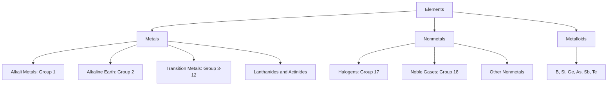

---
tags:
  - chemistry
  - advance
  - periodic-table
  - ipst
source: "IPST (สสวท.) Chemistry Curriculum B.E. 2551 (2008, revised 2560/2017)"
created: 2026-07-30
course_codes: ["ว311"]
---

# Periodic Table — ตารางธาตุ

> *"The periodic table is a treasure map. The more you understand it, the more you can find."* — Sam Kean

The periodic table (ตารางธาตุ) arranges the elements in order of increasing atomic number, revealing the relationship between atomic structure and element properties. It enables systematic prediction of the chemical behavior (พฤติกรรมทางเคมี) of the elements.

---

## 1 | Course Coverage

### ม.4 (ว311)

| Semester | Scope | Key Skills |
|---|---|---|
| **Semester 1** | Periods (คาบ) and groups (หมู่), classification of elements (การจำแนกธาตุ): metals (โลหะ), nonmetals (อโลหะ), metalloids (กึ่งโลหะ), transition metals (ธาตุทรานซิชัน); periodic trends (แนวโน้ม): atomic radius (ขนาดอะตอม), ionization energy (IE), electronegativity (EN), electron affinity (EA) | Predict and compare properties of elements, explain trends |

---

## 2 | Key Terminology

| Thai | English | Symbol/Notes |
|---|---|---|
| คาบ | Period | แถวนอน (1-7) |
| หมู่ | Group | แถวตั้ง (1-18) |
| โลหะแอลคาไล | Alkali metals | หมู่ 1 (ยกเว้น H) |
| โลหะแอลคาไลน์เอิร์ธ | Alkaline earth metals | หมู่ 2 |
| ธาตุทรานซิชัน | Transition metals | หมู่ 3-12 |
| แฮโลเจน | Halogens | หมู่ 17 |
| แก๊สมีตระกูล | Noble gases | หมู่ 18 |
| แรงดึงดูดระหว่างนิวเคลียสกับอิเล็กตรอน | Effective nuclear charge | $Z_{eff}$ |
| พลังงานไอออไนเซชัน | Ionization energy | $IE$ |
| อิเล็กโตรเนกาติวิตี | Electronegativity | $\chi$ |

---

## 3 | Key Concepts

### 3.1 Structure of the Periodic Table (โครงสร้างตารางธาตุ)

The modern periodic table contains **118 elements (ธาตุ)** arranged as:

- **7 periods (คาบ)** (horizontal rows) — elements in the same period have the same number of electron shells (จำนวนชั้นอิเล็กตรอนเท่ากัน)
- **18 groups (หมู่)** (vertical columns) — elements in the same group have the same number of valence electrons (จำนวนอิเล็กตรอนวงนอกสุดเท่ากัน)

**Classification (การจำแนก):**

| Class | Location | Properties |
|---|---|---|
| Metals (โลหะ) | Left and center | Conduct electricity, ductile, lustrous (นำไฟฟ้า ดึงเป็นเส้นได้ มันวาว) |
| Nonmetals (อโลหะ) | Upper right | Brittle, non-conductors (except C) (เปราะ ไม่นำไฟฟ้า ยกเว้น C) |
| Metalloids (กึ่งโลหะ) | Staircase | B, Si, Ge, As, Sb, Te, Po |
| Lanthanides (แลนทาไนด์) | Period 6, bottom row | $4f$-block |
| Actinides (แอกทิไนด์) | Period 7, bottom row | $5f$-block |

### 3.2 s-, p-, d-, f-block

| Block | Last electron enters | Elements |
|---|---|---|
| s-block | ns orbital | Groups 1, 2 (หมู่ 1, 2) |
| p-block | np orbital | Groups 13–18 (หมู่ 13-18) |
| d-block | (n-1)d orbital | Groups 3–12 (transition) (หมู่ 3-12) |
| f-block | (n-2)f orbital | Lanthanides, actinides (แลนทาไนด์, แอกทิไนด์) |

### 3.3 Effective Nuclear Charge ($Z_{eff}$)

The net positive pull felt by a valence electron from the nucleus, after subtracting the repulsion (แรงผลัก) from inner-shell electrons:

$$Z_{eff} = Z - S$$

where $S$ = shielding constant (approximated by Slater's rules)

**Trend (แนวโน้ม):** $Z_{eff}$ increases from left to right across a period (because $Z$ increases while shielding increases more slowly).

### 3.4 Atomic Radius Trends

**Atomic Radius (ขนาดอะตอม):**

| Trend | Direction | Reason |
|---|---|---|
| Decreases (ลดลง) | Left → Right (within a period) | $Z_{eff}$ increases |
| Increases (เพิ่มขึ้น) | Top → Bottom (within a group) | More electron shells (เพิ่มชั้นอิเล็กตรอน) |

**Ionic Radius (ขนาดไอออน):**
- cation < neutral atom (loses e⁻, fewer e⁻ remain, higher $Z_{eff}$)
- anion > neutral atom (gains e⁻, more e⁻-e⁻ repulsion)

### 3.5 Ionization Energy (IE)

The energy required to remove the first electron from a gaseous atom:

$$\ce{X(g) -> X^+(g) + e^-} \quad \Delta E = IE_1$$

**Trends (แนวโน้ม):**

| Direction | Trend | Reason |
|---|---|---|
| Left → Right | **Increases (เพิ่มขึ้น)** | Higher $Z_{eff}$ holds e⁻ more tightly |
| Top → Bottom | **Decreases (ลดลง)** | Valence e⁻ farther from nucleus, more shielding |

**Exceptions (ข้อยกเว้น):**
- $\ce{Be}$ → $\ce{B}$ (IE decreases): $2s^2$ is filled and stable, $2p$ is higher in energy
- $\ce{N}$ → $\ce{O}$ (IE decreases): $2p^3$ is stable (Hund), $2p^4$ has paired-electron repulsion

### 3.6 Electron Affinity (EA)

The energy released when an atom gains an electron:

$$\ce{X(g) + e^- -> X^-(g)} \quad \Delta E = -EA$$

**Trend (แนวโน้ม):** EA is most negative (releases the most energy) in Groups 16–17 of periods 2–3 ($\ce{Cl}$ has the highest EA).

### 3.7 Electronegativity ($\chi$)

The ability of an atom to attract shared electrons in a bond (Pauling scale: 0.7 to 4.0).

- Highest: $\ce{F}$ ($\chi = 4.0$)
- Lowest: $\ce{Cs}$ / $\ce{Fr}$ ($\chi \approx 0.7$)

**Trend (แนวโน้ม):** Increases left→right, decreases top→bottom (similar to IE).

### 3.8 Metallic Character

- Increases from right to left and from top to bottom
- $\ce{Fr}$ has the highest metallic character
- $\ce{F}$ has the lowest metallic character

---

## 4 | Common Problem Types

### Type 1: Comparing Atomic Radii

> Arrange the following in order of increasing atomic radius: $\ce{Na}, \ce{Mg}, \ce{K}, \ce{Cl}$

**Solution:**

- Separate by period: $\ce{Na, Mg, Cl}$ (period 3) < $\ce{K}$ (period 4)
- Within period 3: $\ce{Cl} < \ce{Mg} < \ce{Na}$ (because $Z_{eff}$ increases)
- Order: $\ce{Cl < Mg < Na < K}$

### Type 2: Comparing Ionization Energy

> Which element has the higher IE: $\ce{Na}$ or $\ce{Mg}$?

**Solution:**

- Both are in period 3; $\ce{Mg}$ lies to the right → higher $Z_{eff}$
- **$\ce{Mg}$ has the higher IE** (but $\ce{Mg^+}$ IE > $\ce{Na^+}$ because group effects are weaker than period effects)

### Type 3: Identifying an Element from its Properties

> Element $\ce{X}$ is in group 14, period 3. Identify the element and write its electron configuration.

**Solution:**

- Group 14, period 3 → **$\ce{Si}$ (Silicon, Z=14)**
- $\ce{Si}: [\ce{Ne}]\, 3s^2\, 3p^2$

### Type 4: Comparing Electronegativity

> Arrange $\chi$ in order of decreasing value: $\ce{C, N, O, F}$

**Solution:**

- All are in period 2; $\chi$ increases left→right
- **$\ce{F > O > N > C}$** ($\ce{F}=4.0, \ce{O}=3.5, \ce{N}=3.0, \ce{C}=2.5$)

---

## 5 | Cross-Links

- [[01_Atomic_Structure]] — Electron configuration is the basis of the periodic table
- [[03_Chemical_Bonding]] — Electronegativity trends predict bond type
- [[04_Intermolecular_Forces]] — Element properties affect IMFs
- [[../../Fundamental/10_Atoms_Elements_and_Compounds]] — Foundation of elements from ม.1-3
