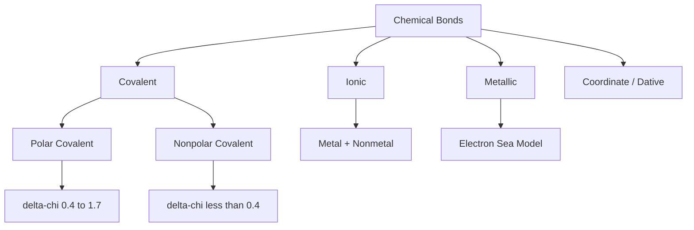

---
tags:
  - chemistry
  - advance
  - chemical-bonding
  - ipst
source: "IPST (สสวท.) Chemistry Curriculum B.E. 2551 (2008, revised 2560/2017)"
created: 2026-07-30
course_codes: ["ว311"]
---

# Chemical Bonding — พันธะเคมี

> *"Chemical bonds are the glue that holds molecules together. Understanding them is understanding chemistry itself."* — Linus Pauling

Chemical bonds (พันธะเคมี) are the attractive forces (แรงยึดเหนี่ยว) between atoms that hold them together as molecules or compounds. Studying bonding helps explain the structure, shape, and properties of substances — the heart of chemistry.

---

## 1 | Course Coverage

### ม.4 (ว311)

| Semester | Scope | Key Skills |
|---|---|---|
| **Semester 1** | Ionic (พันธะไอออนิก), covalent (พันธะโคเวเลนต์), metallic (พันธะโลหะ) bonds; Lewis structures; VSEPR theory; molecular geometry; hybridization | Draw Lewis structures, predict molecular shapes, identify hybridization |

---

## 2 | Key Terminology

| Thai | English | Symbol/Notes |
|---|---|---|
| พันธะไอออนิก | Ionic bond | โลหะ + อโลหะ, ถ่ายเท e⁻ |
| พันธะโคเวเลนต์ | Covalent bond | อโลหะ + อโลหะ, ใช้ e⁻ ร่วม |
| พันธะโลหะ | Metallic bond | โลหะ + โลหะ, e⁻ sea |
| โครงสร้างลิวอิส | Lewis structure | จุดแทน valence e⁻ |
| คู่อิเล็กตรอนพันธะ | Bonding pair | e⁻ ที่ใช้ร่วม |
| คู่อิเล็กตรอนโดดเดี่ยว | Lone pair | e⁻ ไม่ใช้ในพันธะ |
| ทฤษฎี VSEPR | Valence Shell Electron Pair Repulsion | ใช้ทำนายรูปร่าง |
| ไฮบริไดเซชัน | Hybridization | $sp, sp^2, sp^3$ |

---

## 3 | Key Concepts

### 3.1 Ionic Bond (พันธะไอออนิก)

Formed by the transfer of electrons from a metal to a nonmetal, producing a positive ion (cation, ไอออนบวก) and a negative ion (anion, ไอออนลบ), which attract each other by electrostatic forces (แรงไฟฟ้าสถิต).

**Example (ตัวอย่าง):**

$$\ce{Na -> Na^+ + e^-}$$
$$\ce{Cl + e^- -> Cl^-}$$
$$\ce{Na + Cl -> Na^+Cl^-}$$

**Properties (สมบัติ):**
- High melting/boiling points
- Brittle solids (ของแข็งเปราะ)
- Soluble in water (most cases) (ละลายน้ำได้ ส่วนใหญ่)
- Conduct electricity when molten or dissolved (นำไฟฟ้าเมื่อหลอมเหลว/ละลาย)

**Lattice Energy ($U$):** The energy released when gaseous cations and anions combine to form a crystalline solid (พลังงานที่ปล่อยออกเมื่อไอออนบวก/ลบรวมตัวเป็นผลึก).

$$U \propto \frac{|z^+ \cdot z^-|}{r^+}$$

where $z$ = charge, $r$ = distance between ions (ระยะระหว่างไอออน).

### 3.2 Covalent Bond (พันธะโคเวเลนต์)

Formed by the sharing of electrons between atoms (การใช้อิเล็กตรอนร่วมกัน).

**Types (ประเภท):**

| Type | Description | Example |
|---|---|---|
| Single bond | 1 shared e⁻ pair (1 คู่ e⁻ ร่วม) | $\ce{H-H}$ |
| Double bond | 2 shared e⁻ pairs (2 คู่ e⁻ ร่วม) | $\ce{O=O}$ |
| Triple bond | 3 shared e⁻ pairs (3 คู่ e⁻ ร่วม) | $\ce{N#N}$ |

**Polar Covalent Bond:** Atoms with different electronegativities share electrons, but the electron density (e⁻ เอียง) is shifted toward the more electronegative atom.

**Properties (สมบัติ):**
- Lower boiling/melting points than ionic compounds
- Do not conduct electricity (except graphite) (ไม่นำไฟฟ้า ยกเว้นกราฟีน)
- Dissolve in polar solvents (ละลายในตัวทำละลายที่มีขั้ว)

### 3.3 Metallic Bond (พันธะโลหะ)

The "electron sea" model (ทะเลอิเล็กตรอน, Electron Sea Model):
- Positive metal ions (ไอออนบวกของโลหะ) are immersed in a sea of mobile electrons (ทะเล e⁻ ที่เคลื่อนที่อิสระ)
- The free electrons (e⁻ ที่อิสระ) enable high electrical and thermal conductivity
- The electron sea acts as "glue" (กาว) holding the cations together

**Properties of metals (สมบัติโลหะ):** Conduct electricity, ductile, malleable, lustrous (นำไฟฟ้า, ดึงเป็นเส้น, ตีเป็นแผ่น, มันวาว).

### 3.4 Lewis Structures

**Procedure (ขั้นตอนการเขียน):**

1. Count total valence e⁻ (นับ valence e⁻ ทั้งหมด)
2. Choose the central atom (เลือกอะตอมกลาง) (usually C, N, or the least electronegative atom except H)
3. Form single bonds between the central atom and surrounding atoms (สร้างพันธะเดี่ยวระหว่างอะตอมกลางกับอะตอมรอบข้าง)
4. Place remaining electrons as lone pairs on the outer atoms (เติม e⁻ ที่เหลือเป็น lone pairs บนอะตอมรอบข้าง)
5. If the central atom lacks an octet, form multiple bonds (ถ้าอะตอมกลาง e⁻ ไม่ครบ octet ให้สร้าง multiple bond)

**Example (ตัวอย่าง): $\ce{CO2}$**

1. Valence e⁻ = $4 + 6 + 6 = 16$
2. C is the central atom
3. Structure: $\ce{O=C=O}$
4. Each O has 2 lone pairs, C has a complete octet

### 3.5 Resonance Structures

When more than one equivalent Lewis structure can be drawn, e.g. $\ce{O3}$ (ozone):

$$\ce{O=O-O <-> O-O=O}$$

Connect them with $\leftrightarrow$ and the true structure is the **resonance hybrid** (เฉลี่ยของทั้งหมด).

### 3.6 Formal Charge

$$FC = V - L - \frac{B}{2}$$

where $V$ = valence e⁻, $L$ = lone-pair e⁻, $B$ = bonding e⁻.

The best structure has the lowest $FC$ and any negative $FC$ on the most electronegative atom (-FC อยู่บน EN สูง).

### 3.7 VSEPR Theory

**Principle (หลักการ):** Electron pairs (คู่อิเล็กตรอน) around the central atom arrange themselves as far apart as possible.

**Molecular geometries (รูปร่างโมเลกุล) (AXE notation):**

| Steric # | Lone pairs | Geometry | Bond angle | Example |
|---|---|---|---|---|
| 2 | 0 | Linear | 180° | $\ce{BeCl2}$ |
| 3 | 0 | Trigonal planar | 120° | $\ce{BF3}$ |
| 3 | 1 | Bent | <120° | $\ce{SO2}$ |
| 4 | 0 | Tetrahedral | 109.5° | $\ce{CH4}$ |
| 4 | 1 | Trigonal pyramidal | <109.5° | $\ce{NH3}$ |
| 4 | 2 | Bent | <109.5° | $\ce{H2O}$ |
| 5 | 0 | Trigonal bipyramidal | 90°, 120° | $\ce{PCl5}$ |
| 6 | 0 | Octahedral | 90° | $\ce{SF6}$ |

### 3.8 Bond Polarity & Molecular Polarity

**Bond Polarity:** Determined by $\Delta \chi$ between two atoms.
- $\Delta \chi < 0.4$: nonpolar
- $0.4 \le \Delta \chi < 1.7$: polar covalent
- $\Delta \chi \ge 1.7$: ionic

**Molecular Polarity:** Depends on both bond polarity and molecular geometry.
- Dipole moment: $\mu = q \times d$ (Debye units)

Example: $\ce{CO2}$ (linear) = nonpolar, $\ce{H2O}$ (bent) = polar.

### 3.9 Hybridization

**Principle (หลักการ):** Orbitals of different types mix to form new orbitals suited to bonding (ออร์บิทัลต่างชั้นผสมกันเพื่อสร้างออร์บิทัลใหม่ที่เหมาะกับการเกิดพันธะ).

| Hybrid | Geometry | Example |
|---|---|---|
| $sp$ | Linear (180°) | $\ce{BeCl2, C2H2}$ |
| $sp^2$ | Trigonal planar (120°) | $\ce{BF3, C2H4}$ |
| $sp^3$ | Tetrahedral (109.5°) | $\ce{CH4, NH3, H2O}$ |
| $sp^3d$ | Trigonal bipyramidal | $\ce{PCl5}$ |
| $sp^3d^2$ | Octahedral | $\ce{SF6}$ |

**Sigma (σ) bond:** head-on overlap, all single bonds are sigma (พันธะเดี่ยวทั้งหมดเป็น sigma)
**Pi (π) bond:** side-by-side overlap, found in double/triple bonds (พบใน double/triple bond)

- Single bond: 1σ
- Double bond: 1σ + 1π
- Triple bond: 1σ + 2π

---

## 4 | Common Problem Types

### Type 1: Drawing a Lewis Structure

> Draw the Lewis structure of $\ce{SO2}$.

**Solution:**

- Valence e⁻ = $6 + 6 + 6 = 18$
- S is the central atom
- Form bonds: $\ce{O=S=O}$ (uses 8 e⁻), leaving 10 e⁻
- Add lone pairs: each O has 2 lone pairs (8 e⁻), leaving 2 e⁻ on S
- **Structure:** $\ce{[:O:]=[S]=[:O:]:}$ (S has 1 lone pair)

### Type 2: Predicting Molecular Shape

> What is the shape of $\ce{PCl3}$?

**Solution:**

- Valence e⁻ around P = $5 + 3(7) = 26$ → used in bonds $3 \times 2 = 6$, leaving $20$ e⁻
- Lone pairs on P = 1 (4 e⁻)
- Steric # = 4, lone pair = 1 → **Trigonal pyramidal**

### Type 3: Identifying Hybridization

> What is the hybridization of C in $\ce{C2H4}$?

**Solution:**

- Each C forms 3 σ bonds (1 to H, 1 to H, 1 to C) + 1 π
- **$sp^2$ hybridization** (trigonal planar, 120°)

### Type 4: Comparing Polarity

> Is $\ce{NH3}$ polar?

**Solution:**

- $\ce{NH3}$ has a trigonal pyramidal shape (asymmetric) (ไม่สมมาตร)
- N has EN = 3.0, H has 2.1 → N–H bonds are polar
- Dipoles do not cancel → **$\ce{NH3}$ is polar** ($\mu \neq 0$)

---

## 5 | Cross-Links

- [[01_Atomic_Structure]] — Electron configuration is the foundation of bonding
- [[02_Periodic_Table]] — Electronegativity predicts bond type
- [[04_Intermolecular_Forces]] — Molecular polarity affects IMFs
- [[03_Chemical_Bonding#33-covalent-bond|ตัวอย่าง Lewis]] — See additional examples
