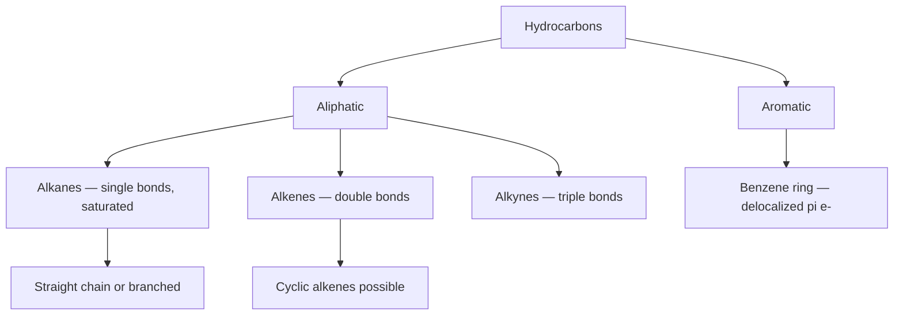

---
tags:
  - chemistry
  - advance
  - organic-fundamentals
  - ipst
source: "IPST (สสวท.) Chemistry Curriculum B.E. 2551 (2008, revised 2560/2017)"
created: 2026-07-30
course_codes: ["ว313"]
---

# Organic Chemistry Fundamentals — พื้นฐานเคมีอินทรีย์

> *"Organic chemistry is the chemistry of carbon compounds. Carbon has the unique ability to bond with itself and a variety of other elements, forming an enormous number of compounds."* — Peter Vollhardt

Organic chemistry (เคมีอินทรีย์) is the branch of chemistry that studies the structure, properties, composition, and reactions of carbon compounds (สารประกอบคาร์บอน). It forms the foundation of living systems, the chemical industry, pharmaceuticals, and materials science. This note covers the unique properties of carbon, the classes of hydrocarbons, IUPAC nomenclature, and isomerism (ภาวะไอโซเมอร์).

---

## 1 | Course Coverage

### ม.6 (ว313)

|| Semester | Scope | Key Skills |
||---|---|---|
|| **Semester 1** | Organic chemistry fundamentals, nomenclature, isomers, organic reactions | Draw structures, classify compounds, assign IUPAC names |
|| **Semester 2** | (continued in the next note) | — |

---

## 2 | Key Terminology

|| Thai | English | Symbol/Notes |
||---|---|---|
|| คาร์บอน | Carbon | C; atomic number 6, 4 valence e⁻ |
|| พันธะเดี่ยว | Single bond | C–C, σ-bond |
|| พันธะคู่ | Double bond | C=C, 1σ + 1π |
|| พันธะสาม | Triple bond | C≡C, 1σ + 2π |
|| ไฮบริไดเซชัน | Hybridization | sp³, sp², sp |
|| อะลิเฟติก | Aliphatic | open chain / ring |
|| อะโรมาติก | Aromatic | e.g. benzene C₆H₆ |
|| ไฮโดรคาร์บอน | Hydrocarbon | composed of C, H |
|| อัลเคน | Alkane | CₙH₂ₙ₊₂, single bonds |
|| อัลคีน | Alkene | CₙH₂ₙ, double bond |
|| อัลไคน์ | Alkyne | CₙH₂ₙ₋₂, triple bond |
|| ไอโซเมอร์ | Isomer | same molecular formula, different structure |
|| ไอยูแพค | IUPAC | International Union of Pure and Applied Chemistry |
|| สูตรโครงสร้าง | Structural formula | shows every bond |
|| สูตรแบบย่อ | Condensed formula | CH₃CH₂CH₃ |
|| สูตรแบบเส้น | Skeleton/Line formula | lines and angles |

---

## 3 | Key Concepts

### 3.1 The Special Properties of Carbon

Carbon (C) has a set of unique properties that allow it to form a vast number of compounds:

- **Tetravalent (เตตระวาเลนต์):** C has 4 valence electrons, so it forms 4 bonds.
- **Catenation (การต่อกันเอง):** C–C bonds can form straight chains, branched chains, and rings.
- **Strong bonds:** the C–C bond energy is ≈ 347 kJ/mol.
- **Hybridization (ไฮบริไดเซชัน):**

$$\text{sp}^3: \text{tetrahedral}, 109.5° \quad \text{sp}^2: \text{trigonal}, 120° \quad \text{sp: linear}, 180°$$

### 3.2 Classes of Hydrocarbons

#### (1) Alkanes (อัลเคน) — CₙH₂ₙ₊₂

All single bonds, **saturated** (อิ่มตัว).

$$\ce{CH4, C2H6, C3H8, C4H10, ...}$$

Names end in **-ane** (methane, ethane, propane, butane).

#### (2) Alkenes (อัลคีน) — CₙH₂ₙ

At least one C=C double bond, **unsaturated** (ไม่อิ่มตัว).

$$\ce{CH2=CH2} \text{ (ethene)}, \ce{CH3-CH=CH2} \text{ (propene)}$$

Names end in **-ene** (ethene, propene, butene).

#### (3) Alkynes (อัลไคน์) — CₙH₂ₙ₋₂

At least one C≡C triple bond.

$$\ce{HC≡CH} \text{ (ethyne/acetylene)}, \ce{CH3-C≡CH} \text{ (propyne)}$$

Names end in **-yne**.

#### (4) Aromatic Hydrocarbons (อะโรมาติกไฮโดรคาร์บอน)

Contain a benzene ring C₆H₆ with delocalized π electrons.

### 3.3 IUPAC Nomenclature

**Steps:**

1. **Find the longest carbon chain (สายโซ่หลัก)** that contains the most carbons.
2. **Identify the substituents (หมู่แทนที่)** and their positions.
3. **Number the chain** to give the lowest possible locants.
4. **Alphabetize** the substituents.
5. **Assemble the name:** locant + substituent + parent.

**Example:**

$$\ce{CH3-CH(CH3)-CH2-CH3}$$

→ 2-methylbutane (parent chain of 4 C = butane, methyl group at position 2).

### 3.4 Three Types of Chemical Formulas

|| Form | Example (butane C₄H₁₀) |
||---|---|
|| **Full structural (โครงสร้าง)** | shows every C–C and C–H bond |
|| **Condensed (แบบย่อ)** | $\ce{CH3CH2CH2CH3}$ |
|| **Skeletal (แบบเส้น)** | 3-segment zig-zag line |

### 3.5 Isomerism (ภาวะไอโซเมอร์)

#### (1) Structural (Constitutional) Isomerism
- **Chain isomer:** different carbon skeleton.
- **Position isomer:** functional group at a different position.
- **Functional group isomer:** different functional group.

Example: $\ce{C4H10}$ has 2 isomers (n-butane, isobutane).

#### (2) Geometric (cis-trans) Isomerism
- Occurs in compounds with a C=C double bond or a ring.
- **cis:** identical groups on the same side.
- **trans:** identical groups on opposite sides.

#### (3) Optical Isomerism
- Molecules that are non-superimposable on their mirror image (chiral).
- Contain a **chiral carbon center** (C bonded to 4 different groups).
- Rotate plane-polarized light: **dextrorotatory (+)** or **levorotatory (−)**.

---

## 4 | Common Problem Types

### Type 1: IUPAC Naming

> Name the following compound by IUPAC rules: $\ce{CH3-CH(CH3)-CH=CH-CH3}$

**Solution:**
1. The longest chain has 5 C → **pentene**.
2. Number from the right to give the double bond the lowest locant (position 2).
3. Substituent: methyl at C-4.
4. Answer: **4-methyl-2-pentene**.

### Type 2: Counting Isomers

> How many structural isomers does $\ce{C5H12}$ have?

**Solution:**
- n-pentane
- 2-methylbutane (isopentane)
- 2,2-dimethylpropane (neopentane)
- **Total: 3 isomers.**

### Type 3: Calculating the Degree of Unsaturation (DoU)

> What is the DoU of C₆H₁₀?

**Formula:**

$$\text{DoU} = \frac{2C + 2 - H}{2}$$

**Solution:**

$$\text{DoU} = \frac{2(6) + 2 - 10}{2} = \frac{4}{2} = 2$$

This means 2 double bonds, or 1 double bond + 1 ring, or 1 triple bond.

### Type 4: Identifying a cis-trans Isomer

> Does 2-butene have a cis-trans isomer?

**Solution:** Yes.
- **cis-2-butene:** both $\ce{CH3}$ on the same side (bp 4°C).
- **trans-2-butene:** $\ce{CH3}$ on opposite sides (bp 1°C).

---

## 5 | Cross-Links

- [[03_Chemical_Bonding]] — Covalent bonds and hybridization
- [[04_Structure_of_Matter]] — Atomic structure
- [[15_Organic_Reactions]] — Organic reactions (next)
- [[16_Organic_Compounds_by_Functional_Group]] — Functional groups
- [[19_Qualitative_Analysis]] — Qualitative analysis
