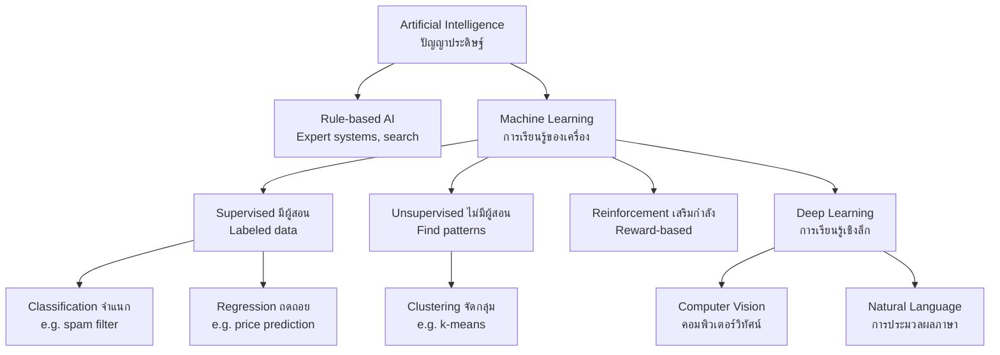

---
tags:
  - computer-science
  - advance
  - artificial-intelligence
  - machine-learning
  - ipst
source: "IPST (สสวท.) Computer Science Curriculum B.E. 2551 (2008, revised 2560/2017)"
created: 2026-07-30
course_codes: ["ว333"]
---

# Artificial Intelligence — ปัญญาประดิษฐ์

> *"AI is one of the most important things humanity is working on. It is more profound than electricity or fire."* — Sundar Pichai, CEO of Google

Artificial Intelligence (ปัญญาประดิษฐ์, AI) is the field of building systems that perform tasks normally requiring human intelligence — recognizing images, understanding language, making predictions, and even creating art. Modern AI is largely driven by **machine learning** (การเรียนรู้ของเครื่อง, ML), where computers learn patterns from data instead of following hand-written rules. The most powerful subset today is **deep learning** (การเรียนรู้เชิงลึก, DL), built on artificial neural networks.

This note covers the AI/ML/DL hierarchy, the main types of machine learning, neural network basics, the training/testing workflow, common applications (NLP, computer vision, recommendation systems), AI ethics (จริยศาสตร์ด้าน AI), and an overview of generative AI.

---

## 1 | Course Coverage

### ม.6 (ว333)

| Semester | Scope | Key Skills |
|---|---|---|
| **Semester 1** | AI/ML/DL concepts, ML types, neural network basics | Distinguish ML types, explain a neuron, train a simple model |
| **Semester 2** | Applications, AI ethics, generative AI | Evaluate AI bias, discuss privacy/jobs, use AI responsibly |

---

## 2 | Key Terminology

| Thai | English | Symbol/Notes |
|---|---|---|
| ปัญญาประดิษฐ์ | Artificial Intelligence (AI) | Human-like machine intelligence |
| การเรียนรู้ของเครื่อง | Machine Learning (ML) | Learn from data |
| การเรียนรู้เชิงลึก | Deep Learning (DL) | Multi-layer neural networks |
| การเรียนรู้แบบมีผู้สอน | Supervised learning | Labeled data |
| การเรียนรู้แบบไม่มีผู้สอน | Unsupervised learning | Unlabeled data |
| การเรียนรู้แบบเสริมกำลัง | Reinforcement learning | Reward-based |
| เครือข่ายประสาทเทียม | Neural network (NN) | Inspired by brain neurons |
| นิวรอน | Neuron / Unit | A single node |
| น้ำหนัก | Weight | $w$ — connection strength |
| ฟังก์ชันกระตุ้น | Activation function | ReLU, sigmoid, tanh |
| ชุดข้อมูลฝึก | Training set | Data to learn from |
| ชุดข้อมูลทดสอบ | Test set | Data to evaluate |
| อคติ | Bias | Unfair skew in data/output |
| ปัญญาประดิษฐ์เชิงกำเนิด | Generative AI | Creates new content |

---

## 3 | Key Concepts

### 3.1 AI vs ML vs DL

These terms are nested, not synonyms:

```
┌───────────────────────────────────────────┐
│  AI — any technique making machines       │   Broadest
│       "smart" (rules, search, ML)         │
│  ┌─────────────────────────────────────┐  │
│  │  ML — learn patterns from data      │  │   Subset of AI
│  │  ┌───────────────────────────────┐  │  │
│  │  │  DL — deep neural networks    │  │  │   Subset of ML
│  │  └───────────────────────────────┘  │  │
│  └─────────────────────────────────────┘  │
└───────────────────────────────────────────┘
```

- **AI** — the broad goal (game-playing, expert systems, robots, ML).
- **ML** — algorithms that improve with data (linear regression, decision trees, SVMs, neural nets).
- **DL** — neural networks with many layers; powers modern vision, language, and speech.




### 3.2 Types of Machine Learning

| Type | Thai | Data | Example |
|---|---|---|---|
| **Supervised** | มีผู้สอน | Labeled $(x, y)$ | Spam classifier, house-price prediction |
| **Unsupervised** | ไม่มีผู้สอน | Unlabeled $x$ | Customer segmentation, clustering |
| **Reinforcement** | เสริมกำลัง | Rewards over time | Game AI (AlphaGo), robot control |

- **Supervised (การเรียนรู้แบบมีผู้สอน):**
  - **Classification** (จำแนกประเภท) — predict a category (spam / not spam).
  - **Regression (การถดถอย)** — predict a number (price = 2.5M THB).
- **Unsupervised (การเรียนรู้แบบไม่มีผู้สอน):**
  - **Clustering (การจัดกลุ่ม)** — group similar items (k-means).
  - **Dimensionality reduction** — compress features (PCA).
- **Reinforcement (การเรียนรู้แบบเสริมกำลัง):** an **agent** (ตัวแทน) takes **actions** (การกระทำ) in an **environment** (สภาพแวดล้อม) to maximize cumulative **reward** (รางวัล).

### 3.3 Neural Networks Intro (เครือข่ายประสาทเทียม)

A neural network is built from **neurons** (นิวรอน) arranged in **layers** (ชั้น):

- **Input layer** — receives features $x_1, x_2, \ldots, x_n$.
- **Hidden layer(s)** — perform transformations; "deep" = many hidden layers.
- **Output layer** — produces the prediction $\hat{y}$.

Each connection has a **weight** (น้ำหนัก, $w$) and each neuron a **bias** (ไบแอส, $b$). A neuron computes:

$$z = w_1 x_1 + w_2 x_2 + \ldots + w_n x_n + b = \mathbf{w}\cdot\mathbf{x} + b$$

then applies an **activation function** (ฟังก์ชันกระตุ้น) $a = f(z)$:

| Function | Formula | Use |
|---|---|---|
| **ReLU** | $f(z)=\max(0,z)$ | Hidden layers (default) |
| **Sigmoid** | $f(z)=\frac{1}{1+e^{-z}}$ | Binary output (0–1) |
| **Softmax** | multi-class probabilities | Output layer (classification) |
| **Tanh** | $f(z)=\tanh(z)$ | Hidden layers (older) |

### 3.4 Training and Testing

The standard ML workflow:

```
1. Collect & clean data
2. Split: training set (e.g. 80%) / test set (20%)
3. Choose a model
4. Train: adjust weights to minimize a loss function
5. Evaluate on test set (accuracy, etc.)
6. Deploy / iterate
```

**Key ideas:**

- **Loss function** (ฟังก์ชันความสูญเสีย) — measures prediction error (MSE for regression, cross-entropy for classification).
- **Gradient descent** (การลงตามความชัน) — update weights in the direction that reduces loss.
- **Epoch** — one full pass over the training set.
- **Overfitting** (การฝึกฝนมากเกินไป) — model memorizes training data, fails on new data. Counter with more data, regularization, or dropout.
- **Underfitting** — model too simple to capture patterns.

```python
# Minimal scikit-learn example (supervised classification)
from sklearn.tree import DecisionTreeClassifier
from sklearn.model_selection import train_test_split
from sklearn.metrics import accuracy_score

# X = features, y = labels (0=not spam, 1=spam)
X_train, X_test, y_train, y_test = train_test_split(X, y, test_size=0.2)
model = DecisionTreeClassifier()
model.fit(X_train, y_train)             # train
preds = model.predict(X_test)           # predict
print("Accuracy:", accuracy_score(y_test, preds))
```

### 3.5 Common AI Applications

| Domain | Thai | Examples |
|---|---|---|
| **Natural Language Processing (NLP)** | การประมวลผลภาษาธรรมชาติ | Translation, chatbots, sentiment analysis |
| **Computer Vision** | คอมพิวเตอร์วิทัศน์ | Face ID, medical imaging, self-driving |
| **Recommendation systems** | ระบบแนะนำ | Netflix, YouTube, Shopee suggestions |
| **Speech recognition** | การจดจำเสียงพูด | Siri, Google Assistant |
| **Robotics** | หุ่นยนต์ | Autonomous navigation, manufacturing |

### 3.6 AI Ethics (จริยศาสตร์ด้าน AI)

| Issue | Thai | Description |
|---|---|---|
| **Bias & fairness** | อคติและความยุติธรรม | Model inherits biases in training data |
| **Privacy** | ความเป็นส่วนตัว | Personal data collection & misuse |
| **Transparency** | ความโปร่งใส | "Black box" models hard to explain |
| **Job displacement** | การสูญเสียงาน | Automation replaces some roles |
| **Accountability** | ความรับผิดชอบ | Who is liable for AI errors? |
| **Misinformation** | ข้อมูลเท็จ | Deepfakes, AI-generated fake news |
| **Environmental cost** | ต้นทุนสิ่งแวดล้อม | Training large models uses huge energy |

Responsible AI requires diverse data, auditing, human oversight, and clear policies.

### 3.7 Generative AI Overview (ปัญญาประดิษฐ์เชิงกำเนิด)

**Generative AI** (ปัญญาประดิษฐ์เชิงกำเนิด) creates **new** content — text, images, audio, code — rather than just classifying or predicting. Large models are trained on massive datasets:

| Modality | Model families | Examples |
|---|---|---|
| Text (LLM) | GPT, GLM, Llama, Claude | Chat assistants, summarization |
| Image | Diffusion models | Stable Diffusion, DALL·E, Midjourney |
| Audio | TTS, music models | Voice synthesis, Suno |
| Code | Codex, Copilot | Programming assistance |

**Transformer architecture** (สถาปัตยกรรมทรานส์ฟอร์เมอร์) underlies most modern LLMs, using the **attention mechanism** (กลไกการใส่ใจ) to weigh the relevance of different input tokens.

---

## 4 | Common Problem Types

### Type 1: Classify ML Type

> A bank uses past loan records (approved / rejected) to train a model that decides new applications. What ML type is this?

**Solution:** **Supervised learning (classification)** — the training data is **labeled** (each past record has a known approve/reject outcome), and the goal is to predict a category.

### Type 2: Compute a Single Neuron

> A neuron has inputs $x=[2,3]$, weights $w=[0.5,-1.0]$, bias $b=1$, and ReLU activation. Compute the output.

**Solution:**
```python
def relu(z): return max(0, z)

x = [2, 3]
w = [0.5, -1.0]
b = 1
z = sum(xi*wi for xi, wi in zip(x, w)) + b
print(z, relu(z))   # -1.0  0   (z = 1 + 1 - 3 = -1; ReLU(-1) = 0)
```
The weighted sum is $z = (2)(0.5) + (3)(-1.0) + 1 = 1 - 3 + 1 = -1$; ReLU output is $0$.

### Type 3: Train a Simple Classifier (Python)

> Train a k-NN classifier on the Iris dataset and report accuracy.

**Solution:**
```python
from sklearn.datasets import load_iris
from sklearn.neighbors import KNeighborsClassifier
from sklearn.model_selection import train_test_split
from sklearn.metrics import accuracy_score

X, y = load_iris(return_X_y=True)
X_tr, X_te, y_tr, y_te = train_test_split(X, y, test_size=0.2, random_state=42)
model = KNeighborsClassifier(n_neighbors=3)
model.fit(X_tr, y_tr)
print("Accuracy:", accuracy_score(y_te, model.predict(X_te)))
# Accuracy: 1.0  (Iris is an easy dataset)
```

---

## 5 | Cross-Links

- [[06_Algorithms]] — ML training is itself an algorithm (gradient descent)
- [[07_Data_Structures]] — tensors/vectors are multi-dimensional arrays
- [[08_Object_Oriented_Programming]] — ML models are OOP objects (`.fit()`, `.predict()`)
- [[10_Databases]] — training data is often stored in databases
- [[12_Digital_Citizenship]] — AI ethics, misinformation, responsible use
- [[19_Probability|Mathematics: Probability]] — statistical foundations of ML
