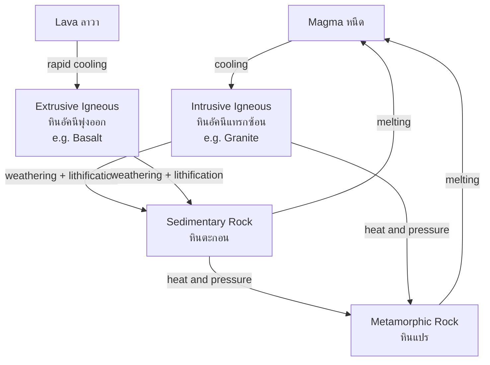

---
tags:
  - earth-science
  - advance
  - minerals-rocks
  - ipst
source: "IPST (สสวท.) Earth Science Curriculum B.E. 2551 (2008, revised 2560/2017)"
created: 2026-07-30
course_codes: ["ว341"]
---

# Minerals and Rocks — แร่และหิน

> *"In all things of nature there is something of the marvelous."* — Aristotle

Earth's crust is built from minerals (แร่) — naturally occurring, inorganic, crystalline solids with a definite chemical composition. Rocks (หิน) are aggregates of one or more minerals, and the rock cycle (วงจรหิน) continuously transforms them among three great families: igneous (หินอัคนี), sedimentary (หินตะกอน), and metamorphic (หินแปร). Understanding these materials is the foundation of geology because every landscape, every resource, and every natural hazard begins with what the planet is made of.

This note covers mineral identification, the silicate (ซิลิเกต) and non-silicate groups, Bowen's reaction series, the textures and origins of the three rock types, and the rock cycle that links them. Practical skills include using Mohs hardness (ความแข็ง), reading crystal habit (รูปร่างผลึก), and distinguishing intrusive (แทรกซ้อน) from extrusive (พุ่งออก) igneous rocks in hand specimens.

---

## 1 | Course Coverage

### ม.4-ม.5 (ว341, elective)

| Semester | Scope | Key Skills |
|---|---|---|
| **Semester 1** | Mineral properties & identification; silicate structures; the three rock families and their subtypes; the rock cycle | Hand-specimen identification using Mohs, streak, luster, cleavage; sketching the rock cycle |
| **Semester 2** | Economic minerals & ore deposits in Thailand; environmental impact of mining; rock resources and sustainability | Field-trip rock description; evaluate mining impacts; link resources to the rock cycle |

---

## 2 | Key Terminology

| Thai | English | Symbol/Notes |
|---|---|---|
| แร่ | Mineral | Naturally occurring, inorganic, crystalline solid |
| หิน | Rock | Aggregate of one or more minerals |
| หินอัคนี | Igneous rock | From solidified magma/lava |
| หินตะกอน | Sedimentary rock | From lithified sediment |
| หินแปร | Metamorphic rock | Altered by heat/pressure |
| หินแกรนิต | Granite | Intrusive felsic igneous |
| หินบะซอลต์ | Basalt | Extrusive mafic igneous |
| ความแข็ง | Hardness | Mohs scale 1–10 |
| ความวาว | Luster | How light reflects off the surface |
| การแตกแนว | Cleavage | Breaks along flat planes |
| สีผง | Streak | Powder color on porcelain plate |
| ซิลิเกต | Silicate | Contains Si and O |
| หินดินดาน | Shale | Clastic sedimentary |
| หินปูน | Limestone | $\ce{CaCO3}$, chemical/biochemical |
| หินอ่อน | Marble | Metamorphosed limestone |
| วงจรหิน | Rock cycle | Continuous transformation |

---

## 3 | Key Concepts

### 3.1 Mineral Properties and Identification

A mineral is defined by five criteria: (1) naturally occurring, (2) inorganic, (3) solid, (4) definite chemical composition, and (5) ordered crystalline structure (โครงสร้างผลึก). Geologists identify minerals using a suite of physical properties that do not require expensive equipment:

- **Hardness (ความแข็ง)** — resistance to scratching, ranked on the **Mohs scale**:
  $$H = 1 \text{ (talc, แร่ทัลค์)} \;\rightarrow\; 10 \text{ (diamond, เพชร)}$$
- **Luster (ความวาว)** — metallic (วาวโลหะ) or non-metallic (วาวอโลหะ: vitreous, dull, silky).
- **Color (สี)** — useful but often unreliable due to impurities.
- **Streak (สีผง)** — color of the powdered mineral on a porcelain streak plate; more diagnostic than color.
- **Cleavage (การแตกแนว)** — tendency to break along planes of weak atomic bonding (e.g., mica's perfect basal cleavage).
- **Fracture (รอยแตก)** — irregular breakage; conchoidal fracture (รอยแตกก้นหอย) in quartz.
- **Specific gravity (ความถ่วงจำเพาะ)** — density relative to water.
- **Crystal form / habit (รูปร่างผลึก)** — external shape reflecting internal atomic order.

### 3.2 Silicate and Non-Silicate Minerals

About 90% of Earth's crust is composed of **silicate minerals (แร่ซิลิเกต)**, built from the silicate tetrahedron $\ce{[SiO4]^{4-}}$. The way these tetrahedra link determines structure and properties:

| Structure | Tetrahedra linkage | Example mineral |
|---|---|---|
| Nesosilicate (isolated) | Independent | Olivine (โอลิวีน) |
| Inosilicate (single chain) | Shared 2 O | Pyroxene (ไพรอกซีน) |
| Inosilicate (double chain) | Shared 2–3 O | Amphibole (แอมฟิโบล) |
| Phyllosilicate (sheet) | Shared 3 O | Mica (ไมก้า), clay (ดินเหนียว) |
| Tectosilicate (framework) | Shared 4 O | Quartz (ควอตซ์), feldspar (เฟลด์สปาร์) |

**Non-silicate minerals (แร่ที่ไม่ใช่ซิลิเกต)** are grouped by anion:

- **Carbonates** — $\ce{CaCO3}$ calcite (แคลไซต์), the chief mineral of limestone (หินปูน).
- **Oxides** — $\ce{Fe2O3}$ hematite, $\ce{Fe3O4}$ magnetite, $\ce{Al2O3}$ corundum.
- **Sulfides** — $\ce{FeS2}$ pyrite (ทองคำฟุ่มเฟือย).
- **Sulfates** — $\ce{CaSO4 \cdot 2H2O}$ gypsum (ยิปซัม).
- **Halides** — $\ce{NaCl}$ halite, $\ce{CaF2}$ fluorite.
- **Native elements** — gold, copper, diamond, graphite.

### 3.3 Igneous Rocks (หินอัคนี)

Formed by solidification of magma (หนืด, underground) or lava (ลาวา, surface). Classification uses composition (felsic → mafic) and texture (cooling rate):

- **Intrusive / plutonic (หินอัคนีแทรกซ้อน)** — slow cooling deep underground produces coarse-grained (phaneritic) texture. Examples: granite (แกรนิต), diorite, gabbro.
- **Extrusive / volcanic (หินอัคนีพุ่งออก)** — rapid cooling produces fine-grained (aphanitic), glassy, or porous texture. Examples: basalt (บะซอลต์), rhyolite, obsidian, pumice (หินพัมมิซ), scoria.

**Bowen's reaction series (อนุกรมปฏิกิริยาโบเวน)** describes the order in which minerals crystallize from a cooling magma: olivine and Ca-rich plagioclase form first at high temperature, while quartz, K-feldspar, and muscovite crystallize last at low temperature.

### 3.4 Sedimentary Rocks (หินตะกอน)

Formed by lithification (การกลายเป็นหิน) of sediment through compaction and cementation. Three origins:

- **Clastic (เศษหิน)** — fragments of pre-existing rock. Classified by grain size: shale (ดินดาน, clay), siltstone, sandstone (หินทราย, sand), conglomerate (หินกรวดมณฑา, gravel).
- **Chemical (เคมี)** — precipitated from solution: rock salt ($\ce{NaCl}$), rock gypsum, some limestones.
- **Organic / biochemical (อินทรีย์)** — from biological activity: limestone from shells and coral ($\ce{CaCO3}$), coal from compressed plant matter.

Sedimentary rocks record Earth's surface environments and frequently contain fossils (ซากดึกดำบรรพ์).

### 3.5 Metamorphic Rocks (หินแปร)

Formed when pre-existing rocks are altered by heat, pressure, or chemically active fluids **without melting** (solid-state recrystallization). Two textures:

- **Foliated (มีทิศทาง)** — aligned minerals from directed pressure: slate (หินชนวน) → phyllite → schist (หินแบบชิสต์) → gneiss (หินเนยส์), in order of increasing grade.
- **Non-foliated (ไม่มีทิศทาง)** — equidimensional minerals from uniform pressure: marble (หินอ่อน, from limestone), quartzite (หินควอตไซต์, from sandstone).

Common parent → product pairs: limestone → marble; sandstone → quartzite; shale → slate → schist; granite → gneiss.

### 3.6 The Rock Cycle (วงจรหิน)

The rock cycle is the continuous, interconnected transformation among the three rock families driven by Earth's internal heat and surface processes:

$$\text{magma} \xrightarrow{\text{cooling}} \text{igneous} \xrightarrow[\text{lithification}]{\text{weathering}} \text{sedimentary} \xrightarrow[\text{pressure}]{\text{heat}} \text{metamorphic} \xrightarrow{\text{melting}} \text{magma}$$

Any rock type can be transformed into any other type; the cycle has no required starting point and is not a single closed loop but a network of possible paths.

---

## 4 | Common Problem Types

### Type 1: Identify an unknown mineral from a set of properties
> A mineral scratches glass (H ≈ 5.5) but not a steel file (H ≈ 6.5), has no cleavage, and produces a white streak. What is it?

**Solution:** H is between 5.5 and 6.5; no cleavage and conchoidal fracture point to **quartz (ควอตซ์)**, confirmed by the white streak and common vitreous luster.

### Type 2: Classify an igneous rock by texture and composition
> A rock has coarse grains of quartz, K-feldspar, and biotite. Name it and state its origin.

**Solution:** Coarse texture = slow (intrusive) cooling; felsic composition (quartz, K-feldspar) → **granite (แกรนิต)**, a plutonic intrusive igneous rock.

### Type 3: Distinguish foliated from non-foliated metamorphic rocks
> You are given a dark, banded specimen and a white, sugary-textured specimen. Identify both.

**Solution:** Banded, foliated = **gneiss (หินเนยส์)**. Uniform, sugary, non-foliated on quartz sandstone parent = **quartzite (หินควอตไซต์)**.

### Type 4: Trace a rock through the rock cycle
> Starting with granite, describe a path that turns it into sedimentary rock and back to metamorphic rock.

**Solution:** granite $\xrightarrow{\text{weathering}}$ sand grains $\xrightarrow{\text{lithification}}$ sandstone $\xrightarrow[\text{heat}]{\text{pressure}}$ quartzite (metamorphic).

---

## 5 | Cross-Links

- [[../../Fundamental/19_Rocks_Minerals_Soil]] — foundation from ม.1-3
- [[02_Plate_Tectonics]] — plate motion generates the magma that feeds the igneous rock cycle
- [[03_Earthquakes_and_Volcanoes]] — volcanoes are the surface expression of igneous activity
- [[04_Weathering_and_Erosion]] — weathering supplies the sediment that becomes sedimentary rock
