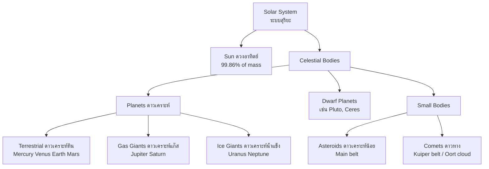
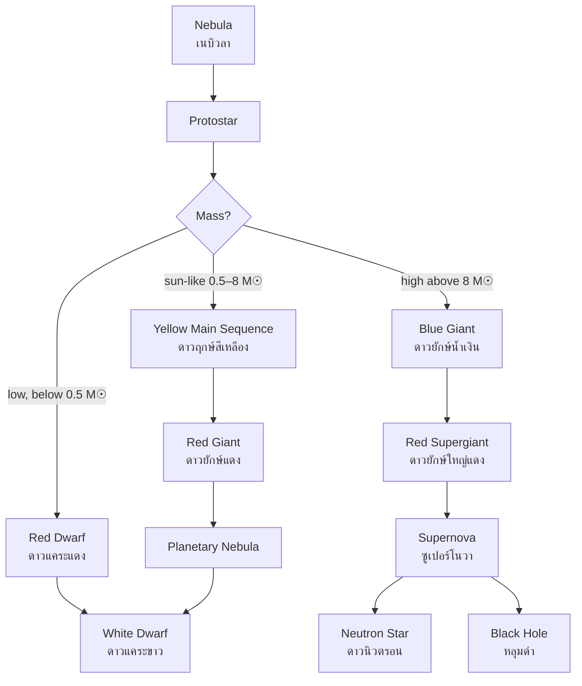

---
tags:
  - earth-science
  - advance
  - astronomy
  - solar-system
  - cosmology
  - ipst
source: "IPST (สสวท.) Earth Science Curriculum B.E. 2551 (2008, revised 2560/2017)"
created: 2026-07-30
course_codes: ["ว341"]
---

# Solar System and Astronomy — ระบบสุริยะและดาราศาสตร์

> *"The cosmos is within us. We are made of star-stuff."* — Carl Sagan

Astronomy (ดาราศาสตร์) is the scientific study of celestial objects, space, and the universe. The **solar system** (ระบบสุริยะ) formed approximately $4.6$ billion years ago from a collapsing cloud of gas and dust called a **solar nebula** (เนบิวลาสุริยะ). This nebular hypothesis explains the common patterns observed: all planets orbit in the same direction, nearly in the same plane (the ecliptic), and rocky planets formed closer to the Sun while gas giants formed farther out.

Our Sun (ดวงอาทิตย์) is a medium-sized star in the **main sequence** (แถบลำดับหลัก) stage. Stars like the Sun spend most of their lives converting hydrogen to helium via nuclear fusion (ปฏิกิริยานิวเคลียร์ฟิวชัน). Understanding stellar evolution — from protostar to main sequence to red giant and beyond — reveals how elements are forged in stellar cores and distributed through supernova explosions (การระเบิดของซูเปอร์โนวา).

---

## 1 | Course Coverage

### ม.4-ม.5 (ว341, elective)

| Semester | Scope | Key Skills |
|---|---|---|
| **Semester 1** | Solar system formation, planets, moons, asteroids, comets, meteoroids | Classifying planets, calculating orbital periods (Kepler's laws), identifying solar system bodies |
| **Semester 2** | Stellar evolution, H-R diagram, galaxies, Big Bang theory, cosmology | Reading H-R diagrams, understanding stellar life cycles, applying cosmological concepts |

---

## 2 | Key Terminology

| Thai | English | Symbol/Notes |
|---|---|---|
| ดาราศาสตร์ | Astronomy | Study of celestial objects |
| ระบบสุริยะ | Solar system | Sun + 8 planets + small bodies |
| เนบิวลาสุริยะ | Solar nebula | Rotating gas/dust cloud |
| ดาวเคราะห์หิน | Terrestrial planet | Mercury, Venus, Earth, Mars |
| ดาวเคราะห์แก๊ส | Gas giant | Jupiter, Saturn |
| ดาวเคราะห์น้ำแข็ง | Ice giant | Uranus, Neptune |
| ดวงจันทร์ | Moon / Satellite | Natural satellite |
| ดาวเคราะห์น้อย | Asteroid | Rocky body, mostly in belt |
| ดาวหาง | Comet | Icy body with tail |
| อุกกาบาต | Meteoroid/Meteor/Meteorite | In space / in atmosphere / on ground |
| ดวงอาทิตย์ | The Sun | G-type main-sequence star |
| แถบลำดับหลัก | Main sequence | Stable hydrogen fusion stage |
| ดาวยักษ์แดง | Red giant | Late-stage swollen star |
| ซูเปอร์โนวา | Supernova | Stellar explosion |
| ดาวนิวตรอน | Neutron star | Dense remnant |
| หลุมดำ | Black hole | Singularity, gravity traps light |
| ดาราจักร | Galaxy | Billions of stars |
| ทางช้างเผือก | Milky Way | Our galaxy |
| บิกแบง | Big Bang | Universe origin theory |

---

## 3 | Key Concepts

### 3.1 Solar System Formation (การกำเนิดระบบสุริยะ)

The **nebular hypothesis** (สมมติฐานเนบิวลา):

1. A large cloud of gas and dust (เนบิวลา) begins to collapse under gravity
2. Conservation of angular momentum causes it to spin faster and flatten into a **disk** (จาน)
3. Most material gathers at the center → forms the **Sun** (protostar ignites fusion)
4. Remaining material **accretes** (สะสม) into planets:
   - Inner disk is hot → only rocky/metallic material survives → **terrestrial planets**
   - Outer disk is cold → ices and gases condense → **gas/ice giants**

**Evidence:**
- All planets orbit in same direction (counterclockwise from above)
- Orbits lie in nearly the same plane (the **ecliptic** — สุริยคติ)
- The Sun has $99.86\%$ of the solar system's mass

### 3.2 The Eight Planets (ดาวเคราะห์ทั้งแปด)

| Planet | Type | Diameter (Earth = 1) | Mass (Earth = 1) | Distance (AU) | Notable Feature |
|---|---|---|---|---|---|
| **Mercury** (พุธ) | Terrestrial | $0.38$ | $0.06$ | $0.39$ | No atmosphere, extreme temps |
| **Venus** (ศุกร์) | Terrestrial | $0.95$ | $0.82$ | $0.72$ | Runaway greenhouse, hottest |
| **Earth** (โลก) | Terrestrial | $1.00$ | $1.00$ | $1.00$ | Life, liquid water |
| **Mars** (อังคาร) | Terrestrial | $0.53$ | $0.11$ | $1.52$ | Iron oxide (red), polar ice |
| **Jupiter** (พฤหัสบดี) | Gas giant | $11.2$ | $318$ | $5.20$ | Great Red Spot, 95 moons |
| **Saturn** (เสาร์) | Gas giant | $9.45$ | $95$ | $9.58$ | Spectacular ring system |
| **Uranus** (ยูเรนัส) | Ice giant | $4.00$ | $14.5$ | $19.2$ | Rotates on its side |
| **Neptune** (เนปจูน) | Ice giant | $3.88$ | $17.1$ | $30.1$ | Strongest winds, deep blue |

**Key comparisons:**
- Terrestrial planets (ดาวเคราะห์หิน): small, dense, rocky, few moons
- Gas/ice giants (ดาวเคราะห์ยักษ์): large, low density, many moons, ring systems

### 3.3 Small Solar System Bodies (วัตถุขนาดเล็ก)

| Body | Location | Composition | Key Feature |
|---|---|---|---|
| **Asteroids** (ดาวเคราะห์น้อย) | Main belt (Mars–Jupiter) | Rock/metal | Largest: Ceres |
| **Comets** (ดาวหาง) | Kuiper belt / Oort cloud | Ice + dust | Tails form near Sun |
| **Meteoroids** (อุกกาบาต) | Throughout space | Rock/metal fragments | Become meteors entering atmosphere |

**Comet structure:**
- **Nucleus** (นิวเคลียส): solid icy core ($1$–$50$ km)
- **Coma** (โคม่า): glowing envelope of gas/dust
- **Tails** (หาง): always point **away** from the Sun
  - **Ion tail** (หางประจุ): blue, pushed by solar wind
  - **Dust tail** (หางฝุ่น): white/yellow, pushed by radiation pressure

### 3.4 The Sun and Stellar Evolution (ดวงอาทิตย์และวิวัฒนาการของดาวฤกษ์)

**The Sun:**
- Composition: $\sim 74\%$ Hydrogen ($\ce{H}$), $\sim 24\%$ Helium ($\ce{He}$), $2\%$ heavier elements
- Core temperature: $\sim 15$ million K
- Energy source: **proton-proton chain** (ปฏิกิริยาลูกโซ่โปรตอน-โปรตอน):

$$4 \ce{H} \rightarrow \ce{He} + \text{energy}$$

**Stellar evolution depends on mass:**

| Stage | Low-mass star ($< 0.5\ M_\odot$) | Sun-like ($0.5$–$8\ M_\odot$) | High-mass ($> 8\ M_\odot$) |
|---|---|---|---|
| Birth | Protostar | Protostar | Protostar |
| Main sequence | Red dwarf | Yellow star | Blue giant |
| Late stage | (Stays on MS) | **Red giant** (ดาวยักษ์แดง) | Red supergiant |
| Death | White dwarf | Planetary nebula → **White dwarf** | **Supernova** → Neutron star or Black hole |

### 3.5 The H-R Diagram (แผนภาพดาวฤกษ์)

The **Hertzsprung-Russell diagram** (แผนภาพเอช-อาร์) plots stars by:
- **x-axis**: Temperature (or spectral class: O B A F G K M) — hot on left
- **y-axis**: Luminosity (ความสว่าง) — bright on top

**Key regions:**
- **Main sequence** (แถบลำดับหลัก): diagonal band, $\sim 90\%$ of stars
- **Giants** (ดาวยักษ์): upper right, cool but bright
- **Supergiants** (ดาวยักษ์ใหญ่): top, very bright
- **White dwarfs** (ดาวแคระขาว): lower left, hot but dim

### 3.6 Galaxies and Cosmology (ดาราจักรและจักรวาลวิทยา)

**Galaxy types (ชนิดของดาราจักร):**
- **Spiral** (ดาราจักรชนิดก้นหอย): Milky Way, Andromeda
- **Elliptical** (รูปไข่): old stars, little gas
- **Irregular** (ไม่แน่นอน): Magellanic Clouds

**The Milky Way** (ทางช้างเผือก):
- Type: barred spiral
- Diameter: $\sim 100{,}000$ light-years
- Contains $100$–$400$ billion stars
- Sun is located in the **Orion Arm** ($\sim 26{,}000$ ly from center)

### 3.7 Big Bang Theory (ทฤษฎีบิกแบง)

The universe began $\sim 13.8$ billion years ago from an extremely hot, dense state.

**Evidence:**
1. **Cosmic Microwave Background** (CMB — รังสีไมโครเวฟพื้นหลัง): $2.7$ K radiation from early universe
2. **Hubble expansion**: galaxies moving apart (redshift)
3. **Abundance of light elements**: $\sim 75\%$ $\ce{H}$, $\sim 25\%$ $\ce{He}$

$$v = H_0 \times d \quad \text{(Hubble's Law)}$$

where $v$ = recession velocity, $H_0$ = Hubble constant ($\sim 70$ km/s/Mpc), $d$ = distance.

---

## 4 | Common Problem Types

### Type 1: Kepler's Third Law

> A planet orbits at $4$ AU from the Sun. Calculate its orbital period.

**Solution:** Kepler's Third Law: $T^2 = a^3$ (in years and AU)

$$T^2 = 4^3 = 64$$
$$T = \sqrt{64} = 8 \text{ years}$$

### Type 2: Classifying a Star on the H-R Diagram

> A star has surface temperature $3{,}000$ K and luminosity $10{,}000\ L_\odot$. Where does it lie on the H-R diagram?

**Solution:** Cool temperature ($3{,}000$ K) but very bright → upper right region → it is a **red giant** or **red supergiant** (ดาวยักษ์แดง).

### Type 3: Calculating Light Travel Time

> A star is $10$ light-years away. How long does its light take to reach Earth?

**Solution:** By definition, $1$ light-year = distance light travels in $1$ year. So light from a star $10$ ly away takes exactly **$10$ years** to reach us. We see the star as it was $10$ years ago.

### Type 4: Identifying Solar System Bodies

> A body has a glowing coma and two tails pointing away from the Sun. What is it?

**Solution:** This is a **comet** (ดาวหาง). The nucleus is composed of ice and dust; as it approaches the Sun, solar heating vaporizes ices, creating the coma. The tails always point away from the Sun due to solar wind (ion tail) and radiation pressure (dust tail).

---

## 5 | Cross-Links

- [[02_Plate_Tectonics]] — Earth's formation as a terrestrial planet
- [[06_Weather_and_Climate]] — solar radiation drives atmospheric processes
- [[10_Climate_Change_and_Environment]] — Milankovitch cycles and solar forcing
- [[21_Solar_System_and_Astronomy]] — foundation from ม.1-3
- [[03_Dynamics|Physics: Gravitation]] — Kepler's laws and orbital mechanics
