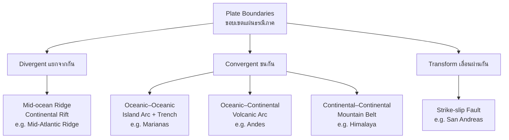

---
tags:
  - earth-science
  - advance
  - plate-tectonics
  - ipst
source: "IPST (สสวท.) Earth Science Curriculum B.E. 2551 (2008, revised 2560/2017)"
created: 2026-07-30
course_codes: ["ว341"]
---

# Plate Tectonics — การเคลื่อนที่ของแผ่นธรณีภาค

> *"The geologic history of the Earth is a history of plate tectonics."* — John Tuzo Wilson

Plate tectonics (ทฤษฎีแผ่นธรณีภาค) is the unifying theory of geology. Earth's rigid outer shell, the **lithosphere** (ธรณีภาค), is fractured into about fifteen major and minor plates that float on the ductile **asthenosphere** (อะธีโนสเฟียร์) and move a few centimeters per year. Their interactions produce earthquakes, volcanoes, mountain ranges (เทือกเขา), and ocean trenches — the architecture of the dynamic planet.

This note traces the theory from Wegener's continental drift (การเคลื่อนที่ของทวีป), through the evidence for seafloor spreading (การแผ่ขยายของพื้นมหาสมุทร), to the modern classification of plate boundaries (ขอบเขตแผ่นธรณีภาค): divergent (แยกจากกัน), convergent (ชนกัน), and transform (เลื่อนผ่านกัน). We also examine the driving forces of mantle convection (การพาความร้อนในเนื้อโลก), ridge push, and slab pull.

---

## 1 | Course Coverage

### ม.4-ม.5 (ว341, elective)

| Semester | Scope | Key Skills |
|---|---|---|
| **Semester 1** | Continental drift & evidence; seafloor spreading; types of plate boundaries; mantle convection; Pangaea | Draw plate boundary cross-sections; interpret paleomagnetic and fossil evidence |
| **Semester 2** | Plate tectonics of Southeast Asia; tectonic origin of Thai landscapes and earthquakes; Himalayan orogeny | Relate Thai geography to plate motion; evaluate seismic hazard from plate setting |

---

## 2 | Key Terminology

| Thai | English | Symbol/Notes |
|---|---|---|
| แผ่นธรณีภาค | Lithospheric plate | Rigid outer shell, 100 km thick |
| ธรณีภาค | Lithosphere | Crust + uppermost mantle |
| อะธีโนสเฟียร์ | Asthenosphere | Ductile layer plates slide on |
| ขอบเขตแผ่นธรณีภาค | Plate boundary | Edge between two plates |
| ขอบเขตแยกจากกัน | Divergent boundary | Plates move apart |
| ขอบเขตชนกัน | Convergent boundary | Plates collide |
| ขอบเขตเลื่อนผ่านกัน | Transform boundary | Plates slide horizontally |
| การแผ่ขยายของพื้นมหาสมุทร | Seafloor spreading | New crust at ocean ridges |
| ร่องลึกก้นสมุทร | Ocean trench | Subduction at convergent boundaries |
| การมุดตัว | Subduction | Dense plate sinks into mantle |
| การเคลื่อนที่ของทวีป | Continental drift | Wegener's theory |
| แพนเจีย | Pangaea | Supercontinent, ~250 Ma |
| การพาความร้อนในเนื้อโลก | Mantle convection | Heat-driven mantle flow |
| พาเลโอแมกเนติก | Paleomagnetism | Fossil magnetic record in rocks |
| หินหนืด | Magma | Molten rock below surface |
| แนวเทือกเขากลางสมุทร | Mid-ocean ridge | Divergent boundary under ocean |
| รอยเลื่อน | Fault | Fracture with movement |
| แรงดันสันหลังสันเขา | Ridge push | Gravity sliding off ridge |
| แรงดึงของแผ่นมุดตัว | Slab pull | Dense subducting plate pulls |

---

## 3 | Key Concepts

### 3.1 Continental Drift (การเคลื่อนที่ของทวีป)

In 1912 Alfred Wegener proposed that continents drift across Earth's surface. He cited multiple lines of evidence:

- **Coastline fit** — South America and Africa fit like puzzle pieces.
- **Fossil match (ซากดึกดำบรรพ์)** — Mesosaurus, Lystrosaurus found on now-separated continents.
- **Rock and mountain correlation (การต่อเนื่องของหินและเทือกเขา)** — Appalachian–Caledonian belts match across the Atlantic.
- **Paleoclimatic evidence (หลักฐานบรรยากาศโบราณ)** — glacial deposits in now-tropical regions (India, Africa), coal in Antarctica.

Wegener named the supercontinent **Pangaea (แพนเจีย)** (~250 Ma), surrounded by the universal ocean Panthalassa. His theory was rejected because he lacked a plausible mechanism.

### 3.2 Seafloor Spreading (การแผ่ขยายของพื้นมหาสมุทร)

In the 1960s, Harry Hess and Robert Dietz proposed that new oceanic crust forms at mid-ocean ridges (แนวเทือกเขากลางสมุทร) and moves outward, while older crust descends into trenches at the edges. Evidence:

- **Paleomagnetic stripes (แถบพาเลโอแมกเนติก)** — symmetric, alternating normal/reverse magnetic polarity stripes parallel to ridges, recording magnetic reversals.
- **Age of seafloor** — rocks are youngest at the ridge axis and older with distance; none older than ~180 Ma.
- **Sediment thickness** — thin at the ridge, thickening toward the margins.
- **Heat flow** — highest at the ridge axis, decreasing outward.

### 3.3 Types of Plate Boundaries

| Boundary | Motion | Feature | Example |
|---|---|---|---|
| **Divergent (แยกจากกัน)** | Plates separate | Mid-ocean ridge, continental rift valley | Mid-Atlantic Ridge, East African Rift |
| **Convergent (ชนกัน)** | Plates collide | Depends on crust types (see below) | Himalaya, Andes, Japan trench |
| **Transform (เลื่อนผ่านกัน)** | Plates slide horizontally | Strike-slip faults, offset ridges | San Andreas Fault, Dead Sea Transform |

**Convergent boundaries (ขอบเขตชนกัน)** subdivide by crust type:

- **Oceanic–oceanic (มหาสมุทร–มหาสมุทร)** — older, denser plate subducts, forming an island arc (หมู่เกาะรูปโค้ง) and trench: Marianas, Aleutians.
- **Oceanic–continental (มหาสมุทร–ทวีป)** — oceanic plate subducts; continental margin grows a volcanic arc (ที่ลาดชันฝั่งทวีป): Andes, Cascades.
- **Continental–continental (ทวีป–ทวีป)** — neither subducts; crust buckles into huge mountains: Himalaya (collision India–Eurasia), Alps.

**Transform boundaries (ขอบเขตเลื่อนผ่านกัน)** — plates grind past each other; no magma, no trenches, but powerful earthquakes.

### 3.4 Driving Forces of Plate Motion

Three mechanisms move plates, with relative contributions still debated:

1. **Mantle convection (การพาความร้อนในเนื้อโลก)** — hot mantle rises at ridges, cools, and sinks at trenches, dragging plates along.
2. **Ridge push (แรงดันสันหลังสันเขา)** — gravity slides the elevated plate down the ridge flank.
3. **Slab pull (แรงดึงของแผ่นมุดตัว)** — the cold, dense subducting slab sinks and pulls the rest of the plate; widely considered the strongest force.

Typical plate speeds range from ~1 cm/yr (the slow North American plate) to ~10 cm/yr (the fast Pacific plate).

### 3.5 The Wilson Cycle

The **Wilson cycle (วงจรวิลสัน)** describes the lifecycle of an ocean basin: embryonic rift → young narrow ocean → mature ocean (Atlantic stage) → declining ocean with subduction → terminal (Mediterranean) → continental collision (Himalaya). It unifies continental drift and seafloor spreading over ~400–500 Ma cycles.

---

## 4 | Common Problem Types

### Type 1: Classify a boundary from geographic features
> A region has a deep trench, a line of explosive volcanoes, and frequent large earthquakes. What type of boundary is this?

**Solution:** Trench + volcanic arc + large earthquakes = **convergent boundary (ขอบเขตชนกัน)**, specifically oceanic–continental subduction (Andes-type).

### Type 2: Predict the feature formed at each boundary type
> Draw a cross-section of a continent–continent collision. Label the resulting feature.

**Solution:** Neither plate subducts; crust thickens and buckles into a towering mountain belt — e.g., the **Himalaya (เทือกเขาหิมาลัย)** formed by India colliding with Eurasia.

### Type 3: Use magnetic stripes to find spreading rate
> A magnetic stripe 100 km from the ridge axis is 5 million years old. Calculate the half-spreading rate.

**Solution:** Distance = rate × time.
$$v = \frac{d}{t} = \frac{100\,\text{km}}{5 \times 10^{6}\,\text{yr}} = 2 \times 10^{-5}\,\text{km/yr} = 2\,\text{cm/yr}$$

### Type 4: Identify the dominant plate-driving force
> Which force is thought to contribute most to plate motion?

**Solution:** **Slab pull (แรงดึงของแผ่นมุดตัว)** — the dense, cold subducting slab sinks into the mantle and pulls the trailing plate; plates with long slabs (Pacific) move fastest.

---

## 5 | Cross-Links

- [[01_Minerals_and_Rocks]] — subduction melts rock into magma; igneous activity at ridges
- [[03_Earthquakes_and_Volcanoes]] — direct consequences of plate boundary motion
- [[05_Earth_History]] — Pangaea breakup and Wilson cycle structure the geological timescale
- [[../../Advance/physic/02_Kinematics|Physics: Kinematics]] — motion, velocity, and relative motion applied to plate speeds
