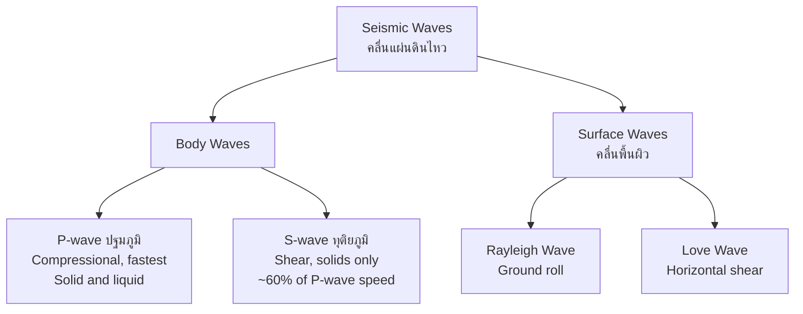
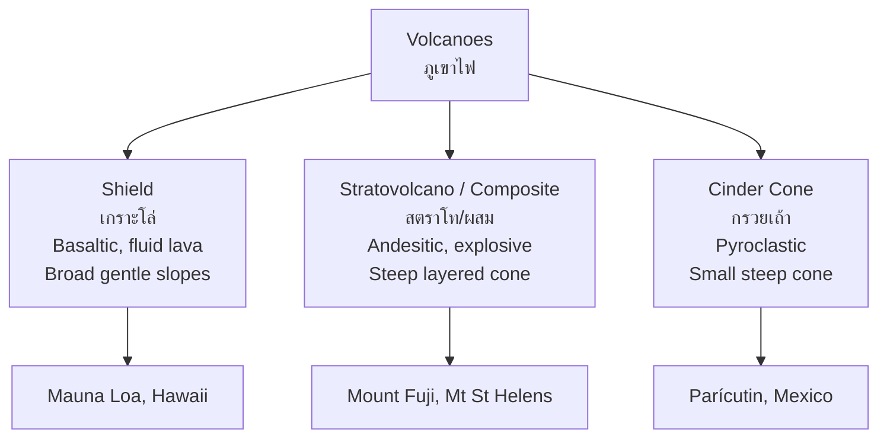

---
tags:
  - earth-science
  - advance
  - earthquakes-volcanoes
  - ipst
source: "IPST (สสวท.) Earth Science Curriculum B.E. 2551 (2008, revised 2560/2017)"
created: 2026-07-30
course_codes: ["ว341"]
---

# Earthquakes and Volcanoes — แผ่นดินไหวและภูเขาไฟ

> *"Earthquakes don't kill people, buildings do."* — seismological proverb

Earthquakes (แผ่นดินไหว) and volcanoes (ภูเขาไฟ) are the most dramatic expressions of Earth's internal energy. Both cluster along plate boundaries, where stress accumulates until rock fractures and magma finds a path to the surface. The study of seismic waves (คลื่นแผ่นดินไหว) not only lets us locate and measure earthquakes but also revealed Earth's layered interior. Volcanism, in turn, builds new crust, fertilizes soils, and occasionally reshapes civilizations.

This note covers the generation of seismic waves (P, S, and surface waves), the Richter (ริกเตอร์) and Mercalli (เมอร์คัลลี) scales, epicenter (ศูนย์กลางบนพื้นผิว) and focus (ศูนย์กลางใต้พื้นผิว) location by triangulation (การหาตำแหน่งโดยสามเหลี่ยม), the types of volcanoes (shield, stratovolcano, cinder cone), magma composition, the **Pacific Ring of Fire (วงแหวนแห่งไฟ)**, and the generation of tsunamis (สึนามิ).

---

## 1 | Course Coverage

### ม.4-ม.5 (ว341, elective)

| Semester | Scope | Key Skills |
|---|---|---|
| **Semester 1** | Causes of earthquakes; seismic wave types; Richter & Mercalli scales; epicenter triangulation; volcano types & magma; Ring of Fire; tsunamis | Interpret seismograms; locate epicenter from three stations; classify volcanic hazards |
| **Semester 2** | Seismic and volcanic hazards in Thailand & SE Asia; disaster preparedness; historical events (2004 Indian Ocean tsunami) | Read a hazard map; design school evacuation plan; evaluate building codes |

---

## 2 | Key Terminology

| Thai | English | Symbol/Notes |
|---|---|---|
| แผ่นดินไหว | Earthquake | Sudden release of elastic energy |
| ศูนย์กลางใต้พื้นผิว | Focus / hypocenter | Point of rupture origin |
| ศูนย์กลางบนพื้นผิว | Epicenter | Point on surface directly above focus |
| คลื่นแผ่นดินไหว | Seismic wave | Energy traveling through Earth |
| คลื่นปฐมภูมิ | P-wave (primary) | Compressional, fastest, travels in solid & liquid |
| คลื่นทุติยภูมิ | S-wave (secondary) | Shear, solids only, ~60% P-wave speed |
| คลื่นพื้นผิว | Surface wave | Slowest, most destructive (Love, Rayleigh) |
| เครื่องวัดแผ่นดินไหว | Seismograph / seismometer | Records ground motion |
| แผนที่แผ่นดินไหว | Seismogram | Record from a seismograph |
| มาตราริกเตอร์ | Richter scale | Logarithmic magnitude, based on amplitude |
| มาตราเมอร์คัลลี | Mercalli scale | I–XII intensity, based on observed damage |
| การหาตำแหน่งโดยสามเหลี่ยม | Triangulation | Locate epicenter from ≥3 stations |
| ภูเขาไฟ | Volcano | Vent erupting magma at surface |
| ลาวา | Lava | Magma once it reaches surface |
| หินหนืด | Magma | Molten rock below surface |
| ภูเขาไฟเกราะโล่ | Shield volcano | Broad, gentle slopes, fluid basaltic lava |
| ภูเขาไฟสตราโท | Stratovolcano / composite | Steep, layered, explosive andesitic |
| ภูเขาไฟกรวยเถ้า | Cinder cone | Small, steep, pyroclastic |
| วงแหวนแห่งไฟ | Pacific Ring of Fire | ~75% of world's volcanoes |
| สึนามิ | Tsunami | Long-wavelength seismic sea wave |
| แมกมา | Magma chamber | Subsurface reservoir of molten rock |

---

## 3 | Key Concepts

### 3.1 Earthquake Generation and Seismic Waves

Earthquakes occur when stress accumulated in rock exceeds the friction holding a fault (รอยเลื่อน) locked, causing sudden slip that radiates elastic energy as **seismic waves (คลื่นแผ่นดินไหว)**. The point of rupture is the **focus / hypocenter (ศูนย์กลางใต้พื้นผิว)**; the surface point directly above is the **epicenter (ศูนย์กลางบนพื้นผิว)**.

Three wave types are distinguished by how they move material:

| Wave | Motion | Speed | Medium |
|---|---|---|---|
| **P-wave (คลื่นปฐมภูมิ)** | Compressional (push-pull), longitudinal | ~6 km/s in crust | Solid and liquid |
| **S-wave (คลื่นทุติยภูมิ)** | Shear (side-to-side), transverse | ~3.5 km/s in crust | Solid only |
| **Surface wave (คลื่นพื้นผิว)** | Ground roll (Rayleigh) or horizontal shear (Love) | ~3 km/s | Surface of solid Earth |

Because S-waves do not pass through liquids, their disappearance beyond ~103° from an earthquake revealed Earth's **liquid outer core (แก่นชั้นนอกที่เป็นของเหลว)**.

### 3.2 Measuring Earthquakes

**Magnitude (ขนาด)** — energy released, measured on the **Richter scale (มาตราริกเตอร์)** or the more modern moment magnitude ($M_w$). It is logarithmic: each whole-number step represents ~31.6× energy and ~10× amplitude:
$$M = \log_{10} A + f(\Delta)$$
where $A$ is the maximum amplitude and $f(\Delta)$ corrects for distance.

**Intensity (ความรุนแรง)** — local effect, measured on the **Modified Mercalli scale (มาตราเมอร์คัลลี)**, ranked **I–XII** based on observed damage and human perception. The same earthquake has one magnitude but many intensities.

### 3.3 Locating the Epicenter by Triangulation

Because P-waves travel faster than S-waves, the time gap between their arrivals (S–P time) grows with distance from the earthquake. The procedure:

1. At each of ≥3 seismograph stations, read the S–P interval from the seismogram.
2. Use a travel-time curve to convert S–P time into **epicentral distance**.
3. Draw a circle of that radius around each station.
4. The **intersection of the three circles** is the epicenter — the method of **triangulation (การหาตำแหน่งโดยสามเหลี่ยม)**.

### 3.4 Volcano Types and Magma Composition

Volcano form is controlled by **magma viscosity (ความหนืดของแมกมา)**, which depends on silica content, temperature, and gas content:

| Magma type | $\ce{SiO2}$ | Viscosity | Gas | Eruption style | Volcano type |
|---|---|---|---|---|---|
| Basaltic (mafic) | ~50% | Low | Low | Effusive, fluid lava flows | **Shield volcano (เกราะโล่)** |
| Andesitic (intermediate) | ~60% | Medium | High | Alternating explosive & effusive | **Stratovolcano (สตราโท)** |
| Rhyolitic (felsic) | ~70% | High | Very high | Explosive, pyroclastic | Dome / caldera-forming |

- **Shield volcano (ภูเขาไฟเกราะโล่)** — broad, gently sloping (Mauna Loa, Hawaii).
- **Stratovolcano / composite (สตราโท/ผสม)** — steep, symmetrical, built of alternating lava and ash layers (Mount Fuji, Mount St. Helens); most dangerous.
- **Cinder cone (กรวยเถ้า)** — small, steep, built of pyroclasts (Parícutin).

**Magma source controls type**:
- Mid-ocean ridges and hotspots → basaltic, effusive.
- Subduction zones → andesitic/rhyolitic, explosive.

### 3.5 The Pacific Ring of Fire (วงแหวนแห่งไฟ)

The Ring of Fire is a horseshoe-shaped belt around the Pacific Ocean where ~75% of Earth's active volcanoes and ~90% of earthquakes occur. It corresponds to the boundaries of the Pacific Plate subducting under surrounding plates — the Andes, Cascades, Japan, the Philippines, Indonesia, and New Zealand. The Mayon, Merapi, and Taal volcanoes of SE Asia all sit on this belt.

### 3.6 Tsunami Generation (สึนามิ)

A **tsunami (สึนามิ)** is a series of long-wavelength ocean waves triggered by sudden vertical displacement of seawater — most often by a large megathrust earthquake at a subduction zone, but also by volcanic collapse or submarine landslide.

In deep water, tsunamis travel at the shallow-water wave speed:
$$v = \sqrt{g \cdot d}$$
where $d$ is ocean depth. At $d \approx 4000$ m, $v \approx 200$ m/s ($\sim$720 km/h), yet wave height is under a meter. As depth shallows near coast, speed drops and energy compresses vertically — amplitude can reach 10–30 m. The **2004 Indian Ocean tsunami (สึนามิในมหาสมุทรอินเดีย)**, generated by a $M_w 9.1$ earthquake off Sumatra, killed ~230,000 across 14 countries and reshaped Thai coastal disaster preparedness.

---

## 4 | Common Problem Types

### Type 1: Identify wave types from a seismogram
> A seismogram shows a first arrival at 10:00:00 and a second, larger arrival at 10:01:20. Name the waves.

**Solution:** The first is the faster **P-wave (คลื่นปฐมภูมิ)**; the second is the slower **S-wave (คลื่นทุติยภูมิ)**. The 80-second S–P gap is used to find epicentral distance.

### Type 2: Richter scale magnitude jump
> An $M 7.0$ earthquake releases how much more energy than an $M 5.0$?

**Solution:** Each unit ≈ 31.6× energy. Two units apart:
$$E_{\text{ratio}} = 31.6^{2} \approx 1000\times$$

### Type 3: Calculate epicentral distance from S–P time
> S–P interval is 60 s. Use a travel-time curve that gives ~8 km/s P-wave speed and ~4.5 km/s S-wave speed to estimate the epicentral distance.

**Solution:** Let distance = $d$. Then $\frac{d}{v_S} - \frac{d}{v_P} = 60$.
$$d \left(\frac{1}{4.5} - \frac{1}{8}\right) = 60 \;\Rightarrow\; d \approx 620\,\text{km}$$

### Type 4: Predict volcanic hazard from magma composition
> A volcano erupts viscous, gas-rich magma. What type and hazard result?

**Solution:** High-silica, high-gas magma → explosive eruption → **stratovolcano (ภูเขาไฟสตราโท)**, with hazards including pyroclastic flows (ไหล้ลาวาและเถ้า), ash fall, and possible caldera collapse.

### Type 5: Tsunami travel time
> A tsunami is generated 1500 km from a coast. Estimate arrival time in deep ocean.

**Solution:** $v = \sqrt{9.8 \times 4000} \approx 198$ m/s.
$$t = \frac{1500 \times 10^{3}}{198} \approx 7576\,\text{s} \approx 2.1\,\text{hours}$$

---

## 5 | Cross-Links

- [[02_Plate_Tectonics]] — plate boundaries are the source of nearly all earthquakes and volcanoes
- [[01_Minerals_and_Rocks]] — volcanic rocks are the igneous products of eruptions
- [[05_Earth_History]] — volcanic ash layers provide dating markers in the rock record
- [[../../Advance/physic/02_Kinematics|Physics: Kinematics]] — wave speed, $v = \sqrt{gd}$, and energy relations
- [[../../Advance/physic/08_Waves|Physics: Waves]] — longitudinal vs transverse waves, wave interference
