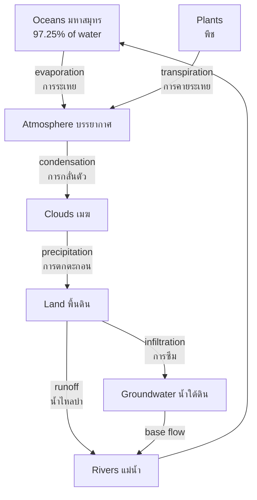

---
tags:
  - earth-science
  - advance
  - hydrology
  - water-cycle
  - ipst
source: "IPST (สสวท.) Earth Science Curriculum B.E. 2551 (2008, revised 2560/2017)"
created: 2026-07-30
course_codes: ["ว341"]
---

# Water Cycle and Hydrology — วัฏจักรน้ำและอุทกวิทยา

> *"Water is the driving force of all nature."* — Leonardo da Vinci

Hydrology (อุทกวิทยา) is the science of water on Earth — its movement, distribution, and quality. The **hydrological cycle** (วัฏจักรของน้ำ) describes the continuous movement of water between reservoirs: oceans, atmosphere, land, and living organisms. This cycle is powered by solar energy (พลังงานจากดวงอาทิตย์) and gravity (แรงโน้มถ่วง), making water one of the most dynamic substances on our planet.

Groundwater (น้ำใต้ดิน) is a critical freshwater resource stored in aquifers (ชั้นน้ำใต้ดิน). Only about $0.6\%$ of Earth's freshwater is accessible as groundwater, yet it supplies drinking water for over $2$ billion people. Understanding porosity (ความพรุน), permeability (ความซึมผ่านได้), and water table (ระดับน้ำใต้ดิน) is essential for sustainable water resource management (การจัดการทรัพยากรน้ำ) and pollution prevention.

---

## 1 | Course Coverage

### ม.4-ม.5 (ว341, elective)

| Semester | Scope | Key Skills |
|---|---|---|
| **Semester 1** | Hydrological cycle processes, evaporation and precipitation, groundwater basics | Calculating water budgets, measuring infiltration rates, interpreting hydrographs |
| **Semester 2** | Aquifers, water table, watersheds, water resources management, water pollution | Analyzing porosity/permeability data, assessing water quality, understanding pollution pathways |

---

## 2 | Key Terminology

| Thai | English | Symbol/Notes |
|---|---|---|
| อุทกวิทยา | Hydrology | Study of water on land |
| วัฏจักรของน้ำ | Hydrological cycle | Continuous water movement |
| การระเหย | Evaporation | Liquid → vapor (surface) |
| การคายระเหย | Transpiration | Plant water release |
| การกลั่นตัว | Condensation | Vapor → liquid |
| การตกตะกอน | Precipitation | Rain, snow, hail |
| การซึม | Infiltration | Water entering soil |
| น้ำไหลบ่า | Runoff | Surface water flow |
| น้ำใต้ดิน | Groundwater | Subsurface water |
| ชั้นน้ำใต้ดิน | Aquifer | Water-bearing rock layer |
| ระดับน้ำใต้ดิน | Water table | Top of saturated zone |
| ความพรุน | Porosity | % void space |
| ความซึมผ่านได้ | Permeability | Ability to transmit fluid |
| ลุ่มน้ำ | Watershed | Drainage basin |
| ชั้นกันซึม | Aquitard | Low permeability layer |
| ชั้นกันน้ำ | Aquiclude | Impermeable layer |

---

## 3 | Key Concepts

### 3.1 The Hydrological Cycle (วัฏจักรของน้ำ)

The water cycle consists of several key processes:

| Process | Description | Driven By |
|---|---|---|
| **Evaporation** (การระเหย) | Surface water → water vapor | Solar energy |
| **Transpiration** (การคายระเหย) | Plant release of water vapor | Solar energy |
| **Evapotranspiration** | Evaporation + transpiration combined | Solar energy |
| **Condensation** (การกลั่นตัว) | Vapor → liquid (cloud formation) | Cooling |
| **Precipitation** (การตกตะกอน) | Rain, snow, sleet, hail | Gravity |
| **Infiltration** (การซึม) | Water enters soil | Gravity, capillary action |
| **Runoff** (น้ำไหลบ่า) | Surface flow to streams | Gravity |
| **Percolation** | Deep downward movement | Gravity |

**Water budget equation:**

$$P = ET + R + \Delta S$$

where $P$ = precipitation, $ET$ = evapotranspiration, $R$ = runoff, $\Delta S$ = change in storage.

### 3.2 Earth's Water Distribution (การกระจายน้ำบนโลก)

| Reservoir | Volume ($10^6$ km³) | % of Total |
|---|---|---|
| **Oceans** (มหาสมุทร) | $1{,}370$ | $97.25\%$ |
| **Ice caps/glaciers** (น้ำแข็ง) | $29$ | $2.05\%$ |
| **Groundwater** (น้ำใต้ดิน) | $9.5$ | $0.68\%$ |
| **Lakes** (ทะเลสาบ) | $0.125$ | $0.01\%$ |
| **Atmosphere** (บรรยากาศ) | $0.013$ | $0.001\%$ |
| **Rivers** (แม่น้ำ) | $0.0017$ | $0.0001\%$ |

**Key insight:** Only about $0.3\%$ of Earth's total water is accessible freshwater.

### 3.3 Groundwater Systems (ระบบน้ำใต้ดิน)

**Aquifer (ชั้นน้ำใต้ดิน)** — a permeable rock layer that stores and transmits water.

**Types of aquifers:**

| Type | Description | Example |
|---|---|---|
| **Unconfined** (ไม่ถูกจำกัด) | Water table open to surface | Sand, gravel deposits |
| **Confined** (ถูกจำกัด) | Trapped between impermeable layers | Artesian wells |

**Porosity (ความพรุน)** = ratio of void space to total volume:

$$n = \frac{V_v}{V_t} \times 100\%$$

| Material | Porosity (%) |
|---|---|
| Gravel | $25$–$40$ |
| Sand | $25$–$50$ |
| Clay | $40$–$70$ |
| Sandstone | $5$–$30$ |
| Limestone | $5$–$20$ |
| Granite | $<1$ |

**Permeability (ความซึมผ่านได้)** — the ability to transmit fluid. Note: clay has high porosity but **low** permeability because pores are tiny and disconnected.

**Darcy's Law** (กฎของดาร์ซี):

$$Q = K \cdot A \cdot \frac{\Delta h}{L}$$

where $Q$ = discharge, $K$ = hydraulic conductivity, $A$ = cross-sectional area, $\Delta h/L$ = hydraulic gradient.

### 3.4 Watersheds and Drainage (ลุ่มน้ำและการระบายน้ำ)

A **watershed** (ลุ่มน้ำ) is the area of land that drains to a common point. Key features:
- **Divide** (สันแบ่งน้ำ) — the boundary between watersheds
- **Drainage basin** — the entire collection area
- **Stream order** — hierarchical numbering (Strahler system)

**Thailand's major watersheds:**
- **Chao Phraya** (ลุ่มน้ำเจ้าพระยา) — largest, central Thailand
- **Mekong** (แม่น้ำโขง) — northeastern Thailand
- **Salween** (แม่น้ำสาละวิน) — western Thailand

### 3.5 Water Resources Management (การจัดการทรัพยากรน้ำ)

**Challenges in Thailand:**
- **Seasonal flooding** (น้ำท่วม) — monsoon rains, 2011 great flood
- **Drought** (ภัยแล้ง) — dry season water shortages
- **Water quality** — industrial and agricultural pollution

**Management strategies:**
- **Dams and reservoirs** — store wet-season water for dry season
- **Irrigation systems** — agricultural water delivery
- **Rainwater harvesting** — collection for household use
- **Wastewater treatment** — pollution prevention

### 3.6 Water Pollution (มลพิษทางน้ำ)

| Pollution Type | Source | Effect |
|---|---|---|
| **Point source** (แหล่งกำเนิดจุด) | Factory pipe, sewage outlet | Traceable to single source |
| **Non-point source** | Agricultural runoff, urban drainage | Diffuse, harder to control |
| **Eutrophication** (ยูโทรฟิเคชัน) | Excess nutrients ($\ce{N}$, $\ce{P}$) | Algal blooms, oxygen depletion |
| **Heavy metals** | Mining, industry | Bioaccumulation in food chain |

**Dissolved Oxygen (DO):** Healthy water has DO $> 5$ mg/L; below $2$ mg/L causes fish kills.

---

## 4 | Common Problem Types

### Type 1: Water Budget Calculation

> A watershed receives $1{,}200$ mm of precipitation annually. Evapotranspiration is $800$ mm and storage change is negligible. Calculate the runoff.

**Solution:**

$$P = ET + R + \Delta S$$
$$1{,}200 = 800 + R + 0$$
$$R = 400 \text{ mm/year}$$

### Type 2: Porosity Calculation

> A $100$ cm³ rock sample contains $35$ cm³ of void space. Calculate porosity.

**Solution:**

$$n = \frac{V_v}{V_t} \times 100\% = \frac{35}{100} \times 100\% = 35\%$$

This indicates a moderately porous rock, likely sandstone (หินทราย).

### Type 3: Darcy's Law Application

> Water flows through a sand aquifer with hydraulic conductivity $K = 10$ m/day. The hydraulic gradient is $0.001$ over an area of $500$ m². Calculate the discharge.

**Solution:**

$$Q = K \cdot A \cdot \frac{\Delta h}{L} = 10 \times 500 \times 0.001 = 5 \text{ m}^3\text{/day}$$

### Type 4: Interpreting a Hydrograph

> After a storm, stream discharge rises rapidly, peaks after 6 hours, and returns to base flow in 48 hours. What does this indicate about the watershed?

**Solution:** The rapid rise (flashy response) indicates:
- **Low infiltration capacity** — urbanized or impermeable surfaces
- **Steep slopes** — fast runoff
- **Small storage** — limited groundwater contribution

A forested watershed would show a more gradual rise and longer recession.

---

## 5 | Cross-Links

- [[06_Weather_and_Climate]] — precipitation is the input to the hydrological cycle
- [[07_Oceanography]] — oceans are the largest water reservoir
- [[10_Climate_Change_and_Environment]] — climate change alters precipitation patterns
- [[02_Rocks_and_Minerals]] — rock types determine aquifer properties
- [[../../Advance/Biology/16_Ecology|Biology: Ecology]] — water availability shapes ecosystems
