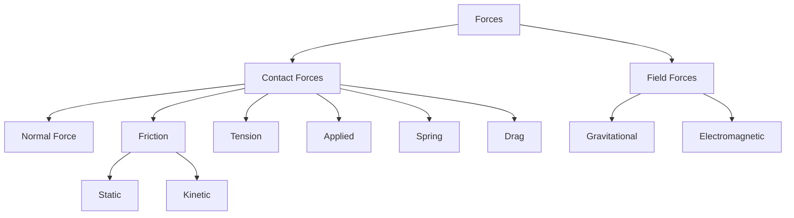

---
tags:
  - physics
  - advance
  - dynamics
  - ipst
source: "IPST (สสวท.) Physics Curriculum B.E. 2551 (2008, revised 2560/2017)"
created: 2026-07-30
course_codes: ["ว301"]
---

# Dynamics — พลศาสตร์

> *"If I have seen further it is by standing on the shoulders of Giants."* — Isaac Newton

Dynamics (พลศาสตร์) is the study of motion and its **causes** — forces. While kinematics described *how* objects move, dynamics explains *why*. At the heart of classical dynamics are Newton's three laws of motion, which relate the net force on an object to its acceleration, mass, and interactions with other bodies. These laws, combined with force diagrams (free-body diagrams), allow us to analyse a vast range of situations: friction, inclined planes, circular motion, tension in ropes, and gravitation.

This note covers Newton's laws, types of forces (friction, normal, tension, weight), free-body diagrams, uniform circular motion, and the law of universal gravitation. Mastery of dynamics is essential for understanding work, energy, momentum, and rotational motion in subsequent topics.

---

## 1 | Course Coverage

### ม.4 (ว301)

| Semester | Scope | Key Skills |
|---|---|---|
| **Semester 1** | Newton's 3 laws, friction, inclined planes, tension, circular motion, gravitation | Draw free-body diagrams, apply $F = ma$, solve friction and circular motion problems |
| **Semester 2** | (Applied in oscillations — restoring forces) | Connect force analysis to SHM |

---

## 2 | Key Terminology

| Thai | English | Symbol/Notes |
|---|---|---|
| แรง | Force | $\vec{F}$ (N) |
| มวล | Mass | $m$ (kg) |
| ความเร่ง | Acceleration | $\vec{a}$ (m/s²) |
| กฎข้อที่หนึ่งของนิวตัน | Newton's first law | Inertia |
| กฎข้อที่สอง | Newton's second law | $\vec{F} = m\vec{a}$ |
| กฎข้อที่สาม | Newton's third law | Action-reaction |
| แรงเสียดทาน | Friction | $f$ |
| แรงเสียดทานสถิต | Static friction | $f_s \le \mu_s N$ |
| แรงเสียดทานจลน์ | Kinetic friction | $f_k = \mu_k N$ |
| แรงปฏิกิริยาปกติ | Normal force | $N$ |
| แรงตึงเชือก | Tension | $T$ |
| น้ำหนัก | Weight | $w = mg$ |
| แรงโน้มถ่วง | Gravitational force | $F_g = G\frac{m_1 m_2}{r^2}$ |
| การเคลื่อนที่เป็นวงกลม | Circular motion | $F_c = \frac{mv^2}{r}$ |

---

## 3 | Key Concepts

### 3.1 Newton's First Law (Law of Inertia)

A body at rest stays at rest, and a body in motion continues in uniform motion, unless acted upon by a net external force:

$$\sum \vec{F} = 0 \Rightarrow \vec{v} = \text{constant}$$

### 3.2 Newton's Second Law

The net force on an object equals its mass times acceleration:

$$\sum \vec{F} = m\vec{a}$$

In component form: $\sum F_x = ma_x$ and $\sum F_y = ma_y$.

### 3.3 Newton's Third Law

For every action there is an equal and opposite reaction:

$$\vec{F}_{AB} = -\vec{F}_{BA}$$

The forces act on **different** bodies and never cancel each other out within a single free-body diagram.

### 3.4 Free-Body Diagrams

A free-body diagram (แผนภาพแรงที่กระทำ) isolates a single object and shows every external force acting on it. Steps:
1. Isolate the object of interest
2. Draw all forces as vectors from the object's centre
3. Choose axes (align with motion or inclined surfaces)
4. Apply $\sum F = ma$ along each axis

### 3.5 Friction

| Type | Formula | Notes |
|---|---|---|
| Static friction | $f_s \le \mu_s N$ | Prevents motion up to a maximum |
| Kinetic friction | $f_k = \mu_k N$ | Opposes sliding motion |

Typically $\mu_s > \mu_k$. The normal force $N$ is the perpendicular contact force, not always equal to $mg$.

### 3.6 Inclined Plane

For a mass on a frictionless incline at angle $\theta$:

- Component along plane: $mg\sin\theta$ (down the slope)
- Component perpendicular: $mg\cos\theta$ (into the surface)
- Normal force: $N = mg\cos\theta$
- Acceleration (no friction): $a = g\sin\theta$

With friction:
$$a = g(\sin\theta - \mu_k \cos\theta)$$

### 3.7 Uniform Circular Motion

An object moving in a circle of radius $r$ at constant speed $v$ has centripetal acceleration:

$$a_c = \frac{v^2}{r}$$

The **centripetal force** is provided by some real force (tension, friction, gravity, normal):

$$F_c = \frac{mv^2}{r}$$

### 3.8 Law of Universal Gravitation

Every pair of masses attracts with:

$$F_g = G\frac{m_1 m_2}{r^2}, \qquad G = 6.674 \times 10^{-11}\ \text{N}\cdot\text{m}^2/\text{kg}^2$$

Near Earth's surface, $F_g = mg$ where $g = \frac{GM_E}{R_E^2} \approx 9.8\ \text{m/s}^2$.

---

## 4 | Common Problem Types

### Type 1: Two-body system with a pulley (Atwood machine)
> Masses $m_1 = 3\ \text{kg}$ and $m_2 = 5\ \text{kg}$ hang over a frictionless pulley. Find acceleration and tension.

**Solution:** Apply $F = ma$ to each:
$$m_2 g - T = m_2 a, \quad T - m_1 g = m_1 a$$
Adding: $a = \frac{(m_2 - m_1)g}{m_1 + m_2} = \frac{2 \times 9.8}{8} = 2.45\ \text{m/s}^2$
$$T = m_1(g + a) = 3(9.8 + 2.45) = 36.75\ \text{N}$$

### Type 2: Friction on a horizontal surface
> A $10\ \text{kg}$ box is pushed at constant velocity with $\mu_k = 0.2$. Find the applied force.

**Solution:** Constant velocity $\Rightarrow a = 0$:
$$F_{app} = f_k = \mu_k N = 0.2 \times 10 \times 9.8 = 19.6\ \text{N}$$

### Type 3: Object on an inclined plane with friction
> A block on a $30^\circ$ incline, $\mu_k = 0.1$, $m = 2\ \text{kg}$. Find acceleration.

**Solution:**
$$a = g(\sin\theta - \mu_k\cos\theta) = 9.8(\sin 30^\circ - 0.1\cos 30^\circ)$$
$$a = 9.8(0.5 - 0.0866) = 4.05\ \text{m/s}^2$$

### Type 4: Car turning on a flat curve
> A $1200\ \text{kg}$ car turns on a flat curve of radius $50\ \text{m}$ at $15\ \text{m/s}$. Find the required friction force.

**Solution:**
$$F_c = \frac{mv^2}{r} = \frac{1200 \times 225}{50} = 5400\ \text{N}$$

---

## 5 | Cross-Links

- [[02_Kinematics]] — dynamics provides the $a$ used in kinematic equations
- [[04_Work_Energy_and_Power]] — work done by forces introduced here
- [[05_Momentum]] — Newton's third law leads to momentum conservation
- [[01_Advance Mathematics (Sci-Math) - Overview|Mathematics]] — vector decomposition, trigonometry
