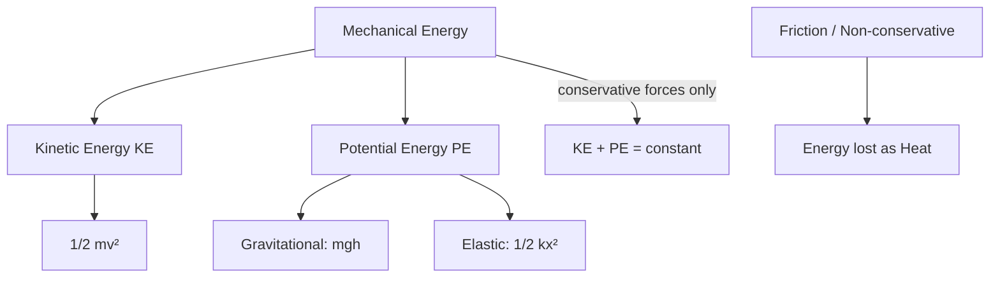

---
tags:
  - physics
  - advance
  - work-energy
  - ipst
source: "IPST (สสวท.) Physics Curriculum B.E. 2551 (2008, revised 2560/2017)"
created: 2026-07-30
course_codes: ["ว301"]
---

# Work, Energy, and Power — งาน พลังงาน และกำลัง

> *"Energy is not merely a quantity; it is the universal currency of the physical world."* — Adapted from Richard Feynman

Work (งาน), energy (พลังงาน), and power (กำลัง) are central concepts in physics that offer an alternative to the force-based approach of dynamics. The **work-energy theorem** shows that the net work done on an object equals the change in its kinetic energy — a powerful tool because energy is a scalar and often easier to track than vector forces. The principle of **conservation of energy** is one of the deepest laws in all of physics: energy is never created or destroyed, only transformed from one form to another.

This note covers the definition of work, kinetic and potential energy, the work-energy theorem, conservative and non-conservative forces, conservation of mechanical energy, power, and efficiency. These concepts recur throughout the rest of the mechanics curriculum, including rotational motion and oscillations.

---

## 1 | Course Coverage

### ม.4 (ว301)

| Semester | Scope | Key Skills |
|---|---|---|
| **Semester 1** | Work, kinetic/potential energy, work-energy theorem, conservative forces, conservation of energy, power, efficiency | Calculate work at an angle, apply energy conservation, compute power and efficiency |
| **Semester 2** | (Applied in oscillations and waves) | Use energy conservation in SHM and wave energy |

---

## 2 | Key Terminology

| Thai | English | Symbol/Notes |
|---|---|---|
| งาน | Work | $W$ (J) |
| พลังงาน | Energy | $E$ (J) |
| พลังงานจลน์ | Kinetic energy | $KE = \frac{1}{2}mv^2$ |
| พลังงานศักย์ | Potential energy | $PE$ (J) |
| พลังงานศักย์โน้มถ่วง | Gravitational PE | $PE_g = mgh$ |
| พลังงานศักย์ยืดหยุ่น | Elastic PE | $PE_e = \frac{1}{2}kx^2$ |
| กำลัง | Power | $P$ (W) |
| ประสิทธิภาพ | Efficiency | $\eta$ (%) |
| แรงอนุรักษ์ | Conservative force | Path-independent |
| แรงไม่อนุรักษ์ | Non-conservative force | e.g. friction |
| งานเชิงกล | Mechanical work | $W = Fd\cos\theta$ |

---

## 3 | Key Concepts

### 3.1 Work

Work done by a constant force $\vec{F}$ over displacement $\vec{d}$:

$$W = \vec{F} \cdot \vec{d} = Fd\cos\theta$$

where $\theta$ is the angle between force and displacement. Work is a **scalar** (Joules, J).

- $\theta = 0^\circ$: positive work (force aids motion)
- $\theta = 180^\circ$: negative work (force opposes motion)
- $\theta = 90^\circ$: zero work (force perpendicular to motion)

### 3.2 Kinetic Energy

$$KE = \frac{1}{2}mv^2$$

### 3.3 Work-Energy Theorem

The net work done on an object equals the change in its kinetic energy:

$$W_{net} = \Delta KE = KE_f - KE_i = \frac{1}{2}mv_f^2 - \frac{1}{2}mv_i^2$$

### 3.4 Potential Energy

**Gravitational PE** (near Earth's surface):
$$PE_g = mgh$$

**Elastic PE** (spring):
$$PE_e = \frac{1}{2}kx^2$$

where $k$ is the spring constant and $x$ the displacement from equilibrium.

### 3.5 Conservative and Non-Conservative Forces

A **conservative force** (แรงอนุรักษ์) does work that depends only on endpoints, not the path taken. The work over any closed loop is zero. Examples: gravity, spring force.

A **non-conservative force** (แรงไม่อนุรักษ์) does path-dependent work. Example: friction (always converts mechanical energy to heat).

### 3.6 Conservation of Mechanical Energy

When only conservative forces act, mechanical energy is conserved:

$$E = KE + PE = \text{constant}$$
$$KE_i + PE_i = KE_f + PE_f$$

With friction or other non-conservative forces:
$$W_{nc} = \Delta E = E_f - E_i$$

### 3.7 Power

Power is the rate of doing work:

$$P = \frac{W}{t} = \vec{F} \cdot \vec{v}$$

Unit: Watt (W), $1\ \text{W} = 1\ \text{J/s}$.

### 3.8 Efficiency

$$\eta = \frac{W_{out}}{E_{in}} \times 100\% = \frac{P_{out}}{P_{in}} \times 100\%$$

Efficiency is always $\le 100\%$ because some input energy is lost to non-conservative forces (heat, sound, etc.).

---

## 4 | Common Problem Types

### Type 1: Work at an angle
> A force $50\ \text{N}$ at $30^\circ$ above horizontal pulls a box $10\ \text{m}$ along the floor. Find work done.

**Solution:**
$$W = Fd\cos\theta = 50 \times 10 \times \cos 30^\circ = 433\ \text{J}$$

### Type 2: Energy conservation on a ramp
> A $2\ \text{kg}$ block slides from rest down a frictionless $3\ \text{m}$ high ramp. Find speed at bottom.

**Solution:** Energy conservation:
$$mgh = \frac{1}{2}mv^2 \Rightarrow v = \sqrt{2gh} = \sqrt{2 \times 9.8 \times 3} = 7.67\ \text{m/s}$$

### Type 3: Work-energy with friction
> A $5\ \text{kg}$ block at $10\ \text{m/s}$ slides on a rough surface with $\mu_k = 0.2$. Find stopping distance.

**Solution:** Work done by friction equals loss in KE:
$$-\mu_k mg \cdot d = 0 - \frac{1}{2}mv^2$$
$$d = \frac{v^2}{2\mu_k g} = \frac{100}{2 \times 0.2 \times 9.8} = 25.5\ \text{m}$$

### Type 4: Power of an engine
> A $1000\ \text{kg}$ car accelerates from rest to $20\ \text{m/s}$ in $8\ \text{s}$. Find average power.

**Solution:**
$$\Delta KE = \frac{1}{2}(1000)(20^2) = 200000\ \text{J}$$
$$P = \frac{W}{t} = \frac{200000}{8} = 25000\ \text{W} = 25\ \text{kW}$$

### Type 5: Efficiency of a machine
> A motor uses $500\ \text{J}$ of electrical energy to output $350\ \text{J}$ of mechanical work. Find efficiency.

**Solution:**
$$\eta = \frac{350}{500} \times 100\% = 70\%$$

---

## 5 | Cross-Links

- [[03_Dynamics]] — forces in dynamics become the work in this topic
- [[05_Momentum]] — energy and momentum together analyse collisions
- [[06_Rotational_Motion]] — rotational kinetic energy extends this topic
- [[07_Oscillations]] — energy oscillates between KE and PE in SHM
- [[01_Advance Mathematics (Sci-Math) - Overview|Mathematics]] — algebra, trigonometry
