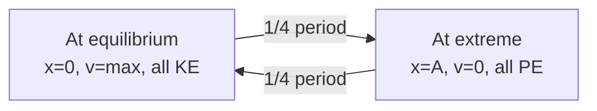

---
tags:
  - physics
  - advance
  - oscillations
  - ipst
source: "IPST (สสวท.) Physics Curriculum B.E. 2551 (2008, revised 2560/2017)"
created: 2026-07-30
course_codes: ["ว301"]
---

# Oscillations — การแกว่ง

> *"Nature is a great oscillation: the breath of the world is a rhythm of return."* — Adapted from Galileo's pendulum studies

Oscillations (การแกว่ง) are motions that repeat about an equilibrium position. They are ubiquitous in nature — from the swing of a pendulum to the vibration of atoms in a crystal. The simplest and most important case is **simple harmonic motion (SHM)**, in which the restoring force is directly proportional to the displacement. SHM provides the mathematical foundation for understanding springs, pendulums, and — in the next topic — waves.

This note covers simple harmonic motion, Hooke's law, the mass-spring system, the simple pendulum, energy in SHM, damped oscillations, driven oscillations, and resonance. Together with waves (topic 08), this completes Semester 2 of the ว301 curriculum.

---

## 1 | Course Coverage

### ม.4 (ว301)

| Semester | Scope | Key Skills |
|---|---|---|
| **Semester 1** | (Not covered — this is Semester 2 content) | — |
| **Semester 2** | SHM, Hooke's law, mass-spring, pendulum, energy in SHM, damped and driven oscillations, resonance | Derive periods, analyse energy, identify resonance conditions |

---

## 2 | Key Terminology

| Thai | English | Symbol/Notes |
|---|---|---|
| การเคลื่อนที่แบบฮาร์โมนิกอย่างง่าย | Simple harmonic motion (SHM) | $a \propto -x$ |
| การแกว่ง | Oscillation | Repeated motion |
| สมดุล | Equilibrium | Net force = 0 |
| แอมพลิจูด | Amplitude | $A$ (max displacement) |
| คาบ | Period | $T$ (s) |
| ความถี่ | Frequency | $f = 1/T$ (Hz) |
| ความถี่เชิงมุม | Angular frequency | $\omega$ (rad/s) |
| การกระจัด | Displacement | $x(t) = A\cos(\omega t + \phi)$ |
| พลังงานของการแกว่ง | Energy of oscillation | $E = \frac{1}{2}kA^2$ |
| การแกว่งที่จางหาย | Damped oscillation | Amplitude decreases |
| การแกว่งบังคับ | Driven oscillation | External periodic force |
| เรโซแนนซ์ | Resonance | Driving freq = natural freq |
| กฎของฮุก | Hooke's law | $F = -kx$ |

---

## 3 | Key Concepts

### 3.1 Hooke's Law

A spring exerts a restoring force proportional to displacement:

$$F = -kx$$

where $k$ is the spring constant (N/m). The negative sign indicates the force opposes displacement.

### 3.2 Simple Harmonic Motion (SHM)

SHM occurs when the restoring force is proportional to displacement:

$$F = -kx \Rightarrow a = -\frac{k}{m}x = -\omega^2 x$$

where $\omega^2 = \frac{k}{m}$.

**Equations of motion:**
$$x(t) = A\cos(\omega t + \phi)$$
$$v(t) = -A\omega\sin(\omega t + \phi)$$
$$a(t) = -A\omega^2\cos(\omega t + \phi) = -\omega^2 x$$

**Period and frequency:**
$$T = \frac{2\pi}{\omega} = 2\pi\sqrt{\frac{m}{k}}, \qquad f = \frac{1}{T}$$

### 3.3 Mass-Spring System

For a mass $m$ on a spring with constant $k$:
$$\omega = \sqrt{\frac{k}{m}}, \qquad T = 2\pi\sqrt{\frac{m}{k}}$$

### 3.4 Simple Pendulum

For a pendulum of length $L$ (small angle approximation, $\theta < 15^\circ$):
$$\omega = \sqrt{\frac{g}{L}}, \qquad T = 2\pi\sqrt{\frac{L}{g}}$$

The period depends only on $L$ and $g$, not on mass or amplitude (isochronism).

### 3.5 Energy in SHM

Total mechanical energy is conserved and equals:

$$E = \frac{1}{2}kA^2$$

At any instant:
$$E = KE + PE = \frac{1}{2}mv^2 + \frac{1}{2}kx^2$$

At equilibrium ($x = 0$): all energy is KE, $v = v_{max} = A\omega$.
At extremes ($x = \pm A$): all energy is PE, $v = 0$.

### 3.6 Damped Oscillations

A damping force (often $F_d = -bv$) opposes motion, causing amplitude to decrease:

$$x(t) = A_0 e^{-\gamma t}\cos(\omega_d t + \phi)$$

where $\gamma = \frac{b}{2m}$. Three regimes:
- **Underdamped:** oscillates with decreasing amplitude
- **Critically damped:** returns to equilibrium fastest, no oscillation
- **Overdamped:** returns slowly, no oscillation

### 3.7 Driven Oscillations and Resonance

A driven oscillator has an external periodic force applied at frequency $f_d$. When $f_d$ equals the **natural frequency** $f_0$, amplitude grows dramatically — this is **resonance** (สาเรซอนานซ์).

Examples: pushing a swing, Tacoma Narrows Bridge, tuning forks, microwave ovens.

---

## 4 | Common Problem Types

### Type 1: Mass-spring period
> A $0.5\ \text{kg}$ mass on a spring ($k = 200\ \text{N/m}$) oscillates. Find period.

**Solution:**
$$T = 2\pi\sqrt{\frac{m}{k}} = 2\pi\sqrt{\frac{0.5}{200}} = 2\pi\sqrt{0.0025} = 2\pi(0.05) = 0.314\ \text{s}$$

### Type 2: Pendulum length for given period
> Find the length of a pendulum with period $2\ \text{s}$ (use $g = 9.8$).

**Solution:**
$$T = 2\pi\sqrt{\frac{L}{g}} \Rightarrow L = g\left(\frac{T}{2\pi}\right)^2 = 9.8\left(\frac{2}{2\pi}\right)^2 = 9.8 \times 0.1013 = 0.993\ \text{m}$$

### Type 3: Energy and maximum speed
> A mass-spring has $k = 100\ \text{N/m}$, $A = 0.1\ \text{m}$, $m = 0.2\ \text{kg}$. Find total energy and max speed.

**Solution:**
$$E = \frac{1}{2}kA^2 = \frac{1}{2}(100)(0.01) = 0.5\ \text{J}$$
$$v_{max} = A\omega = A\sqrt{\frac{k}{m}} = 0.1\sqrt{\frac{100}{0.2}} = 0.1\sqrt{500} = 2.24\ \text{m/s}$$

### Type 4: SHM equation from parameters
> An oscillator has $A = 0.05\ \text{m}$, $T = 0.4\ \text{s}$, starts at max displacement. Write $x(t)$.

**Solution:**
$$\omega = \frac{2\pi}{T} = \frac{2\pi}{0.4} = 5\pi\ \text{rad/s}, \quad \phi = 0$$
$$x(t) = 0.05\cos(5\pi t)\ \text{m}$$

---

## 5 | Cross-Links

- [[04_Work_Energy_and_Power]] — energy conservation in SHM
- [[06_Rotational_Motion]] — torque analysis of pendulums
- [[08_Waves]] — SHM is the source of wave motion
- [[01_Advance Mathematics (Sci-Math) - Overview|Mathematics]] — trigonometry, calculus of sinusoids
