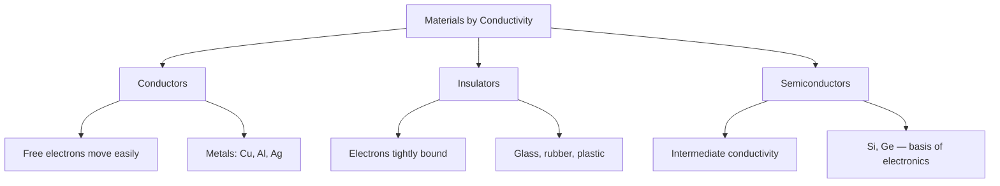

---
tags:
  - physics
  - advance
  - electrostatics
  - electricity
  - ipst
source: "IPST (สสวท.) Physics Curriculum B.E. 2551 (2008, revised 2560/2017)"
created: 2026-07-30
course_codes: ["ว302"]
---

# Electrostatics — ไฟฟ้าสถิต

> *"To understand electricity, we must first understand the electrostatic force."* — Charles-Augustin de Coulomb

Electrostatics deals with electric charges at rest. The electric force is one of the fundamental interactions of nature — far stronger than gravity. Coulomb's law quantifies the force between point charges, while the electric field describes the force per unit charge in the space around a charge distribution. Electric potential extends this to energy, and capacitors demonstrate the practical storage of electric energy. Gauss's law provides an elegant and powerful tool for calculating fields from symmetric charge distributions.

In the Thai ว302 curriculum, electrostatics is the foundation for all of electromagnetism. Students learn to calculate forces, fields, and potentials for simple charge configurations. Capacitors bridge electrostatics to circuits, and the dielectric materials studied here connect to real-world applications in electronics and energy storage.

---

## 1 | Course Coverage

### ม.5 (ว302)

| Semester | Scope | Key Skills |
|---|---|---|
| **Semester 1** | Coulomb's law, electric field, Gauss's law, electric potential, capacitors, dielectrics | Calculate forces, fields, potentials; apply Gauss's law; capacitor energy |
| **Semester 2** | (Continued in circuits and EM induction) | — |

---

## 2 | Key Terminology

| Thai | English | Symbol/Notes |
|---|---|---|
| ประจุไฟฟ้า | Electric charge | $q$ (C) |
| กฎของคูลอมบ์ | Coulomb's law | $F = k\frac{q_1 q_2}{r^2}$ |
| สนามไฟฟ้า | Electric field | $\vec{E}$ (N/C or V/m) |
| สายเส้นแรงไฟฟ้า | Electric field lines | Direction: + to − |
| กฎของเกาส์ | Gauss's law | $\oint \vec{E} \cdot d\vec{A} = \frac{Q_{\text{enc}}}{\varepsilon_0}$ |
| ศักย์ไฟฟ้า | Electric potential | $V$ (V or J/C) |
| พลังงานศักย์ไฟฟ้า | Electric potential energy | $U$ (J) |
| ตัวเก็บประจุ | Capacitor | $C$ (F) |
| ความจุ | Capacitance | $C = Q/V$ |
| ค่าคงตัวไดอิเล็กตริก | Dielectric constant | $\kappa$ |
| ความหนาแน่นประจุ | Charge density | $\sigma, \lambda, \rho$ |

---

## 3 | Key Concepts

### 3.1 Coulomb's Law

The force between two point charges:

$$\vec{F} = k\frac{|q_1 q_2|}{r^2}\hat{r}, \quad k = 8.99 \times 10^9 \text{ N·m}^2/\text{C}^2$$

Also written as $k = \frac{1}{4\pi\varepsilon_0}$ where $\varepsilon_0 = 8.854 \times 10^{-12}$ C²/N·m². Like charges repel, opposite charges attract.

### 3.2 Electric Field

The electric field is force per unit test charge:

$$\vec{E} = \frac{\vec{F}}{q_0}$$

For a point charge: $E = k\frac{|q|}{r^2}$. Multiple charges use superposition: $\vec{E}_{\text{total}} = \sum \vec{E}_i$.

### 3.3 Gauss's Law

$$\oint \vec{E} \cdot d\vec{A} = \frac{Q_{\text{enc}}}{\varepsilon_0}$$

Applications by symmetry:
- **Infinite line charge:** $E = \frac{\lambda}{2\pi\varepsilon_0 r}$
- **Infinite plane:** $E = \frac{\sigma}{2\varepsilon_0}$
- **Sphere (outside):** $E = k\frac{Q}{r^2}$
- **Sphere (inside, uniform):** $E = k\frac{Q_{\text{enc}}}{r^2}$

### 3.4 Electric Potential

Potential at distance $r$ from a point charge:

$$V = k\frac{q}{r}$$

Potential difference: $\Delta V = V_B - V_A$. For a uniform field: $\Delta V = -Ed$.

Potential energy of two charges: $U = k\frac{q_1 q_2}{r}$.

### 3.5 Capacitors

A capacitor stores charge and energy:

$$C = \frac{Q}{V}$$

**Parallel plate:** $C = \frac{\varepsilon_0 A}{d}$. With dielectric: $C = \kappa C_0$.

**Energy stored:** $U = \frac{1}{2}CV^2 = \frac{Q^2}{2C} = \frac{1}{2}QV$

**Series:** $\frac{1}{C_{\text{eq}}} = \sum \frac{1}{C_i}$ — same $Q$, voltages add.

**Parallel:** $C_{\text{eq}} = \sum C_i$ — same $V$, charges add.

### 3.6 Dielectrics

Inserting a dielectric increases capacitance by factor $\kappa$:
$$C = \kappa C_0$$

The dielectric reduces the internal field, allowing more charge storage at the same voltage.

---

## 4 | Common Problem Types

### Type 1: Coulomb's Law
> Two charges $q_1 = +3\,\mu\text{C}$ and $q_2 = -2\,\mu\text{C}$ are 0.1 m apart. Find the force.

**Solution:**

$$F = k\frac{|q_1 q_2|}{r^2} = (8.99 \times 10^9)\frac{(3 \times 10^{-6})(2 \times 10^{-6})}{(0.1)^2} = 5.39 \text{ N (attractive)}$$

### Type 2: Electric Field from Gauss's Law
> Find the field 0.2 m from a point charge of $+5\,\mu\text{C}$.

**Solution:**

$$E = k\frac{Q}{r^2} = (8.99 \times 10^9)\frac{5 \times 10^{-6}}{(0.2)^2} = 1.12 \times 10^6 \text{ N/C}$$

### Type 3: Capacitor Energy
> A $10\,\mu\text{F}$ capacitor is charged to 100 V. Find the energy stored.

**Solution:**

$$U = \frac{1}{2}CV^2 = \frac{1}{2}(10 \times 10^{-6})(100)^2 = 0.05 \text{ J}$$

### Type 4: Potential at a Point
> Find the potential 0.3 m from a $+2\,\mu\text{C}$ charge.

**Solution:**

$$V = k\frac{q}{r} = (8.99 \times 10^9)\frac{2 \times 10^{-6}}{0.3} = 59{,}933 \text{ V} \approx 60 \text{ kV}$$

---

## 5 | Cross-Links

- [[10_Heat_and_Thermodynamics]] — Energy conservation applies to electric potential energy
- [[12_Electric_Circuits]] — Capacitors discharge through resistors (RC circuits)
- [[13_Magnetism]] — Moving charges create magnetic fields
- [[13_Forces_and_Motion]] — Compare inverse-square laws (Coulomb vs. Newton)
