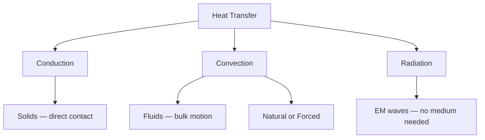
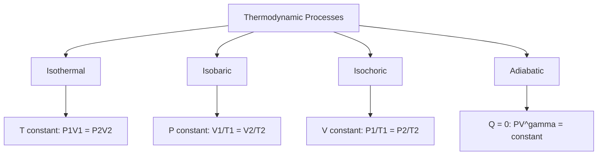

---
tags:
  - physics
  - advance
  - thermodynamics
  - heat
  - ipst
source: "IPST (สสวท.) Physics Curriculum B.E. 2551 (2008, revised 2560/2017)"
created: 2026-07-30
course_codes: ["ว301"]
---

# Heat and Thermodynamics — ความร้อนและอุณหพลศาสตร์

> *"Heat is a quantity which, like matter, can be transferred from one body to another."* — James Clerk Maxwell

Thermodynamics studies the relationships between heat, work, and energy. Heat is energy transferred due to temperature differences, while temperature measures the average kinetic energy of particles. The four laws of thermodynamics (Zeroth through Third) govern all thermal processes, from steam engines to biological cells. The first law is essentially energy conservation applied to thermal systems, while the second law introduces the arrow of time through entropy.

For Thai high school physics, students learn the mechanisms of heat transfer, thermal expansion, the ideal gas law, and the first and second laws of thermodynamics. Heat engines and the Carnot cycle connect theory to engineering applications. Understanding entropy provides a foundation for why natural processes are irreversible and why energy conversions always involve losses.

---

## 1 | Course Coverage

### ม.4 (ว301)

| Semester | Scope | Key Skills |
|---|---|---|
| **Semester 1** | Temperature, heat, thermal expansion, heat transfer | Calorimetry, expansion calculations |
| **Semester 2** | Ideal gas law, 1st & 2nd laws, entropy, heat engines, Carnot cycle | Apply gas laws, $p$-$V$ diagrams, efficiency calculations |

---

## 2 | Key Terminology

| Thai | English | Symbol/Notes |
|---|---|---|
| อุณหภูมิ | Temperature | $T$ (K, °C) |
| ความร้อน | Heat | $Q$ (J) |
| ความจุความร้อนจำเพาะ | Specific heat capacity | $c$ (J/kg·K) |
| ความร้อนแฝง | Latent heat | $L$ (J/kg) |
| การนำความร้อน | Conduction | Transfer in solids |
| การพาความร้อน | Convection | Transfer in fluids |
| การแผ่รังสีความร้อน | Radiation | EM wave transfer |
| การขยายตัวจากความร้อน | Thermal expansion | $\Delta L = \alpha L_0 \Delta T$ |
| ก๊าซอุดมคติ | Ideal gas | $PV = nRT$ |
| กฎข้อที่หนึ่ง | First law | $\Delta U = Q - W$ |
| กฎข้อที่สอง | Second law | Entropy increases |
| เอนโทรปี | Entropy | $S$ (J/K) |
| เครื่องจักรความร้อน | Heat engine | Converts $Q_H$ to $W$ |
| วัฏจักรคาร์โนต์ | Carnot cycle | Maximum efficiency |
| ประสิทธิภาพ | Efficiency | $\eta = W/Q_H$ |

---

## 3 | Key Concepts

### 3.1 Heat Transfer

**Conduction:** $Q = \frac{kA \Delta T \cdot t}{d}$ where $k$ is thermal conductivity, $A$ is area, $d$ is thickness, $t$ is time.

**Convection:** Bulk fluid motion transports heat. Natural convection driven by density differences; forced convection driven by external means.

**Radiation:** Stefan-Boltzmann law: $P = \sigma e A T^4$ where $\sigma = 5.67 \times 10^{-8}$ W/m²·K⁴.

### 3.2 Thermal Expansion

Linear expansion: $\Delta L = \alpha L_0 \Delta T$

Volume expansion: $\Delta V = \beta V_0 \Delta T$ where $\beta \approx 3\alpha$ for isotropic solids.

### 3.3 Calorimetry

Heat gained = heat lost in isolated systems:

$$Q = mc\Delta T, \qquad Q_{\text{phase}} = mL$$

### 3.4 Ideal Gas Law

$$PV = nRT = Nk_BT$$

Where $R = 8.314$ J/mol·K, $k_B = 1.38 \times 10^{-23}$ J/K.

Special cases:
- **Isothermal** ($T$ constant): $P_1 V_1 = P_2 V_2$
- **Isobaric** ($P$ constant): $V_1/T_1 = V_2/T_2$
- **Isochoric** ($V$ constant): $P_1/T_1 = P_2/T_2$
- **Adiabatic** ($Q=0$): $PV^\gamma = \text{constant}$

### 3.5 First Law of Thermodynamics

$$\Delta U = Q - W$$

Where $Q > 0$ is heat added to system, $W > 0$ is work done by system. For an ideal gas, $W = \int P \, dV$.

### 3.6 Second Law and Entropy

The total entropy of an isolated system never decreases:

$$\Delta S_{\text{total}} \geq 0$$

Entropy change: $\Delta S = \int \frac{dQ}{T}$ (reversible process).

### 3.7 Heat Engines and Carnot Cycle

Efficiency: $\eta = \frac{W}{Q_H} = 1 - \frac{Q_C}{Q_H}$

Carnot (ideal) efficiency: $\eta_{\text{Carnot}} = 1 - \frac{T_C}{T_H}$ (temperatures in Kelvin).

The Carnot cycle consists of two isothermal and two adiabatic processes. No real engine can exceed Carnot efficiency.

---

## 4 | Common Problem Types

### Type 1: Calorimetry
> How much heat is needed to raise 2 kg of water from 20 °C to 80 °C? ($c = 4186$ J/kg·K)

**Solution:**

$$Q = mc\Delta T = 2 \times 4186 \times (80 - 20) = 502{,}320 \text{ J}$$

### Type 2: Ideal Gas Law
> A gas at 2 atm and 300 K occupies 10 L. Find the new volume at 1 atm and 600 K.

**Solution:** Using $\frac{P_1 V_1}{T_1} = \frac{P_2 V_2}{T_2}$:

$$V_2 = \frac{P_1 V_1 T_2}{P_2 T_1} = \frac{2 \times 10 \times 600}{1 \times 300} = 40 \text{ L}$$

### Type 3: Carnot Efficiency
> A Carnot engine operates between 500 K and 300 K. Find its efficiency.

**Solution:**

$$\eta = 1 - \frac{T_C}{T_H} = 1 - \frac{300}{500} = 0.40 = 40\%$$

### Type 4: First Law Application
> A gas absorbs 500 J of heat and does 200 J of work. Find $\Delta U$.

**Solution:**

$$\Delta U = Q - W = 500 - 200 = 300 \text{ J}$$

Internal energy increases by 300 J.

---

## 5 | Cross-Links

- [[09_Sound]] — Temperature affects speed of sound
- [[11_Electrostatics]] — Energy concepts carry over to electric potential energy
- [[14_Electromagnetic_Induction]] — Transformers and generators are heat engine analogs
- [[Fundamental/07_Energy]] — Conservation of energy underpins the first law
