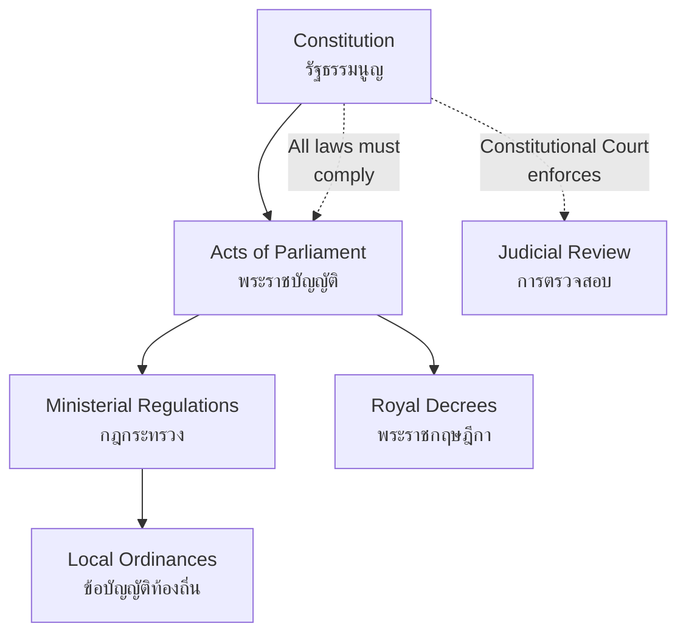

# Thai Constitution — รัฐธรรมนูญไทย

> *"The constitution is the supreme law of the land — it defines the structure of government, protects the rights of the people, and establishes the rules by which a nation governs itself."*

The Thai Constitution is the foundational legal document that defines Thailand's political system. Since becoming a constitutional monarchy in 1932, Thailand has had 20 constitutions, reflecting the nation's evolving political journey. This topic covers constitutional history, principles, structure, and the role of the Constitutional Court.

---

## 1 | Grade Band Breakdown

| Grade | Key Content |
|---|---|
| **ป.4–6** | Laws protect people, basic rights in daily life, King's role under constitution |
| **ม.1–3** | Constitutional history (basic), key constitutional principles, relationship between constitution and other laws |
| **ม.4–6** | Constitutional history detailed, amendment process, Constitutional Court, political philosophy behind constitutions |

---

## 2 | History of Thai Constitutions

| Year | Event | Thai | Significance |
|---|---|---|---|
| **1932** | Siamese Revolution | การเปลี่ยนแปลงการปกครอง | Absolute monarchy → constitutional monarchy |
| **1932** | First Constitution | รัฐธรรมนูญฉบับแรก | Established People's Party government |
| **1946** | People's Constitution | รัฐธรรมนูญฉบับประชาชน | Considered most democratic of early era |
| **1997** | People's Constitution | รัฐธรรมนูญฉบับปวงชน | Established independent organizations, Senate election |
| **2007** | Post-coup Constitution | รัฐธรรมนูญหลังรัฐประหาร | Drafted after 2006 coup |
| **2017** | Current Constitution | รัฐธรรมนูญฉบับปัจจุบัน | Drafted after 2014 coup, currently in force |

> Thailand has had **20 constitutions** since 1932 — more than any other country in the region. Each reflects a shift in political power.

---

## 3 | Current Constitution (2017) Structure

| Chapter | Thai | Content |
|---|---|---|
| **1** | บททั่วไป | General provisions, sovereignty, principles |
| **2** | พระมหากษัตริย์ | King's role, succession, powers |
| **3** | สิทธิและเสรีภาพ | Rights and liberties of the people |
| **4** | หน้าที่ของปวงชนชาวไทย | Duties of Thai citizens |
| **5** | หน้าที่ของรัฐ | Duties of the state |
| **6** | แนวนโยบายแห่งรัฐ | State policy guidelines |
| **7** | รัฐสภา | Parliament — structure and powers |
| **8** | คณะรัฐมนตรี | Cabinet — executive branch |
| **9** | ศาล | Courts — judicial branch |
| **10** | ศาลรัฐธรรมนูญ | Constitutional Court |
| **11** | องค์กรอิสระ | Independent organizations |
| **12** | การปกครองส่วนท้องถิ่น | Local government |
| **13** | การตรวจสอบการใช้อำนาจรัฐ | Checks and balances |

---

## 4 | Fundamental Constitutional Principles

| Principle | Thai | Meaning |
|---|---|---|
| **Sovereignty** | อธิปไตย | Power belongs to the people |
| **Rule of law** | นิติรัฐ | Everyone is subject to the law |
| **Constitutional supremacy** | รัฐธรรมนูญสูงสุด | Constitution is the highest law |
| **Separation of powers** | การแบ่งแยกอำนาจ | Legislative, executive, judicial are separate |
| **Checks and balances** | การตรวจสอบถ่วงดุล | Each branch limits the others |
| **Rights protection** | การคุ้มครองสิทธิ | Constitution protects fundamental rights |

---

## 5 | Constitutional Monarchy Principles

| Aspect | Thai | Description |
|---|---|---|
| **King as head of state** | พระมหากษัตริย์ทรงเป็นประมุข | King is above politics, symbol of national unity |
| **King under constitution** | อยู่ใต้รัฐธรรมนูญ | King exercises power through constitution |
| **Royal assent** | พระราชทาน | Laws require royal signature to take effect |
| **Royal prerogative** | พระราชอำนาจ | Powers granted by constitution (e.g., appointing PM) |
| **Political neutrality** | ความเป็นกลางทางการเมือง | King does not engage in partisan politics |

> Constitutional monarchy means the King reigns but does not rule — governance is carried out by elected representatives.

---

## 6 | Constitutional Amendment Process

| Step | Thai | Description |
|---|---|---|
| **1. Proposal** | การเสนอญัตติ | PM, MPs, or Senate members propose amendment |
| **2. First reading** | วาระแรก | Parliament debates the principle |
| **3. Public hearing** | รับฟังความคิดเห็น | Citizens can comment on proposed changes |
| **4. Second reading** | วาระสอง | Detailed clause-by-clause debate |
| **5. Third reading** | วาระสาม | Final vote — requires majority of both houses |
| **6. Royal assent** | พระราชทาน | King signs the amendment into law |

> Amendments to certain chapters (e.g., monarchy, fundamental rights) may require a **referendum** (การลงประชามติ).

---

## 7 | Constitutional Court (ศาลรัฐธรรมนูญ)

| Function | Thai | Description |
|---|---|---|
| **Constitutional interpretation** | การตีความรัฐธรรมนูญ | Interprets constitutional provisions |
| **Law review** | การตรวจสอบกฎหมาย | Rules whether laws comply with constitution |
| **Dissolution of parties** | การยุบพรรค | Dissolves political parties that violate the constitution |
| **Impeachment** | การถอดถอน | Rules on removal of political officeholders |
| **Election disputes** | ข้อพิพาทการเลือกตั้ง | Resolves election-related disputes |

| Component | Thai | Details |
|---|---|---|
| **Composition** | องค์ประกอบ | 9 justices appointed by King |
| **Selection** | การคัดเลือก | Selected from judiciary, legal experts |
| **Term** | วาระ | 7-year term, non-renewable |

---

## 8 | Relationship Between Constitution and Other Laws

---

## 9 | Thai Terminology

| Thai | English |
|---|---|
| รัฐธรรมนูญ | Constitution |
| ศาลรัฐธรรมนูญ | Constitutional Court |
| สิทธิ | Rights |
| เสรีภาพ | Liberties |
| อธิปไตย | Sovereignty |
| นิติรัฐ | Rule of law |
| การแก้ไขรัฐธรรมนูญ | Constitutional amendment |
| การลงประชามติ | Referendum |
| พระราชอำนาจ | Royal prerogative |
| องค์กรอิสระ | Independent organization |

---

## 10 | Cross-Links

- [[Social Studies - Overview|← Back to Social Studies]]
- [[01_Democracy_and_Government|Democracy and Government]] — How democracy works under the constitution
- [[04_Rights_Duties_and_Laws|Rights, Duties, and Laws]] — Constitutional rights in detail
- [[06_Government_Structure|Government Structure]] — How the constitution organizes government
