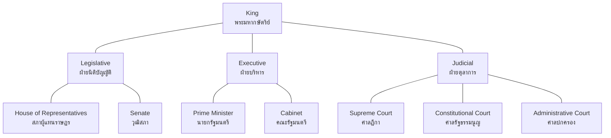
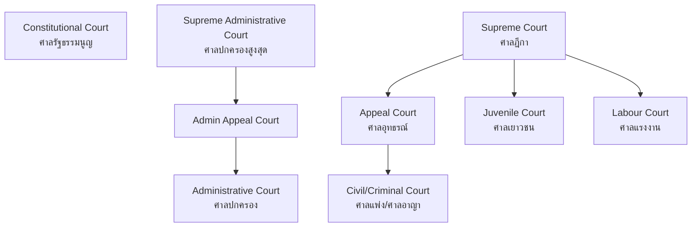

# Government Structure — โครงสร้างรัฐบาลไทย

> *"Understanding how government is organized helps citizens know where to go, who to ask, and how to participate in public life."*

Government Structure examines the detailed organization of Thailand's government — the three branches, the bureaucratic system, independent organizations, and local administration. While Democracy and Government covers the principles, this topic focuses on the institutional machinery that makes governance work.

---

## 1 | Grade Band Breakdown

| Grade | Key Content |
|---|---|
| **ป.1–3** | King as head of state, basic roles of government (school, community) |
| **ป.4–6** | Three branches (basic), local government, how laws are made |
| **ม.1–3** | Three branches detailed, bureaucracy, independent organizations, local administration |
| **ม.4–6** | Court system detailed, legal procedures, policy analysis, government accountability |

---

## 2 | Overview of Thai Government

---

## 3 | Legislative Branch (ฝ่ายนิติบัญญัติ)

### Parliament (รัฐสภา)

| Chamber | Thai | Members | Selection |
|---|---|---|---|
| **House of Representatives** | สภาผู้แทนราษฎร | 500 members | 400 elected by constituency, 100 by party list |
| **Senate** | วุฒิสภา | 250 members | Selected (not elected) under 2017 constitution |

### Legislative Process

| Step | Thai | Description |
|---|---|---|
| **1. Bill introduction** | การเสนอร่างกฎหมาย | By PM, Cabinet, or MPs |
| **2. Committee review** | การพิจารณาของคณะกรรมาธิการ | Detailed study by specialized committee |
| **3. Three readings** | สามวาระ | Debate and vote in each chamber |
| **4. Senate review** | การพิจารณาของวุฒิสภา | Senate reviews and may propose amendments |
| **5. Royal assent** | พระราชทานพระบรมราชานุญาต | King signs into law |
| **6. Publication** | การประกาศในราชกิจจานุเบกษา | Published in Royal Gazette, takes effect |

---

## 4 | Executive Branch (ฝ่ายบริหาร)

### Prime Minister and Cabinet

| Role | Thai | Responsibility |
|---|---|---|
| **Prime Minister** | นายกรัฐมนตรี | Head of government, leads Cabinet |
| **Cabinet Ministers** | รัฐมนตรี | Each oversees a ministry |
| **Cabinet** | คณะรัฐมนตรี (ครม.) | Collective decision-making body |

### Key Ministries

| Ministry | Thai | Responsibility |
|---|---|---|
| **Interior** | กระทรวงมหาดไทย | Provincial administration, security |
| **Finance** | กระทรวงการคลัง | Budget, taxation, treasury |
| **Education** | กระทรวงศึกษาธิการ | Schools, universities, curriculum |
| **Public Health** | กระทรวงสาธารณสุข | Hospitals, disease control |
| **Defence** | กระทรวงกลาโหม | Military, national security |
| **Foreign Affairs** | กระทรวงการต่างประเทศ | Diplomacy, international relations |
| **Justice** | กระทรวงยุติธรรม | Prisons, legal affairs |
| **Commerce** | กระทรวงพาณิชย์ | Trade, exports, business regulation |
| **Agriculture** | กระทรวงเกษตรและสหกรณ์ | Farming, fisheries, land |
| **Transport** | กระทรวงคมนาคม | Roads, railways, aviation |

---

## 5 | Judicial Branch (ฝ่ายตุลาการ)

| Court | Thai | Jurisdiction |
|---|---|---|
| **Supreme Court** | ศาลฎีกา | Highest court for criminal and civil cases |
| **Supreme Administrative Court** | ศาลปกครองสูงสุด | Highest court for government disputes |
| **Constitutional Court** | ศาลรัฐธรรมนูญ | Constitutional interpretation |
| **Appeal Court** | ศาลอุทธรณ์ | Hears appeals from lower courts |
| **Civil Court** | ศาลแพ่ง | Civil disputes (contracts, property, family) |
| **Criminal Court** | ศาลอาญา | Criminal cases |
| **Administrative Court** | ศาลปกครอง | Disputes involving government agencies |
| **Juvenile Court** | ศาลเยาวชนและครอบครัว | Cases involving minors |
| **Labour Court** | ศาลแรงงาน | Employment disputes |
| **Tax Court** | ศาลภาษีอากร | Tax disputes |

### Court Hierarchy

---

## 6 | Independent Organizations (องค์กรอิสระ)

| Organization | Thai | Role |
|---|---|---|
| **Election Commission** | คณะกรรมการการเลือกตั้ง (กกต.) | Oversees elections |
| **National Anti-Corruption Commission** | คณะกรรมการป้องกันและปราบปรามการทุจริต (ป.ป.ช.) | Investigates corruption |
| **State Audit Commission** | สำนักงานการตรวจเงินแผ่นดิน (สตง.) | Audits government spending |
| **National Human Rights Commission** | คณะกรรมการสิทธิมนุษยชนแห่งชาติ (กสม.) | Protects human rights |
| **Ombudsman** | ผู้ตรวจการแผ่นดิน | Handles citizen complaints against government |
| **Office of the Attorney General** | สำนักงานอัยการสูงสุด | Prosecutes criminal cases |

---

## 7 | Local Government (การปกครองส่วนท้องถิ่น)

| Type | Thai | Head | Population Scope |
|---|---|---|---|
| **Provincial Admin Org** | อบจ. (องค์การบริหารส่วนจังหวัด) | นายก อบจ. | Provincial level |
| **Municipality** | เทศบาล | นายกเทศมนตรี | Urban areas (3 levels: city, town, subdistrict) |
| **Subdistrict Admin Org** | อบต. (องค์การบริหารส่วนตำบล) | นายก อบต. | Rural subdistricts |
| **Bangkok Metropolitan Admin** | กรุงเทพมหานคร (กทม.) | ผู้ว่าราชการกรุงเทพ | Bangkok special admin |
| **Pattaya City** | เมืองพัทยา | นายกเมืองพัทยา | Pattaya special admin |

### Local Government Functions

| Function | Thai | Examples |
|---|---|---|
| **Infrastructure** | โครงสร้างพื้นฐาน | Roads, water supply, drainage |
| **Public health** | สาธารณสุข | Local health centers, sanitation |
| **Education** | การศึกษา | Local schools (some levels) |
| **Environment** | สิ่งแวดล้อม | Waste management, parks |
| **Social welfare** | สวัสดิการสังคม | Elderly care, child care |
| **Culture** | วัฒนธรรม | Local festivals, heritage preservation |

---

## 8 | Bureaucratic System (ระบบราชการ)

| Level | Thai | Examples |
|---|---|---|
| **Ministry** | กระทรวง | 20 ministries under Cabinet |
| **Department** | กรม | Sub-divisions within ministries |
| **Division** | กอง | Units within departments |
| **Section** | ฝ่าย/ส่วน | Smallest administrative units |
| **Provincial office** | สำนักงานจังหวัด | Ministry representatives in provinces |
| **District office** | ที่ว่าการอำเภอ | District-level administration |

---

## 9 | Thai Terminology

| Thai | English |
|---|---|
| โครงสร้างรัฐบาล | Government structure |
| ฝ่ายบริหาร | Executive branch |
| ฝ่ายนิติบัญญัติ | Legislative branch |
| ฝ่ายตุลาการ | Judicial branch |
| รัฐสภา | Parliament |
| คณะรัฐมนตรี | Cabinet |
| กระทรวง | Ministry |
| กรม | Department |
| องค์กรอิสระ | Independent organization |
| การปกครองส่วนท้องถิ่น | Local government |

---

## 10 | Cross-Links

- [[Social Studies - Overview|← Back to Social Studies]]
- [[01_Democracy_and_Government|Democracy and Government]] — Principles behind the structure
- [[05_Thai_Constitution|Thai Constitution]] — Legal foundation of government structure
- [[04_Rights_Duties_and_Laws|Rights, Duties, and Laws]] — How courts protect rights
