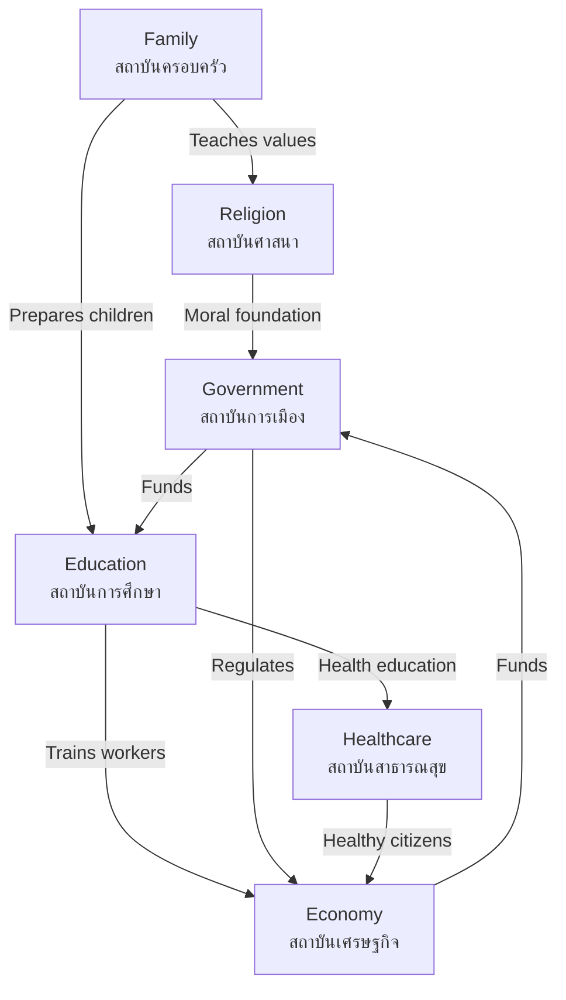

# Social Institutions — สถาบันสังคม

> *"Social institutions are the established structures that shape how people live together — family, school, religion, and economy form the backbone of every society."*

Social Institutions explores the key structures that organize Thai society. Students learn how family, education, religion, and economic institutions function, how they've changed over time, and the challenges they face in the modern world.

---

## 1 | Grade Band Breakdown

| Grade | Key Content |
|---|---|
| **ป.1–3** | Family roles, school as institution, community helpers |
| **ป.4–6** | Religious institutions, economic institutions, institutions' roles in society |
| **ม.1–3** | Functions of social institutions, institutional change, modern challenges |
| **ม.4–6** | Institutional analysis, interdependence, institutional reform |

---

## 2 | Major Social Institutions

| Institution | Thai | Primary Function | Key Components |
|---|---|---|---|
| **Family** | สถาบันครอบครัว | Socialization, emotional support, reproduction | Parents, children, extended family |
| **Education** | สถาบันการศึกษา | Knowledge transmission, skill development | Schools, universities, teachers |
| **Religion** | สถาบันศาสนา | Moral guidance, meaning, community | Temples, churches, clergy |
| **Economy** | สถาบันเศรษฐกิจ | Production, distribution of goods/services | Markets, businesses, labor |
| **Government** | สถาบันการเมือง | Governance, law, public order | Parliament, courts, bureaucracy |
| **Media** | สถาบันสื่อ | Information, entertainment, public discourse | TV, newspapers, internet |
| **Healthcare** | สถาบันสาธารณสุข | Health maintenance, disease prevention | Hospitals, clinics, health workers |

---

## 3 | Family Institution (สถาบันครอบครัว)

### Thai Family Structure

| Type | Thai | Description |
|---|---|---|
| **Nuclear family** | ครอบครัวเดี่ยว | Parents and children only |
| **Extended family** | ครอบครัวขยาย | Multiple generations living together |
| **Single-parent** | ครอบครัวเลี้ยงเดี่ยว | One parent with children |

### Family Functions

| Function | Thai | Description |
|---|---|---|
| **Socialization** | การขัดเกลาทางสังคม | Teaching children social norms and values |
| **Emotional support** | การสนับสนุนทางอารมณ์ | Love, care, sense of belonging |
| **Economic cooperation** | การร่วมมือทางเศรษฐกิจ | Sharing resources, financial support |
| **Reproduction** | การสืบพันธุ์ | Raising the next generation |
| **Cultural transmission** | การถ่ายทอดวัฒนธรรม | Passing on traditions, beliefs |

### Modern Family Challenges

| Challenge | Thai | Description |
|---|---|---|
| **Divorce** | การหย่าร้าง | Increasing divorce rates |
| **Aging society** | สังคมผู้สูงอายุ | More elderly, fewer caregivers |
| **Migration** | การอพยพ | Parents working in cities, children left with grandparents |
| **Digital gap** | ช่องว่างดิจิทัล | Generational differences in technology use |
| **Dual-income families** | ครอบครัวที่พ่อแม่ทำงานทั้งคู่ | Less time for child-rearing |

---

## 4 | Education Institution (สถาบันการศึกษา)

### Education System

| Level | Thai | Duration | Ages |
|---|---|---|---|
| **Pre-primary** | อนุบาล | 3 years | 3–5 |
| **Primary** | ประถมศึกษา | 6 years | 6–11 |
| **Lower secondary** | มัธยมศึกษาตอนต้น | 3 years | 12–14 |
| **Upper secondary** | มัธยมศึกษาตอนปลาย | 3 years | 15–17 |
| **Vocational** | อาชีวศึกษา | 2–3 years | 15+ |
| **Higher education** | อุดมศึกษา | 4+ years | 18+ |

### Education Functions

| Function | Thai | Description |
|---|---|---|
| **Knowledge transmission** | การถ่ายทอดความรู้ | Academic subjects, literacy, numeracy |
| **Socialization** | การขัดเกลาทางสังคม | Learning to interact with peers |
| **Cultural preservation** | การอนุรักษ์วัฒนธรรม | Teaching national heritage |
| **Skill development** | การพัฒนาทักษะ | Critical thinking, problem-solving |
| **Social mobility** | การเลื่อนสถานะทางสังคม | Education as path to better opportunities |

---

## 5 | Religious Institution (สถาบันศาสนา)

### Religion in Thailand

| Religion | Thai | Followers | Key Features |
|---|---|---|---|
| **Buddhism** | ศาสนาพุทธ | ~95% | Theravada, monks, temples |
| **Islam** | ศาสนาอิสลาม | ~4% | Southern provinces, mosques |
| **Christianity** | ศาสนาคริสต์ | ~0.7% | Churches, schools |
| **Hinduism** | ศาสนาฮินดู | Small | Brahmin ceremonies, Hindu temples |
| **Confucianism** | ศาสนาขงจื๊อ | Small | Chinese community influence |

### Religion's Social Functions

| Function | Thai | Description |
|---|---|---|
| **Moral guidance** | การชี้นำทางศีลธรรม | Right and wrong, ethical behavior |
| **Community cohesion** | การสร้างความสามัคคี | Bringing people together |
| **Comfort** | การปลอบโยน | Coping with suffering, death |
| **Cultural identity** | อัตลักษณ์ทางวัฒนธรรม | Shaping festivals, art, values |
| **Social welfare** | สวัสดิการสังคม | Temple schools, charity, community support |

---

## 6 | Economic Institution (สถาบันเศรษฐกิจ)

| Component | Thai | Role |
|---|---|---|
| **Households** | ครัวเรือน | Consume goods, supply labor |
| **Businesses** | ธุรกิจ | Produce goods and services |
| **Government** | รัฐบาล | Regulates economy, provides public goods |
| **Banks** | ธนาคาร | Financial services, savings, loans |
| **Markets** | ตลาด | Place where buyers and sellers meet |

### Thai Economic Sectors

| Sector | Thai | Examples | % of GDP |
|---|---|---|---|
| **Agriculture** | เกษตรกรรม | Rice, rubber, fisheries | ~8% |
| **Industry** | อุตสาหกรรม | Manufacturing, electronics, automobiles | ~35% |
| **Services** | 服务业 | Tourism, finance, retail | ~57% |

---

## 7 | Healthcare Institution (สถาบันสาธารณสุข)

| Level | Thai | Description |
|---|---|---|
| **Village health volunteer** | อสม. (อาสาสมัครสาธารณสุข) | First point of contact in rural areas |
| **Health center** | สถานีอนามัย / รพ.สต. | Subdistrict-level primary care |
| **Community hospital** | โรงพยาบาลชุมชน | District-level hospital |
| **Provincial hospital** | โรงพยาบาลศูนย์ | Provincial-level, specialist care |
| **University hospital** | โรงพยาบาลมหาวิทยาลัย | Advanced care, teaching hospitals |

### Key Health Programs

| Program | Thai | Description |
|---|---|---|
| **Universal coverage** | หลักประกันสุขภาพถ้วนหน้า | 30-baht healthcare scheme |
| **Social security** | ประกันสังคม | For formal sector employees |
| **Civil servant scheme** | สวัสดิการข้าราชการ | For government employees |

---

## 8 | Interdependence of Institutions

---

## 9 | Thai Terminology

| Thai | English |
|---|---|
| สถาบันสังคม | Social institution |
| ครอบครัว | Family |
| การศึกษา | Education |
| ศาสนา | Religion |
| เศรษฐกิจ | Economy |
| สาธารณสุข | Healthcare |
| การขัดเกลาทางสังคม | Socialization |
| สังคมผู้สูงอายุ | Aging society |
| การเลื่อนสถานะทางสังคม | Social mobility |
| สวัสดิการสังคม | Social welfare |

---

## 10 | Cross-Links

- [[Social Studies - Overview|← Back to Social Studies]]
- [[09_Socialization|Socialization]] — How institutions shape individuals
- [[02_Thai_Culture_and_Traditions|Thai Culture]] — Cultural values in institutions
- [[10_Culture_and_Change|Culture and Change]] — How institutions evolve
- [[01 Religion/00_overview|Religion]] — Religion as social institution
