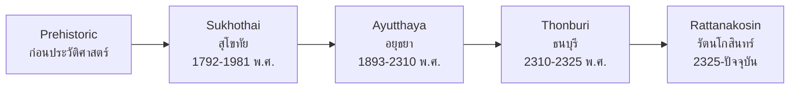

# Thai History — ประวัติศาสตร์ไทย

> *"Understanding the past illuminates the present and guides the future — Thai history is the story of a people who preserved their identity through centuries of change."*

Thai History covers the major periods from prehistoric settlements through the current Rattanakosin era. Students learn about key monarchs, important events, political and cultural development, and how Thailand evolved into the modern nation it is today.

---

## 1 | Grade Band Breakdown

| Grade | Key Content |
|---|---|
| **ป.1–3** | Family timeline, important days, stories of important kings, national heroes |
| **ป.4–6** | Thai history periods overview (Sukhothai → Rattanakosin), key monarchs, historical method basics |
| **ม.1–3** | Detailed political/social/cultural development per period, historical evidence, world history connections |
| **ม.4–6** | Critical analysis, historiographical debate, comparative period assessment |

---

## 2 | Thai Historical Periods

---

## 3 | Sukhothai Period (สุโขทัย, พ.ศ. 1792–1981)

| Aspect | Details |
|---|---|
| **Founded** | พ.ศ. 1792 by Pho Khun Bang Klang Hao |
| **Greatest King** | King Ramkhamhaeng (พ่อขุนรามคำแหง) |
| **Key Achievement** | Thai script (อักษรไทย), First Stone Inscription (ศิลาจารึกหลักที่ 1) |
| **Governance** | พ่อปกครองลูก (father governs children) — paternalistic system |
| **Economy** | Agriculture, trade (Nan Chao route) |
| **Culture** | Thai script, Sukhothai Buddha images (ปางมารวิชัย) |
| **Decline** | Weakened, fell under Ayutthaya's influence |

### King Ramkhamhaeng's Contributions

| Contribution | Thai | Significance |
|---|---|---|
| Thai script | อักษรไทย | Created writing system for Thai language |
| Stone inscription | ศิลาจารึก | Earliest Thai historical document |
| Governance | การปกครอง | Open-door policy, justice system |
| Buddhism | พุทธศาสนา | Promoted Theravada Buddhism |

---

## 4 | Ayutthaya Period (อยุธยา, พ.ศ. 1893–2310)

| Aspect | Details |
|---|---|
| **Founded** | พ.ศ. 1893 by King U-Thong (สมเด็จพระรามาธิบดีที่ 1) |
| **Duration** | 417 years — longest Thai kingdom |
| **Governance** | จตุสดมภ์ (four ministries), ศักดินา (rank and land system) |
| **Economy** | International trade (Dutch, French, Portuguese, Japanese) |
| **Fall** | Destroyed by Burmese invasion พ.ศ. 2310 |

### Notable Kings

| King | Thai | Key Achievement |
|---|---|---|
| **King Naresuan** | สมเด็จพระนเรศวรมหาราช | Declared independence from Burma, elephant battle (ยุทธหัตถี) |
| **King Narai** | สมเด็จพระนารายณ์มหาราช | Golden age of diplomacy, French relations |
| **King Taksin** | สมเด็จพระเจ้าตากสินมหาราช | Reunified Thailand after Ayutthaya fell |

---

## 5 | Thonburi Period (ธนบุรี, พ.ศ. 2310–2325)

| Aspect | Details |
|---|---|
| **Founded** | พ.ศ. 2310 by King Taksin |
| **Duration** | 15 years — shortest major period |
| **Key Achievement** | Reunified Thai territories, expelled Burmese |
| **Capital** | Thonburi (ธนบุรี) |
| **End** | King Taksin's reign ended, Chao Phraya Chakri became King Rama I |

---

## 6 | Rattanakosin Period (รัตนโกสินทร์, พ.ศ. 2325–ปัจจุบัน)

### Key Kings and Reforms

| King | Thai | Key Achievement |
|---|---|---|
| **Rama I** | รัชกาลที่ 1 | Founded Bangkok, built Grand Palace |
| **Rama IV** | รัชกาลที่ 4 | Modernization, opened relations with West |
| **Rama V** | รัชกาลที่ 5 | Abolished slavery, modernized government, territorial integrity |
| **Rama IX** | รัชกาลที่ 9 | Sufficiency Economy, longest reign (70 years) |

### Major Modern Events

| Event | Thai | Year | Significance |
|---|---|---|---|
| Siamese Revolution | การปฏิวัติสยาม | 2475 (1932) | Changed from absolute to constitutional monarchy |
| World War II | สงครามโลกครั้งที่ 2 | 2482-2488 (1939-1945) | Thailand allied with Japan, then joined Allies |
| Student Uprising | เหตุการณ์ 14 ตุลา | 2516 (1973) | Democracy movement |
| Black October | เหตุการณ์ 6 ตุลา | 2519 (1976) | Political violence |
| May Crisis | พฤษภาทมิฬ | 2535 (1992) | Pro-democracy protest |

---

## 7 | Historical Sources (หลักฐานทางประวัติศาสตร์)

| Source | Thai | Example |
|---|---|---|
| Stone inscriptions | ศิลาจารึก | Ramkhamhaeng inscription |
| Chronicles | พงศาวดาร | Royal chronicles of Ayutthaya |
| Foreign records | บันทึกชาวต่างชาติ | Chinese, European accounts |
| Archaeology | โบราณคดี | Ban Chiang pottery, Sukhothai kilns |
| Oral tradition | ประเพณีมุขปาฐะ | Folk stories, legends |

---

## 8 | Thai Terminology

| Thai | English |
|---|---|
| ประวัติศาสตร์ | History |
| อาณาจักร | Kingdom |
| สมเด็จพระมหากษัตริย์ | King |
| ศิลาจารึก | Stone inscription |
| พงศาวดาร | Chronicle |
| ยุคสมัย | Era/Period |
| การปฏิวัติ | Revolution |
| การปฏิรูป | Reform |
| เลิกทาส | Abolition of slavery |
| ประชาธิปไตย | Democracy |

---

## 9 | Cross-Links

- [[Social Studies - Overview|← Back to Social Studies]]
- [[01_Democracy_and_Government|Democracy]] — Evolution of Thai governance
- [[02_Thai_Culture_and_Traditions|Thai Culture]] — Cultural development across periods
- [[02_World_History_and_Civilizations|World History]] — Thailand in world context

---

## 10 | Upper Secondary (ม.4-6): Historiography and Critical Analysis

### Thai Historiography (ประวัติศาสตร์นิพนธ์ไทย)

| Era | Thai | Approach | Key Figures |
|---|---|---|---|
| **Traditional** | ดั้งเดิม | Royal chronicles, moral lessons | Court scribes |
| **Reform era** | ยุคปฏิรูป | Scientific history | Prince Damrong |
| **Nationalist** | ชาตินิยม | Nation-building narrative | Luang Wichit Wathakan |
| **Modern academic** | วิชาการสมัยใหม่ | Critical, multi-perspective | Nidhi Eoseewong, Charnvit Kasetsiri |

### Critical Debates in Thai History

| Topic | Debate |
|---|---|
| **Ramkhamhaeng Inscription** | Authentic 13th century or later forgery? |
| **"First" Thai kingdom** | Sukhothai or earlier entities? |
| **Ayutthaya's decline** | Internal decay or external Burmese strength? |
| **King Taksin's downfall** | Mental illness or political framing? |
| **1932 Revolution** | Genuine democracy movement or elite power transfer? |
| **Thai neutrality** | Did Thailand truly "escape" colonization or make concessions? |

### Comparative Period Assessment

| Period | Governance | Economy | Culture | Legacy |
|---|---|---|---|---|
| **Sukhothai** | Paternal | Subsistence + trade | Thai script, Buddhism | Cultural foundation |
| **Ayutthaya** | Sakdina | Global trade | Court culture, literature | Bureaucratic model |
| **Thonburi** | Military | Recovery | Survival | National reunification |
| **Rattanakosin** | Modernizing | Modern economy | Modern Thai identity | Modern Thailand |

### Thailand in World History (ม.4-6)

| Connection | Description |
|---|---|
| **Indianization** | Hindu-Buddhist cultural influence |
| **China trade** | Centuries of tribute and commerce |
| **European contact** | 16th century onward, Bowring Treaty |
| **WWII** | Japanese alliance, Free Thai Movement |
| **Cold War** | US ally, domino theory, Vietnam War |
| **Globalization** | Economic integration, cultural exchange |
