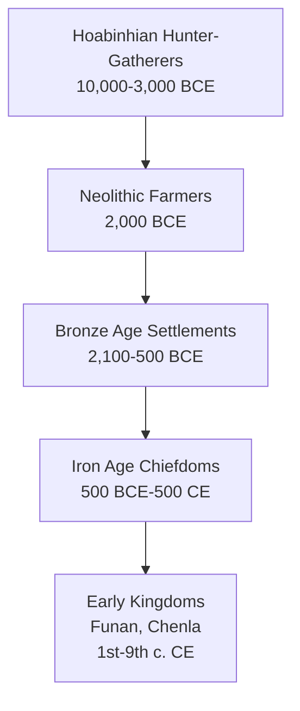

# Prehistoric Thailand — ก่อนประวัติศาสตร์ไทย

> *"The story of humanity in Southeast Asia begins not in written records, but in stone tools, pottery shards, and ancient bones."*

Prehistoric Thailand covers human settlement before written records. Students learn about the Stone Age, Metal Age, and the transition from hunting-gathering to farming communities. Thailand is home to Ban Chiang, one of the world's earliest bronze-age sites.

---

## 1 | Grade Band Breakdown

| Grade | Key Content |
|---|---|
| **ป.1–3** | — |
| **ป.4–6** | Stone Age and Metal Age basics, simple tools |
| **ม.1–3** | Ban Chiang, prehistoric cultures, dating methods |
| **ม.4–6** | Archaeological analysis, migration theories, metallurgy debate |

---

## 2 | Three-Age System (ระบบยุคสามสมัย)

| Age | Thai | Period | Key Features |
|---|---|---|---|
| **Stone Age** | ยุคหิน | ~2.5M years ago – 3000 BCE | Stone tools, hunting-gathering |
| **Bronze Age** | ยุคสำริด | 3000 – 1200 BCE | Bronze tools, settlements |
| **Iron Age** | ยุคเหล็ก | 1200 BCE – 500 CE | Iron tools, complex societies |

### Stone Age Subdivisions

| Period | Thai | Tools | Lifestyle |
|---|---|---|---|
| **Paleolithic** | ยุคหินเก่า | Chipped stone, hand axes | Nomadic hunter-gatherers |
| **Mesolithic** | ยุคหินกลาง | Microliths, bow and arrow | Semi-settled, fishing |
| **Neolithic** | ยุคหินใหม่ | Polished stone, pottery | Farming, permanent villages |

---

## 3 | Key Prehistoric Sites in Thailand

| Site | Thai | Province | Significance |
|---|---|---|---|
| **Ban Chiang** | บ้านเชียง | Udon Thani | Bronze Age, UNESCO site (1992) |
| **Ban Kao** | บ้านเกาะ | Kanchanaburi | Neolithic burial site |
| **Spirit Cave** | ถ้ำผีแมน | Mae Hong Son | Hoabinhian culture, early plant use |
| **Non Nok Tha** | โนนนกทา | Khon Kaen | Early bronze and pottery |
| **Khok Phanom Di** | โคกพนมดี | Chonburi | Neolithic burial, rich grave goods |
| **Phu Wiang** | ภูเวียง | Khon Kaen | Dinosaur fossils |

---

## 4 | Ban Chiang (บ้านเชียง)

| Aspect | Details |
|---|---|
| **Location** | Nong Han District, Udon Thani Province |
| **Discovered** | 1966 (by Stephen Young, accidentally fell into a root) |
| **UNESCO Status** | World Heritage Site since 1992 |
| **Key Finds** | Red-on-buff painted pottery, bronze artifacts, iron tools |
| **Dating** | Originally dated 3600 BCE (now debated: 1500-2100 BCE for bronze) |
| **Significance** | Among earliest bronze-working sites in the world |

### Ban Chiang Cultural Phases

| Phase | Period | Characteristics |
|---|---|---|
| **Early** | 2100–900 BCE | Inhumation burials, flexed position, few bronzes |
| **Middle** | 900–300 BCE | More bronzes, infant jar burials, iron appears |
| **Late** | 300 BCE–200 CE | Rich grave goods, glass beads, trade contacts |

### Ban Chiang Pottery

| Feature | Description |
|---|---|
| **Design** | Red-on-buff spiral, fingerprint, and curvilinear patterns |
| **Technique** | Hand-built, paddle-and-anvil finishing |
| **Function** | burial jars, cooking vessels, ritual objects |
| **UNESCO recognition** | "Outstanding example of early technological and artistic development" |

---

## 5 | Hoabinhian Culture (วัฒนธรรมหอยย่า)

| Aspect | Details |
|---|---|
| **Name** | From Hoa Binh province, Vietnam |
| **Period** | 10,000 – 3,000 BCE |
| **Distribution** | Throughout mainland Southeast Asia |
| **Lifestyle** | Hunter-gatherers in caves and rock shelters |
| **Tools** | Unifacial pebble tools (chipped on one side) |
| **Diet** | Nuts, roots, shellfish, small game |
| **Significance** | Earliest well-defined culture in Southeast Asia |

---

## 6 | Neolithic Revolution in Thailand (การปฏิวัติยุคหินใหม่)

| Change | Thai | Description |
|---|---|---|
| **Agriculture** | เกษตรกรรม | Rice cultivation began ~2000 BCE |
| **Settlement** | การตั้งถิ่นฐาน | Permanent villages near water |
| **Pottery** | เครื่องปั้นดินเผา | Storage, cooking vessels |
| **Domestication** | การเลี้ยงสัตว์ | Dogs, pigs, cattle, water buffalo |
| **Textiles** | สิ่งทอ | Evidence of spindle whorls |

---

## 7 | Metal Age Transition (ยุคโลหะ)

| Development | Thai | Impact |
|---|---|---|
| **Bronze working** | การหล่อสำริด | Better tools, weapons, ritual objects |
| **Iron working** | การถลุงเหล็ก | Stronger tools, agricultural expansion |
| **Social stratification** | การแบ่งชนชั้น | Wealthy burials suggest hierarchy |
| **Trade networks** | เครือข่ายการค้า | Glass beads, marine shells exchanged |

---

## 8 | Upper Secondary (ม.4-6): Archaeological Debates

### Ban Chiang Dating Controversy

| View | Claim |
|---|---|
| **Original (1970s)** | Bronze working began ~3600 BCE — earlier than anywhere |
| **Revised (1990s-2000s)** | Bronze began ~2100 BCE — still early, but not earliest |
| **Current consensus** | Ban Chiang shows independent Southeast Asian metallurgy |

### Migration Theories

| Theory | Description |
|---|---|
| **Austronesian origin** | Austroasiatic speakers migrated from south China |
| **Indigenous development** | Local evolution from Hoabinhian |
| **Current view** | Mixed: migration + local innovation |

### Prehistoric to Historic Transition

---

## 9 | Thai Terminology

| Thai | English |
|---|---|
| ก่อนประวัติศาสตร์ | Prehistoric |
| ยุคหินเก่า | Paleolithic |
| ยุคหินใหม่ | Neolithic |
| ยุคสำริด | Bronze Age |
| ยุคเหล็ก | Iron Age |
| โบราณคดี | Archaeology |
| บ้านเชียง | Ban Chiang |
| เครื่องปั้นดินเผา | Pottery |

---

## 10 | Real-World Examples

- **Ban Chiang pottery** — Distinctive red-on-buff designs found worldwide in museums
- **Dinosaur fossils at Phu Wiang** — New species discovered (Phuwiangosaurus)
- **UNESCO listing (1992)** — Ban Chiang recognized for outstanding universal value
- **Modern controversy** — Looting of Ban Chiang artifacts (US museums returned stolen items)

---

## 11 | Cross-Links

- [[Social Studies - Overview|← Back to Social Studies]]
- [[01_Thai_History|Thai History]] — Continuation into historic periods
- [[03_Historical_Method|Historical Method]] — Archaeological evidence
- [[14_Historical_Sources|Historical Sources]] — Material evidence
