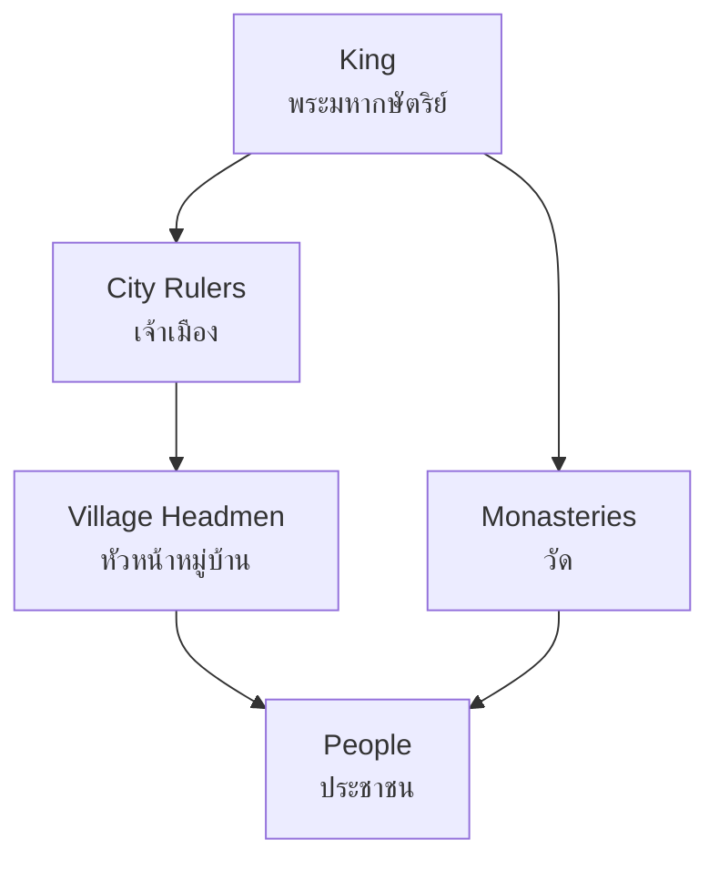

# Sukhothai Period — สมัยสุโขทัย

> *"ในน้ำมีปลา ในนามีข้าว"* — *"In the water there are fish, in the fields there is rice."* — Ramkhamhaeng Inscription

The Sukhothai Period (1238–1438 CE / พ.ศ. 1781–1981) is considered the dawn of Thai civilization. Students learn about the founding of the first Thai kingdom, King Ramkhamhaeng's contributions, the creation of the Thai alphabet, and the cultural foundations that shaped Thai identity.

---

## 1 | Grade Band Breakdown

| Grade | Key Content |
|---|---|
| **ป.1–3** | Stories of King Ramkhamhaeng, simple legends |
| **ป.4–6** | Sukhothai as first Thai kingdom, key achievements |
| **ม.1–3** | Political structure, culture, religion, trade |
| **ม.4–6** | Source criticism of Ramkhamhaeng inscription, comparative with Ayutthaya |

---

## 2 | Historical Overview

| Aspect | Details |
|---|---|
| **Founded** | พ.ศ. 1781 (1238 CE) |
| **Founders** | Pho Khun Bang Klang Hao & Pho Khun Pha Mueang |
| **Greatest era** | Reign of King Ramkhamhaeng (พ.ศ. 1822–1841) |
| **Decline** | Late 14th century, became Ayutthaya vassal (พ.ศ. 1921/1378 CE) |
| **Absorbed** | พ.ศ. 1981 (1438 CE) into Ayutthaya |

### Timeline of Key Events

| Year (พ.ศ.) | Year (CE) | Event |
|---|---|---|
| 1781 | 1238 | Sukhothai founded |
| 1822 | 1279 | Ramkhamhaeng ascends throne |
| ~1826 | ~1283 | Thai alphabet created |
| 1841 | 1298 | Ramkhamhaeng dies |
| 1921 | 1378 | Sukhothai becomes Ayutthaya vassal |
| 1981 | 1438 | Fully absorbed into Ayutthaya |

---

## 3 | Kings of Sukhothai

| King | Thai | Reign | Significance |
|---|---|---|---|
| **Pho Khun Bang Klang Hao** | พ่อขุนบางกลางหาว | 1781–1822 | First king (Si Inthrathit) |
| **Ramkhamhaeng** | รามคำแหงมหาราช | 1822–1841 | Greatest king, Thai alphabet |
| **Loethai** | เลิไทย | 1341–1368 | Kingdom declined |
| **Lithai (Maha Thammaracha I)** | ลือไทย/มหาธรรมราชาที่ 1 | 1347–1368/1374 | Buddhist scholar, Traibhumikatha |
| **Sai Lue Thai** | สายลือไทย | 1341–1419 | Last important king |

---

## 4 | King Ramkhamhaeng the Great (พ่อขุนรามคำแหงมหาราช)

### Biography

| Aspect | Details |
|---|---|
| **Birth name** | Phra Ramkhamhaeng |
| **Reign** | พ.ศ. 1822–1841 (1279–1298 CE) |
| **Title** | พ่อขุนรามคำแหงมหาราช |
| **Known for** | Thai alphabet, governance, territorial expansion |

### Contributions

| Contribution | Thai | Description |
|---|---|---|
| **Thai alphabet** | อักษรไทย | Created in ~1283 CE, based on Old Khmer, Mon, and Grantha scripts |
| **Stone Inscription No. 1** | ศิลาจารึกหลักที่ 1 | Earliest Thai literary text, describes Sukhothai's prosperity |
| **Paternal kingship** | พ่อปกครองลูก | "Father rules children" — accessible, just governance |
| **Bell at palace gate** | กระดิ่งหน้าวัง | Citizens could ring bell to petition king directly |
| **Theravada Buddhism** | พุทธศาสนาเถรวาท | Established as state religion |

### Territorial Expansion

| Direction | Territory |
|---|---|
| **North** | Phrae, Nan |
| **East** | Vientiane (Laos) |
| **South** | Nakhon Si Thammarat, Malay peninsula |
| **West** | Martaban (Burma/Myanmar) |

---

## 5 | Ramkhamhaeng Inscription (ศิลาจารึกหลักที่ 1)

| Aspect | Details |
|---|---|
| **Material** | Stone stele |
| **Discovered** | 1833 by King Rama IV (before he became king) |
| **Content** | Describes Sukhothai's prosperity, Ramkhamhaeng's achievements |
| **Significance** | Earliest example of Thai writing |
| **UNESCO** | Registered in Memory of the World Register (2003) |

### Famous Passages

| Quote | Translation |
|---|---|
| ในน้ำมีปลา ในนามีข้าว | "In the water there are fish, in the fields there are rice" |
| พ่อขุนรามคำแหงเจ้าเมืองศรีสัชชนาลัยได้ปลูกฝัง... | King Ramkhamhaeng, lord of Sri Satchanalai, planted... |

---

## 6 | Governance and Society

| Aspect | Thai | Description |
|---|---|---|
| **Paternal rule** | ระบบพ่อปกครองลูก | King as father, subjects as children |
| **Accessibility** | เปิดเผย | Citizens could petition king directly |
| **No slavery** | ไม่มีทาส | "Who wants to trade in elephants, trades. Who wants to trade in horses, trades" |
| **Justice** | ยุติธรรม | Fair trials, king judged personally |
| **Trade** | การค้า | Free trade, people could travel freely |

### Administrative Structure

---

## 7 | Culture and Religion

| Aspect | Thai | Description |
|---|---|---|
| **Theravada Buddhism** | พุทธศาสนาเถรวาท | State religion |
| **Buddha images** | พระพุทธรูป | Walking Buddha (ปางลีลา) — unique to Sukhothai |
| **Art style** | ศิลปะสุโขทัย | Elegant, serene, idealized proportions |
| **Ceramics** | เครื่องสังคโลก | Sangkhalok pottery — famous celadon and brown-glazed wares |
| **Literature** | วรรณคดี | Traibhumikatha (ไตรภูมิกถา) by King Lithai |
| **Architecture** | สถาปัตยกรรม | Lotus-bud stupa (เจดีย์ทรงดอกบัวตูม), lotus-column pillars |

### Sangkhalok Ceramics (เครื่องสังคโลก)

| Type | Description |
|---|---|
| **Celadon** | Green-glazed stoneware |
| **Brown-glazed** | Underglaze iron decoration |
| **White-glazed** | Rare, Chinese-influenced |
| **Export** | Traded to Philippines, Indonesia, China |

---

## 8 | Upper Secondary (ม.4-6): Source Criticism

### Ramkhamhaeng Inscription Debate

| Position | Argument |
|---|---|
| **Authentic** | Linguistic analysis supports 13th century date |
| **Partially later** | Some sections may have been added in later periods |
| **Fabricated** | (Minority view) James Chamberlain argued for later creation |
| **Current consensus** | Mostly authentic, some sections debated |

### Sukhothai vs Ayutthaya Comparison

| Aspect | Sukhothai | Ayutthaya |
|---|---|---|
| **Governance** | Paternal (พ่อปกครองลูก) | Bureaucratic (จตุสดมภ์, ศักดินา) |
| **Society** | Egalitarian | Hierarchical (sakdina) |
| **Religion** | Theravada | Theravada + Hindu elements |
| **Trade** | Regional | International (global) |
| **Art** | Elegant, spiritual | Majestic, ornate |

---

## 9 | Thai Terminology

| Thai | English |
|---|---|
| สุโขทัย | Sukhothai |
| พ่อขุนรามคำแหง | Ramkhamhaeng |
| ศิลาจารึก | Stone inscription |
| อักษรไทย | Thai alphabet/script |
| สังคโลก | Sangkhalok (ceramics) |
| พ่อปกครองลูก | Paternal rule |
| พุทธศาสนาเถรวาท | Theravada Buddhism |
| เจดีย์ทรงดอกบัวตูม | Lotus-bud stupa |

---

## 10 | Real-World Examples

- **Sukhothai Historical Park** — UNESCO World Heritage site, ruins of old capital
- **Si Satchanalai** — Satellite city, major ceramics production center
- **Sangkhalok pottery** — Found in shipwrecks throughout Southeast Asia
- **Thai alphabet day** — การประกาศใช้อักษรไทย, celebrated annually

---

## 11 | Cross-Links

- [[Social Studies - Overview|← Back to Social Studies]]
- [[01_Thai_History|Thai History]] — Sukhothai in context of Thai periods
- [[06_Ayutthaya_Period|Ayutthaya]] — Successor kingdom
- [[09_Important_Monarchs|Important Monarchs]] — Ramkhamhaeng
