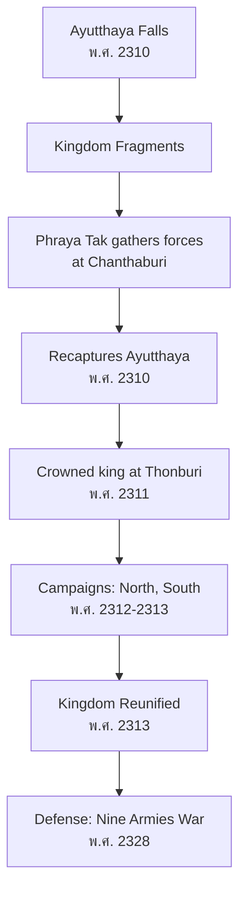
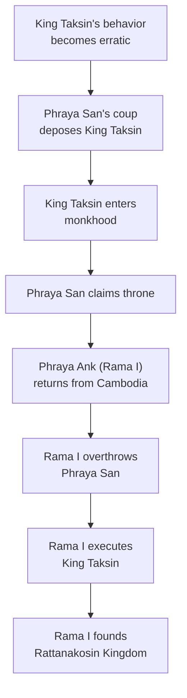

# Thonburi Period — สมัยธนบุรี

> *"At a time when all seemed lost, one man rose to reunite the kingdom."*

The Thonburi Period (1767–1782 CE / พ.ศ. 2310–2325) was the shortest major period in Thai history — only 15 years. Yet King Taksin the Great achieved the seemingly impossible: reunifying a shattered kingdom after the fall of Ayutthaya. Students learn about this critical transitional period and the controversial assessment of King Taksin's reign.

---

## 1 | Grade Band Breakdown

| Grade | Key Content |
|---|---|
| **ป.1–3** | — |
| **ป.4–6** | King Taksin as hero, reunification story |
| **ม.1–3** | Detailed campaigns, capital at Thonburi, political context |
| **ม.4–6** | Reign assessment, historiographical debate, causes of downfall |

---

## 2 | Historical Overview

| Aspect | Details |
|---|---|
| **Founded** | พ.ศ. 2310 (1767 CE) |
| **Founder** | King Taksin (สมเด็จพระเจ้ากรุงธนบุรี) |
| **Duration** | 15 years (shortest major period) |
| **Capital** | Thonburi (ธนบุรี), west bank of Chao Phraya |
| **End** | พ.ศ. 2325 (1782 CE) — King Taksin deposed, Rama I founded Rattanakosin |

---

## 3 | King Taksin the Great (สมเด็จพระเจ้าตากสินมหาราช)

### Biography

| Aspect | Details |
|---|---|
| **Birth name** | Sin (สิน) |
| **Father** | Chinese immigrant (Hai Hong) |
| **Mother** | Thai woman (Nok-iang) |
| **Title before king** | Phraya Tak (พระยาตาก) — governor of Tak |
| **Role at Ayutthaya fall** | Broke through Burmese lines to gather forces in east |

### Military Campaigns (Reunification)

| Campaign | Thai | Year | Result |
|---|---|---|---|
| **Breakout from Ayutthaya** | การตีฝ่าวงล้อม | 2310 (1767) | Gathered 500 troops at Chanthaburi |
| **Recapture Ayutthaya** | ตีกรุงศรีอยุธยากลับคืน | 2310 (1767) | Defeated Burmese garrison |
| **Conquer the North** | ปราบเหนือ | 2313 (1770) | Reunified northern territories |
| **Defeat Phra Fang** | ปราบพระฝ่าย | 2313 (1770) | Ended independent regime in Phitsanulok |
| **Conquer Nakhon Si Thammarat** | ปราบใต้ | 2312 (1769) | Reunified southern provinces |
| **Cambodian campaigns** | ศึกเขมร | 2314-2315 | Exercised suzerainty |
| **Nine Armies War** | ศึกเก้าทัพ | 2328 (1785) | Defended against major Burmese invasion |

### Why Thonburi as Capital?

| Reason | Description |
|---|---|
| **Ayutthaya destroyed** | Too damaged to rebuild quickly |
| **Strategic location** | Near coast for trade and naval defense |
| **Fortified** | Wat Arun and forts provided defense |
| **Provisioning** | Easier to supply from sea |

---

## 4 | Reunification Process

---

## 5 | Challenges During Thonburi Period

| Challenge | Thai | Description |
|---|---|---|
| **Economic ruin** | เศรษฐกิจพังพินาศ | Treasury empty, farmlands abandoned |
| **Population loss** | ประชากรลดลง | Thousands deported by Burmese |
| **Rival regimes** | ก๊กต่าง ๆ | 5+ competing factions claimed territory |
| **Burma threat** | ภัยจากพม่า | Continued military pressure |
| **Limited resources** | ทรัพยากรจำกัด | 15-year reign, constant warfare |

---

## 6 | King Taksin's Religious Policy

| Policy | Thai | Description |
|---|---|---|
| **Buddhist reform** | ปฏิรูปพุทธศาสนา | Concentrated monks for discipline |
| **Religious studies** | การศึกษาพระปริยัติ | Sponsored scriptural study |
| **Personal practice** | การปฏิบัติธรรม | Later claimed spiritual attainment |
| **Controversy** | ข้อวิพากษ์ | Later years: claimed to be Buddhameissa (พุทธเษฐีย์) |

---

## 7 | Downfall and Transition

### Causes of Downfall

| Factor | Thai | Description |
|---|---|---|
| **Mental health** | พระสติวิปลาส | Historical accounts describe erratic behavior |
| **Religious claims** | อ้างตนเป็นพุทธเษฐีย์ | Claimed spiritual supremacy over monks |
| **Factional conflict** | ความขัดแย้ง | Court factions opposed his rule |
| **Harsh punishment** | การลงโทษรุนแรง | Executed officials and monks who opposed him |
| **Coup** | การรัฐประหาร | 1782 — Phraya San staged coup |

### Sequence of Events (พ.ศ. 2325 / 1782)

---

## 8 | Upper Secondary (ม.4-6): Historiographical Debate

### Assessment of King Taksin

| Perspective | Argument |
|---|---|
| **Hero narrative** | Saved the nation from destruction, reunified kingdom |
| **Critical view** | Later years marred by instability and religious claims |
| **Balanced assessment** | Extraordinary military leader, complex legacy |
| **Rehabilitation** | Modern scholars emphasize his achievements over downfall |

### Was King Taksin "Mad"?

| View | Argument |
|---|---|
| **Traditional** | Royal chronicles describe mental deterioration |
| **Revisionist** | May have been political framing by successors |
| **Medical speculation** | Possible stress, overwork, or other conditions |
| **Caution** | Diagnosing historical figures is speculative |

### King Taksin's Legacy

| Legacy | Description |
|---|---|
| **National hero** | Officially honored as "the Great" (มหาราช) since 1954 |
| **Wat Arun** | Built Temple of Dawn, national symbol |
| **Chinese-Thai identity** | Part-Chinese king reflects Thailand's multicultural heritage |
| **Taksin Bridge** | Named after him in Bangkok |
| **King Taksin the Great Day** | December 28, national commemoration |

---

## 9 | Thai Terminology

| Thai | English |
|---|---|
| ธนบุรี | Thonburi |
| สมเด็จพระเจ้าตากสินมหาราช | King Taksin the Great |
| การรวบรวมหัวเมือง | Reunification of territories |
| ฉันทบุรี | Chanthaburi |
| ศึกเก้าทัพ | War of Nine Armies |
| วัดอรุณ | Wat Arun (Temple of Dawn) |
| พุทธาภิเษก | Buddhameissa claim |

---

## 10 | Real-World Examples

- **King Taksin the Great Shrine** — Memorial at Wongwian Yai, Bangkok
- **Wat Arun** — Iconic temple built during Thonburi period
- **King Taksin Day (Dec 28)** — National commemoration since 1954
- **Chanthaburi** — Where King Taksin gathered forces, now a historic city

---

## 11 | Cross-Links

- [[Social Studies - Overview|← Back to Social Studies]]
- [[01_Thai_History|Thai History]] — Thonburi in context
- [[06_Ayutthaya_Period|Ayutthaya]] — Preceding period
- [[08_Rattanakosin_Period|Rattanakosin]] — Succeeding period
