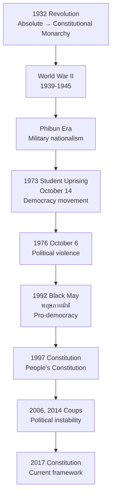

# Rattanakosin Period — สมัยรัตนโกสินทร์

> *"Thailand's journey from absolute monarchy to constitutional democracy, from feudal kingdom to modern nation."*

The Rattanakosin Period (1782–present / พ.ศ. 2325–ปัจจุบัน) covers the Chakri Dynasty from its founding to modern Thailand. Students learn about the critical reforms of Kings Rama IV and Rama V, the 1932 transition to constitutional monarchy, and the political evolution through the 20th century.

---

## 1 | Grade Band Breakdown

| Grade | Key Content |
|---|---|
| **ป.1–3** | Current dynasty stories, King Rama IX, Grand Palace |
| **ป.4–6** | Key reforms (Rama IV, V), main events |
| **ม.1–3** | Modernization, democracy movement, major events |
| **ม.4–6** | Political analysis, democracy vs military rule, constitutional development |

---

## 2 | Founding of Bangkok (การสถาปนากรุงรัตนโกสินทร์)

| Aspect | Details |
|---|---|
| **Founded** | April 21, พ.ศ. 2325 (April 21, 1782) |
| **Founder** | King Rama I (Phutthayotfa Chulalok / รัชกาลที่ 1) |
| **Location** | East bank of Chao Phraya (Rattanakosin Island) |
| **Name** | กรุงเทพมหานคร อมรรัตนโกสินทร์ มหินทรายุธยา |
| **Significance** | Reestablished Thai state after Thonburi period |

---

## 3 | Chakri Dynasty Kings (ราชวงศ์จักรี)

| King | Thai | Reign | Key Achievement |
|---|---|---|---|
| **Rama I** | รัชกาลที่ 1 | 2325–2352 | Founded Bangkok, revived culture, codified law |
| **Rama II** | รัชกาลที่ 2 | 2352–2567 | Arts and literature golden age |
| **Rama III** | รัชกาลที่ 3 | 2367–2394 | Trade expansion, temple art |
| **Rama IV** | รัชกาลที่ 4 | 2394–2411 | Modernization, Western relations |
| **Rama V** | รัชกาลที่ 5 | 2411–2453 | Major reforms, abolition of slavery |
| **Rama VI** | รัชกาลที่ 6 | 2453–2468 | Nationalism, education, scouting |
| **Rama VII** | รัชกาลที่ 7 | 2468–2477 | Last absolute monarch |
| **Rama VIII** | รัชกาลที่ 8 | 2477–2489 | Young king, died tragically |
| **Rama IX** | รัชกาลที่ 9 | 2489–2559 | Sufficiency Economy, longest reign |
| **Rama X** | รัชกาลที่ 10 | 2559–present | Current king |

---

## 4 | Early Rattanakosin (Rama I–III)

### Rama I: Foundation (2325–2352)

| Achievement | Thai | Description |
|---|---|---|
| **Grand Palace** | พระบรมมหาราชวัง | Built royal palace and Wat Phra Kaew |
| **Law codification** | กฎหมายตราสามดวง | Laws of Three Seals (1805) |
| **Literary revival** | ฟื้นฟูวรรณคดี | Ramakien (รามเกียรติ์), revised literature |
| **Buddhist canon** | พระไตรปิฎก | Convened council to revise Tripitaka |

### Rama III: Trade Era (2367–2394)

| Achievement | Thai | Description |
|---|---|---|
| **Trade with China** | การค้าจีน | Rice exports, tribute trade |
| **Temple building** | การสร้างวัด | Wat Pho (วัดโพธิ์), Wat Arun restoration |
| **Medical education** | การแพทย์ | Wat Pho stone inscriptions on medicine |
| **Macaque trade** | ของป่า | Elephant, sapanwood, tin exports |

---

## 5 | Reform Era: Rama IV and Rama V (2394–2453)

### King Rama IV (King Mongkut / พระบาทสมเด็จพระจอมเกล้าเจ้าอยู่หัว)

| Reform | Thai | Description |
|---|---|---|
| **Western relations** | ความสัมพันธ์กับตะวันตก | Treaties with Britain (Bowring Treaty, 1855) |
| **Modernization** | ทำนายอุปราคา | Calculated eclipse (1868) |
| **Education** | การศึกษา | Hired Western tutors (Anna Leonowens) |
| **Religion** | สาสนา | Founded Thammayut Nikaya order |
| **Printing** | การพิมพ์ | Introduced printing press |

### King Rama V (King Chulalongkorn / พระบาทสมเด็จพระจุลจอมเกล้าเจ้าอยู่หัว)

The most revered reformer. Major reforms:

| Reform Area | Thai | Description |
|---|---|---|
| **Abolition of slavery** | เลิกทาส | Gradual emancipation (37 years, 1874–1911) |
| **Administrative reform** | การปกครอง | Replaced Chatusadom with 12 ministries (1892) |
| **Provincial reform** | เทศาภิบาล | Monthon system (1892-1915) |
| **Education** | การศึกษา | Compulsory education, schools |
| **Railways** | ทางรถไฟ | First railway (Bangkok–Pak Nam, 1893) |
| **Health** | การสาธารณสุข | First hospital (Siriraj, 1888) |
| **Military** | ทหาร | Modern army, conscription (1905) |
| **Territorial integrity** | อธิปไตย | Negotiated to avoid colonization |

### Territorial Changes Under Rama V

| Territory | Status Change |
|---|---|
| **Laos (east of Mekong)** | Ceded to France (1893, 1904, 1907) |
| **Cambodian provinces** | Ceded to France (1907) |
| **Malay states** | Ceded to Britain (1909) |
| **Shan states** | Ceded to Britain (1893) |
| **Remaining territory** | Core Siam preserved independence |

---

## 6 | Nationalism and Pre-War Era (Rama VI–VII)

### King Rama VI (พระบาทสมเด็จพระมงกุฎเกล้าเจ้าอยู่หัว)

| Achievement | Thai | Description |
|---|---|---|
| **Nationalism** | ชาตินิยม | "Nation, Religion, King" ideology |
| **Education** | การศึกษา | Compulsory Education Act (1921) |
| **Scouting** | ลูกเสือ | Founded Thai scouting (1911) |
| **WWI** | สงครามโลกครั้งที่ 1 | Joined Allies (1917), gained international recognition |
| **Literature** | วรรณคดี | Prolific author, translated Shakespeare |

### King Rama VII (พระบาทสมเด็จพระปกเกล้าเจ้าอยู่หัว)

| Aspect | Details |
|---|---|
| **Reign** | 2468–2477 (1925–1935) |
| **Challenge** | Economic problems (Great Depression) |
| **Constitution** | Drafted a constitution (not implemented before coup) |
| **End** | Abdicated after 1932 revolution |

---

## 7 | 1932 Revolution (การปฏิวัติสยาม 2475)

| Aspect | Details |
|---|---|
| **Date** | June 24, พ.ศ. 2475 (June 24, 1932) |
| **Group** | Khana Ratsadon (คณะราษฎร) — People's Party |
| **Leaders** | Pridi Banomyong, Phraya Phaholpholphayuhasena, Phraya Songsuradet |
| **Change** | Absolute monarchy → constitutional monarchy |
| **Significance** | End of 700+ years of absolute monarchy |

---

## 8 | 20th Century Political Events

### Key Political Events

| Event | Thai | Year | Significance |
|---|---|---|---|
| **1932 Revolution** | การปฏิวัติ 2475 | 2475 (1932) | End of absolute monarchy |
| **WWII** | สงครามโลกครั้งที่ 2 | 2482–2488 | Alliance with Japan |
| **Phibun government** | รัฐบาลจอมพล ป. | 2481–2507 | Name changed to Thailand (2482) |
| **October 14 Uprising** | เหตุการณ์ 14 ตุลา 2516 | 2516 (1973) | Student-led democracy movement |
| **October 6** | เหตุการณ์ 6 ตุลา 2519 | 2519 (1964) | Massacre at Thammasat University |
| **Black May** | พฤษภาทมิฬ 2535 | 2535 (1992) | Pro-democracy protests crushed |
| **2006 Coup** | รัฐประหาร 2549 | 2549 (2006) | Military overthrew Thaksin government |
| **2014 Coup** | รัฐประหาร 2557 | 2557 (2014) | NCPO seized power |

---

## 9 | Upper Secondary (ม.4-6): Democracy vs Military Rule

### Patterns of Thai Politics

| Pattern | Description |
|---|---|
| **Cycles** | Democracy → coup → military rule → election → repeat |
| **Coups** | 19 successful coups since 1932 (most of any country) |
| **Role of monarchy** | King as stabilizing force, arbiter |
| **Military** | Powerful political actor, claims "protector" role |
| **Civil society** | Growing student, NGO, professional movements |

### Constitutional Development

| Constitution | Year | Key Feature |
|---|---|---|
| **First (Temporary)** | 2475 (1932) | Established constitutional monarchy |
| **1946** | 2489 | Democratic, two-house parliament |
| **"Permanent"** | Multiple | Most lasted only a few years |
| **1997 "People's"** | 2540 | Most democratic, written with public input |
| **2007** | 2550 | Post-2006 coup, appointed Senate |
| **2017** | 2560 | Current, post-2014 coup, 250 appointed senators |

---

## 10 | King Rama IX (King Bhumibol Adulyadej)

| Aspect | Details |
|---|---|
| **Reign** | พ.ศ. 2489–2559 (1946–2016) — 70 years, longest in world |
| **Born** | December 5, 1927 (Cambridge, Massachusetts) |
| **Coronation** | May 5, 1950 |
| **Philosophy** | Sufficiency Economy Philosophy |
| **Projects** | 4,000+ Royal Development Projects |
| **Legacy** | Revered as "Father of the Nation" |

### Key Contributions

| Area | Thai | Description |
|---|---|---|
| **Rural development** | การพัฒนาชนบท | Royal projects in agriculture, water, health |
| ** Sufficiency Economy** | เศรษฐกิจพอเพียง | Philosophy for sustainable living |
| **Unity** | ความสามัคคี | Symbol of national unity during crises |
| **Music** | ดนตรี | Composed jazz, received international recognition |
| **Sailing** | การแล่นเรือ | Won SEAP Games gold medal (1967) |

---

## 11 | Thai Terminology

| Thai | English |
|---|---|
| รัตนโกสินทร์ | Rattanakosin |
| ราชวงศ์จักรี | Chakri Dynasty |
| พระบาทสมเด็จพระจุลจอมเกล้าเจ้าอยู่หัว | King Chulalongkorn (Rama V) |
| พระบาทสมเด็จพระเจ้าอยู่หัว | King (current) |
| เลิกทาส | Abolition of slavery |
| คณะราษฎร | People's Party |
| การปฏิวัติ | Revolution |
| รัฐประหาร | Coup d'état |
| รัฐธรรมนูญ | Constitution |
| พฤษภาทมิฬ | Black May |

---

## 12 | Real-World Examples

- **Grand Palace & Wat Phra Kaew** — Built by Rama I, major tourist destination
- **Democracy Monument** — Built to commemorate 1932 revolution
- **October 14 Memorial** — Commemorates 1973 democracy uprising
- **Royal projects** — Visit Doi Tung, Huai Hong Khrai to see Rama IX's work
- **2017 Constitution** — Current governing document

---

## 13 | Cross-Links

- [[Social Studies - Overview|← Back to Social Studies]]
- [[01_Thai_History|Thai History]] — Rattanakosin in context
- [[07_Thonburi_Period|Thonburi]] — Preceding period
- [[09_Important_Monarchs|Important Monarchs]] — Detailed king profiles
