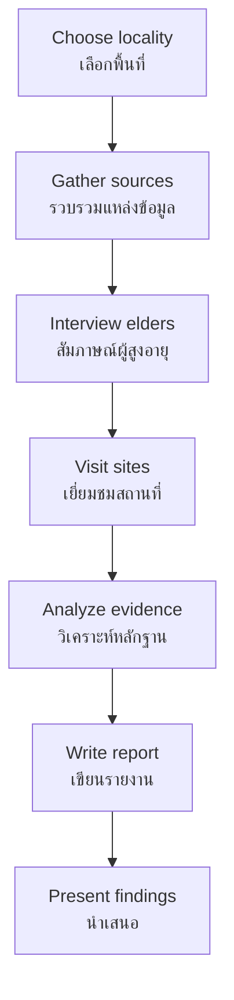

# Local History — ประวัติศาสตร์ท้องถิ่น

> *"History is not only made in capitals. Every village, every temple, every family has a story worth preserving."*

Local History brings historical thinking down to the personal level. Students learn to research the history of their own community, province, and region — gathering oral histories, studying local landmarks, and connecting family stories to broader historical patterns.

---

## 1 | Grade Band Breakdown

| Grade | Key Content |
|---|---|
| **ป.1–3** | Family history, important local places, community helpers |
| **ป.4–6** | Community history, local landmarks, provincial identity |
| **ม.1–3** | Provincial research, oral history projects, local archives |
| **ม.4–6** | Methodology application, comparative local studies, heritage preservation |

---

## 2 | What is Local History? (ประวัติศาสตร์ท้องถิ่นคืออะไร?)

| Aspect | Thai | Description |
|---|---|---|
| **Definition** | นิยาม | History of a specific locality: village, district, province |
| **Scope** | ขอบเขต | Smaller than national, larger than family |
| **Sources** | แหล่งข้อมูล | Oral histories, local documents, material culture |
| **Value** | คุณค่า | Connects people to place, preserves identity |

### Why Local History Matters

| Reason | Thai | Description |
|---|---|---|
| **Identity** | อัตลักษณ์ | Understanding "who we are" through place |
| **Connection** | ความผูกพัน | Emotional bond to community |
| **Diversity** | ความหลากหลาย | Thailand is not monolithic — regions differ |
| **Preservation** | การอนุรักษ์ | Local knowledge disappears if not recorded |
| **Critical thinking** | การคิดวิเคราะห์ | History is not just what's in textbooks |

---

## 3 | Levels of Local History

| Level | Thai | Focus | Example |
|---|---|---|---|
| **Family** | ครอบครัว | Genealogy, family stories | Grandparents' migration story |
| **Village/Muban** | หมู่บ้าน | Community founding, key events | How village got its name |
| **Sub-district/Tambon** | ตำบล | Local institutions, temples | History of local wat |
| **District/Amphoe** | อำเภอ | Administrative history | When district was established |
| **Province/Changwat** | จังหวัด | Regional identity, major events | Provincial founding |
| **Region** | ภาค | Cultural region history | Lanna, Isan, Southern history |

---

## 4 | Regional Histories of Thailand

Thailand's regions have distinct historical traditions:

### Northern Thailand (ภาคเหนือ) — Lanna Kingdom

| Aspect | Details |
|---|---|
| **Kingdom** | Lanna (อาณาจักรล้านนา) |
| **Founded** | พ.ศ. 1839 (1296 CE) by King Mangrai |
| **Capital** | Chiang Mai |
| **Culture** | Distinct language (Kam Mueang), script (Tua Mueang), festivals (Yi Peng) |
| **Joined Thailand** | พ.ศ. 2442 (1899) under Rama V |

### Northeastern Thailand (ภาคอีสาน) — Lan Xang Heritage

| Aspect | Details |
|---|---|
| **Heritage** | Lan Xang Kingdom (ล้านช้าง), Khmer influence |
| **Culture** | Isan language (Lao dialect), sticky rice, Mor Lam music |
| **Khmer ruins** | Phanom Rung, Phimai |
| **Prehistoric sites** | Ban Chiang, Non Nok Tha |

### Southern Thailand (ภาคใต้) — Maritime Kingdoms

| Aspect | Details |
|---|---|
| **Kingdoms** | Srivijaya, Ligor (Nakhon Si Thammarat), Pattani |
| **Culture** | Malay influence, Islamic heritage, sea trade |
| **Key sites** | Wat Phra Mahathat (Nakhon Si), old port cities |
| **Economy** | Tin, rubber, fishing, tourism |

### Central Thailand (ภาคกลาง) — Heartland

| Aspect | Details |
|---|---|
| **Kingdoms** | Sukhothai, Ayutthaya, Rattanakosin |
| **Culture** | Standard Thai, central plains rice farming |
| **Rivers** | Chao Phraya basin — cradle of Thai civilization |
| **Significance** | Political and economic center |

---

## 5 | Sources for Local History Research

| Source Type | Thai | Examples | How to Access |
|---|---|---|---|
| **Oral history** | ประวัติศาสตร์มุขปาฐะ | Interviews with elders | Record interviews |
| **Local documents** | เอกสารท้องถิ่น | Temple records, land deeds | Visit temples, district offices |
| **Material culture** | วัตถุโบราณ | Old buildings, tools, artifacts | Field survey |
| **Photographs** | ภาพถ่าย | Family albums, temple photos | Family collections |
| **Newspapers** | หนังสือพิมพ์ | Local news archives | Provincial libraries |
| **Maps** | แผนที่ | Old maps showing changes | National Archives |

---

## 6 | Conducting Oral History Interviews

### Preparation

| Step | Thai | Description |
|---|---|---|
| **Choose informant** | เลือกผู้ให้สัมภาษณ์ | Elder with knowledge of community |
| **Prepare questions** | เตรียมคำถาม | Open-ended, non-leading questions |
| **Get consent** | ขออนุญาต | Explain purpose, get permission to record |
| **Test equipment** | เตรียมอุปกรณ์ | Recorder, camera, notebook |

### Interview Questions

| Category | Sample Questions |
|---|---|
| **Origins** | "When was this village founded? Who were the first settlers?" |
| **Daily life** | "What was daily life like 50 years ago?" |
| **Key events** | "What major events happened in this community?" |
| **Changes** | "How has this community changed over your lifetime?" |
| **Traditions** | "What local traditions or ceremonies are important?" |

---

## 7 | Local History Project Framework

### Steps for Student Project

---

## 8 | Heritage Preservation (การอนุรักษ์มรดกทางวัฒนธรรม)

| Type | Thai | Example |
|---|---|---|
| **Tangible heritage** | มรดกที่จับต้องได้ | Buildings, artifacts, landscapes |
| **Intangible heritage** | มรดกที่จับต้องไม่ได้ | Traditions, language, crafts, music |
| **Natural heritage** | มรดกทางธรรมชาติ | Forests, mountains, rivers |

### UNESCO World Heritage Sites in Thailand

| Site | Thai | Type | Year |
|---|---|---|---|
| **Historic City of Ayutthaya** | อุทยานประวัติศาสตร์อยุธยา | Cultural | 1991 |
| ** Historic Town of Sukhothai** | อุทยานประวัติศาสตร์สุโขทัย | Cultural | 1991 |
| **Ban Chiang** | บ้านเชียง | Cultural | 1992 |
| **Dong Phayayen-Khao Yai** | ดงพญาเย็น-เขาใหญ่ | Natural | 2005 |
| **Kaeng Krachan** | แก่งกระจาน | Natural | 2021 |

---

## 9 | Upper Secondary (ม.4-6): Applied Methodology

### Comparative Local Studies

| Approach | Description |
|---|---|
| **Cross-regional** | Compare local history of North, Northeast, South |
| **Thematic** | Compare how same theme (e.g., Buddhism) differs locally |
| **Diachronic** | How one locality changed over time |
| **Synchronic** | Compare localities at same time period |

### Public History and Heritage

| Concept | Thai | Description |
|---|---|---|
| **Public history** | ประวัติศาสตร์สาธารณะ | History presented to general public |
| **Community archaeology** | โบราณคดีชุมชน | Communities research their own past |
| **Digital humanities** | มนุษยศาสตร์ดิจิทัล | Using technology to preserve history |
| **Heritage tourism** | การท่องเที่ยวเชิงมรดก | Economic value of historical sites |

---

## 10 | Thai Terminology

| Thai | English |
|---|---|
| ประวัติศาสตร์ท้องถิ่น | Local history |
| ประวัติศาสตร์มุขปาฐะ | Oral history |
| ชาวบ้าน | Villagers / local people |
| ภูมิปัญญาท้องถิ่น | Local wisdom |
| มรดกทางวัฒนธรรม | Cultural heritage |
| อนุรักษ์ | Conserve / preserve |
| ท้องถิ่น | Locality |
| ถิ่นกำเนิด | Place of origin |

---

## 11 | Real-World Examples

- **Local temple records** — Many wats have centuries of birth, death, ordination records
- **Provincial museums** — Every province has a museum showcasing local history
- **Family genealogies** — Chinese-Thai families often keep detailed family trees
- **Village founding stories** — Many Isan villages have origin legends tied to specific families

---

## 12 | Cross-Links

- [[Social Studies - Overview|← Back to Social Studies]]
- [[01_Thai_History|Thai History]] — National context for local stories
- [[03_Historical_Method|Historical Method]] — Research methods
- [[14_Historical_Sources|Historical Sources]] — Source types
