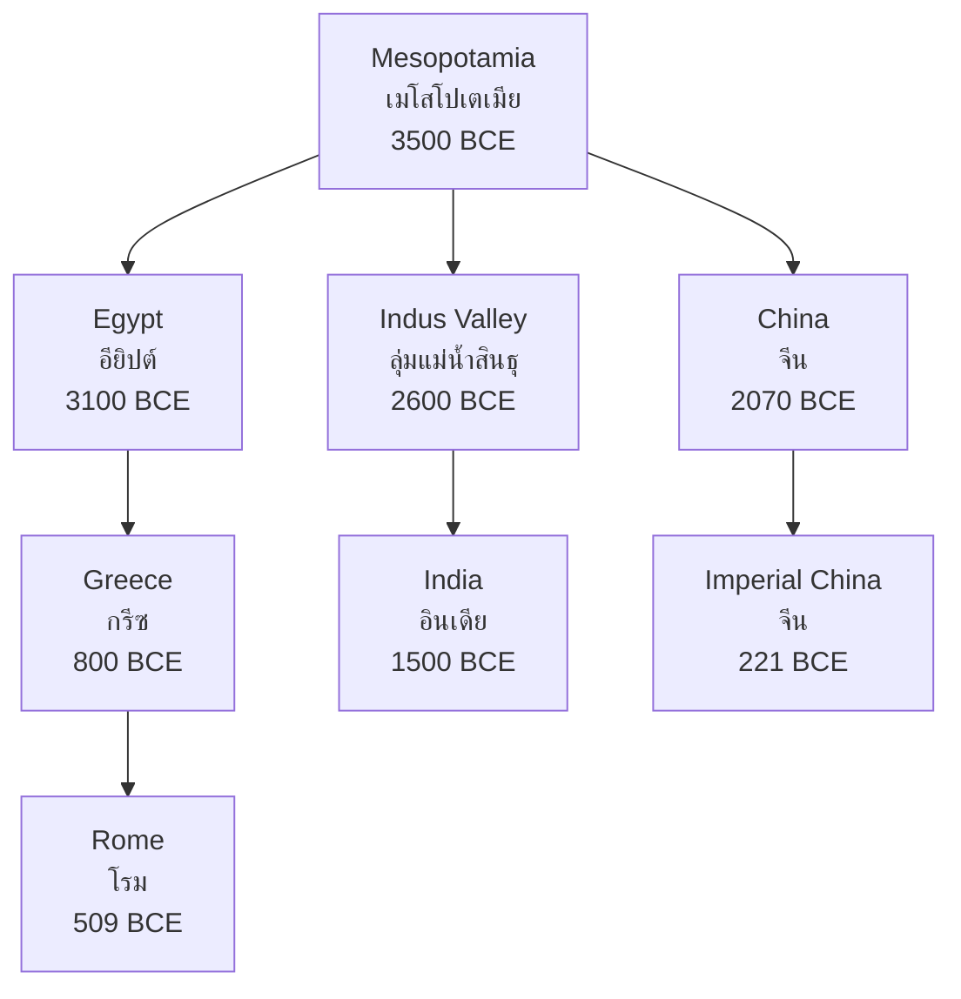

# Ancient Civilizations — อารยธรรมโบราณ

> *"Civilization is the progress toward a society of privacy. The savage's whole existence is public."* — Ayn Rand

Ancient Civilizations examines the foundational societies that shaped human development. From the first cities of Mesopotamia to the philosophical achievements of Greece, students learn how civilizations emerged, developed, and influenced one another.

---

## 1 | Grade Band Breakdown

| Grade | Key Content |
|---|---|
| **ป.1–3** | — |
| **ป.4–6** | Ancient civilizations intro (Egypt, Greece, Rome, China) |
| **ม.1–3** | Comparative study, contributions to modern world |
| **ม.4–6** | Deep comparison, causes of rise and fall, legacy analysis |

---

## 2 | Cradles of Civilization

---

## 3 | Mesopotamia (เมโสโปเตเมีย)

| Aspect | Details |
|---|---|
| **Location** | Between Tigris and Euphrates rivers (modern Iraq) |
| **Period** | ~3500–539 BCE |
| **Major cities** | Ur, Uruk, Babylon, Nineveh |
| **Peoples** | Sumerians, Akkadians, Babylonians, Assyrians |

### Key Contributions

| Contribution | Thai | Description |
|---|---|---|
| **Writing** | อักษร | Cuneiform (ตัวลิ่ม) — earliest writing system |
| **Wheel** | ล้อ | Transportation, pottery |
| **Law** | กฎหมาย | Code of Hammurabi (~1750 BCE) |
| **Mathematics** | คณิตศาสตร์ | Base-60 system (60 seconds, 360°) |
| **Astronomy** | ดาราศาสตร์ | Zodiac, 7-day week |
| **Architecture** | สถาปัตยกรรม | Ziggurat (ศาสนสถานรูปพีรามิด) |

### Code of Hammurabi

| Principle | Description |
|---|---|
| **Lex talionis** | "Eye for an eye" — proportional punishment |
| **Social class** | Punishments varied by social status |
| **Written law** | Laws publicly displayed for all to see |
| **Significance** | Earliest comprehensive written legal code |

---

## 4 | Ancient Egypt (อียิปต์โบราณ)

| Aspect | Details |
|---|---|
| **Location** | Nile River valley |
| **Period** | ~3100–30 BCE |
| **Capital** | Memphis, Thebes |
| **Pharaohs** | Khufu, Hatshepsut, Thutmose III, Ramses II, Cleopatra |

### Key Contributions

| Contribution | Thai | Description |
|---|---|---|
| **Pyramids** | พีรามิด | Great Pyramid of Giza (~2560 BCE) |
| **Hieroglyphics** | อักษรภาพ | Picture writing, decoded via Rosetta Stone |
| **Mummification** | การทำมัมมี่ | Preservation of bodies for afterlife |
| **Medicine** | การแพทย์ | Anatomy, surgery, herbal remedies |
| **Mathematics** | คณิตศาสตร์ | Geometry for pyramid construction |
| **Calendar** | ปฏิทิน | 365-day calendar based on Nile flooding |

### Egyptian Periods

| Period | Period | Key Feature |
|---|---|---|
| **Old Kingdom** | 2686–2181 BCE | Pyramid building era |
| **Middle Kingdom** | 2055–1650 BCE | Cultural renaissance |
| **New Kingdom** | 1550–1069 BCE | Empire, famous pharaohs |
| **Late Period** | 664–332 BCE | Decline, foreign rule |
| **Ptolemaic** | 332–30 BCE | Greek rule, ends with Cleopatra |

---

## 5 | Ancient Greece (กรีซโบราณ)

| Aspect | Details |
|---|---|
| **Location** | Aegean Sea, Balkan peninsula |
| **Period** | ~800–146 BCE |
| **Structure** | Independent city-states (polis) |
| **Major cities** | Athens, Sparta, Thebes, Corinth |

### Key Contributions

| Contribution | Thai | Description |
|---|---|---|
| **Democracy** | ประชาธิปไตย | First democracy in Athens (508 BCE) |
| **Philosophy** | ปรัชญา | Socrates, Plato, Aristotle |
| **Theater** | การละคร | Tragedy, comedy (Aeschylus, Sophocles) |
| **Olympics** | กีฬาโอลิมปิก | First Olympic Games (776 BCE) |
| **Mathematics** | คณิตศาสตร์ | Pythagoras, Euclid, Archimedes |
| **Medicine** | การแพทย์ | Hippocrates — "Father of Medicine" |
| **Architecture** | สถาปัตยกรรม | Parthenon, classical orders (Doric, Ionic, Corinthian) |

### Athens vs Sparta

| Feature | Athens | Sparta |
|---|---|---|
| **Government** | Democracy | Military oligarchy |
| **Values** | Wisdom, arts, debate | Strength, discipline, war |
| **Education** | Intellectual | Military training from age 7 |
| **Women** | Restricted | More freedom, physically strong |
| **Economy** | Trade, naval | Agriculture, helots (slaves) |
| **Legacy** | Philosophy, democracy | Military excellence |

---

## 6 | Ancient Rome (โรมโบราณ)

| Aspect | Details |
|---|---|
| **Location** | Italian peninsula, Mediterranean |
| **Period** | 753 BCE – 476 CE (Western), –1453 CE (Eastern) |
| **Structure** | Kingdom → Republic → Empire |

### Key Contributions

| Contribution | Thai | Description |
|---|---|---|
| **Law** | กฎหมาย | Roman law — basis of many legal systems |
| **Engineering** | วิศวกรรม | Roads, aqueducts, bridges, concrete |
| **Government** | การปกครอง | Republic (Senate, consuls) |
| **Latin** | ภาษาละติน | Basis of Romance languages |
| **Calendar** | ปฏิทิน | Julian calendar (months named after Romans) |
| **Christianity** | คริสต์ศาสนา | Spread throughout empire |

### Roman Periods

| Period | Year | Key Feature |
|---|---|---|
| **Kingdom** | 753–509 BCE | Seven kings |
| **Republic** | 509–27 BCE | Senate, consuls, expansion |
| **Empire** | 27 BCE–476 CE | Emperors (Augustus to Romulus Augustulus) |
| **Byzantine** | 330–1453 CE | Eastern Empire, Constantinople |

---

## 7 | Ancient China (จีนโบราณ)

| Aspect | Details |
|---|---|
| **Location** | Yellow River (Huang He), Yangtze |
| **Period** | ~2070 BCE – 1912 CE (imperial) |
| **Major dynasties** | Xia, Shang, Zhou, Qin, Han, Tang, Song, Ming, Qing |

### Key Contributions

| Contribution | Thai | Description |
|---|---|---|
| **Four Great Inventions** | สิ่งประดิษฐ์ 4 อย่าง | Paper, printing, gunpowder, compass |
| **Philosophy** | ปรัชญา | Confucianism, Daoism, Legalism |
| **Great Wall** | กำแพงเมืองจีน | Built/expanded over centuries |
| **Silk** | ผ้าไหม | Silk Road trade network |
| **Civil service exam** | การสอบขุนนาง | Merit-based bureaucracy |
| **Porcelain** | เครื่องปั้นดินเผา | Fine ceramics ("china") |

### Chinese Dynasties

| Dynasty | Period | Key Feature |
|---|---|---|
| **Shang** | 1600–1046 BCE | Bronze work, oracle bones |
| **Zhou** | 1046–256 BCE | Mandate of Heaven, Confucius |
| **Qin** | 221–206 BCE | First unified empire, Great Wall |
| **Han** | 202 BCE–220 CE | Golden age, Silk Road |
| **Tang** | 618–907 CE | Cultural brilliance, poetry |
| **Song** | 960–1279 CE | Inventions, economic revolution |
| **Ming** | 1368–1644 CE | Forbidden City, naval expeditions |
| **Qing** | 1644–1912 CE | Last dynasty, Manchu rule |

---

## 8 | Ancient India (อินเดียโบราณ)

| Aspect | Details |
|---|---|
| **Location** | Indus and Ganges river valleys |
| **Period** | ~2600 BCE – 550 CE |
| **Civilizations** | Indus Valley, Vedic, Mauryan, Gupta |

### Key Contributions

| Contribution | Thai | Description |
|---|---|---|
| **Religions** | ศาสนา | Hinduism, Buddhism, Jainism, Sikhism |
| **Mathematics** | คณิตศาสตร์ | Zero, decimal system, π |
| **Medicine** | การแพทย์ | Ayurveda, surgery (Sushruta) |
| **Architecture** | สถาปัตยกรรม | Stupas, rock-cut temples |
| **Literature** | วรรณคดี | Vedas, epics (Mahabharata, Ramayana) |

---

## 9 | Upper Secondary (ม.4-6): Comparative Analysis

### Why Did Civilizations Rise?

| Factor | Description |
|---|---|
| **River valleys** | Water, fertile soil, transportation |
| **Agriculture** | Food surplus → population growth, specialization |
| **Writing** | Record-keeping, knowledge transmission |
| **Cities** | Centers of trade, governance, culture |
| **Organized religion** | Social cohesion, moral framework |
| **Metalworking** | Better tools and weapons |

### Why Did Civilizations Fall?

| Cause | Examples |
|---|---|
| **Environmental** | Drought, soil exhaustion, climate change |
| **Invasion** | Rome (barbarians), Maya (unknown) |
| **Internal decay** | Corruption, civil war, economic decline |
| **Disease** | Plague of Justinian, Black Death |
| **Combination** | Usually multiple factors interact |

### Legacy Comparison

| Civilization | Greatest Legacy |
|---|---|
| **Mesopotamia** | Writing, law, urban life |
| **Egypt** | Monumental architecture, medicine |
| **Greece** | Democracy, philosophy, science |
| **Rome** | Law, engineering, governance |
| **China** | Technology, bureaucracy, philosophy |
| **India** | Religions, mathematics |

---

## 10 | Thai Terminology

| Thai | English |
|---|---|
| อารยธรรม | Civilization |
| เมโสโปเตเมีย | Mesopotamia |
| อียิปต์ | Egypt |
| กรีซ | Greece |
| โรม | Rome |
| จีน | China |
| พีรามิด | Pyramid |
| ประชาธิปไตย | Democracy |
| ปรัชญา | Philosophy |
| กฎหมาย | Law |

---

## 11 | Real-World Examples

- **Rosetta Stone** — Key to decoding Egyptian hieroglyphics (1799 discovery)
- **Olympic Games** — Revived in 1896, based on ancient Greek tradition
- **Roman law** | Foundation of civil law in many countries including Thailand
- **Silk Road** | Ancient trade network revived as "Belt and Road Initiative"
- **Indian mathematics** | The zero we use daily came from ancient India

---

## 12 | Cross-Links

- [[Social Studies - Overview|← Back to Social Studies]]
- [[02_World_History_and_Civilizations|World History]] — Continuation into modern era
- [[13_SE_Asian_History|SE Asian History]] | Regional civilizations
- [[04_Prehistoric_Thailand|Prehistoric Thailand]] — Thai prehistoric context
