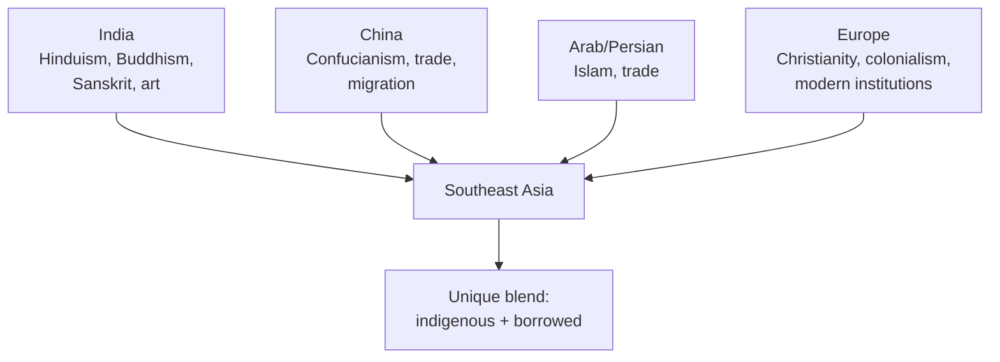
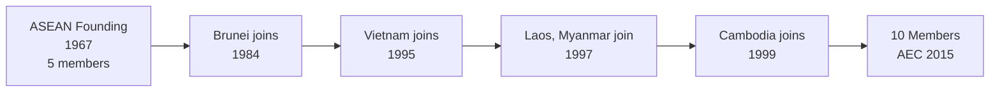

# Southeast Asian History — ประวัติศาสตร์เอเชียตะวันออกเฉียงใต้

> *"Southeast Asia is a crossroads of civilizations — where India, China, and the West met and blended with indigenous cultures."*

Southeast Asian History covers the kingdoms, colonial periods, independence movements, and modern development of the region surrounding Thailand. Students learn how geography shaped history, how colonialism affected the region (and why Thailand escaped it), and how ASEAN emerged.

---

## 1 | Grade Band Breakdown

| Grade | Key Content |
|---|---|
| **ป.1–3** | — |
| **ป.4–6** | Early SE Asian kingdoms, ASEAN neighbors |
| **ม.1–3** | Colonial period, independence movements, ASEAN formation |
| **ม.4–6** | Cold War impact, comparative decolonization, regional integration |

---

## 2 | Southeast Asia: Geographic and Cultural Context

### The Region

| Aspect | Details |
|---|---|
| **Countries** | 11 countries (ASEAN 10 + Timor-Leste) |
| **Population** | ~680 million |
| **Area** | 4.5 million km² |
| **Geography** | Mainland (Indochina, Malay Peninsula) + Maritime (Indonesia, Philippines) |
| **Religions** | Buddhism, Islam, Christianity, Hinduism, animism |

### Cultural Influences

---

## 3 | Early Kingdoms (อาณาจักรยุคแรก)

| Kingdom | Thai | Location | Period | Significance |
|---|---|---|---|---|
| **Funan** | ฟูนาน | Mekong Delta | 1st–6th c. CE | Earliest SE Asian state |
| **Srivijaya** | ศรีวิชัย | Sumatra | 7th–13th c. CE | Maritime empire, Buddhism |
| **Angkor** | อังkorะ / อาณาจักรขอม | Cambodia | 9th–15th c. CE | Khmer Empire, Angkor Wat |
| **Majapahit** | มัชปาฮิต | Java | 1293–1527 CE | Greatest Javanese empire |
| **Pagan** | พุกาม | Myanmar/Burma | 849–1287 CE | Buddhist kingdom, thousands of temples |
| **Lan Xang** | ล้านช้าง | Laos | 1353–1707 CE | Million elephants kingdom |
| **Lanna** | ล้านนา | Northern Thailand | 1292–1775 CE | Independent Thai kingdom |
| **Malacca** | มะละกา | Malay Peninsula | 1400–1511 CE | Islamic sultanate, trade |

### Indianization (อิทธิพลอินเดีย)

| Aspect | Indian Influence | Thai Term |
|---|---|---|
| **Religion** | Hinduism, Buddhism | พราหมณ์, พุทธ |
| **Language** | Sanskrit, Pali | ภาษาสันสกฤต, บาลี |
| **Art** | Gupta, Pallava styles | ศิลปะอินเดีย |
| **Governance** | Devaraja (god-king) | ราชาศาสนพิธี |
| **Literature** | Ramayana | รามเกียรติ์ |

---

## 4 | Colonial Period (ยุคล่าอาณานิคม)

### European Colonization Timeline

| Power | Colonies | Period |
|---|---|---|
| **Portugal** | Malacca (1511), Timor | 16th c. |
| **Spain** | Philippines | 1565–1898 |
| **Netherlands** | Indonesia (Dutch East Indies) | 1602–1945 |
| **Britain** | Burma, Malaya, Singapore, Borneo | 1824–1963 |
| **France** | Vietnam, Laos, Cambodia (French Indochina) | 1887–1954 |
| **USA** | Philippines | 1898–191946 |

### Why Thailand Escaped Colonization

| Factor | Thai | Description |
|---|---|---|
| **Diplomatic skill** | ความชำนาญทางการทูต | Kings Rama IV and V navigated colonial powers |
| **Buffer state** | รัฐกันชน | Britain and France agreed Thailand as buffer |
| **Modernization** | การปฏิรูป | Rama V's reforms showed "civilized" status |
| **Territorial sacrifice** | สละดินแดน | Ceded Laos, Cambodia, Malay states to preserve core |
| **Geographic luck** | โชคชะตาทางภูมิศาสตร์ | Between British and French spheres |

### Territorial Concessions by Thailand

| Territory | Ceded To | Treaty/Year |
|---|---|---|
| **Shan states** | Britain | 1893 |
| **Malay states** (Kedah, Perlis, Kelantan, Terengganu) | Britain | Anglo-Siamese Treaty 1909 |
| **Laos (east of Mekong)** | France | 1893 |
| **Cambodian provinces** | France | 1907 |

---

## 5 | World War II in Southeast Asia

| Event | Thai | Year | Impact |
|---|---|---|---|
| **Japanese invasion** | ญี่ปุ่นบุก | Dec 8, 1941 | Swept through SE Asia |
| **Thailand alliance** | ไทยเป็นพันธมิตร | Jan 25, 1942 | Allied with Japan |
| **Free Thai Movement** | เสรีไทย | 1942–1945 | Underground resistance |
| **Burma Railway** | ทางรถไฟสายมรณะ | 1942–1943 | POW labor, 100,000+ deaths |
| **Hiroshima/Nagasaki** | ฮิโรชิมา นางาซากิ | Aug 1945 | End of war |
| **Independence wave** | เสรีภาพ | 1945–1957 | Decolonization began |

---

## 6 | Decolonization (การปลดปล่อยอาณานิคม)

| Country | Thai | Independence Year | From |
|---|---|---|---|
| **Indonesia** | อินโดนีเซีย | 1945 | Netherlands |
| **Philippines** | ฟิลิปปินส์ | 1946 | USA |
| **Burma (Myanmar)** | พม่า | 1948 | Britain |
| **Malaya** | มาเลเซีย | 1957 (Malaya), 1963 (Malaysia) | Britain |
| **Vietnam** | เวียดนาม | 1945 (declared), 1954 (recognized) | France |
| **Laos** | ลาว | 1953 | France |
| **Cambodia** | กัมพูชา | 1953 | France |
| **Singapore** | สิงคโปร์ | 1965 | Malaysia (separation) |
| **Brunei** | บรูไน | 1984 | Britain |
| **Timor-Leste** | ติมอร์-เลสเต | 2002 | Indonesia |

---

## 7 | Cold War in Southeast Asia (สงครามเย็น)

### Major Conflicts

| Conflict | Thai | Period | Impact |
|---|---|---|---|
| **Vietnam War** | สงครามเวียดนาม | 1955–1975 | US vs communist North Vietnam |
| **Malayan Emergency** | ภาวะฉุกเฉินมาลายา | 1948–1960 | British vs communist guerrillas |
| **Cambodian Civil War** | สงครามกลางเมืองกัมพูชา | 1967–1975 | Khmer Rouge rise |
| **Indonesian killings** | การสังหารอินโดนีเซีย | 1965–1966 | Anti-communist purge |

### Thailand During the Cold War

| Role | Description |
|---|---|
| **US ally** | Allowed US air bases, sent troops to Vietnam |
| **Anti-communist** | Received US military and economic aid |
| **Domestic politics** | Cold War justified military rule |
| **Insurgency** | Communist Party of Thailand active in rural areas |
| **Refugee crisis** | Hosted Indochinese refugees (Laotian, Cambodian, Vietnamese) |

### Khmer Rouge (เขมรแดง)

| Aspect | Details |
|---|---| 
| **Leader** | Pol Pot (พล พต) |
| **Period** | 1975–1979 |
| **Ideology** | Extreme Maoist communism |
| **Impact** | 1.5–2 million deaths (21% of population) |
| **End** | Vietnamese invasion (1979) |
| **Legacy** | Genocide tribunal ongoing, lasting trauma |

---

## 8 | ASEAN Formation (การก่อตั้งอาเซียน)

### ASEAN Founding (August 8, 1967)

| Aspect | Details |
|---|---|
| **Founding members** | Indonesia, Malaysia, Philippines, Singapore, Thailand |
| **Location** | Bangkok (ASEAN Declaration signed at Saranrom Palace) |
| **Purpose** | Economic, social, cultural cooperation; peace and stability |
| **Secretary-General** | Based in Jakarta |

### ASEAN Expansion

| Year | Country Joined |
|---|---|
| 1967 | Indonesia, Malaysia, Philippines, Singapore, Thailand (founding) |
| 1984 | Brunei |
| 1995 | Vietnam |
| 1997 | Laos, Myanmar |
| 1999 | Cambodia |

---

## 9 | Upper Secondary (ม.4-6): Comparative Analysis

### Paths to Independence

| Path | Example | Description |
|---|---|---|
| **Negotiated** | Malaya, Singapore | Peaceful transfer of power |
| **Armed struggle** | Indonesia, Vietnam | Military fight against colonizer |
| **International pressure** | Philippines | US agreed to independence |
| **Post-war vacuum** | Burma, Cambodia | Japan's defeat ended colonial order |

### Southeast Asian Democracy Index

| Country | System | Freedom Rating |
|---|---|---|
| **Indonesia** | Democracy | Free |
| **Philippines** | Democracy | Partly Free |
| **Thailand** | Constitutional monarchy (military influence) | Partly Free |
| **Malaysia** | Constitutional monarchy | Partly Free |
| **Singapore** | Parliamentary | Partly Free |
| **Vietnam** | One-party communist | Not Free |
| **Myanmar** | Military junta (2021 coup) | Not Free |
| **Cambodia** | Dominant-party | Not Free |
| **Laos** | One-party communist | Not Free |
| **Brunei** | Absolute monarchy | Not Free |

### Regional Challenges (ม.4-6)

| Challenge | Thai | Description |
|---|---|---|
| **South China Sea** | ทะเลจีนใต้ | Territorial disputes with China |
| **Myanmar crisis** | วิกฤตพม่า | 2021 coup, civil war, refugee crisis |
| **Economic inequality** | ความเหลื่อมล้ำ | Singapore vs Laos income gap |
| **Climate change** | การเปลี่ยนแปลงสภาพภูมิอากาศ | Rising seas, extreme weather |
| **Transnational crime** | อาชญากรรมข้ามชาติ | Drugs, human trafficking, scams |

---

## 10 | Thai Terminology

| Thai | English |
|---|---|
| เอเชียตะวันออกเฉียงใต้ | Southeast Asia |
| ลัทธิล่าอาณานิคม | Colonialism |
| อาณานิคม | Colony |
| อิสรภาพ | Independence |
| สงครามเย็น | Cold War |
| ลัทธิคอมมิวนิสต์ | Communism |
| อาเซียน | ASEAN |
| รัฐกันชน | Buffer state |
| สละดินแดน | Territorial concession |

---

## 11 | Real-World Examples

- **Angkor Wat** — Largest religious monument in the world, symbol of Cambodia
- **Burma Railway** — "Death Railway" in Kanchanaburi, bridge over River Kwai
- **ASEAN Summit** — Annual meetings rotate among members
- **Myanmar refugee crisis** — Karen, Rohingya refugees in Thailand
- **South China Sea** | Ongoing territorial disputes involving multiple ASEAN states

---

## 12 | Cross-Links

- [[Social Studies - Overview|← Back to Social Studies]]
- [[01_Thai_History|Thai History]] — Thailand in regional context
- [[02_World_History_and_Civilizations|World History]] — Global context
- [[11_ASEAN_Economics|ASEAN Economics]] — Economic cooperation
