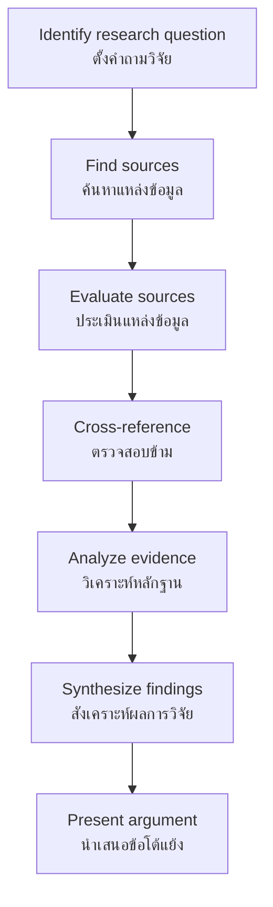

# Historical Sources — หลักฐานทางประวัติศาสตร์

> *"History is only as reliable as its sources. The historian's first task is to find, evaluate, and interpret evidence."*

Historical Sources examines the types of evidence historians use to reconstruct the past. Students learn about Thai and international historical sources — from stone inscriptions to DNA evidence — and how to evaluate them critically.

---

## 1 | Grade Band Breakdown

| Grade | Key Content |
|---|---|
| **ป.1–3** | What is a source? (things from the past) |
| **ป.4–6** | Types of sources, inscriptions and chronicles |
| **ม.1–3** | Source criticism, primary vs secondary |
| **ม.4–6** | Research methodology, advanced source evaluation, digital sources |

---

## 2 | Classification of Sources

### By Origin

| Type | Thai | Definition | Examples |
|---|---|---|---|
| **Primary source** | แหล่งปฐมภูมิ | Created at the time of the event | Letters, diaries, inscriptions, photos |
| **Secondary source** | แหล่งทุติยภูมิ | Later interpretation of primary sources | Textbooks, biographies, documentaries |
| **Tertiary source** | แหล่งตติยภูมิ | Collections and indexes of sources | Encyclopedias, bibliographies |

### By Medium

| Type | Thai | Examples |
|---|---|---|
| **Written** | ลายลักษณ์ | Inscriptions, chronicles, letters, documents |
| **Material** | โบราณวัตถุ | Artifacts, buildings, monuments |
| **Oral** | ประเพณีมุขปาฐะ | Legends, folk tales, interviews |
| **Visual** | ภาพ | Paintings, photographs, maps |
| **Audio/Visual** | เสียงและภาพ | Recordings, films (modern era) |
| **Digital** | ดิจิทัล | Emails, social media, websites |

---

## 3 | Thai Historical Sources

### Stone Inscriptions (ศิลาจารึก)

| Inscription | Thai | Period | Significance |
|---|---|---|---|
| **Ramkhamhaeng Inscription No. 1** | ศิลาจารึกหลักที่ 1 | Sukhothai (~1283 CE) | Earliest Thai writing, UNESCO Memory of the World |
| **Inscription No. 2** | ศิลาจารึกหลักที่ 2 | Sukhothai | Wat Saphan Hin inscription |
| **Rama I Inscription** | ศิลาจารึกรัชกาลที่ 1 | Rattanakosin | Laws of Three Seals |
| **Lopburi inscriptions** | จารึกลพบุรี | Dvaravati/Khmer | Early evidence of Thai region |

### Royal Chronicles (พงศาวดาร)

| Chronicle | Thai | Content |
|---|---|---|
| **Royal Chronicles of Ayutthaya** | พงศาวดารกรุงศรีอยุธยา | History of Ayutthaya kings |
| **Royal Chronicles of Bangkok** | พงศาวดารกรุงรัตนโกสินทร์ | Rattanakosin period |
| **Chiang Mai Chronicle** | ตำนานพื้นเมืองเชียงใหม่ | Lanna history |
| **Jinakālamālī** | ชินกาลมาลีปกรณ์ | Buddhist history, Pali language |

### Foreign Accounts (บันทึกชาวต่างชาติ)

| Source | Author | Period | Value |
|---|---|---|---|
| **Chinese records** | จดหมายเหตุจีน | Tang–Qing dynasties | Trade, diplomacy with Thai kingdoms |
| **Ralph Fitch** | ราล์ฟ ฟิช | 1580s | First English visitor to Ayutthaya |
| **Van Vliet** | เยเรเมียส ฟาน ฟลีต | 1630s–1640s | Dutch account of Ayutthaya |
| **La Loubère** | ลา ลูแบร์ | 1687–1688 | French envoy to Narai's court |
| **Anna Leonowens** | แอนนา ลีโนเวนส์ | 1862–1867 | English governess (controversial accuracy) |
| **Bowring Treaty** | สนธิสัญญาเบาริง | 1855 | British trade agreement |

---

## 4 | Archaeological Evidence (หลักฐานทางโบราณคดี)

| Type | Thai | What It Tells Us |
|---|---|---|
| **Pottery** | เครื่องปั้นดินเผา | Technology, trade, daily life, artistic style |
| **Tools** | เครื่องมือ | Technology, economy, way of life |
| **Human remains** | กระดูกมนุษย์ | Health, diet, causes of death, migration |
| **Buildings** | อาคารสถาปัตยกรรม | Architecture, social organization |
| **Coins** | เหรียญ | Economy, trade connections |
| **Inscriptions** | จารึก | Language, governance, religion |
| **Botanical remains** | พืชโบราณ | Agriculture, diet, environment |

---

## 5 | Source Evaluation (การประเมินแหล่งข้อมูล)

### The 5 Ws Framework

| Question | Thai | What to Check |
|---|---|---|
| **Who?** | ใคร? | Author identity, credentials, bias |
| **What?** | อะไร? | Content, genre, purpose |
| **When?** | เมื่อไหร่? | Date of creation, contemporary or later |
| **Where?** | ที่ไหน? | Place of origin, context |
| **Why?** | ทำไม? | Purpose: record, propaganda, personal |

### Evaluating Credibility

| Criterion | Thai | Description |
|---|---|---|
| **Authenticity** | ความแท้จริง | Is the source genuine or forged? |
| **Credibility** | ความน่าเชื่อถือ | Is the author reliable? |
| **Representativeness** | ความเป็นตัวแทน | Is this typical or exceptional? |
| **Meaning** | ความหมาย | What did it mean at the time? |
| **Corroboration** | การยืนยัน | Do other sources support this? |

---

## 6 | Bias in Historical Sources

| Type of Bias | Thai | Example |
|---|---|---|
| **Political bias** | อคติทางการเมือง | Chronicles written by victors |
| **Cultural bias** | อคติทางวัฒนธรรม | Foreigners misunderstanding Thai customs |
| **Religious bias** | อคติทางศาสนา | Missionaries judging Buddhist practices |
| **Gender bias** | อคติทางเพศ | History written by men, about men |
| **Class bias** | อคติทางชนชั้น | Elite sources ignore commoners |
| **National bias** | อคติทางชาติ | Nationalist historiography |

---

## 7 | Cross-Referencing Sources (การตรวจสอบข้าม)

### Why Cross-Reference?

| Reason | Description |
|---|---|
| **Verify facts** | Single source may be wrong or biased |
| **Multiple perspectives** | Different sources show different views |
| **Fill gaps** | Each source has limitations |
| **Detect bias** | Comparing sources reveals agendas |
| **Build richer picture** | More sources = more complete understanding |

### Thai Example: Fall of Ayutthaya (1767)

| Source Type | Example | Perspective |
|---|---|---|
| **Thai chronicles** | Royal Chronicles of Ayutthaya | Thai royal perspective |
| **Burmese records** | Hsinbyushin's court records | Burmese perspective |
| **Foreign accounts** | Dutch VOC records | European trader perspective |
| **Archaeology** | Burned remains, debris | Physical evidence |
| **Oral traditions** | Local legends | Common people's memory |

---

## 8 | Modern Sources and Methods

### Digital Sources (ม.4-6)

| Type | Thai | Examples |
|---|---|---|
| **Digitized archives** | คลังข้อมูลดิจิทัล | National Archives online |
| **Social media** | สื่อสังคมออนไลน์ | Future historical sources |
| **Email** | อีเมล | Personal correspondence |
| **Databases** | ฐานข้อมูล | Census, economic data |

### Scientific Methods

| Method | Thai | Application |
|---|---|---|
| **DNA analysis** | การวิเคราะห์ดีเอ็นเอ | Migration patterns, family relationships |
| **Isotope analysis** | การวิเคราะห์ไอโซโทป | Diet, place of origin |
| **Satellite imagery** | ภาพถ่ายดาวเทียม | Lost cities, landscape change |
| **Lidar** | ไลดาร์ | Reveal structures under vegetation |

---

## 9 | Upper Secondary (ม.4-6): Research Methodology

### Historical Research Process

### Source Hierarchy

| Level | Source Type | Reliability |
|---|---|---|
| **1 (Best)** | Multiple primary sources, cross-referenced | High |
| **2** | Single primary source | Medium-High |
| **3** | Secondary source using primary sources | Medium |
| **4** | Secondary source, unclear methodology | Low-Medium |
| **5 (Weakest)** | Tertiary source (encyclopedia) | Low |

---

## 10 | Thai Terminology

| Thai | English |
|---|---|
| หลักฐานทางประวัติศาสตร์ | Historical evidence |
| แหล่งข้อมูลปฐมภูมิ | Primary source |
| แหล่งข้อมูลทุติยภูมิ | Secondary source |
| ศิลาจารึก | Stone inscription |
| พงศาวดาร | Royal chronicle |
| จดหมายเหตุ | Archive / records |
| จารึก | Inscription |
| โบราณวัตถุ | Artifact |
| การตรวจสอบข้าม | Cross-referencing |
| ความน่าเชื่อถือ | Credibility |

---

## 11 | Real-World Examples

- **Ramkhamhaeng Inscription** — Best-known Thai primary source, authenticity debated
- **Foreign accounts of Ayutthaya** — Van Vliet, La Loubère documented Thai life that Thais did not record themselves
- **DNA evidence** — Genetic studies confirm migration patterns into Southeast Asia
- **Lidar at Angkor** — Revealed extensive urban networks hidden under jungle
- **Bowring Treaty (1855)** | Primary document showing trade terms between Thailand and Britain

---

## 12 | Cross-Links

- [[Social Studies - Overview|← Back to Social Studies]]
- [[03_Historical_Method|Historical Method]] — How historians use sources
- [[04_Prehistoric_Thailand|Prehistoric Thailand]] — Archaeological evidence
- [[10_Local_History|Local History]] — Local source research
