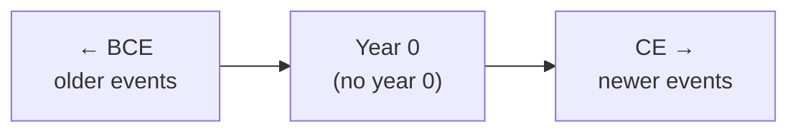

# Time and Chronology — เวลาและการลำดับเวลา

> *"Time is the longest distance between two places."* — Tennessee Williams

Time and Chronology teaches students how historians measure, organize, and conceptualize time. Students learn about different calendar systems, periodization, and how to place historical events in proper sequence.

---

## 1 | Grade Band Breakdown

| Grade | Key Content |
|---|---|
| **ป.1–3** | Days, weeks, months, family timeline |
| **ป.4–6** | Decades, centuries, CE/BCE, important dates |
| **ม.1–3** | CE/BCE, พ.ศ., historical periods, chronologies |
| **ม.4–6** | Periodization theory, comparative calendars, deep time |

---

## 2 | Measuring Time

| Unit | Thai | Duration |
|---|---|---|
| **Second** | วินาที | Base unit |
| **Minute** | นาที | 60 seconds |
| **Hour** | ชั่วโมง | 60 minutes |
| **Day** | วัน | 24 hours (Earth rotation) |
| **Month** | เดือน | ~30 days (lunar cycle) |
| **Year** | ปี | 365.25 days (Earth orbit) |
| **Decade** | ทศวรรษ | 10 years |
| **Century** | ศตวรรษ | 100 years |
| **Millennium** | สหัสวรรษ | 1,000 years |

---

## 3 | Calendar Systems

### Calendar Systems Used in Thailand

| Calendar | Thai | Year Zero | Usage |
|---|---|---|---|
| **Buddhist Era (พ.ศ.)** | พุทธศักราช | 543 BCE (Parinibbana of Buddha) | Official in Thailand |
| **Common Era (ค.ศ.)** | คริสต์ศักราช | Birth of Jesus | International standard |
| **Ratanakosin Era (ร.ศ.)** | รัตนโกสินทร์ศก | 1782 CE (Bangkok founding) | Historical documents |
| **Chulasakaraj (จ.ศ.)** | จุลศักราช | 638 CE | Pre-modern Thai records |

### Conversion Formula

$$\text{Buddhist Era} = \text{Common Era} + 543$$

**Examples:**

| CE (ค.ศ.) | พ.ศ. | Event |
|---|---|---|
| 1238 | 1781 | Sukhothai founded |
| 1351 | 1894 | Ayutthaya founded |
| 1767 | 2310 | Fall of Ayutthaya |
| 1782 | 2325 | Bangkok founded |
| 1932 | 2475 | Revolution |
| 2026 | 2569 | Current year |

---

## 4 | CE/BCE System

| Term | Meaning | Description |
|---|---|---|
| **CE** | Common Era | Same as AD (Anno Domini) |
| **BCE** | Before Common Era | Same as BC (Before Christ) |
| **BP** | Before Present | Before 1950 (used in archaeology) |

### Timeline Direction

**Note:** There is no "Year 0" in the CE/BCE system. The year before 1 CE is 1 BCE.

---

## 5 | Thai Historical Periodization

| Period | Thai | พ.ศ. | CE |
|---|---|---|---|
| **Prehistoric** | ก่อนประวัติศาสตร์ | Before ~1781 | Before 1238 |
| **Sukhothai** | สุโขทัย | 1781–1981 | 1238–1438 |
| **Ayutthaya** | อยุธยา | 1894–2310 | 1351–1767 |
| **Thonburi** | ธนบุรี | 2310–2325 | 1767–1782 |
| **Early Rattanakosin** | รัตนโกสินทร์ตอนต้น | 2325–2411 | 1782–1868 |
| **Reform Era** | ยุคปฏิรูป | 2411–2475 | 1868–1932 |
| **Democratic Era** | ยุคประชาธิปไตย | 2475–ปัจจุบัน | 1932–present |

---

## 6 | World Historical Periodization

| Period | Period | Key Feature |
|---|---|---|
| **Prehistoric** | Before ~3000 BCE | Before writing |
| **Ancient** | 3000 BCE – 500 CE | First civilizations |
| **Classical** | 500 BCE – 500 CE | Greece, Rome, Han China |
| **Post-Classical/Medieval** | 500 – 1500 CE | Fall of Rome to Renaissance |
| **Early Modern** | 1500 – 1800 CE | Exploration, Reformation |
| **Late Modern** | 1800 – 1945 CE | Industrial Revolution, World Wars |
| **Contemporary** | 1945 – present | Cold War, globalization |

---

## 7 | Thai Calendar and Important Dates

### Official Thai Holidays with Historical Significance

| Date | Thai | Holiday | Historical Event |
|---|---|---|---|
| **Jan 1** | วันขึ้นปีใหม่ | New Year | International calendar adoption |
| **Apr 6** | วันจักรี | Chakri Day | Founding of Chakri Dynasty (1782) |
| **Apr 13–15** | สงกรานต์ | Songkran | Thai New Year (traditional) |
| **May 5** | วันฉัตรมงคล | Coronation Day | King's coronation |
| **Jun 24** | วันชาติ | National Day | 1932 Revolution |
| **Aug 12** | วันแม่ | Mother's Day | Queen Sirikit's birthday |
| **Oct 23** | วันปิยมหาราช | Chulalongkorn Day | Death of Rama V (1910) |
| **Dec 5** | วันพ่อ | Father's Day | King Rama IX's birthday |
| **Dec 10** | วันรัฐธรรมนูญ | Constitution Day | First constitution (1932) |

---

## 8 | Dating Methods in Archaeology

### Relative Dating

| Method | Thai | Description |
|---|---|---|
| **Stratigraphy** | ชั้นดิน | Lower layers = older |
| **Typology** | จำแนกประเภท | Compare object styles |
| **Seriation** | การจัดลำดับ | Arrange in chronological order |

### Absolute Dating

| Method | Thai | Description |
|---|---|---|
| **Radiocarbon (C-14)** | คาร์บอนกัมมันตรังสี | Organic materials up to 50,000 years |
| **Dendrochronology** | การกำหนดอายุจากวงแหวนไม้ | Tree-ring counting |
| **Thermoluminescence** | การเรืองแสงเมื่อได้รับความร้อน | Ceramics |
| **Potassium-Argon** | โพแทสเซียม-อาร์กอน | Volcanic materials (millions of years) |

---

## 9 | Upper Secondary (ม.4-6): Periodization Theory

### Why Periodization Matters

| Question | Consideration |
|---|---|
| **Who decides?** | Periodization is a construct, not natural |
| **What's included?** | Each system emphasizes different events |
| **Whose perspective?** | Western periodization vs Thai vs Buddhist |
| **Transitions** | When does one period "end" and another "begin"? |

### Comparative Periodization

| Event | Western | Thai | Buddhist |
|---|---|---|---| 
| **Year zero** | Birth of Jesus | Buddha's Parinibbana | Buddha's Parinibbana |
| **Classical era** | Greece/Rome | Sukhothai/Ayutthaya | Buddhist councils |
| **Modern** | Renaissance/Industrial | Rama IV/V reforms | Colonial encounter |

---

## 10 | Thai Terminology

| Thai | English |
|---|---|
| เวลา | Time |
| สมัย | Era / Period |
| ลำดับเวลา | Chronology |
| พุทธศักราช | Buddhist Era |
| คริสต์ศักราช | Common Era |
| ศตวรรษ | Century |
| ทศวรรษ | Decade |
| ปฏิทิน | Calendar |
| ยุค | Age / Era |
| การกำหนดอายุ | Dating |

---

## 11 | Real-World Examples

- **Thai official documents** — Use พ.ศ. (e.g., 2569 = 2026 CE)
- **International communication** — Convert to CE for clarity
- **Songkran** — Traditional Thai New Year (April), separate from January 1
- **C-14 dating** — Used to date Ban Chiang artifacts
- **Tree rings** — Dendrochronology dates wooden structures precisely

---

## 12 | Cross-Links

- [[Social Studies - Overview|← Back to Social Studies]]
- [[01_Thai_History|Thai History]] — Thai periodization
- [[02_World_History_and_Civilizations|World History]] — World periodization
- [[03_Historical_Method|Historical Method]] — Dating as historical method
