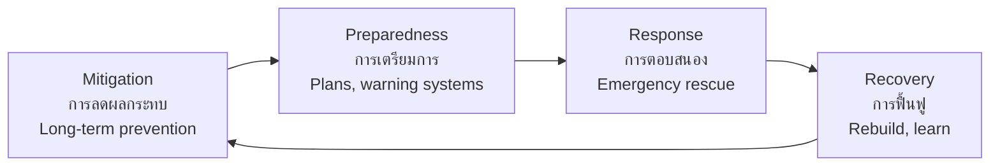

# Natural Disasters and Environment — ภัยธรรมชาติและสิ่งแวดล้อม

> *"Understanding natural disasters helps us prepare; protecting the environment ensures our future."*

Natural Disasters and Environment covers the geographic processes that cause disasters and the environmental challenges facing Thailand and the world. Students learn about earthquakes, floods, climate change, and conservation.

---

## 1 | Grade Band Breakdown

| Grade | Key Content |
|---|---|
| **ป.1–3** | Weather safety, caring for environment, basic recycling |
| **ป.4–6** | Types of natural disasters, causes and effects, local environmental issues, conservation basics |
| **ม.1–3** | Disaster preparedness, climate change, environmental laws, sustainable development |
| **ม.4–6** | Disaster management systems, environmental policy, climate adaptation, resilience planning |

---

## 2 | Natural Disasters

| Disaster | Thai | Cause | Thailand Risk |
|---|---|---|---|
| **Flood** | อุทกภัย | Heavy rain, river overflow | High (annual monsoon) |
| **Drought** | ภัยแล้ง | Insufficient rainfall | Medium-High |
| **Earthquake** | แผ่นดินไหว | Tectonic plate movement | Low (but Chiang Mai at risk) |
| **Tsunami** | สึนามิ | Undersea earthquake | Low (Andaman coast) |
| **Landslide** | ดินถล่ม | Heavy rain on slopes | Medium (mountains) |
| **Typhoon** | พายุหมุนเขตร้อน | Ocean warming | Medium (South affected) |

---

## 3 | Environmental Issues

| Issue | Thai | Cause | Effect |
|---|---|---|---|
| **Deforestation** | การตัดไม้ทำลายป่า | Logging, agriculture expansion | Erosion, biodiversity loss |
| **Air pollution** | มลพิษทางอากาศ | Vehicles, factories | Health problems, smog |
| **Water pollution** | มลพิษทางน้ำ | Industrial waste, chemicals | Contaminated water |
| **Climate change** | การเปลี่ยนแปลงสภาพภูมิอากาศ | Greenhouse gases | Rising temperatures, extreme weather |
| **Waste** | ขยะ | Consumerism, plastic | Land, water, ocean pollution |

---

## 4 | Conservation Methods

| Method | Thai | Description |
|---|---|---|
| **Reduce** | ลดการใช้ | Use less, choose wisely |
| **Reuse** | ใช้ซ้ำ | Use again before discarding |
| **Recycle** | รีไซเคิล | Process into new products |
| **Reforestation** | ปลูกป่า | Plant trees, restore forests |
| **Renewable energy** | พลังงานหมุนเวียน | Solar, wind, hydro |
| **Protected areas** | เขตอนุรักษ์ | National parks, wildlife sanctuaries |

---

## 5 | Climate Change

| Aspect | Details |
|---|---|
| **Cause** | Burning fossil fuels → CO₂ → greenhouse effect |
| **Effects** | Rising temperatures, sea level rise, extreme weather |
| **Thailand impact** | Flooding, drought, agricultural changes |
| **Solutions** | Reduce emissions, renewable energy, conservation |

### Greenhouse Gases

| Gas | Thai | Source |
|---|---|---|
| CO₂ | คาร์บอนไดออกไซด์ | Burning fossil fuels |
| CH₄ | มีเทน | Agriculture, landfills |
| N₂O | ไนตรัสออกไซด์ | Fertilizers |

---

## 6 | Thai Terminology

| Thai | English |
|---|---|
| ภัยธรรมชาติ | Natural disaster |
| สิ่งแวดล้อม | Environment |
| การอนุรักษ์ | Conservation |
| การเปลี่ยนแปลงสภาพภูมิอากาศ | Climate change |
| ภาวะเรือนกระจก | Greenhouse effect |
| พลังงานหมุนเวียน | Renewable energy |
| การพัฒนาที่ยั่งยืน | Sustainable development |
| ขยะ | Waste |
| รีไซเคิล | Recycle |

---

## 7 | Real-World Examples

- **2011 Thailand Floods** — Worst in 50 years; 815 deaths, billions in damage
- **2004 Indian Ocean Tsunami** — 8,000+ deaths in Thailand
- **Bangkok Air Pollution** — PM2.5 levels regularly exceed safe limits
- **Coral Reef Bleaching** — Rising ocean temperatures damage Thai reefs

---

## 8 | Cross-Links

- [[Social Studies - Overview|← Back to Social Studies]]
- [[01_Geography_of_Thailand|Geography]] — Physical geography, climate
- [[01_Economics_Fundamentals|Economics]] — Environmental economics
- [[01_Thai_History|History]] — Historical disasters

---

## 9 | Upper Secondary (ม.4-6): Disaster Management

### Disaster Management Cycle

| Phase | Thai | Activities |
|---|---|---|
| **Mitigation** | การลดผลกระทบ | Dams, building codes, zoning |
| **Preparedness** | การเตรียมการ | Early warning, drills, supplies |
| **Response** | การตอบสนอง | Rescue, evacuation, first aid |
| **Recovery** | การฟื้นฟู | Rebuild, compensation, planning |

### Thailand's Disaster Management System

| Agency | Thai | Role |
|---|---|---|
| **DDPM** | กรมป้องกันและบรรเทาสาธารณภัย | National disaster management |
| **Thai Meteorological Dept** | กรมอุตุนิยมวิทยา | Weather, tsunami warnings |
| **Dept of Mineral Resources** | กรมทรัพยากรธรณี | Earthquake monitoring |
| **Royal Thai Army** | กองทัพบกไทย | Emergency response |
| **Foundation Thai Red Cross** | สภากาชาดไทย | Relief, first aid |

### Climate Adaptation Strategies

| Strategy | Thai | Thailand Application |
|---|---|---|
| **Infrastructure** | โครงสร้างพื้นฐาน | Flood walls, drainage upgrades |
| **Nature-based** | ธรรมชาติเป็นฐาน | Mangrove restoration, urban green |
| **Early warning** | ระบบเตือนภัย | Weather stations, SMS alerts |
| **Community resilience** | ความยืดหยุ่นของชุมชน | Community disaster plans |
| **Insurance** | การประกันภัย | Crop insurance, disaster funds |
| **Relocation** | การย้ายที่อยู่ | Managed retreat from coasts |
