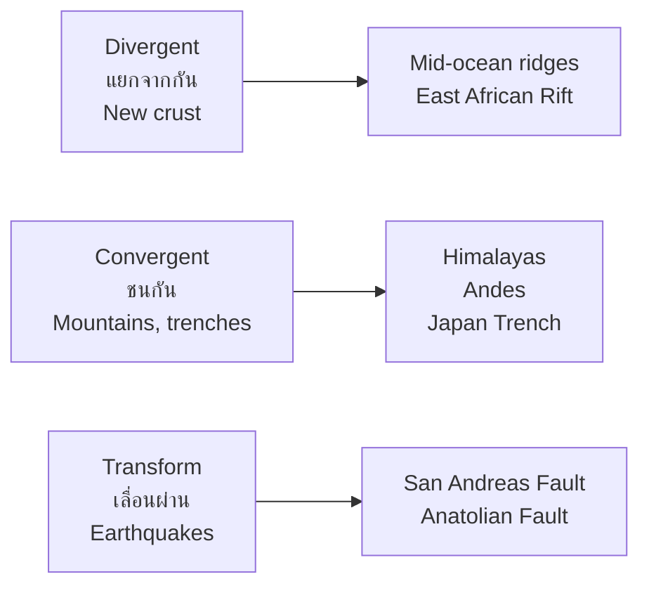
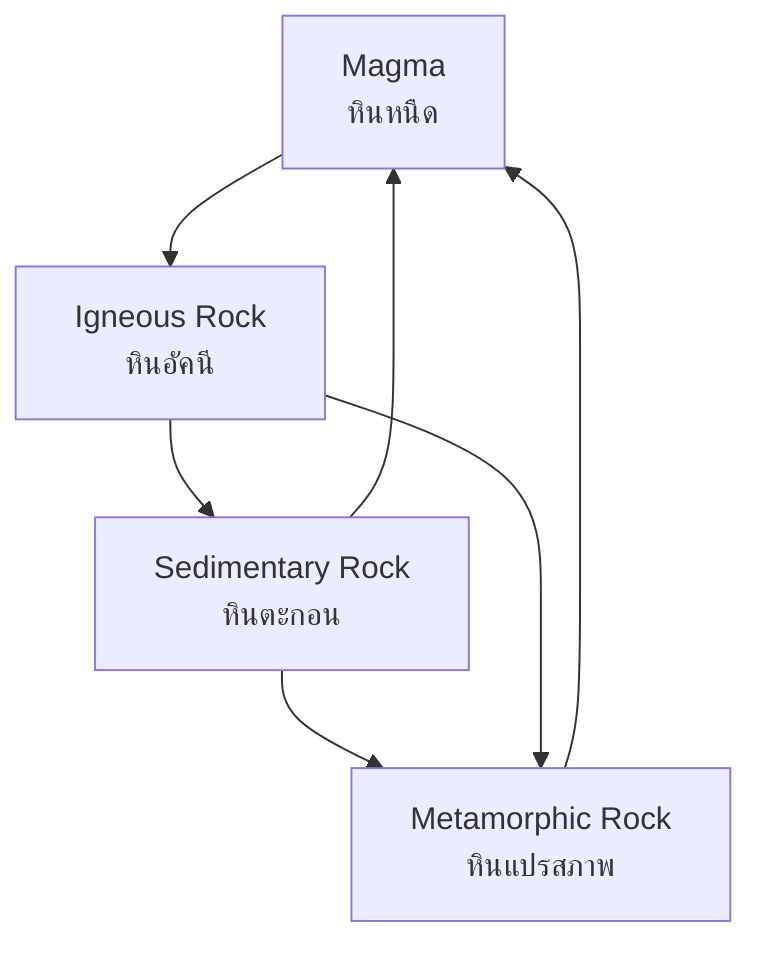

# Physical Geography — Landforms — ลักษณะภูมิประเทศ

> *"The Earth's surface is a canvas shaped by fire, water, wind, and time."*

Physical Geography examines the natural features of Earth's surface and the processes that shape them. Students learn about plate tectonics, landform types, the rock cycle, and how geological processes create the landscapes we see.

---

## 1 | Grade Band Breakdown

| Grade | Key Content |
|---|---|
| **ป.1–3** | — |
| **ป.4–6** | Mountains, rivers, plains, valleys (basic identification) |
| **ม.1–3** | Plate tectonics, rock cycle, weathering, erosion, river systems |
| **ม.4–6** | Geomorphology, landform evolution, Thailand's geological history |

---

## 2 | Plate Tectonics (แผ่นธรณีภาค)

| Concept | Thai | Description |
|---|---|---|
| **Lithosphere** | ธรณีภาค | Earth's rigid outer shell |
| **Plate** | แผ่นธรณีภาค | Large section of lithosphere that moves |
| **Plate boundary** | ขอบแผ่นธรณีภาค | Where two plates meet |
| **Convection current** | กระแสความร้อนในเนื้อโลก | Heat-driven mantle flow that moves plates |

### Types of Plate Boundaries

| Boundary | Thai | Movement | Result | Example |
|---|---|---|---|---|
| **Divergent** | ขอบแยก | Plates move apart | New crust, ridges | Mid-Atlantic Ridge |
| **Convergent** | ขอบมุด | Plates collide | Mountains, trenches, volcanoes | Himalayas |
| **Transform** | ขอบเลื่อน | Plates slide past | Earthquakes | San Andreas Fault |

### Plate Movements That Shaped Thailand

| Feature | Plate Interaction | Result |
|---|---|---|
| **Himalayas** | India plate collides with Eurasia | Created Southeast Asian mountain ranges |
| **Andaman Trench** | Indian plate subducts under Burma microplate | Earthquake and tsunami risk |
| **Gulf of Thailand** | Rift valley formation | Sedimentary basin, natural gas |

---

## 3 | Landform Types (ประเภทของสัณฐานที่ดิน)

### Major Landforms

| Landform | Thai | Description | Example |
|---|---|---|---|
| **Mountain** | ภูเขา | Elevated landform >600m | Doi Inthanon |
| **Hill** | เนินเขา | Moderate elevation 200-600m | Khao Yai |
| **Plateau** | ที่ราบสูง | Flat, elevated area | Khorat Plateau |
| **Plain** | ที่ราบ | Flat lowland | Chao Phraya plain |
| **Valley** | หุบเขา | Low area between hills | Ping River valley |
| **Delta** | ดินดอนสามเหลี่ยม | Sediment deposit at river mouth | Chao Phraya delta |
| **Canyon/Gorge** | หุบเขาลึก | Deep, steep-sided valley | Grand Canyon |
| **Island** | เกาะ | Land surrounded by water | Phuket, Koh Samui |
| **Peninsula** | คาบสมุทร | Land extending into water | Malay Peninsula |
| **Isthmus** | คอคอด | Narrow land bridge | Kra Isthmus |

### Coastal Landforms

| Feature | Thai | Description |
|---|---|---|
| **Beach** | หาด | Sandy/pebble shore |
| **Cliff** | ผาหิน | Steep coastal rock face |
| **Estuary** | ปากแม่น้ำ | Where river meets sea |
| **Mangrove** | ป่าชายเลน | Tidal forest ecosystem |
| **Coral reef** | แนวปะการัง | Underwater limestone structure |

---

## 4 | The Rock Cycle (วงจรของหิน)

| Rock Type | Thai | Formation | Example |
|---|---|---|---|
| **Igneous** | หินอัคนี | Cooled magma/lava | Granite (หินแกรนิต), basalt |
| **Sedimentary** | หินตะกอน | Compressed sediments | Sandstone (หินทราย), limestone (หินปูน) |
| **Metamorphic** | หินแปรสภาพ | Heat/pressure transforms rock | Marble (หินอ่อน), quartzite |

---

## 5 | Weathering and Erosion (การผุพังและการกัดกร่อน)

### Weathering (การผุพัง)

| Type | Thai | Description | Example |
|---|---|---|---|
| **Physical** | กายภาพ | Breaks rock without chemical change | Freeze-thaw, exfoliation |
| **Chemical** | เคมี | Changes rock composition | Dissolution (limestone caves) |
| **Biological** | ชีวภาพ | Plants/animals break rock | Root wedging |

### Erosion Agents (ตัวการกัดกร่อน)

| Agent | Thai | Feature Created |
|---|---|---|
| **Water (rivers)** | น้ำ | V-shaped valleys, canyons, deltas |
| **Wind** | ลม | Sand dunes, rock arches |
| **Ice (glaciers)** | ธารน้ำแข็ง | U-shaped valleys, moraines |
| **Gravity** | แรงโน้มถ่วง | Landslides, talus slopes |
| **Ocean waves** | คลื่นทะเล | Sea cliffs, sea stacks |

---

## 6 | River Systems (ระบบแม่น้ำ)

| Feature | Thai | Description |
|---|---|---|
| **Source** | ต้นน้ำ | Where river begins (spring, glacier) |
| **Tributary** | สาขาแม่น้ำ | Stream flowing into main river |
| **Main river** | แม่น้ำสายหลัก | Primary watercourse |
| **Floodplain** | ที่ราบน้ำท่วมถึง | Flat land beside river that floods |
| **Meander** | การคดเคี้ยว | Bending river channel |
| **Delta** | ดินดอนสามเหลี่ยม | Sediment at river mouth |
| **Watershed** | ลุ่มน้ำ | Area draining to one river |

### Thailand's Major Rivers

| River | Thai | Length | Basin Area |
|---|---|---|---|
| **Chao Phraya** | แม่น้ำเจ้าพระยา | 372 km | 160,000 km² |
| **Mekong** | แม่น้ำโขง | 4,350 km | 795,000 km² |
| **Ping** | แม่น้ำปิง | 658 km | 44,688 km² |
| **Mun** | แม่น้ำมูล | 673 km | 71,060 km² |
| **Salween** | แม่น้ำสาละวิน | 2,815 km | 324,000 km² |

---

## 7 | Thailand's Geological Regions

| Region | Thai | Geology | Key Features |
|---|---|---|---|
| **North** | ภาคเหนือ | Fold mountains, granite | Doi Inthanon (2,565m), Doi Suthep |
| **Northeast** | ภาคอีสาน | Sandstone plateau | Khorat Plateau, Phu Phan mountains |
| **Central** | ภาคกลาง | Alluvial plain | Chao Phraya delta, Bangkok |
| **East** | ภาคตะวันออก | Coastal plain, mountains | Chonburi, Rayong coast |
| **South** | ภาคใต้ | Limestone, granite | Karst peaks, islands, Kra Isthmus |

---

## 8 | Upper Secondary (ม.4-6): Advanced Geomorphology

### Landform Evolution

| Process | Timescale | Result |
|---|---|---|
| **Tectonic uplift** | Millions of years | Mountain ranges |
| **Erosion cycle** | Davisian cycle: youth → maturity → old age | Landscape maturation |
| **Sea level change** | Thousands of years | Coastal landforms, submerged coastlines |
| **Volcanic activity** | Variable | New landforms, islands |

### Thailand's Geological History

| Era | Event | Result |
|---|---|---|
| **Paleozoic** | Sediment deposition | Limestone, sandstone in NE Thailand |
| **Mesozoic** | Khorat Group formation | Red sandstones of Isan |
| **Cenozoic** | Himalayan uplift | Northern mountains, active tectonics |
| **Quaternary** | Sea level changes | Chao Phraya delta formation |

---

## 9 | Thai Terminology

| Thai | English |
|---|---|
| ภูเขา | Mountain |
| ที่ราบสูง | Plateau |
| ที่ราบ | Plain |
| แผ่นธรณีภาค | Tectonic plate |
| การกัดกร่อน | Erosion |
| การผุพัง | Weathering |
| หินอัคนี | Igneous rock |
| หินตะกอน | Sedimentary rock |
| หินแปรสภาพ | Metamorphic rock |
| ลุ่มน้ำ | Watershed / River basin |

---

## 10 | Real-World Examples

- **Doi Inthanon** — Thailand's highest peak (2,565m), part of Himalayan range
- **Khorat Plateau** — Sandstone plateau covering most of Isan, poor soil for farming
- **Krabi karst landscape** — Limestone formations creating iconic islands and cliffs
- **2011 floods** — Chao Phraya floodplain geography worsened flooding

---

## 11 | Cross-Links

- [[Social Studies - Overview|← Back to Social Studies]]
- [[01_Geography_of_Thailand|Geography of Thailand]] — Thai physical features
- [[02_Natural_Disasters_and_Environment|Natural Disasters]] — Earthquakes, volcanoes
- [[03_Map_Skills_and_Geographic_Tools|Map Skills]] — Topographic features on maps
