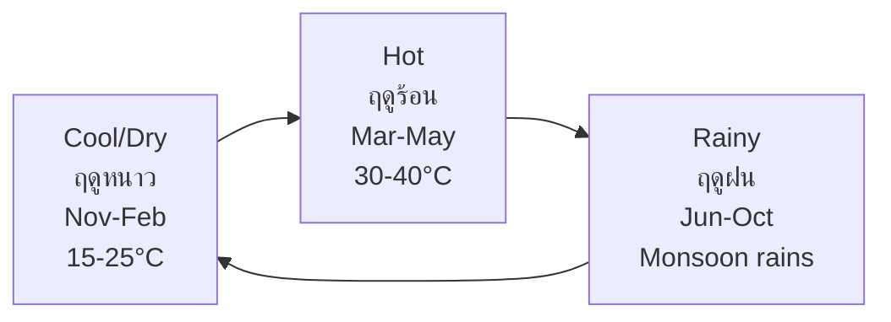
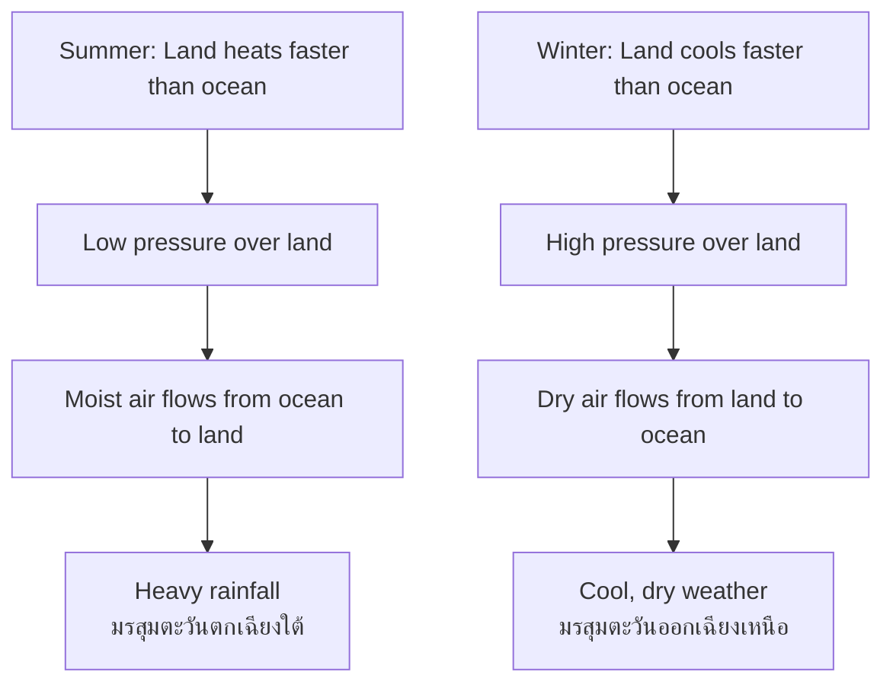

# Climate — ภูมิอากาศ

> *"Climate is what you expect; weather is what you get."* — Mark Twain

Climate examines the long-term patterns of temperature, rainfall, wind, and atmospheric conditions. Students learn about climate zones, the monsoon system that shapes Thailand's seasons, and the critical challenge of climate change.

---

## 1 | Grade Band Breakdown

| Grade | Key Content |
|---|---|
| **ป.1–3** | Seasons, daily weather observation, dressing for weather |
| **ป.4–6** | Climate zones, factors affecting climate, Thailand's seasons |
| **ม.1–3** | Monsoon system, global climate patterns, greenhouse effect |
| **ม.4-6** | Climatology, climate models, climate change science, mitigation |

---

## 2 | Weather vs Climate

| Aspect | Thai | Definition | Timescale |
|---|---|---|---|
| **Weather** | สภาพอากาศ | Short-term atmospheric conditions | Hours to days |
| **Climate** | ภูมิอากาศ | Long-term average of weather patterns | 30+ years |

---

## 3 | Climate Factors (ปัจจัยที่มีผลต่อภูมิอากาศ)

| Factor | Thai | Effect on Climate |
|---|---|---|
| **Latitude** | ละติจูด | Determines solar energy received |
| **Altitude** | ระดับความสูง | Higher altitude = cooler temperatures |
| **Ocean currents** | กระแสน้ำมหาสมุทร | Warm/cold currents modify coastal climate |
| **Distance from sea** | ระยะห่างจากทะเล | Continental vs maritime climate |
| **Prevailing winds** | ลมประจำทิศ | Distribute heat and moisture |
| **Mountain barriers** | แนวเทือกเขา | Create rain shadow effects |

---

## 4 | Köppen Climate Classification

| Zone | Code | Thai | Climate | Example |
|---|---|---|---|---|
| **Tropical** | A | เขตร้อนชื้น | Hot, humid, year-round rain | Bangkok, Amazon |
| **Dry** | B | เขตแห้งแล้ง | Low precipitation | Sahara, Central Australia |
| **Temperate** | C | เขตอบอุ่น | Moderate temperatures, seasons | Mediterranean, Tokyo |
| **Continental** | D | เขตทวีป | Cold winters, warm summers | Moscow, New York |
| **Polar** | E | เขตขั้วโลก | Very cold year-round | Antarctica, Greenland |

**Thailand's climate:** Tropical savanna (Aw) — hot year-round, distinct wet and dry seasons.

---

## 5 | Thailand's Climate

### Three Seasons (สามฤดู)

| Season | Thai | Months | Temperature | Rainfall |
|---|---|---|---|---|
| **Cool/Dry** | ฤดูหนาว | November–February | 15-25°C | Low |
| **Hot** | ฤดูร้อน | March–May | 30-40°C | Very low |
| **Rainy** | ฤดูฝน | June–October | 27-35°C | High |

### Regional Climate Variations

| Region | Temperature | Rainfall | Special Features |
|---|---|---|---|
| **North** | Cooler (can reach 4°C in mountains) | 1,200-1,600 mm | Winter fog, mountain chill |
| **Northeast** | Hottest (45°C in April) | 1,000-1,500 mm | Drought-prone |
| **Central** | Hot | 1,400-1,600 mm | Flooding in rainy season |
| **East** | Hot, coastal | 1,500-2,000 mm | Sea breezes |
| **South (East coast)** | Warm year-round | 2,000-2,800 mm | Rainy season different |
| **South (West coast)** | Warm year-round | 2,500-4,000 mm | Highest rainfall |

---

## 6 | Monsoon System (ระบบมรสุม)

| Monsoon | Thai | Direction | Months | Effect |
|---|---|---|---|---|
| **Northeast monsoon** | มรสุมตะวันออกเฉียงเหนือ | From China/Siberia | November–February | Cool, dry air |
| **Southwest monsoon** | มรสุมตะวันตกเฉียงใต้ | From Indian Ocean | May–October | Warm, moist, heavy rain |

### How Monsoons Work

---

## 7 | Global Climate Patterns

### Atmospheric Circulation

| Cell | Location | Description |
|---|---|---|
| **Hadley Cell** | 0°–30° | Equatorial heat rises, descends at ~30° |
| **Ferrel Cell** | 30°–60° | Mid-latitude circulation |
| **Polar Cell** | 60°–90° | Polar circulation |

### Global Wind Belts

| Wind Belt | Location | Direction |
|---|---|---|
| **Trade winds** | 0°–30° N/S | Northeast / Southeast |
| **Westerlies** | 30°–60° N/S | Southwest / Northwest |
| **Polar easterlies** | 60°–90° N/S | East to west |

---

## 8 | Climate Change (การเปลี่ยนแปลงสภาพภูมิอากาศ)

### Causes

| Cause | Thai | Description |
|---|---|---|
| **Greenhouse effect** | ปรากฏการณ์เรือนกระจก | Gases trap heat in atmosphere |
| **Fossil fuels** | เชื้อเพลิงฟอสซิล | Coal, oil, gas → CO₂ |
| **Deforestation** | การตัดไม้ทำลายป่า | Less CO₂ absorption |
| **Agriculture** | เกษตรกรรม | Methane from livestock, rice paddies |

### Greenhouse Gases

| Gas | Thai | Global Warming Potential |
|---|---|---|
| **CO₂** | คาร์บอนไดออกไซด์ | 1 (reference) |
| **CH₄** | มีเทน | 28× |
| **N₂O** | ไนตรัสออกไซด์ | 265× |
| **CFCs** | คลอโรฟลูโอโรคาร์บอน | Thousands× |

### Impacts on Thailand

| Impact | Thai | Description |
|---|---|---|
| **Sea level rise** | ระดับน้ำทะเลสูงขึ้น | Bangkok sinking + sea rise = severe flood risk |
| **Extreme weather** | สภาพอากาศสุดโต่ง | More intense storms, floods, droughts |
| **Agricultural disruption** | ผลกระทบต่อเกษตรกรรม | Changing rainfall patterns, crop failure |
| **Coral bleaching** | ปะการังฟอกขาว | Ocean warming kills reefs |
| **Health** | สุขภาพ | Heat stress, dengue spread |

---

## 9 | Upper Secondary (ม.4-6): Climatology

### Climate Models

| Model Type | Thai | Description |
|---|---|---|
| **GCM** | แบบจำลองการหมุนเวียนบรรยากาศทั่วโลก | Global Circulation Models |
| **RCM** | แบบจำลองภูมิภาค | Regional Climate Models |
| **Ensemble** | การพยากรณ์แบบกลุ่ม | Combining multiple models |

### El Niño / La Niña (เอลนีโญ / ลานีญา)

| Phenomenon | Thai | Effect | Impact on Thailand |
|---|---|---|---|
| **El Niño** | เอลนีโญ | Pacific warms, weakens trade winds | Drought, hot dry season |
| **La Niña** | ลานีญา | Pacific cools, strengthens trade winds | Heavy rain, flooding |
| **ENSO** | เอนโซ | El Niño Southern Oscillation | Alternating cycles |

### Carbon Cycle (วงจรคาร์บอน)

| Process | Thai | Carbon Flow |
|---|---|---|
| **Photosynthesis** | การสังเคราะห์แสง | Removes CO₂ from atmosphere |
| **Respiration** | การหายใจ | Releases CO₂ |
| **Combustion** | การเผาไหม้ | Releases CO₂ (fossil fuels) |
| **Ocean absorption** | การดูดซับของมหาสมุทร | Removes CO₂, ocean acidification |

### Paris Agreement (ความตกลงปารีส)

| Aspect | Details |
|---|---|
| **Signed** | 2015 |
| **Goal** | Limit warming to 1.5°C above pre-industrial |
| **Thailand's commitment** | Carbon neutrality by 2050 |
| **Mechanism** | Nationally Determined Contributions (NDCs) |

---

## 10 | Thai Terminology

| Thai | English |
|---|---|
| ภูมิอากาศ | Climate |
| สภาพอากาศ | Weather |
| ฤดูกาล | Season |
| มรสุม | Monsoon |
| ปรากฏการณ์เรือนกระจก | Greenhouse effect |
| การเปลี่ยนแปลงสภาพภูมิอากาศ | Climate change |
| ภาวะโลกร้อน | Global warming |
| เขตภูมิอากาศ | Climate zone |
| ละติจูด | Latitude |

---

## 11 | Real-World Examples

- **2011 floods** — La Niña + unusually heavy monsoon caused catastrophic flooding
- **2015-2016 El Niño** — Severe drought, water rationing in Thailand
- **Bangkok sinking** — 2cm/year subsidence + sea level rise = existential threat
- **PM2.5** — Winter air pollution in Bangkok and Chiang Mai from crop burning
- **Thai coral reefs** — Mass bleaching events in 2010, 2016 linked to warming oceans

---

## 12 | Cross-Links

- [[Social Studies - Overview|← Back to Social Studies]]
- [[01_Geography_of_Thailand|Geography of Thailand]] — Thai climate
- [[04_Physical_Geography|Physical Geography]] — Geographical factors in climate
- [[10_Environmental_Conservation|Environmental Conservation]] — Climate action
