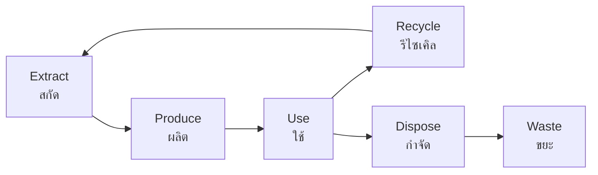

# Natural Resources — ทรัพยากรธรรมชาติ

> *"We do not inherit the Earth from our ancestors; we borrow it from our children."* — Native American proverb

Natural Resources examines the materials and energy sources that human societies depend on. Students learn about renewable and non-renewable resources, Thailand's resource base, and the challenge of sustainable management.

---

## 1 | Grade Band Breakdown

| Grade | Key Content |
|---|---|
| **ป.1–3** | — |
| **ป.4–6** | Resources in Thailand, renewable vs non-renewable |
| **ม.1–3** | Resource distribution, conservation, extraction |
| **ม.4–6** | Resource management policy, energy security, circular economy |

---

## 2 | Classification of Resources

### By Renewability

| Type | Thai | Description | Examples |
|---|---|---|---|
| **Renewable** | ทรัพยากรหมุนเวียน | Naturally replenished | Solar, wind, water, biomass |
| **Non-renewable** | ทรัพยากรไม่หมุนเวียน | Finite, cannot be replaced | Oil, coal, natural gas, minerals |
| **Flow resources** | ทรัพยากรไหล | Continuously available | Wind, sunlight, tides |
| **Stock resources** | ทรัพยากรสำรอง | Fixed quantity | Metal ores, fossil fuels |

### By Origin

| Type | Thai | Examples |
|---|---|---|
| **Biotic** | ชีวภาพ | Forests, fish, crops, livestock |
| **Abiotic** | อชีวภาพ | Minerals, water, air, land |

---

## 3 | Thailand's Natural Resources

### Land Resources

| Type | Thai | Area (million rai) | Use |
|---|---|---|---|
| **Agricultural land** | ที่ดินเกษตรกรรม | ~131 | Farming |
| **Forest land** | ป่าไม้ | ~82 | Conservation, timber |
| **Urban/built** | ที่อยู่อาศัย | ~12 | Cities, roads |
| **Other** | อื่น ๆ | ~37 | Water bodies, wasteland |

### Water Resources

| Resource | Thai | Distribution |
|---|---|---|
| **Surface water** | น้ำผิวดิน | Rivers, lakes, reservoirs |
| **Groundwater** | น้ำบาดาล | Aquifers beneath surface |
| **Major dams** | เขื่อนขนาดใหญ่ | Bhumibol, Sirikit, Pak Mun |
| **Irrigation** | ระบบชลประทาน | Central plains, royal projects |

### Mineral Resources

| Mineral | Thai | Location | Thailand Rank |
|---|---|---|---|
| **Tin** | แร่ดีบุก | South (Phuket, Ranong) | Former world #1 |
| **Gypsum** | ยิปซั่ม | Nakhon Si Thammarat | Export |
| **Limestone** | หินปูน | Saraburi, nationwide | Cement production |
| **Natural gas** | ก๊าซธรรมชาติ | Gulf of Thailand | Erawan field |
| **Lignite** | ถ่านลิกไนต์ | Lampang, Krabi | Power generation |
| **Shale gas** | ก๊าซหินเปื้อน | Northeast | Potential future |
| **Potash** | โพแทช | Chaiyaphum, Udon Thani | Large reserves |

### Energy Resources

| Source | Thai | Share of Electricity | Description |
|---|---|---|---|
| **Natural gas** | ก๊าซธรรมชาติ | ~55% | Domestic + imported (Myanmar) |
| **Coal** | ถ่านหิน | ~15% | Domestic + imported |
| **Hydroelectric** | ไฟฟ้าพลังน้ำ | ~3% | Large dams |
| **Solar** | พลังงานแสงอาทิตย์ | ~3% | Growing rapidly |
| **Wind** | พลังงานลม | ~1% | Korat, Central |
| **Imported** | นำเข้า | ~20% | From Laos, Malaysia |

### Forest Resources

| Forest Type | Thai | Coverage | Key Species |
|---|---|---|---|
| **Tropical rainforest** | ป่าดิบชื้น | North, South | Dipterocarp, teak |
| **Deciduous forest** | ป่าผลัดใบ | North, Northeast | Teak, Shorea |
| **Mangrove** | ป่าชายเลน | Coast | Rhizophora, Avicennia |
| **Pine forest** | ป่าสนเขา | High mountains | Pinus merkusii |

---

## 4 | Major Dams in Thailand

| Dam | Thai | River | Purpose | Capacity (MCM) |
|---|---|---|---|---|
| **Bhumibol** | เขื่อนภูมิพล | Ping | Irrigation, hydro | 13,462 |
| **Sirikit** | เขื่อนสิริกิติ์ | Nan | Irrigation, hydro | 9,510 |
| **Pak Mun** | เขื่อนปากมูล | Mun | Hydro | 225 |
| **Rajjaprabha** | เขื่อนราชประภา | Phum Duang | Hydro | 5,651 |
| **Pasak Jolasid** | เขื่อนป่าสักชลสิทธิ์ | Pasak | Flood control | 960 |

---

## 5 | Renewable Energy in Thailand

| Type | Thai | Capacity | Potential |
|---|---|---|---|
| **Solar** | พลังงานแสงอาทิตย์ | ~3,000 MW | High (tropical) |
| **Wind** | พลังงานลม | ~1,500 MW | Medium (coastal, plateau) |
| **Hydro** | พลังงานน้ำ | ~3,000 MW | Mostly developed |
| **Biomass** | พลังงานชีวมวล | ~3,500 MW | High (agricultural waste) |
| **Biogas** | ก๊าซชีวภาพ | ~400 MW | Growing |
| **Geothermal** | พลังงานความร้อนใต้พิภพ | Minimal | Low potential |

### Thailand's Alternative Energy Development Plan (AEDP)

| Target | Year | Goal |
|---|---|---|
| **Renewable share** | 2037 | 30% of energy mix |
| **Solar** | 2037 | ~15,000 MW |
| **Biomass** | 2037 | ~7,000 MW |
| **EV adoption** | 2030 | 30% of vehicle production |

---

## 6 | Resource Depletion and Conservation

### Resource Depletion Issues

| Resource | Issue | Thai |
|---|---|---|
| **Forests** | Deforestation (from 53% to 31%) | การตัดไม้ทำลายป่า |
| **Fisheries** | Overfishing, depleted stocks | การทำประมงเกินขีดจำกัด |
| **Water** | Scarcity in dry season | การขาดแคลนน้ำ |
| **Soil** | Erosion, salinization | การพังทลายของดิน |
| **Minerals** | Depletion of tin reserves | ทรัพยากรหมดไป |

### Conservation Approaches

| Approach | Thai | Description |
|---|---|---|
| **Protected areas** | พื้นที่คุ้มครอง | National parks, wildlife sanctuaries |
| **Sustainable harvest** | การใช้อย่างยั่งยืน | Use at replacement rate |
| **Recycling** | การนำกลับมาใช้ใหม่ | Reduce waste, conserve materials |
| **Substitution** | การใช้ทดแทน | Replace scarce with abundant resources |
| **Efficiency** | การใช้อย่างมีประสิทธิภาพ | Do more with less |

---

## 7 | Upper Secondary (ม.4-6): Resource Policy

### Energy Security

| Dimension | Thai | Description |
|---|---|---|
| **Availability** | ความพร้อม | Reliable supply |
| **Affordability** | ความสามารถในการจ่าย | Reasonable cost |
| **Accessibility** | การเข้าถึง | Physical access to energy |
| **Acceptability** | ความยอมรับ | Environmental and social acceptance |

### Thailand's Energy Challenges

| Challenge | Thai | Description |
|---|---|---|
| **Import dependence** | พึ่งพาการนำเข้า | ~70% of energy imported |
| **Natural gas depletion** | ก๊าซธรรมชาติลดลง | Gulf fields declining |
| **Coal controversy** | ขัดแย้งเรื่องถ่านหิน | Environmental opposition to new plants |
| **Nuclear debate** | การถกเถียงเรื่องนิวเคลียร์ | Considered but politically difficult |
| **Grid modernization** | การปรับปรุงระบบส่ง | Smart grid needed for renewables |

### Circular Economy (เศรษฐกิจหมุนเวียน)

| Principle | Thai | Application |
|---|---|---|
| **Reduce** | ลด | Minimize resource use |
| **Reuse** | ใช้ซ้ำ | Extend product life |
| **Recycle** | รีไซเคิล | Convert waste to resource |
| **Recover** | กู้คืน | Extract energy from waste |
| **Redesign** | ออกแบบใหม่ | Products for circularity |

---

## 8 | Thai Terminology

| Thai | English |
|---|---|
| ทรัพยากรธรรมชาติ | Natural resources |
| ทรัพยากรหมุนเวียน | Renewable resource |
| ทรัพยากรไม่หมุนเวียน | Non-renewable resource |
| การอนุรักษ์ | Conservation |
| พลังงานทดแทน | Alternative/renewable energy |
| การพัฒนาที่ยั่งยืน | Sustainable development |
| เขื่อน | Dam |
| ป่าไม้ | Forest |
| แร่ธาตุ | Mineral |
| เขตอนุรักษ์ | Protected area |

---

## 9 | Real-World Examples

- **Tin mining decline** — Phuket transitioned from tin mining to tourism
- **Erawan gas field** — Discovered 1973, fueled Thailand's economic growth
- **Bhumibol Dam** — Thailand's largest dam, critical for central plain agriculture
- **Solar farms** — Large installations in Lopburi, Kanchanaburi
- **EV push** — Thailand promoting electric vehicles to reduce oil imports

---

## 10 | Cross-Links

- [[Social Studies - Overview|← Back to Social Studies]]
- [[01_Geography_of_Thailand|Geography of Thailand]] — Resource distribution
- [[05_Climate|Climate]] — Renewable energy, climate change
- [[10_Environmental_Conservation|Environmental Conservation]] — Resource protection
