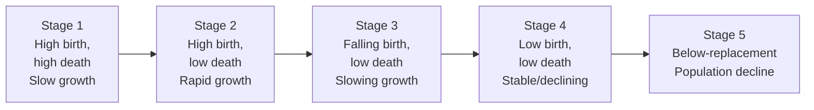

# Population Geography — ภูมิศาสตร์ประชากร

> *"Demography is destiny."* — Auguste Comte

Population Geography examines where people live, why they live there, and how populations change over time. Students learn about population distribution, density, demographic transition, migration patterns, and the challenges of aging societies.

---

## 1 | Grade Band Breakdown

| Grade | Key Content |
|---|---|
| **ป.1–3** | — |
| **ป.4–6** | Where people live, rural vs urban |
| **ม.1–3** | Population density, distribution factors, demographic transition |
| **ม.4–6** | Population policy, aging society, migration analysis, demographic dividend |

---

## 2 | Key Population Concepts

| Concept | Thai | Definition |
|---|---|---|
| **Population** | ประชากร | Total number of people in an area |
| **Population density** | ความหนาแน่นประชากร | People per unit area (usually km²) |
| **Population distribution** | การกระจายตัวของประชากร | How people are spread across an area |
| **Birth rate** | อัตราการเกิด | Live births per 1,000 people |
| **Death rate** | อัตราการตาย | Deaths per 1,000 people |
| **Natural increase** | การเพิ่มขึ้นตามธรรมชาติ | Birth rate − death rate |
| **Fertility rate** | อัตราการมีบุตร | Average children per woman |
| **Life expectancy** | อายุขัยเฉลี่ย | Average years a person lives |
| **Dependency ratio** | อัตราส่วนพึ่งพิ่ง | Non-working vs working-age population |

---

## 3 | Thailand's Population

| Statistic | Value |
|---|---|
| **Total population** | ~70 million (2023) |
| **Population density** | ~135 people/km² |
| **Growth rate** | 0.15% (very low) |
| **Fertility rate** | 1.0 (below replacement 2.1) |
| **Life expectancy** | 78.7 years |
| **Median age** | 40 years |
| **Urban population** | ~53% |
| **Working age (15-59)** | ~65% (declining) |
| **Elderly (60+)** | ~20% (rising rapidly) |

### World Comparison

| Statistic | Thailand | World |
|---|---|---|
| **Fertility rate** | 1.0 | 2.3 |
| **Life expectancy** | 78.7 | 73 |
| **Median age** | 40 | 31 |
| **Growth rate** | 0.15% | 0.9% |

---

## 4 | Demographic Transition Model

| Stage | Birth Rate | Death Rate | Growth | Example |
|---|---|---|---|---|
| **1** | High | High | Slow | Pre-modern societies |
| **2** | High | Falling | Rapid | Early industrialization |
| **3** | Falling | Low | Slowing | Many developing countries |
| **4** | Low | Low | Stable | Most developed countries |
| **5** | Below 2.1 | Low | Declining | Thailand, Japan, Italy |

**Thailand:** Now in **Stage 5** — population will start declining around 2028.

---

## 5 | Population Distribution in Thailand

### Factors Affecting Distribution

| Factor | Thai | Effect |
|---|---|---|
| **Topography** | ภูมิประเทศ | People settle in flat, lowland areas |
| **Water availability** | ความอุดมสมบูรณ์ของน้ำ | Settlements near rivers, coasts |
| **Climate** | ภูมิอากาศ | Temperate/tropical preferred |
| **Soil fertility** | ความอุดมสมบูรณ์ของดิน | Agricultural settlement |
| **Economic opportunity** | โอกาสทางเศรษฐกิจ | Jobs attract migration |
| **Transportation** | การคมนาคม | Settlements along transport routes |

### Thailand's Population by Region

| Region | Population (million) | Density (people/km²) | Characteristic |
|---|---|---|---|
| **Bangkok metro** | ~15 | 5,300+ | Megacity, primate city |
| **Central** | ~16 | 200 | Densest region after Bangkok |
| **Northeast** | ~22 | 130 | Largest population, most provinces |
| **North** | ~12 | 70 | Moderate density |
| **South** | ~9 | 120 | Coastal settlement |
| **East** | ~5 | 150 | Growing (EEC) |

---

## 6 | Migration (การย้ายถิ่น)

### Types of Migration

| Type | Thai | Description |
|---|---|---|
| **Rural-urban** | ชนบทสู่เมือง | Most common in Thailand |
| **International** | ระหว่างประเทศ | Thai workers abroad, foreign workers in Thailand |
| **Seasonal** | ตามฤดูกาล | Agricultural workers |
| **Forced** | บังคับ | War, disaster, persecution |
| **Return migration** | ย้ายกลับ | Workers returning home |

### Migration in Thailand

| Flow | Description |
|---|---|
| **Rural → Bangkok** | Northeast and North farmers moving to capital |
| **Thai workers abroad** | To Taiwan, Singapore, Israel, South Korea |
| **Foreign workers in** | Myanmar, Laos, Cambodia (~3 million) |
| **Retirement migration** | Western, Japanese retirees to Chiang Mai, Hua Hin |
| **Brain drain** | Skilled Thais moving to developed countries |

### Push and Pull Factors

| Push Factors (ออก) | Pull Factors (เข้า) |
|---|---|
| Poverty, lack of jobs | Better wages, employment |
| Limited education | Better schools, universities |
| Natural disasters | Safety, stability |
| Land shortage | Available housing |
| Political conflict | Freedom, security |

---

## 7 | Aging Society (สังคมผู้สูงอายุ)

Thailand is **aging faster than any other developing country**:

| Year | Elderly (60+) | % of Population |
|---|---|---|
| 2000 | 4.5 million | 7% (aging society) |
| 2020 | 11 million | 17% |
| 2023 | 13 million | 20% (aged society) |
| 2040 (projected) | 18 million | 30%+ (super-aged) |

### Impacts of Aging

| Impact | Thai | Description |
|---|---|---|
| **Labor shortage** | ขาดแคลนแรงงาน | Fewer workers |
| **Healthcare costs** | ค่ารักษาพยาบาล | More elderly care needed |
| **Pension burden** | ภาระเงินบำนาญ | Social security strain |
| **Economic growth** | การเติบโตทางเศรษฐกิจ | Slower growth |
| **Family structure** | โครงสร้างครอบครัว | Smaller families, elderly living alone |

---

## 8 | Upper Secondary (ม.4-6): Population Policy

### Thailand's Population Policies

| Era | Policy | Rationale |
|---|---|---|
| **1970s-1990s** | Family planning (ลูกน้อยดีกว่า) | Reduce rapid growth |
| **2000s** | Relaxed | Growth stabilized |
| **2010s-present** | Pro-natalist (encourage births) | Reverse population decline |

### Demographic Dividend

| Concept | Thai | Description |
|---|---|---|
| **Demographic dividend** | ปันผลทางประชากร | Economic benefit of large working-age share |
| **Thailand's dividend** | ปันผลของไทย | 1980s-2010s — rapid growth era |
| **Window closing** | หน้าต่างปิดลง | Working-age share declining since 2010 |
| **Next phase** | เฟสต่อไป | Aging burden without dividend |

### Global Population Issues

| Issue | Thai | Description |
|---|---|---|
| **Overpopulation** | ประชากรมากเกินไป | 8 billion people, resource strain |
| **Underpopulation** | ประชากรน้อยเกินไป | Japan, South Korea, Europe |
| **Youth bulge** | ประชากรวัยหนุ่มสาวมาก | Africa, Middle East |
| **Urbanization** | การกลายเป็นเมือง | 57% of world now urban |
| **Refugee crisis** | วิกฤตผู้ลี้ภัย | Climate, conflict, economic |

---

## 9 | Population Pyramids

| Shape | Description | Example |
|---|---|---|
| **Expansive (triangle)** | Wide base, narrow top | Africa, Afghanistan |
| **Stationary (rectangular)** | Even distribution | Developed countries |
| **Constrictive (inverted)** | Narrow base, wide top | Thailand, Japan |

### Thailand's Population Pyramid Evolution

| Period | Shape | Characteristic |
|---|---|---|
| 1970 | Triangle | High birth, many youth |
| 2000 | Constricting | Family planning working |
| 2023 | Inverted triangle | Aging, low birth |
| 2040 (projected) | Severely inverted | Super-aged |

---

## 10 | Thai Terminology

| Thai | English |
|---|---|
| ประชากร | Population |
| ความหนาแน่นประชากร | Population density |
| อัตราการเกิด | Birth rate |
| อัตราการตาย | Death rate |
| การย้ายถิ่น | Migration |
| สังคมผู้สูงอายุ | Aging society |
| โครงสร้างประชากร | Population structure |
| การวางแผนครอบครัว | Family planning |

---

## 11 | Real-World Examples

- **Bangkok primacy** — 10× larger than second city (Nakhon Ratchasima)
- **Isan migration** — Millions moved from Northeast to Bangkok and abroad
- **Myanmar workers** — ~2-3 million migrants fill Thai construction, fishing, domestic work
- **Japan comparison** — Thailand aging similarly but at lower income level ("getting old before getting rich")
- **Family planning slogan** — "ลูกน้อยดีกว่า แม่พ่อมีเวลาให้ลูก" (Fewer children is better)

---

## 12 | Cross-Links

- [[Social Studies - Overview|← Back to Social Studies]]
- [[01_Geography_of_Thailand|Geography of Thailand]] — Population distribution
- [[08_Settlement_and_Urbanization|Settlement & Urbanization]] — Urban growth
- [[09_Economic_Geography|Economic Geography]] — Labor force, economy
