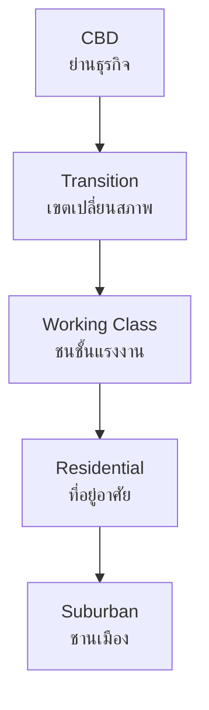

# Settlement and Urbanization — การตั้งถิ่นฐานและการกลายเป็นเมือง

> *"The city is not a concrete jungle; it is a human zoo."* — Desmond Morris

Settlement and Urbanization examines where and how people live — from rural villages to megacities. Students learn about settlement patterns, the process of urbanization, city functions, and the challenges of rapid urban growth.

---

## 1 | Grade Band Breakdown

| Grade | Key Content |
|---|---|
| **ป.1–3** | — |
| **ป.4–6** | Rural vs urban living, village and city features |
| **ม.1–3** | Urbanization process, settlement factors, Bangkok growth |
| **ม.4–6** | Urban systems, city planning, megacity challenges, sustainable cities |

---

## 2 | Types of Settlement

### Rural Settlement (ชนบท)

| Type | Thai | Description | Example |
|---|---|---|---|
| **Dispersed** | กระจัดกระจาย | Houses spread apart | Farming areas |
| **Nucleated** | กลุ่มก้อน | Houses clustered around center | Village center |
| **Linear** | เป็นแนวยาว | Houses along road/river | Riverside villages |
| **Isolated** | โดดเดี่ยว | Single farmsteads | Remote areas |

### Urban Settlement (เมือง)

| Type | Thai | Population | Example |
|---|---|---|---|
| **Hamlet** | หมู่บ้านเล็ก | <100 | Rural hamlet |
| **Village** | หมู่บ้าน | 100-1,000 | Tambon center |
| **Town** | เมืองเล็ก | 1,000-100,000 | Provincial town |
| **City** | เมือง | 100,000-1 million | Chiang Mai, Khon Kaen |
| **Metropolis** | มหานคร | 1-10 million | Bangkok |
| **Megacity** | เมกะซิตี้ | >10 million | Bangkok metro |

---

## 3 | Factors Affecting Settlement

| Factor | Thai | Rural Settlement | Urban Settlement |
|---|---|---|---|
| **Water** | น้ำ | Near rivers, wells | Reservoirs, piped supply |
| **Land** | ที่ดิน | Arable farmland | Limited, expensive |
| **Topography** | ภูมิประเทศ | Flat valley, plains | Any terrain |
| **Climate** | ภูมิอากาศ | Favorable for farming | Modified (air-con) |
| **Economy** | เศรษฐกิจ | Agriculture | Industry, services |
| **Transport** | การคมนาคม | Roads, tracks | Multiple modes |
| **Defense** | การป้องกัน | Hills, rivers | Fortifications (historic) |

---

## 4 | Urbanization (การกลายเป็นเมือง)

| Concept | Thai | Definition |
|---|---|---|
| **Urbanization** | การกลายเป็นเมือง | Increase in urban population and area |
| **Urban growth** | การเติบโตของเมือง | Physical expansion of cities |
| **Urban sprawl** | การขยายตัวของเมือง | Unplanned low-density expansion |
| **Suburbanization** | การขยายชานเมือง | Population moves to suburbs |
| **Counter-urbanization** | การย้ายออกจากเมือง | People return to rural areas |
| **Gentrification** | การปรับปรุงย่านเก่า | Wealthy move into poor neighborhoods |

### Global Urbanization

| Year | World Urban % |
|---|---|
| 1950 | 30% |
| 2000 | 47% |
| 2020 | 56% |
| 2050 (projected) | 68% |

### Thailand's Urbanization

| Year | Urban % |
|---|---|
| 1960 | 20% |
| 1980 | 27% |
| 2000 | 31% |
| 2020 | 53% |
| 2040 (projected) | 65% |

---

## 5 | Bangkok: Primate City

Bangkok exemplifies the "primate city" pattern — one city dominates the national urban hierarchy:

| Indicator | Bangkok | Second City |
|---|---|---|
| **Population** | ~15 million (metro) | ~500,000 (Nakhon Ratchasima) |
| **GDP share** | ~35% of national | <3% |
| **Universities** | 30+ major | 2-3 |
| **Hospitals** | 100+ | 5-10 |
| **Ratio** | 10:1 (primacy ratio) | — |

### Bangkok's Urban Challenges

| Challenge | Thai | Description |
|---|---|---|
| **Traffic** | รถติด | Severe congestion, 2+ hour commutes |
| **Flooding** | น้ำท่วม | City sinking, poor drainage |
| **Air pollution** | มลพิษทางอากาศ | PM2.5 exceed safe levels |
| **Housing** | ที่อยู่อาศัย | Slums, unaffordable rents |
| **Waste** | ขยะ | ~10,000 tons/day |
| **Inequality** | ความเหลื่อมล้ำ | Rich condos next to poor slums |

---

## 6 | Urban Structure Models

### Concentric Zone Model (Burgess)

| Model | Thai | Description |
|---|---|---|
| **Concentric (Burgess)** | แบบวงแหวน | Zones radiate outward from CBD |
| **Sector (Hoyt)** | แบบเซกเตอร์ | Wedge-shaped zones along transport |
| **Multiple nuclei (Harris-Ullman)** | แบบศูนย์กลางหลายแห่ง | Multiple business centers |

### Bangkok's Urban Structure

| Zone | Thai | Areas |
|---|---|---|
| **CBD** | ย่านธุรกิจหลัก | Silom, Sathorn, Sukhumvit |
| **Old city** | เขตเมืองเก่า | Rattanakosin, Chinatown |
| **Commercial** | เขตพาณิชย์ | Chatuchak, Bang Na |
| **Industrial** | เขตอุตสาหกรรม | Bang Phli, Samut Prakan |
| **Residential** | เขตที่อยู่อาศัย | Lat Phrao, Bang Kapi |
| **Suburban** | ชานเมือง | Nonthaburi, Samut Prakan, Pathum Thani |

---

## 7 | Urban Planning (การวางผังเมือง)

### City Functions

| Function | Thai | Description |
|---|---|---|
| **Residential** | ที่อยู่อาศัย | Housing |
| **Commercial** | พาณิชยกรรม | Shops, markets, malls |
| **Industrial** | อุตสาหกรรม | Factories, warehouses |
| **Administrative** | การปกครอง | Government offices |
| **Educational** | การศึกษา | Schools, universities |
| **Recreational** | นันทนาการ | Parks, sports facilities |
| **Transport** | การคมนาคม | Roads, rail, ports |

### Thailand's Urban Planning System

| Level | Thai | Authority |
|---|---|---|
| **National** | ระดับชาติ | NESDC (national plan) |
| **Regional** | ระดับภูมิภาค | Regional plans |
| **Provincial** | ระดับจังหวัด | Provincial plan |
| **City/Municipal** | เทศบาล | City Comprehensive Plan |

---

## 8 | Thailand's Decentralization Efforts

| Strategy | Thai | Description |
|---|---|---|
| **EEC** | เขตเศรษฐกิจพิเศษภาคตะวันออก | Eastern Economic Corridor |
| **Secondary cities** | เมืองรอง | Promote Chiang Mai, Khon Kaen, Phuket |
| **Digital parks** | เมืองดิจิทัล | Digital Park Thailand (Sri Racha) |
| **High-speed rail** | รถไฟความเร็วสูง | Bangkok-Nakhon Ratchasima (under construction) |
| **Airport expansion** | ขยายสนามบิน | U-Tapao as third international airport |

---

## 9 | Upper Secondary (ม.4-6): Sustainable Cities

### Smart Cities

| Feature | Thai | Description |
|---|---|---|
| **Digital infrastructure** | โครงสร้างดิจิทัล | IoT sensors, data-driven management |
| **Intelligent transport** | ระบบขนส่งอัจฉริยะ | Smart traffic, autonomous vehicles |
| **Energy management** | การจัดการพลังงาน | Smart grid, renewables |
| **E-government** | รัฐบาลอิเล็กทรอนิกส์ | Digital services |
| **Citizen engagement** | การมีส่วนร่วม | Apps for civic participation |

### Sustainable Urban Design

| Principle | Thai | Application |
|---|---|---|
| **Compact city** | เมืองกระชับ | High-density, mixed-use |
| **Transit-oriented** | พัฒนาตามเส้นทางคมนาคม | Development around transit stations |
| **Green building** | อาคารสีเขียว | LEED certification, energy efficient |
| **Urban green space** | พื้นที่สีเขียว | Parks, greenways |
| **Walkable city** | เมืองเดินได้ | Pedestrian-friendly design |
| **15-minute city** | เมือง 15 นาที | Daily needs within 15-minute walk/cycle |

### Thailand's Smart Cities

| City | Thai | Focus |
|---|---|---|
| **Bangkok** | กรุงเทพฯ | Transport, safety, services |
| **Phuket** | ภูเก็ต | Tourism, transport |
| **Chiang Mai** | เชียงใหม่ | Agriculture, health, culture |
| **Khon Kaen** | ขอนแก่น | Smart health, education |
| **Pattaya** | พัทยา | Tourism, safety |

---

## 10 | Thai Terminology

| Thai | English |
|---|---|
| เมือง | City / Urban |
| ชนบท | Countryside / Rural |
| การกลายเป็นเมือง | Urbanization |
| ชานเมือง | Suburb |
| ย่านธุรกิจ | Business district (CBD) |
| การวางผังเมือง | Urban planning |
| มหานคร | Metropolis |
| เศรษฐกิจพิเศษ | Special economic zone |
| การกระจายการพัฒนา | Decentralization |

---

## 11 | Real-World Examples

- **Bangkok traffic** — Ranked among world's most congested cities
- **BTS/MRT expansion** — Mass transit reducing car dependency
- **Slum housing** — Klong Toey slum contrasts with luxury condos nearby
- **EEC** — Thailand's flagship urban-industrial development
- **Songkhla Lake City** | Planned new city to relieve Bangkok

---

## 12 | Cross-Links

- [[Social Studies - Overview|← Back to Social Studies]]
- [[01_Geography_of_Thailand|Geography of Thailand]] — Settlement geography
- [[07_Population_Geography|Population Geography]] — Urban population growth
- [[09_Economic_Geography|Economic Geography]] — Urban economy
