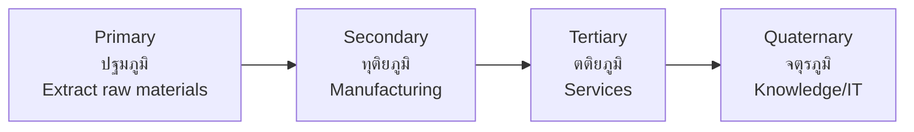

# Economic Geography — ภูมิศาสตร์เศรษฐกิจ

> *"Geography determines what an economy can produce; human ingenuity determines what it will become."*

Economic Geography examines the spatial distribution of economic activities — where farming, manufacturing, and services occur and why. Students learn about agricultural regions, industrial zones, transport networks, and the globalization of economic activity.

---

## 1 | Grade Band Breakdown

| Grade | Key Content |
|---|---|
| **ป.1–3** | — |
| **ป.4–6** | Local occupations, where food comes from |
| **ม.1–3** | Economic sectors, agricultural regions, industrial zones |
| **ม.4–6** | Global supply chains, economic specialization, trade geography |

---

## 2 | Economic Sectors (ภาคเศรษฐกิจ)

| Sector | Thai | Activities | Thailand Share |
|---|---|---|---|
| **Primary** | ปฐมภูมิ | Agriculture, mining, fishing | 8% of GDP |
| **Secondary** | ทุติยภูมิ | Manufacturing, construction | 35% of GDP |
| **Tertiary** | ตติยภูมิ | Retail, banking, tourism | 57% of GDP |
| **Quaternary** | จตุรภูมิ | IT, R&D, consulting | Growing |

---

## 3 | Agricultural Geography

### Thailand's Agricultural Regions

| Region | Main Crops | Thai |
|---|---|---|
| **Central** | Rice, sugarcane | ข้าว, อ้อย |
| **North** | Rice, fruits, vegetables | ลิ้นจี่, ลำไย, สตรอว์เบอร์รี่ |
| **Northeast** | Rice, cassava, rubber | ข้าวหอมมะลิ, มันสำปะหลัง |
| **East** | Fruits, rubber | ทุเรียน, มังคุด, เงาะ |
| **South** | Rubber, palm oil, fruits | ยางพารา, ปาล์มน้ำมัน |

### Major Crops

| Crop | Thai | World Rank | Main Region | Annual Value |
|---|---|---|---|---|
| **Rice** | ข้าว | #1 exporter (some years) | Central, Northeast | ~$5 billion |
| **Natural rubber** | ยางพารา | #1 exporter | South | ~$6 billion |
| **Cassava** | มันสำปะหลัง | #1 exporter | Northeast | ~$2 billion |
| **Sugar** | น้ำตาล | #2 exporter | Central | ~$3 billion |
| **Palm oil** | ปาล์มน้ำมัน | #3 producer | South | ~$2 billion |
| **Tropical fruits** | ผลไม้เขตร้อน | Major exporter | East, South | ~$2 billion |

---

## 4 | Industrial Geography

### Thailand's Industrial Zones

| Zone | Thai | Industries | Key Cities |
|---|---|---|---|
| **Bangkok metro** | กรุงเทพและปริมณฑล | Automotive, electronics, food | Bangkok, Samut Prakan |
| **Eastern Seaboard** | ชายฝั่งทะเลตะวันออก | Petrochemicals, automotive, steel | Rayong, Chonburi, Chachoengsao |
| **EEC** | เขตเศรษฐกิจพิเศษภาคตะวันออก | 10 S-curve industries | 3 eastern provinces |
| **Northern industrial** | ภาคเหนือ | Textiles, food processing | Lamphun, Phra Nakhon Si Ayutthaya |
| **Southern industrial** | ภาคใต้ | Rubber processing, seafood | Songkhla, Surat Thani |

### EEC Target Industries

| Type | Thai | Industries |
|---|---|---|
| **First S-Curve** | เอส-เคิร์ฟเวอแรก | Next-gen auto, smart electronics, affluent tourism, agriculture & biotech, food for future |
| **New S-Curve** | เอส-เคิร์ฟเวอใหม่ | Industrial robotics, logistics & aviation, medical hub, biofuels, digital |

---

## 5 | Transportation Networks

### Transport Modes

| Mode | Thai | Thailand's Network |
|---|---|---|
| **Road** | ถนน | ~490,000 km of roads |
| **Rail** | รถไฟ | ~4,500 km (meter + standard gauge) |
| **Air** | การบิน | 6 international + 28 domestic airports |
| **Water** | ทางน้ำ | 4,000 km of navigable waterways |
| **Pipeline** | ท่อ | Natural gas pipelines |

### Major Ports

| Port | Thai | Type | Throughput |
|---|---|---|---|
| **Laem Chabang** | แหลมฉบัง | Deep sea, containers | ~8 million TEU |
| **Bangkok Port** | ท่าเรือคลองเตย | River port | ~1.5 million TEU |
| **Map Ta Phut** | มาบตาพุด | Industrial | Petrochemicals, LNG |
| **Songkhla** | สงขลา | Regional | Southern trade |
| **Phuket** | ภูเก็ต | Tourism | Cruise, yachts |

### Major Airports

| Airport | Thai | Passengers (annual) |
|---|---|---|
| **Suvarnabhumi** | สุวรรณภูมิ | ~65 million |
| **Don Mueang** | ดอนเมือง | ~40 million |
| **Phuket** | ภูเก็ต | ~18 million |
| **Chiang Mai** | เชียงใหม่ | ~11 million |
| **U-Tapao** | อู่ตะเภา | ~3 million (expanding) |

---

## 6 | Tourism Geography

| Region | Tourist Attractions | Thai |
|---|---|---|
| **Bangkok** | Temples, shopping, nightlife | วัด, ห้างสรรพสินค้า |
| **Central** | Ayutthaya, Kanchanaburi | อยุธยา, กาญจนบุรี |
| **North** | Chiang Mai, Chiang Rai, hill tribes | ดอยสุเทพ, วัดร่องขุ่น |
| **Northeast** | Khmer ruins, festivals | พนมรุ้ง, ปราสาทหินพิมาย |
| **East** | Pattaya, Koh Samet, Koh Chang | พัทยา, เกาะช้าง |
| **South** | Phuket, Krabi, Koh Samui | ภูเก็ต, กระบี่, เกาะสมุย |

### Thailand Tourism Statistics (Pre-COVID 2019)

| Statistic | Value |
|---|---|
| **International visitors** | ~40 million |
| **Tourism revenue** | ~$60 billion (20% of GDP) |
| **Top source countries** | China, Malaysia, India, Korea, Japan |
| **Domestic trips** | ~170 million |

---

## 7 | Factors Affecting Industrial Location

| Factor | Thai | Description | Example |
|---|---|---|---|
| **Raw materials** | วัตถุดิบ | Near source of inputs | Sugar mill near cane fields |
| **Labor** | แรงงาน | Abundant, affordable workforce | Textile factories in NE |
| **Market** | ตลาด | Near customers | Retail in Bangkok |
| **Transport** | การคมนาคม | Access to ports, highways | EEC near Laem Chabang |
| **Energy** | พลังงาน | Power supply availability | Industry near power plants |
| **Government policy** | นโยบายรัฐ | Tax incentives, SEZs | BOI-promoted zones |
| **Capital** | ทุน | Investment availability | Bangkok concentration |

---

## 8 | Upper Secondary (ม.4-6): Global Economic Geography

### Global Supply Chains

| Stage | Thai | Example (Smartphone) |
|---|---|---|
| **Design** | ออกแบบ | USA (Apple) |
| **Components** | ชิ้นส่วน | Korea, Taiwan, Japan |
| **Assembly** | ประกอบ | China, Vietnam |
| **Distribution** | กระจายสินค้า | Global logistics |
| **Retail** | ขายปลีก | Worldwide |

### Comparative Advantage

| Concept | Thai | Description |
|---|---|---|
| **Comparative advantage** | ความได้เปรียบเชิงเปรียบเทียบ | Lower opportunity cost production |
| **Specialization** | การเชี่ยวชาญ | Focus on what you do best |
| **Trade benefits** | ประโยชน์จากการค้า | Both partners gain |

### Thailand's Comparative Advantages

| Sector | Advantage |
|---|---|
| **Automotive** | Skilled labor, supplier network, location |
| **Agriculture** | Tropical climate, fertile land |
| **Tourism** | Beaches, culture, food, hospitality |
| **Electronics** | Established industrial base, labor cost |

### Globalization's Geographic Impact

| Impact | Thai | Description |
|---|---|---|
| **Offshoring** | การย้ายฐานการผลิต | Production moves to low-cost countries |
| **FDI** | การลงทุนโดยตรง | Foreign capital flows |
| **Urbanization** | การกลายเป็นเมือง | Manufacturing drives city growth |
| **Inequality** | ความเหลื่อมล้ำ | Some regions benefit, others left behind |

---

## 9 | Thai Terminology

| Thai | English |
|---|---|
| เกษตรกรรม | Agriculture |
| อุตสาหกรรม | Industry |
| การบริการ | Services |
| เขตเศรษฐกิจพิเศษ | Special economic zone |
| ท่าเรือ | Port |
| สนามบิน | Airport |
| การท่องเที่ยว | Tourism |
| โลจิสติกส์ | Logistics |
| ห่วงโซ่อุปทาน | Supply chain |

---

## 10 | Real-World Examples

- **Detroit of Asia** — Thailand is SE Asia's largest auto producer (~2 million vehicles/year)
- **Laem Chabang** — Among world's top 25 container ports
- **Rice exporter** — World's #1 or #2 rice exporter most years
- **Medical tourism** — ~3 million medical tourists/year pre-COVID
- **EEC** | $45+ billion investment target in eastern provinces

---

## 11 | Cross-Links

- [[Social Studies - Overview|← Back to Social Studies]]
- [[01_Geography_of_Thailand|Geography of Thailand]] — Economic regions
- [[06_Natural_Resources|Natural Resources]] — Resource-based economy
- [[08_Settlement_and_Urbanization|Settlement & Urbanization]] — Urban economy
