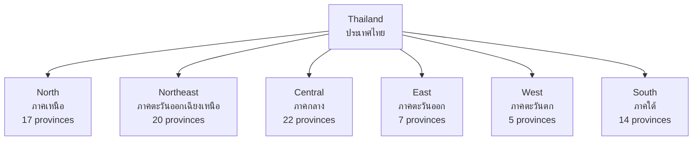

# Thailand's Regions — ภูมิภาคของประเทศไทย

> *"Each region of Thailand has its own character — shaped by geography, climate, history, and the peoples who settled there."*

Thailand's Regions examines the six distinct regions that compose the country. Students learn about each region's physical geography, economy, culture, and development challenges — building geographic literacy about their own country.

---

## 1 | Grade Band Breakdown

| Grade | Key Content |
|---|---|
| **ป.1–3** | — |
| **ป.4–6** | Six regions, key features of each |
| **ม.1–3** | Regional analysis: geography, economy, culture |
| **ม.4–6** | Regional development policy, inequality, decentralization |

---

## 2 | Thailand's Six Regions

| Region | Thai | Provinces | Area (km²) | Population | Capital |
|---|---|---|---|---|---|
| **North** | ภาคเหนือ | 17 | 169,644 | ~12 million | Chiang Mai |
| **Northeast** | ภาคอีสาน | 20 | 168,854 | ~22 million | Nakhon Ratchasima |
| **Central** | ภาคกลาง | 22 | 94,595 | ~16 million | Bangkok |
| **East** | ภาคตะวันออก | 7 | 19,092 | ~5 million | Chonburi |
| **West** | ภาคตะวันตก | 5 | 53,858 | ~3 million | Kanchanaburi |
| **South** | ภาคใต้ | 14 | 70,715 | ~9 million | Songkhla |

---

## 3 | Northern Region (ภาคเหนือ)

| Aspect | Details |
|---|---|
| **Topography** | Mountainous, river valleys (Ping, Wang, Yom, Nan) |
| **Highest peak** | Doi Inthanon (2,565m) |
| **Climate** | Cool winters (can reach 4°C), hot summers |
| **Culture** | Lanna culture, distinct language (คำเมือง) |
| **Economy** | Agriculture (lychee, longan, strawberry), tourism, handicrafts |
| **Key cities** | Chiang Mai, Chiang Rai, Lampang, Lamphun |

### Geographic Features

| Feature | Thai | Significance |
|---|---|---|
| **Thanon Thong Chai Range** | ทิวเขาถนนธงชัย | Main mountain range |
| **Four rivers** | แม่น้ำสายหลัก 4 สาย | Ping, Wang, Yom, Nan → Chao Phraya |
| **Doi Inthanon** | ดอยอินทนนท์ | Highest point in Thailand |
| **Doi Suthep** | ดอยสุเทพ | Chiang Mai landmark |
| **Golden Triangle** | สามเหลี่ยมทองคำ | Thailand-Myanmar-Laos border |

---

## 4 | Northeastern Region / Isan (ภาคอีสาน)

| Aspect | Details |
|---|---|
| **Topography** | Khorat Plateau (sandstone, poor soil) |
| **Climate** | Hottest region (45°C in April), drought-prone |
| **Culture** | Isan culture, Lao-related language, sticky rice |
| **Economy** | Agriculture (jasmine rice, cassava, rubber), migration source |
| **Key cities** | Nakhon Ratchasima, Ubon Ratchathani, Khon Kaen, Udon Thani |
| **Challenge** | Poorest region, highest out-migration |

### Geographic Features

| Feature | Thai | Significance |
|---|---|---|
| **Khorat Plateau** | แผ่นดินสูงโคราช | Sandstone plateau |
| **Mekong River** | แม่น้ำโขง | Northern/eastern border |
| **Phu Phan Mountains** | เทือกเขาภูพาน | Divides plateau |
| **Mun River** | แม่น้ำมูล | Longest river entirely in Thailand |
| **Khmer ruins** | ปราสาทหินขอม | Phanom Rung, Phimai |

---

## 5 | Central Region (ภาคกลาง)

| Aspect | Details |
|---|---|
| **Topography** | Chao Phraya river basin, flat alluvial plain |
| **Climate** | Hot, distinct wet/dry seasons |
| **Culture** | Central Thai, standard language |
| **Economy** | Rice bowl, industry, government, services |
| **Key cities** | Bangkok, Ayutthaya, Nonthaburi, Pathum Thani |

### Geographic Features

| Feature | Thai | Significance |
|---|---|---|
| **Chao Phraya River** | แม่น้ำเจ้าพระยา | Central lifeline |
| **Alluvial plain** | ที่ราบตะกอนน้ำพา | Fertile rice-growing |
| **Gulf of Thailand** | อ่าวไทย | Marine access, gas fields |
| **Bangkok** | กรุงเทพฯ | Capital, primate city |

---

## 6 | Eastern Region (ภาคตะวันออก)

| Aspect | Details |
|---|---|
| **Topography** | Coastal plains, mountains inland |
| **Climate** | Coastal, moderate temperatures |
| **Culture** | Mixed Central-Eastern Thai |
| **Economy** | Industry (EEC), tourism, agriculture (fruits) |
| **Key cities** | Chonburi (Pattaya), Rayong, Chachoengsao, Trat |

### Key Features

| Feature | Thai | Description |
|---|---|---|
| **EEC** | เขตเศรษฐกิจพิเศษภาคตะวันออก | Flagship industrial zone |
| **Laem Chabang** | แหลมฉบัง | Thailand's largest port |
| **Map Ta Phut** | มาบตาพุด | Petrochemical industrial estate |
| **Koh Chang** | เกาะช้าง | Second-largest Thai island |
| **Fruit orchards** | สวนผลไม้ | Durian, rambutan, mangosteen |

---

## 6b | Western Region (ภาคตะวันตก)

| Aspect | Details |
|---|---|
| **Topography** | Mountainous, dense forests, rivers |
| **Climate** | Mountain climate, cooler |
| **Culture** | Mixed Thai-Karen-Mon |
| **Economy** | Mining, dams, tourism, agriculture |
| **Key cities** | Kanchanaburi, Ratchaburi, Tak, Phetchaburi |

### Key Features

| Feature | Thai | Description |
|---|---|---|
| **Tanao Si Range** | ทิวเขาตะนาวศรี | Border with Myanmar |
| **Kwai River** | แม่น้ำแคว | Death Railway, Bridge on River Kwai |
| **Bhumibol Dam** | เขื่อนภูมิพล | Thailand's largest dam |
| **Erawan Falls** | น้ำตกเอราวัณ | Famous tiered waterfall |
| **Hellfire Pass** | ช่องเขาขาด | WWII memorial |

---

## 7 | Southern Region (ภาคใต้)

| Aspect | Details |
|---|---|
| **Topography** | Malay Peninsula, limestone karst, islands |
| **Climate** | Equatorial, warm year-round, high rainfall |
| **Culture** | Thai, Malay-Muslim, Chinese mix |
| **Economy** | Rubber, palm oil, tin, tourism, fishing |
| **Key cities** | Songkhla (Hat Yai), Phuket, Surat Thani, Nakhon Si Thammarat |

### Key Features

| Feature | Thai | Description |
|---|---|---|
| **Kra Isthmus** | คอคอดกระ | Narrowest part of Thailand |
| **Phang Nga Bay** | อ่าวพังงา | Karst limestone islands |
| **Phuket** | ภูเก็ต | Largest island, top tourist destination |
| **Andaman coast** | ฝั่งทะเลอันดามัน | West coast, tsunami-affected |
| **Gulf coast** | ฝั่งอ่าวไทย | East coast, Koh Samui |

### South's Economic Importance

| Sector | Thai | Significance |
|---|---|---|
| **Rubber** | ยางพารา | 90% of Thailand's rubber |
| **Palm oil** | ปาล์มน้ำมัน | Major cooking oil source |
| **Tin** | แร่ดีบุก | Historically important |
| **Tourism** | การท่องเที่ยว | Phuket, Krabi, Koh Samui |
| **Fisheries** | ประมง | Andaman and Gulf coasts |

---

## 8 | Regional Inequality (ม.4-6)

| Indicator | Bangkok | Northeast | Ratio |
|---|---|---|---|
| **GDP per capita** | $15,000 | $2,500 | 6:1 |
| **Poverty rate** | 1% | 12% | 12× |
| **University access** | 40% | 15% | 2.7× |
| **Hospital beds** | High | Low | — |
| **Internet access** | 95% | 60% | — |

### Regional Development Policy

| Strategy | Thai | Description |
|---|---|---|
| **Decentralization** | การกระจายอำนาจ | Move functions from Bangkok |
| **EEC** | เขตเศรษฐกิจฯ | Develop Eastern region |
| **Border SEZs** | เขตเศรษฐกิจพิเศษชายแดน | 10 border SEZs |
| **Southern Coast** | ชายฝั่งทะเลภาคใต้ | Port-led development |
| **CLMV connectivity** | เชื่อมโยง CLMV | Laos, Cambodia, Myanmar, Vietnam |

---

## 9 | Upper Secondary (ม.4-6): Regional Analysis

### Core-Periphery Model

| Concept | Thai | Application to Thailand |
|---|---|---|
| **Core** | แกนกลาง | Bangkok (economic, political center) |
| **Periphery** | ปริมณฑล | Northeast, remote areas |
| **Semi-periphery** | กึ่งปริมณฑล | Eastern, Central regions |
| **Resource frontier** | แนวทรัพยากร | Deep South, mountains |

### Regional Identity

| Region | Identity Marker | Distinguishing Feature |
|---|---|---|
| **North** | Lanna identity | Distinct culture, Khantoke dinner |
| **Northeast** | Isan identity | Lao language, Mor Lam music |
| **Central** | Standard Thai | Political/cultural mainstream |
| **South** | Diverse | Thai-Buddhist and Malay-Muslim |

---

## 10 | Thai Terminology

| Thai | English |
|---|---|
| ภาคเหนือ | Northern Region |
| ภาคอีสาน | Northeastern Region |
| ภาคกลาง | Central Region |
| ภาคตะวันออก | Eastern Region |
| ภาคตะวันตก | Western Region |
| ภาคใต้ | Southern Region |
| แผ่นดินสูงโคราช | Khorat Plateau |
| คอคอดกระ | Kra Isthmus |
| สามเหลี่ยมทองคำ | Golden Triangle |

---

## 11 | Real-World Examples

- **Doi Inthanon** — Northern highest peak, royal project area
- **Isan migration** — Millions from Northeast work in Bangkok
- **EEC** — Eastern region receiving major investment
- **Phuket tourism** — Southern island = top revenue per capita province
- **Kra Isthmus** | Hypothetical canal project (never built) would bypass Malacca Strait

---

## 12 | Cross-Links

- [[Social Studies - Overview|← Back to Social Studies]]
- [[01_Geography_of_Thailand|Geography of Thailand]] — Overview
- [[07_Population_Geography|Population Geography]] — Regional population
- [[09_Economic_Geography|Economic Geography]] — Regional economy
